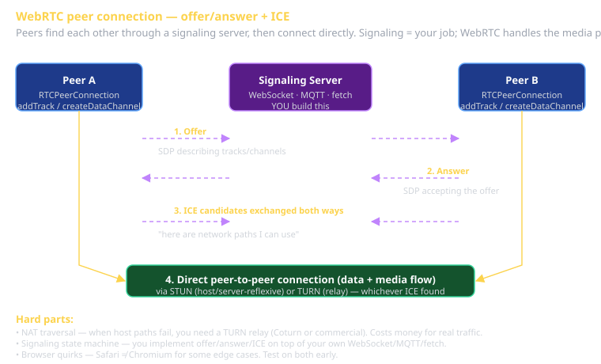

# Advanced Web Platform Cheat Sheet (80/20)

The 20% of WebRTC, Web USB, Web Bluetooth, MediaStream/Camera, and the Permissions API you'll need to pick one for your Sprint 3 capstone's mandatory "advanced platform technology." Each lets the browser talk to physical things; each has its own permission UX and gotchas.

This sheet covers the four most-used. Geolocation, Sensor APIs, Web NFC, Web Serial, WebHID, WebGPU, WebAssembly are real but skipped here — see MDN if you go niche.

## The big picture — pick by capstone shape

| If your capstone is... | Pick |
|---|---|
| Real-time multiplayer game, video call, peer-to-peer file transfer | **WebRTC** |
| IoT controller, microcontroller dashboard, OS-aware hardware UI | **WebUSB** |
| BLE devices: heart rate, beacons, custom firmware | **Web Bluetooth** |
| Visual input: OCR, photo upload, video stream, AR overlays | **MediaStream / Camera** |

## WebRTC — peer-to-peer in the browser

The browser's native real-time-communication stack. Three things travel over WebRTC: **media tracks** (audio/video), **data channels** (arbitrary bytes), and **statistics**.

### The connection lifecycle



1. **Signaling** — peers exchange metadata via a server (your job; WebRTC doesn't do it for you).
2. **Offer** — peer A creates a connection, generates an SDP offer, sends to peer B via signaling.
3. **Answer** — peer B accepts, generates an SDP answer, sends back.
4. **ICE candidates** — both peers gather network paths (host, server-reflexive, relay) and exchange them.
5. **Connection** — peers find a working path, the connection state goes from `new` → `connecting` → `connected`.
6. **Media flows** — tracks/data channels open; bytes move.

### Skeleton (browser side)

```javascript
const pc = new RTCPeerConnection({
  iceServers: [
    { urls: 'stun:stun.l.google.com:19302' },
    { urls: 'turn:turn.example.com', username: '...', credential: '...' },
  ],
});

// Optional: media tracks
const stream = await navigator.mediaDevices.getUserMedia({ video: true, audio: true });
stream.getTracks().forEach(t => pc.addTrack(t, stream));

// Or: data channel
const channel = pc.createDataChannel('chat', { ordered: true });
channel.onopen = () => channel.send('hello');
channel.onmessage = (e) => console.log('rx:', e.data);

// Signaling glue:
pc.onicecandidate = ({ candidate }) => {
  if (candidate) signaling.send({ type: 'ice', candidate });
};
const offer = await pc.createOffer();
await pc.setLocalDescription(offer);
signaling.send({ type: 'offer', sdp: offer });

// On receiving an answer:
await pc.setRemoteDescription(answer);

// On receiving an ICE candidate:
await pc.addIceCandidate(remoteCandidate);
```

### The hard parts

- **NAT traversal**. Some peers can't talk directly; you need a TURN relay server. Coturn is the standard open-source one. Costs money to run if traffic is real.
- **Signaling**. WebRTC doesn't include signaling — you build it (WebSocket, MQTT, fetch).
- **Browser quirks**. Safari and Chromium handle some edge cases differently. Test on both early.

### Data channels vs. WebSocket

| | Data channel | WebSocket |
|---|---|---|
| Transport | UDP-based (SCTP) | TCP |
| Latency | lower | higher |
| Reliability | configurable (ordered/unordered, reliable/unreliable) | always reliable, ordered |
| P2P | yes | no (server-relayed) |
| Setup | complex (signaling + ICE) | trivial |

Use data channels for real-time game state, low-latency cursor sync, peer-to-peer file transfer. Use WebSocket for everything server-relayed.

## Web USB

Talk to USB devices from a browser tab. Devices, configurations, interfaces, endpoints — the USB spec exposed.

### Skeleton

```javascript
// Must be triggered by a user gesture (click).
button.addEventListener('click', async () => {
  const device = await navigator.usb.requestDevice({
    filters: [{ vendorId: 0x2341 }]  // Arduino
  });

  await device.open();
  await device.selectConfiguration(1);
  await device.claimInterface(0);

  // Send 8 bytes:
  await device.transferOut(2, new Uint8Array([0x01, 0x02, 0x03]));

  // Receive:
  const result = await device.transferIn(1, 64);
  console.log(new Uint8Array(result.data.buffer));

  await device.close();
});
```

### Gotchas

- **HTTPS required** (or `localhost` in dev).
- **User gesture required** for `requestDevice` — can't pop the picker without a click.
- **Reserved device classes**: USB mass-storage, HID, audio, etc. The OS claims those; the browser refuses. Custom-firmware microcontrollers and serial bridges are the typical successes.
- **Persistence**: once granted, the browser remembers the permission. The user can revoke per-site.

## Web Bluetooth

GATT services and characteristics. Read/write/notify on BLE peripherals.

### Skeleton

```javascript
const device = await navigator.bluetooth.requestDevice({
  filters: [{ services: ['heart_rate'] }],
  optionalServices: ['battery_service'],
});

const server = await device.gatt.connect();
const service = await server.getPrimaryService('heart_rate');
const characteristic = await service.getCharacteristic('heart_rate_measurement');

// Subscribe to notifications:
await characteristic.startNotifications();
characteristic.addEventListener('characteristicvaluechanged', (e) => {
  const value = e.target.value; // DataView
  const bpm = value.getUint8(1);
  console.log('Heart rate:', bpm);
});
```

### Gotchas

- **Per-service permission gate**. The user authorizes specific services, not the whole device.
- **Backgrounding**. Tab background → connection often drops. Foreground app, persistent connection are handled differently.
- **OS quirks**. Samsung phones have notoriously aggressive battery savers that kill BLE. iOS Safari support is limited (often non-existent for Web Bluetooth as of 2026).
- **Pairing UX**. Browser shows the pairing dialog; can't be customized; works the way it works.

## MediaStream + Camera

`getUserMedia` is the entry point. The result is a `MediaStream` with track(s).

### Skeleton

```javascript
const stream = await navigator.mediaDevices.getUserMedia({
  video: { facingMode: 'environment', width: 1280, height: 720 },
  audio: true,
});

const video = document.querySelector('video');
video.srcObject = stream;
video.play();

// Capture a still frame:
const canvas = document.createElement('canvas');
canvas.width = video.videoWidth;
canvas.height = video.videoHeight;
canvas.getContext('2d').drawImage(video, 0, 0);
const blob = await new Promise(r => canvas.toBlob(r));
// upload blob...

// Tear down:
stream.getTracks().forEach(t => t.stop());
```

### Gotchas

- **HTTPS required** (or localhost).
- **Permission persists per-origin**. Once granted, the prompt doesn't re-fire. Once denied, hard to recover from (user has to dig in browser settings).
- **Backgrounding**. Stop tracks when not in use; some browsers dim the camera LED only when tracks stop.
- **Image-capture API** is separate (`ImageCapture`); cleaner for "take a photo" than canvas-based capture.
- **Battery + thermal**. Long video sessions on mobile drain battery and heat the device. Plan around it.

## The Permissions API — the meta-API

Query permission state without triggering the prompt. Lets you adapt UI before asking.

```javascript
const { state } = await navigator.permissions.query({ name: 'camera' });
// state: 'granted' | 'denied' | 'prompt'

if (state === 'denied') {
  // Show "Enable camera in browser settings" instructions.
} else if (state === 'prompt') {
  // Show a button that explains why we need camera access; user clicks; then ask.
}
```

### Permission UX rules

- **Earn the right to ask.** Show the user WHY before triggering the prompt. The prompt has 1-2 seconds of attention; if they don't already know why, they'll deny.
- **Never ask without a user gesture.** Most browsers refuse anyway in 2026, but be explicit.
- **Handle denial gracefully.** "Camera disabled — here's what you can still do" is better than a broken page.
- **Don't spam prompts.** Once denied, asking again typically fails silently.

## Capstone-pick decision tree

1. Real-time peer-to-peer? → **WebRTC** (data channels for game state, media for video).
2. Custom hardware that talks USB serial? → **WebUSB**.
3. BLE peripheral (sensor, beacon)? → **Web Bluetooth**.
4. Visual input (photo, OCR, AR)? → **MediaStream / Camera**.
5. None of the above? → Pick something simpler. WebRTC is the most-flexible default; data channels alone open dozens of capstone shapes.

## Hardware reality check

Half of capstone teams pick something they don't have hardware for. Plan now:

- Have an actual BLE peripheral (heart rate monitor, ESP32 with custom firmware) BEFORE picking Web Bluetooth.
- Have a USB device that exposes a non-reserved class BEFORE picking WebUSB.
- Have a phone or laptop with a working camera BEFORE picking MediaStream (yes, this is most of you, but verify on the device the demo will run on).
- Test on the *demo room's network* for WebRTC — corporate firewalls eat WebRTC traffic.

## What this is in vernacular

- WebRTC peer connection ≈ Pub-Sub Channel (EIP) at the network level, but peer-to-peer instead of broker-mediated.
- MediaStream tracks ≈ Datatype Channel (EIP) — strict typing, audio vs. video.
- All four APIs trigger Perfect Framework's *Application > Platform Support* concern at the browser-as-OS level.
- Permissions API ≈ feature detection extended to runtime authorization.

## Further reading

- **MDN: WebRTC API**, **Web USB API**, **Web Bluetooth API**, **MediaStream API**, **Permissions API**.
- **WebRTC for the Curious** (free book, webrtcforthecurious.com) — explains the protocols underneath.
- **Caniuse.com** for each API — browser support matrices.
- **`cheatsheet-realtime-web`** — alternatives that don't require WebRTC for many use cases.
