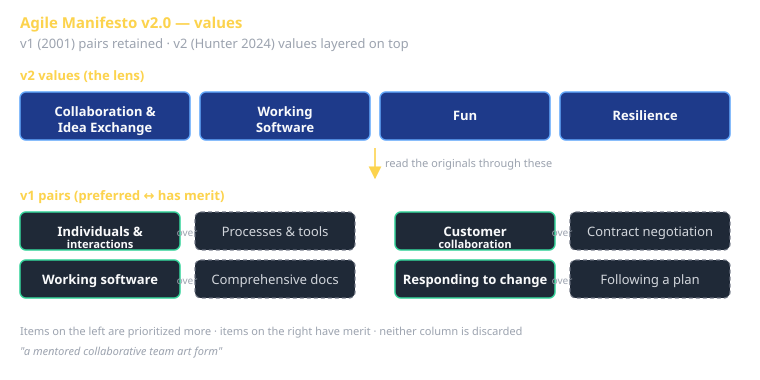
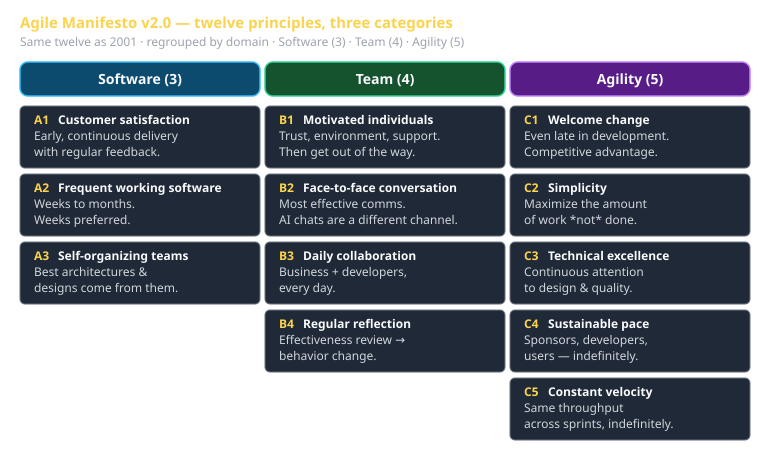

# Agile Manifesto v2.0 Cheat Sheet (80/20)

The 20% of agile that survives the LLM era. Hunter's v2.0 keeps everything the original 2001 manifesto got right (the items on the right still have merit; the items on the left are still prioritized more) and adds four values, regroups the twelve principles into three categories, and frames software development explicitly as a *mentored collaborative team art form*. Source: [The Agile Manifesto v2.0 — Michael Hunter (2024)](https://www.linkedin.com/pulse/agile-manifesto-v20-michael-hunter/).

This sheet is the vocabulary you'll use in your weekly reflections, your sprint presentations, and every conversation about how the team should operate. Skip nothing — it's all twelve principles plus four values, and the whole thing fits on a long subway ride.

## The four v2 values (the new layer)

Hunter adds four values *on top of* the original four pairs. They're not replacements — they're the lens you read the originals through.

### 1. Collaboration and Idea Exchange

The work is fundamentally social. The best ideas come from many minds in dialogue — including AI now — not from a single genius writing alone. **In practice:** every non-trivial decision should pass through at least one other set of eyes (human teammate, AI assistant, code reviewer) before it lands. Ideas without exchange are just opinions.

### 2. Working Software

Restated and elevated from the original. **Working** is doing real load-bearing work in production — not "compiles cleanly," not "passes the demo." Anything else is in-progress. **In practice:** every sprint demo shows the system handling a real scenario end-to-end, not a happy-path skin over an unfinished foundation.

### 3. Fun

If the work isn't fun, you're making it harder than it has to be — and the team will burn out before it ships. **In practice:** if a process step isn't producing learning *or* output that the team is proud of, kill it or fix it. Tedium is a process smell.

### 4. Resilience

The team can absorb a bad sprint, a sick teammate, an external API breaking, or a model outage and keep moving. Brittle plans pretend nothing will go wrong; resilient plans assume something will. **In practice:** the Strategy pattern in your LLM-backend wrapper isn't a clever flourish — it's resilience. Your CI/CD pipeline being able to deploy when a key engineer is offline is resilience. Cross-shuffled teams (no two students share a team twice) build resilient *people*.

## The four original value-pairs (retained)

Hunter explicitly preserves the 2001 wording. Items on the right have merit; items on the left are prioritized more.

| Prefer | Over |
|---|---|
| **Individuals and interactions** | Processes and tools |
| **Working software** | Comprehensive documentation |
| **Customer collaboration** | Contract negotiation |
| **Responding to change** | Following a plan |

The phrase to remember: *"items on the right have merit."* Don't strawman the right-hand column. You still need processes, documentation, contracts, and plans. You just don't worship them.

## The twelve principles, regrouped into three categories

The original manifesto listed 12 principles flat. v2.0 organizes them into three buckets so you can apply them by domain. **Same count, clearer mapping.**

### Category A — Software (3 principles)

These speak to what you ship and how you ship it.

- **A1. Customer satisfaction through early, continuous delivery with regular feedback.** The first sprint ships a thin slice of the whole system, not a thick slice of one component. Feedback loops are weekly minimum; daily during demo week.
- **A2. Frequent delivery of working software — weeks to months, weeks preferred.** In CS 3660 every sprint *is* a delivery. There is no "we'll ship at the end of the semester" sprint that doesn't ship in the middle of the semester first.
- **A3. Self-organizing teams produce the best architectures and designs.** No assigned tech lead. The team reads the spec, argues the tradeoffs, picks. The instructor course-corrects only at the pitch checkpoint and at the demos.

### Category B — Team (4 principles)

These speak to how the people work together.

- **B1. Build projects around motivated individuals; give them the environment and support they need; trust them to do the job.** Cross-shuffled sprint teams force this — you cannot rely on the same teammates carrying you each sprint. Motivated individuals show up. Unmotivated ones get exposed.
- **B2. Face-to-face conversation is the most effective communication.** In a partly-async class, this means: live Mon/Wed discussions, video presentations (not slide decks emailed around), pair-programming on the hard parts. AI chats are *not* a substitute for human face-to-face — they're a different communication channel.
- **B3. Business and developers collaborate daily.** In an industry context, "business" is product/customer. In CS 3660, it's the instructor + the rubric + the class itself (Sprint 1's tools-for-class projects). Daily collaboration ≈ daily check-in cadence within your team, plus immediate escalation on blockers.
- **B4. The team regularly reflects on effectiveness and adjusts behavior.** Per-sprint individual reflections in your portfolio repo are the formal artifact. The informal version is your stand-up reading "what's slowing us down?" out loud and *fixing* it that week, not the next.

### Category C — Agility (5 principles)

These speak to *how the team adapts under pressure.*

- **C1. Welcome changing requirements, even late in development. Agile processes harness change for the customer's competitive advantage.** When the rubric for Sprint 3 capstone announces a Perfect Framework concern is required, the right reaction is "great, we'll target i18n." Not "we already started without that." Late-arriving requirements are a feature, not a bug.
- **C2. Simplicity — the art of maximizing the amount of work *not done* — is essential.** YAGNI. The most agile thing you can do in any sprint is delete a feature you no longer need. Sprint 1's rubric does not list "and add as many extra features as possible." It lists: do the required work *well*.
- **C3. Continuous attention to technical excellence and good design enhances agility.** Cutting corners on tests, on naming, on architecture *reduces* future agility. The Perfect Framework concerns (auth, audit trails, observability, etc.) are not things you "add later" — they're how the system stays modifiable.
- **C4. Sustainable development pace — the sponsors, developers, and users should be able to maintain a constant pace indefinitely.** Sprint 3 is 5 weeks for a reason. Pulling all-nighters during the capstone means you're working at an unsustainable pace, which means your sustainable pace is too low — go fix that. (Hint: it's usually a Sprint 1 or 2 architectural decision catching up with you.)
- **C5. Constant velocity indefinitely.** The team that ships Sprint 3 is the same team that shipped Sprint 1 — different people, same throughput. If your team's velocity collapses across sprints, the team has a debt problem (technical, communication, or motivation), not a planning problem.

## What changed from 2001 → v2.0

| 2001 | v2.0 | Why |
|---|---|---|
| 4 value-pairs | 4 value-pairs **+ 4 new values** | Adds Collaboration/Working/Fun/Resilience as the lens to read the pairs through. |
| 12 flat principles | 12 principles **in 3 categories** (Software 3 / Team 4 / Agility 5) | Same count, clearer where each principle applies. |
| Implicitly human-only teams | Explicitly *mentored collaborative team art form* | Reflects 2024-era reality where AI is on the team. |

## How this lands in CS 3660

- **Vernacular usage**: when you cite "Agile v2" in a reflection or presentation, name the *category* (Software / Team / Agility), not just "agile." That's the precision the LLM grader looks for.
- **Sprint mechanics directly mirror this**: 4-person teams (Team B1), reshuffled (Resilience), 2-week sprints with demos (Software A2), per-sprint individual reflections (Team B4), capstone pitch with course-correction (Software A3 + Agility C1).
- **What it's NOT**: a process you "do" once. It's the lens you re-apply at every decision. "Should we add this feature?" → C2 simplicity. "Is this worth a meeting?" → B2 face-to-face. "Did we ship something that works?" → Working Software (value 2).
- **What it shares with the original Agile Manifesto**: the spirit of the snowbird group's 2001 work. Hunter's v2 explicitly credits and builds on that foundation rather than replacing it.

## The one-line summary

> Software development is a mentored collaborative team art form. **Collaboration**, **Working software**, **Fun**, and **Resilience** — built on top of the four 2001 pairs — applied through three lenses: **Software**, **Team**, **Agility**.

If you can recite that and explain what each piece *does*, you have the vocabulary the rest of the course expects.
