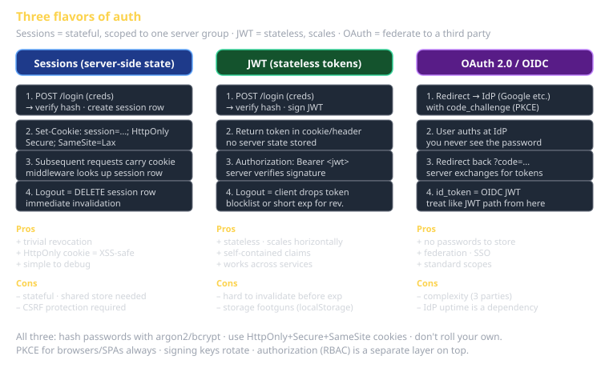

# Auth Cheat Sheet (80/20)

The 20% of authentication and authorization you'll get right (or wrong) 80% of the time. **Authentication** is "who is this user?"; **authorization** is "what are they allowed to do?". They're different problems with different solutions; conflating them is how you ship security holes.

This sheet covers the three patterns you'll pick from in this course — sessions, JWT, OAuth/OIDC — plus the basics of authorization (RBAC, data permissions). Browser-side defense layers (CSP, SameSite, CSRF) are in `cheatsheet-pki-and-mtls` and `cheatsheet-owasp-top-10`.

## Authentication vs. authorization

| | Authentication (authN) | Authorization (authZ) |
|---|---|---|
| Question | Who are you? | What can you do? |
| Mechanism | Passwords, tokens, federated identity | Roles, permissions, ACLs, policies |
| Failure mode | Anyone can log in as anyone | A logged-in user can do something they shouldn't |
| Where it runs | Login endpoint, session middleware | Per-route guards, per-record checks |

A login system that gets authentication right but skips authorization is a system where every logged-in user can read everyone else's data. **Both layers always.**



## Pattern 1 — Sessions (server-side state)

The classic: login creates a row in a server-side session store; the response sets a cookie with the session ID; subsequent requests look up the session.

**The flow**:
1. User submits username + password to `POST /login`.
2. Server validates against a hashed-password store (bcrypt/argon2/scrypt — never plaintext, never SHA-256 alone).
3. Server creates a session record: `{id: random_id, user_id, created_at, expires_at}`.
4. Server responds with `Set-Cookie: session=<id>; HttpOnly; Secure; SameSite=Lax`.
5. Browser sends that cookie on every subsequent request.
6. Server middleware reads cookie → looks up session → attaches `req.user`.

**The trade-offs**:
- ✅ Easy to invalidate (delete the session row → user is logged out).
- ✅ Simple to understand and debug.
- ✅ Cookie is `HttpOnly` — JavaScript can't read it (XSS-safe for the token itself).
- ❌ Stateful — every server (or load balancer) needs to reach the session store.
- ❌ Doesn't scale across services without shared infrastructure.
- ❌ CSRF mitigations required (SameSite cookies usually solve it, but not always).

**When to pick**: monolithic app, single domain, you already have a database. The default for traditional web apps; still right for a lot of cases.

**Cookie attributes you must set**:
- `HttpOnly` — JS can't read it.
- `Secure` — only sent over HTTPS.
- `SameSite=Lax` (or `Strict` if your app doesn't redirect across origins).
- `Path=/` (usually).
- Avoid `Domain=` unless you genuinely need cross-subdomain.

**Hashing the password**:
```typescript
import { hash, verify } from 'argon2';

// On signup:
const pwHash = await hash(password);

// On login:
const ok = await verify(pwHash, password);
```
Never `crypto.createHash('sha256')` for passwords — it's not slow enough; rainbow tables eat it. argon2 (preferred) or bcrypt (fine; older) are deliberately slow.

## Pattern 2 — JWT (stateless tokens)

A signed token that carries claims. The server doesn't store sessions; it verifies the token's signature on each request.

**The flow**:
1. User logs in with credentials.
2. Server validates credentials and creates a JWT: `header.payload.signature`.
3. Server responds with the JWT (in a header, body, or `Set-Cookie`).
4. Client sends `Authorization: Bearer <jwt>` on subsequent requests.
5. Server verifies the signature against its secret/public key, decodes claims.

**Anatomy of a JWT**:
```
eyJhbGciOiJIUzI1NiIsInR5cCI6IkpXVCJ9.        ← header (alg + typ)
eyJzdWIiOiIxMjM0IiwibmFtZSI6IkphbmUifQ.       ← payload (claims)
TJVA95OrM7E2cBab30RMHrHDcEfxjoYZgeFONFh7HgQ   ← signature
```

Each part is base64url-encoded JSON (header and payload) or a binary signature. Standard claims: `iss` (issuer), `sub` (subject = user id), `aud` (audience), `exp` (expiration), `iat` (issued at), `jti` (JWT id).

**The trade-offs**:
- ✅ Stateless — works across services without a shared session store.
- ✅ Self-contained — claims travel with the token.
- ✅ Industry standard — every language has libraries.
- ❌ Hard to invalidate. Once issued, the token is valid until it expires. Revocation requires a blocklist (which makes you stateful again).
- ❌ Footguns: `alg: none` attacks (libraries reject them now, but you should pin the algorithm). Asymmetric vs. symmetric keys (HS256 vs. RS256). Storing in localStorage is XSS-vulnerable.

**When to pick**: microservices that need to validate identity without round-tripping to an auth server; APIs consumed by mobile apps; Bearer-token APIs in general.

**The signing key situation**:
- **HS256** (symmetric) — server signs and verifies with the same secret. Simple but secret must be shared everywhere it's verified.
- **RS256** (asymmetric) — auth server signs with a private key; everyone else verifies with the public key. Right for multi-service or multi-tenant.

**Storage rules**:
- Don't put JWTs in `localStorage` if you can avoid it (XSS-readable).
- HttpOnly cookies are best for browser apps; the cookie carries the token, JS can't see it.
- Mobile apps can use secure keychain (iOS Keychain, Android Keystore).

**Common claims you'll add**:
```json
{
  "sub": "user_12345",
  "email": "j.smith@example.edu",
  "roles": ["student", "team_member"],
  "exp": 1735689600,
  "iat": 1735603200,
  "iss": "cs3660-auth"
}
```
Don't put sensitive data in claims — the payload is base64-decodable, NOT encrypted. The signature only proves origin and integrity, not confidentiality.

**Don't roll your own**. Use `jsonwebtoken` (Node), `python-jose` (Python), `dart_jsonwebtoken`, `go-jwt`. Pin the algorithm; reject `alg: none`. Most libraries do this by default in 2026 but verify.

## Pattern 3 — OAuth 2.0 / OIDC (federated identity)

Delegate authentication to a third party (Google, GitHub, your university SSO). Your app trusts a token from the identity provider instead of holding the password itself.

**OAuth 2.0** is the framework for delegated authorization (the user lets one service act on their behalf at another).
**OIDC (OpenID Connect)** is OAuth 2.0 with a standardized identity token (`id_token`, an OIDC-flavored JWT).

**The "authorization code with PKCE" flow** (the right one for browser apps in 2026):

1. User clicks "Login with GitHub" — your app redirects to GitHub with `client_id`, `redirect_uri`, `scope`, `state`, `code_challenge` (PKCE).
2. User authenticates with GitHub.
3. GitHub redirects back to your app with `?code=...&state=...`.
4. Your app's server exchanges the `code` (plus `code_verifier`) for an access token (and id_token, refresh_token).
5. Your app stores the id_token (the user's identity claims) and uses it like a session/JWT.

**The trade-offs**:
- ✅ You never store passwords.
- ✅ Federated — users log in with an identity they already have.
- ✅ Standard scopes for permissions (`read:user`, `repo`, etc.).
- ❌ Complexity. Three parties (user, your app, the IdP) and many edge cases.
- ❌ Reliant on the IdP's uptime and policies.
- ❌ Per-IdP quirks (Google differs from GitHub differs from Microsoft).

**When to pick**: any app with user accounts where you'd rather not be in the password business; multi-tenant SaaS (each tenant brings its own SSO); UVU SSO integration.

**Don't roll your own.** Use `passport`, `auth.js` (NextAuth), `oauth4webapi`, `pyoidc`. The state machine is finicky and the security implications of getting it wrong are severe.

**PKCE explained briefly**: Proof Key for Code Exchange. The browser generates a random `code_verifier`, hashes it as `code_challenge`, sends the challenge in step 1, sends the verifier in step 4. Prevents authorization-code interception attacks. Required for SPAs and mobile apps in 2026; should be on for everything.

## Decision tree — pick the right one

```
Is this a backend-only service-to-service call?
  → mTLS (see cheatsheet-pki-and-mtls). No JWT needed.

Are users in your app already authenticated by another system you trust?
  → OAuth 2.0 / OIDC. Federate.

Is this a single web app on one domain, you have a database, and scale isn't an immediate concern?
  → Sessions (cookie + server store).

Is this a multi-service backend or you're issuing tokens to external API consumers?
  → JWT.

Is this a mobile app or SPA hitting an API?
  → JWT in HttpOnly cookie if same-domain, otherwise OAuth flow → JWT in secure storage.
```

## Authorization — RBAC in 5 minutes

Role-based access control: assign roles to users, permissions to roles, check permissions in code.

**Schema**:
```
users(id, email, ...)
roles(id, name)            -- 'admin', 'instructor', 'student', 'guest'
permissions(id, name)      -- 'create_assignment', 'view_grade', 'export_roster'
user_roles(user_id, role_id)
role_permissions(role_id, permission_id)
```

**Check at the route level**:
```typescript
app.post('/assignments', requirePermission('create_assignment'), async (ctx) => {
  // ctx.user is set by auth middleware
  // requirePermission threw 403 if missing
  await createAssignment(ctx.body);
});
```

**Don't check at the UI level only**. The UI hides the button; the API still has to refuse the call. UI-level checks are for UX, not security.

## Data permissions — beyond RBAC

RBAC says "this user can call `view_grade`." Data permissions say "this user can view *which* grades."

The naive approach (`SELECT * FROM grades WHERE user_id = ?` with `?` user-supplied) leads directly to BOLA (Broken Object-Level Authorization, OWASP A01). Real systems enforce data permissions:

- **Row-level security in the database** — Postgres has `CREATE POLICY` that filters rows by the connected user. Excellent if your DB connection identity matches your app user identity.
- **Per-query filters in the app** — every query that returns user data is wrapped in a filter that's automatically applied based on the requesting user. ORM features like Prisma's middleware help.
- **Permission checks per record** — slower but explicit. `if (!canRead(user, record)) throw new ForbiddenError()` before returning.

**The right answer is usually "all three layered."** Defense in depth — RBAC at the route, ownership at the query, sensitive-field filtering at the response.

## Common failure modes

- **Storing passwords in plaintext or weakly hashed (SHA-256 / MD5).** Always use argon2 or bcrypt with sufficient cost.
- **JWT in localStorage.** XSS readable. Use cookies if you can.
- **Not validating JWT signature.** A library that decodes without verifying = catastrophic. Always call `verify`, never just `decode`.
- **Trusting the `iss` claim without checking it.** Your code must declare what issuer it accepts.
- **Forgetting to invalidate on logout.** Sessions: delete the row. JWT: add to a blocklist or rely on short expiration.
- **Mixing authentication and authorization.** Verifying identity isn't permission to act.
- **CORS misconfigured.** `Access-Control-Allow-Origin: *` with cookies is a hostile combination; specify the exact origin.

## What this is in vernacular

- **Sessions** ≈ Perfect Framework's *Database* concern (state lives there).
- **JWT** ≈ a Document Message (EIP) — the token is data with metadata.
- **OAuth** ≈ Process Manager (EIP) at scale — orchestrates a multi-step flow across systems.
- **RBAC** = Perfect Framework's *Security > Role-Based Access Control* concern.
- **Data permissions** = Perfect Framework's *Security > Data permissions* concern.

## Further reading

- **OWASP Authentication Cheat Sheet** — what NOT to do.
- **OWASP Session Management Cheat Sheet** — cookie attribute reference.
- **RFC 6749** (OAuth 2.0), **RFC 6750** (Bearer tokens), **RFC 7636** (PKCE), **RFC 8628** (Device Authorization Grant for IoT).
- **Auth0 docs** — opinionated but accurate.
- **`cheatsheet-pki-and-mtls`** — for service-to-service auth.
- **`cheatsheet-owasp-top-10`** — for the failure modes above with mitigations.
