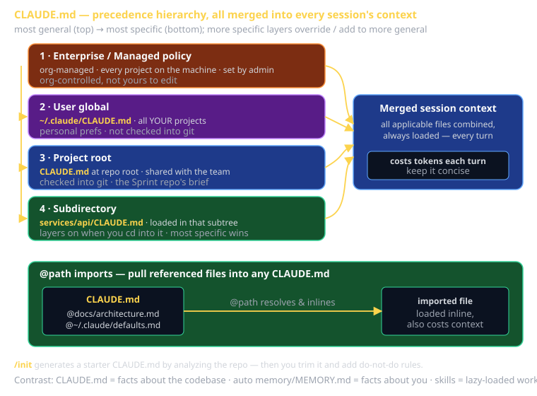

# CLAUDE.md Cheat Sheet (80/20)

CLAUDE.md is Claude Code's project memory: a plain markdown file the agent reads automatically at the start of every session and keeps in context for every turn. This cheat sheet is the 20% of CLAUDE.md you'll use 80% of the time — what to put in it, the precedence hierarchy that decides which file wins, `@path` imports, and the discipline of keeping it short so it doesn't eat your context window.

The reason it matters in CS 3660: every Sprint repo ships with an instructor-maintained CLAUDE.md, and your own additions are graded as part of "substantive use of Claude Code." A good CLAUDE.md is the difference between an agent that knows your conventions on turn one and one that rediscovers them every conversation.



## What CLAUDE.md is (and isn't)

**Is**: a briefing document. Project conventions, architecture orientation, build/test commands, and do-not-do rules — the things you'd tell a new contractor on day one. Claude loads it without being asked.

**Isn't**: a dumping ground. It is *always* in context, so every byte costs tokens on every turn. It is not where rarely-needed detail goes (that's a skill), and it is not where facts about *you* go (that's auto memory / MEMORY.md).

The litmus test: **write CLAUDE.md as if briefing a new contractor on day one.** What do they need before they touch the code? That, and nothing else.

## What goes in it

| Put in CLAUDE.md | Why |
|---|---|
| Project conventions | "Use `pnpm`, not `npm`." "Tabs, not spaces." |
| Architecture orientation | "API in `services/api/`, frontend in `apps/web/`." |
| Build & test commands | How to run tests, where they live, how to type-check. |
| Do-not-do rules | "Never commit `.env`." "Don't edit generated files in `gen/`." |
| Key invariants | "All money is stored in integer cents." |

```markdown
# CLAUDE.md

This project uses Bun + Hono (backend) and React + Vite (frontend).

## Commands
- Backend tests: `bun test`
- Frontend tests: `pnpm test`
- Type-check before every commit: `pnpm typecheck`

## Conventions
- API contracts live in `packages/contracts` — update them BEFORE the implementation.
- Never commit secrets; use `.env.local` (gitignored).
```

## The precedence hierarchy (most general → most specific)

Claude Code does not load one CLAUDE.md — it loads *all of them that apply* and merges them. More specific files layer on top of (and can override) more general ones. From least to most specific:

| Level | Location | Scope | Checked into git? |
|---|---|---|---|
| Enterprise / managed | org-managed policy path | Every project on the machine, set by an admin | n/a (org-controlled) |
| User (global) | `~/.claude/CLAUDE.md` | All *your* projects | No — personal |
| Project root | `CLAUDE.md` at repo root | This repo, shared with the team | **Yes** |
| Subdirectory | `CLAUDE.md` in a subtree | Loaded when you work inside that subtree | Yes |

The merge is additive: your `~/.claude/CLAUDE.md` ("always explain your reasoning") combines with the project root file ("use pnpm") combines with a subdirectory file in `services/api/` ("this service is Python, not TS"). When you `cd` into `services/api/`, that nested file enters context on top of the rest.

In this workspace you can see all four behaviors live: `~/.claude/CLAUDE.md` (the user's global production-code standards) sits under the workspace `CLAUDE.md`, which sits under `course_builder/CLAUDE.md`. Same machine, three layers, merged.

## `@path` imports

A CLAUDE.md can pull in other files with the `@path` syntax. The referenced file's contents get loaded as if they were inline. Use it to keep the main file short while still surfacing a key document.

```markdown
# CLAUDE.md

See @docs/architecture.md for the system overview.
Coding standards: @./STYLE.md
Personal global prefs: @~/.claude/my-defaults.md
```

Paths can be relative to the file, or use `~` for home. Imports are how you reference a detailed doc without pasting its whole body into project memory — but remember the imported content still costs context once loaded, so import deliberately.

## `/init` — generate a starter

Don't write CLAUDE.md from a blank page. Run `/init` and Claude analyzes the repo — languages, build tools, test setup, structure — and writes a starter CLAUDE.md for you. Then edit it: cut what's obvious, add the do-not-do rules and invariants Claude couldn't infer.

```
/init        → scans repo, drafts CLAUDE.md
(you)        → trim, correct, add the rules that aren't in the code
```

## CLAUDE.md vs. auto memory vs. skills

These three are constantly confused. They are different tools for different jobs:

| | Always loaded? | Holds what | You write it? |
|---|---|---|---|
| **CLAUDE.md** | Yes, every turn | Facts about the **codebase** | Yes (or `/init`) |
| **Auto memory / MEMORY.md** | Yes, persists across convos | Facts about **you / your workflow** | No — Claude proposes, you confirm |
| **Skills** | No — **lazy-loaded** on invoke | Reusable workflows | Yes |

The rule of thumb: codebase facts → CLAUDE.md; facts about you and your preferences → auto memory; a procedure you'd otherwise re-explain → a skill. If something is needed only occasionally, it does *not* belong in CLAUDE.md, because CLAUDE.md is paid for on every single turn.

## What this is in vernacular

CLAUDE.md is a **Singleton / shared configuration context** (GoF) — a single ambient object every agent turn reads from. There is one merged view, it's globally visible to the session, and everything downstream consults it without passing it around explicitly. Think of it as the **ambient context** for the whole conversation: it's just *there*, shaping every action, the way a global config or a dependency-injection root shapes a running app.

The precedence stack is the **Decorator / layered-override** idea: each more-specific file wraps the more-general one, adding to or overriding it, with the subdirectory file as the outermost layer.

## Course tie-in (CS 3660)

- Every Sprint repo includes an instructor-maintained `CLAUDE.md` at the root. Read it first — it tells you and your agent how *that* sprint is wired.
- Add a **subdirectory CLAUDE.md** when one part of your project has different rules (e.g., a `game/` folder with its own engine conventions). Demonstrating the hierarchy is exactly the kind of "substantive use" the Sprint 3 rubric rewards.
- Keep it short. Graders (and your token budget) notice a 400-line CLAUDE.md that should have been a 40-line file plus a skill.

## Common failure modes

- **Bloated CLAUDE.md.** Pasting entire design docs inline. It's always in context — every turn pays for it. Move detail to a skill (lazy-loaded) or `@import` it deliberately.
- **Wrong tool for the fact.** Putting "I prefer terse answers" in CLAUDE.md (that's auto memory) or "how to run tests" in a skill (that's CLAUDE.md). Match the fact to the tool.
- **Forgetting it's checked in.** The project-root CLAUDE.md is shared with your team via git. Don't put personal preferences or secrets there — use `~/.claude/CLAUDE.md` for personal, never commit secrets at all.
- **Stale commands.** A CLAUDE.md that says `npm test` after you migrated to `pnpm` actively misleads the agent. Update it when the build changes.
- **Skipping `/init`.** Hand-writing from scratch when `/init` would give you 80% of a correct draft in seconds.
- **Assuming only the root file loads.** Forgetting that a subdirectory CLAUDE.md silently layers in when you work in that subtree — and that it can override the root.

## Further reading

- **`code.claude.com/docs/en/memory`** — official memory & CLAUDE.md reference (hierarchy, imports).
- **`cheatsheet-claude-code-capabilities`** — where CLAUDE.md fits among skills, hooks, sub-agents, and context management.
- **`/init`** — run it in any repo to see a generated CLAUDE.md.
