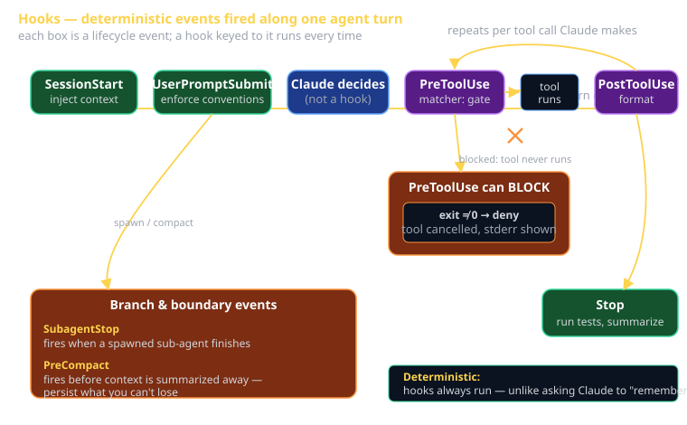

# Hooks Cheat Sheet (80/20)

Hooks are the one Claude Code feature that turns "please remember to do X" into "X always happens." They're user-defined shell commands that fire **deterministically** on lifecycle events. This sheet is the 20% of hooks you'll use 80% of the time — the event table, the `settings.json` shape, the matcher syntax, and the two hooks worth writing first (auto-format on edit, block dangerous commits). The other 80% is variations on these.

Individual Claude Code Artifact #3 ("build a hook") is graded directly off this material. By the end of this sheet you should be able to write and ship a working hook.



## What a hook is (and isn't)

**Is**: a shell command Claude Code runs *itself*, automatically, when a lifecycle event happens. It receives JSON about the event on **stdin**. Its **exit code** and output can let the action proceed, block it, or feed information back into the conversation.

**Isn't**: a request to Claude. When you ask Claude "always run the linter after editing," Claude *might* remember — until the context fills or the conversation resets. A hook is the harness, not the model. It runs every single time, whether Claude feels like it or not. That determinism is the entire point.

The rule of thumb: **if it must happen, hook it. If it's a judgment call, ask Claude.**

## Where hooks live

Configure hooks in a `settings.json` file. Two scopes:

| File | Scope | Use for |
|---|---|---|
| `~/.claude/settings.json` | **User** — every project | Personal guardrails (block secrets everywhere) |
| `.claude/settings.json` | **Project** — committed to git | Team conventions (auto-format, run tests) |

Project hooks ship with the repo, so every teammate (and Claude, on their machine) gets the same enforcement. That's where your Sprint hooks belong.

## The lifecycle events

A hook is keyed to one event. These are the real event names — don't invent others.

| Event | Fires on | Common uses |
|---|---|---|
| `SessionStart` | A new session/conversation begins | Inject project context, print reminders, load TODO state |
| `UserPromptSubmit` | You submit a prompt (before Claude sees it) | Enforce conventions, append context, reject empty/secret-laden prompts |
| `PreToolUse` | Before a tool runs (after Claude decides to call it) | **Block** dangerous commands, gate edits to protected files |
| `PostToolUse` | After a tool finishes | Auto-format edited files, auto-stage, lint, type-check |
| `Stop` | Claude finishes its turn | Run the test suite, flag regressions, summarize |
| `SubagentStop` | A spawned sub-agent finishes | Validate sub-agent output, log research results |
| `PreCompact` | Before context is compacted | Persist anything you don't want summarized away |
| `SessionEnd` | The session ends | Cleanup, write a session log |
| `Notification` | Claude sends a notification (e.g. needs input) | Desktop ping, Slack message, sound |

**`PreToolUse` and `PostToolUse` are the workhorses.** They're the only two that take a `matcher` to target specific tools.

## Matchers: targeting specific tools

`PreToolUse`/`PostToolUse` fire for *any* tool by default. A `matcher` (a regex over tool names) narrows that:

- `Edit|Write` — fires only when Claude edits or writes a file.
- `Bash` — fires only on shell commands.
- `Read` — fires only on file reads.
- `.*` or omitted — fires on everything.

The tool name and its inputs arrive in the stdin JSON, so your script can inspect *what* is about to happen (which file, which command) and decide.

## The stdin JSON contract

Every hook gets a JSON object on stdin describing the event. You read it, you act on it. A `PreToolUse` Bash hook receives something shaped like:

```json
{
  "hook_event_name": "PreToolUse",
  "tool_name": "Bash",
  "tool_input": { "command": "git push --force origin main" }
}
```

Parse it with `jq` (or your language of choice) and branch on the fields. Don't assume the shape blindly — read the field you need and handle the case where it's missing.

## How a hook blocks an action

This is the part that makes hooks more than logging:

- **Exit code `0`** → allow. The action proceeds. Anything on stdout can be surfaced as context.
- **Exit code non-zero** (commonly `2` for a hard block) → **deny**. The tool call is *cancelled*, and whatever your hook prints on **stderr** is shown as the reason — to both you and Claude, so Claude can adjust.

So a `PreToolUse` hook is a true interceptor: it sees the tool call before it happens and can short-circuit it. `PostToolUse` runs after the fact, so it reacts rather than prevents (it can still flag a problem back to Claude).

## Example 1 — auto-format every edited file (PostToolUse)

The classic first hook. After Claude edits or writes a file, format it. No more "remember to run prettier."

`.claude/settings.json`:

```json
{
  "hooks": {
    "PostToolUse": [
      {
        "matcher": "Edit|Write",
        "hooks": [
          {
            "type": "command",
            "command": "FILE=$(jq -r '.tool_input.file_path'); npx prettier --write \"$FILE\""
          }
        ]
      }
    ]
  }
}
```

The command reads the edited file's path out of the stdin JSON with `jq`, then formats just that file. Every edit Claude makes lands formatted. Swap `prettier` for `dart format`, `black`, `gofmt` — whatever your stack uses.

## Example 2 — block dangerous / secret-laden commands (PreToolUse)

A guard that refuses force-pushes and commits that look like they contain secrets. This is the "block dangerous commits" artifact option.

`~/.claude/settings.json` (user scope — protect every project):

```json
{
  "hooks": {
    "PreToolUse": [
      {
        "matcher": "Bash",
        "hooks": [
          {
            "type": "command",
            "command": "CMD=$(jq -r '.tool_input.command'); if echo \"$CMD\" | grep -qE 'push --force|git push -f|AKIA[0-9A-Z]{16}|-----BEGIN [A-Z ]*PRIVATE KEY'; then echo 'Blocked: force-push or secret detected in command.' >&2; exit 2; fi"
          }
        ]
      }
    ]
  }
}
```

When the command matches, the hook prints a reason to **stderr** and exits `2`. The Bash tool call never runs; Claude sees the rejection message and can pick a safer command. When nothing matches, the script falls through, exits `0`, and the command proceeds normally.

## Example 3 — run tests when the turn ends (Stop)

`.claude/settings.json`:

```json
{
  "hooks": {
    "Stop": [
      {
        "hooks": [
          {
            "type": "command",
            "command": "dart test 2>&1 | tail -5"
          }
        ]
      }
    ]
  }
}
```

`Stop` has no `matcher` — it fires once when Claude wraps up. Here it runs the suite and pipes the tail back so a regression surfaces immediately instead of three commits later.

## Build your artifact: a checklist

For Individual Claude Code Artifact #3, pick one of the two starter hooks above and ship it:

1. Choose scope: project (`.claude/settings.json`, committed) for team conventions; user (`~/.claude/settings.json`) for personal guardrails.
2. Write the JSON: pick the event, add a `matcher` if it's `Pre`/`PostToolUse`, write the `command`.
3. Read stdin in your command (`jq -r '.tool_input.file_path'` or `.tool_input.command`).
4. For a guard, exit non-zero and print the reason to stderr; for an action, just do the work and exit 0.
5. **Test it for real**: have Claude edit a file (format hook should fire) or try a `git push --force` (guard should block). A hook you haven't watched fire is not done.
6. Commit it (if project-scoped) so it's reviewable in your PR — that's your evidence for the rubric.

## What this is in vernacular

- Hooks ≈ **Observer pattern** (GoF) — the harness emits lifecycle events; your hooks are subscribers that react.
- `PreToolUse` ≈ **Middleware / Interceptor** (e.g. Express middleware, servlet filters) — it sits in front of the action and can short-circuit the request before it reaches the handler.
- The non-zero-exit block ≈ a **guard clause / `preventDefault()`** — veto the default behavior before it happens.
- `PostToolUse` ≈ an **after-hook / database trigger** — fires once the operation lands, reacts to the result.
- Determinism ≈ **CI enforcement vs. a code-review comment** — a hook is the failing pipeline, not the polite "don't forget to format" note.

## Common failure modes

- **Asking Claude to "remember" instead of hooking it.** If it must happen every time, that's a hook, not a prompt. Memory is best-effort; hooks are guaranteed.
- **Forgetting the `matcher`.** A `PostToolUse` hook with no matcher fires after *every* tool, including `Read` — your formatter runs on nothing and errors. Scope it to `Edit|Write`.
- **Assuming the stdin shape.** `jq -r '.tool_input.command'` on a non-Bash event yields `null`. Read the field you expect and handle the empty case, or your guard silently passes.
- **Wrong exit code for a block.** To deny a `PreToolUse` action you must exit non-zero (use `2`). Exit `0` and the action proceeds no matter what you printed.
- **Printing the block reason to stdout instead of stderr.** The denial message Claude reads comes from **stderr**. To stdout, it may just become context and not read as a rejection.
- **A slow `Stop` hook.** Running the full suite on every turn gets painful fast. Scope it (changed files only) or move it to a pre-push hook.
- **Putting secrets in the hook command.** The command lives in `settings.json`, which is committed for project scope. Reference an env var; don't inline a token.
- **Hook never fires and you don't know why.** Confirm the file path (`~/.claude/` vs `.claude/`), valid JSON (a trailing comma kills the whole config), and the exact event name (case-sensitive: `PreToolUse`, not `pre-tool-use`).

## Further reading

- **`code.claude.com/docs/en/hooks-guide`** — the hooks reference: full event list, JSON schemas, exit-code semantics.
- **`code.claude.com/docs/en/settings`** — `settings.json` structure and scope resolution.
- **`cheatsheet-claude-code-capabilities`** — where hooks sit among sub-agents, skills, and MCP.
- **`cheatsheet-git-workflow`** — the git commands your `PreToolUse` Bash guard will be policing.
