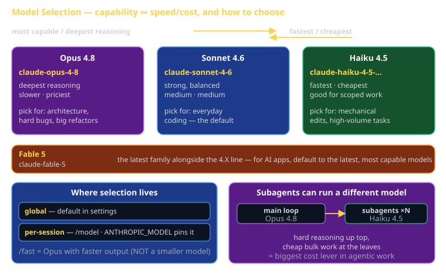

# Model Selection Cheat Sheet (80/20)

Claude Code lets you run different Claude models depending on the job. This cheat sheet is the 20% of model selection you'll use 80% of the time — knowing the capability ↔ speed/cost trade-off, how to switch models, and which model to reach for on which task. Picking the right model is the difference between burning budget on trivial edits and stalling a hard design problem behind an underpowered model.

For the Sprint 3 capstone, this matters twice: students on limited budgets need to understand the cost trade-off, and the capstone's hard design work deserves a capable model while routine edits don't.



## The trade-off in one sentence

More capable models reason deeper but cost more and run slower; faster models are cheaper but reason less. **Match the model to the task** — don't reflexively run the biggest model for a one-line fix, and don't run the cheapest for a gnarly architecture problem.

When you're *building* AI applications (Sprint 2, capstone), the default is different: reach for the **latest, most capable** Claude models, because your users feel the quality directly.

## The model families

The most recent Claude models are **Fable 5** and the **Claude 4.X family**. The 4.X family spans three tiers — Opus, Sonnet, Haiku — that trade capability against speed and cost.

| Model | ID | Capability | Speed / Cost | Pick it for |
|---|---|---|---|---|
| **Opus 4.8** | `claude-opus-4-8` | Highest — deepest reasoning | Slower / priciest | Hard reasoning, architecture, large multi-file refactors |
| **Sonnet 4.6** | `claude-sonnet-4-6` | Strong, balanced | Medium / medium | Everyday coding — the sensible default |
| **Haiku 4.5** | `claude-haiku-4-5-20251001` | Good for scoped work | Fastest / cheapest | Simple/mechanical edits, high-volume bulk tasks |
| **Fable 5** | `claude-fable-5` | Latest family | — | The newest generation alongside the 4.X line |

Rule of thumb:

- **Opus** = the architect. Reach for it when the problem is genuinely hard — designing a system, untangling a thorny bug, refactoring across many files.
- **Sonnet** = the workhorse. Strong balanced default for the bulk of day-to-day coding. When in doubt, this.
- **Haiku** = the sprinter. Fastest and cheapest; ideal for mechanical edits (rename, reformat, boilerplate) and high-volume tasks where you'd otherwise pay Opus prices a hundred times over.

## How to switch models

Selection is **global** (a default in settings) or **per-session** (the `/model` command). You can also pin a model via an environment variable.

### Per-session: `/model`

```
/model                      # interactive picker
/model claude-opus-4-8      # switch this session to Opus 4.8
/model claude-sonnet-4-6    # switch this session to Sonnet 4.6
```

The change applies to the current conversation only. Start a hard design task? `/model claude-opus-4-8`. Done, back to routine edits? `/model claude-sonnet-4-6`.

### Global: settings default

Set a default model in your Claude Code settings so every new session starts on the model you want. Good for matching your typical workload — e.g. Sonnet as your standing default, bumping to Opus per-session when a task earns it.

### Environment variable: `ANTHROPIC_MODEL`

```bash
export ANTHROPIC_MODEL=claude-sonnet-4-6   # pin a model for this shell / CI run
```

Useful in scripts and CI where you want a deterministic model regardless of local settings.

## Fast mode (`/fast`)

Fast mode gives you **Opus with faster output** — it does *not* downgrade to a smaller model. You keep Opus-level reasoning but get quicker responses.

```
/fast        # toggle fast mode on Opus
```

Available on **Opus 4.8 / 4.7 / 4.6**. Reach for it when you want top-tier capability without waiting on the slowest output speeds.

## Subagents can run a different model

A subagent is a separate, isolated conversation Claude spawns. **Subagents can be assigned a different (often cheaper) model than the main loop** — so the architecture-level conversation runs on Opus while bulk grunt work fans out to Haiku subagents, saving real money on high-volume work.

The pattern:

```
[ main loop: Opus 4.8 ]        ← hard reasoning, planning, synthesis
        │ spawns
        ▼
[ subagent: Haiku 4.5 ] × N    ← bulk file reads, mechanical edits, search
        │ report back
        ▼
[ main loop synthesizes ]
```

You pay Opus rates only where the reasoning is hard, and Haiku rates for the volume. This is the single biggest cost lever in agentic work.

## Choosing fast: a decision shortcut

| The task is… | Reach for |
|---|---|
| A one-line fix, rename, reformat, boilerplate | Haiku |
| Normal feature work, a typical bug, a small refactor | Sonnet |
| System design, a hard bug, a large cross-file refactor | Opus |
| Opus reasoning but you're waiting too long | Opus + `/fast` |
| Bulk reads/edits fanned out from a hard main task | Opus main loop + Haiku subagents |
| Building an AI app your users will judge | Latest, most capable (Opus / Fable 5) |

## How this maps to CS 3660

- **Routine sprint edits** — fixing a lint error, wiring a component, adjusting copy — don't need Opus. Sonnet or Haiku keeps your budget intact.
- **Sprint 3 capstone design work** — the architecture, the state charts, the hard integration — earns Opus. This is exactly the case where the cheapest model wastes more of your time than the price difference saves.
- **Limited budget?** Default to Sonnet, bump to Opus per-session only for the hard parts, and push bulk work onto Haiku subagents. You get capable reasoning where it counts without paying top rates all day.

## What this is in vernacular

- The capability/cost spectrum ≈ **Strategy** (GoF) — interchangeable model implementations selected at runtime for the task at hand.
- Per-session vs. global selection ≈ **Scoped configuration** — session override layered over a global default, like local vs. user settings.
- Subagents on a cheaper model ≈ **Tiered execution** — expensive reasoning at the top, cheap throughput at the leaves.

## Common failure modes

- **Running Opus for everything.** Trivial edits on the priciest model burn budget for no quality gain. Drop to Sonnet or Haiku.
- **Running Haiku on a hard problem.** The cheapest model stalls on architecture and gnarly bugs — you pay in your own wasted time. Bump to Opus.
- **Forgetting `/fast` exists.** If Opus output speed is the only thing slowing you down, `/fast` keeps the reasoning and cuts the wait — no need to downgrade.
- **Same model for main loop and bulk subagents.** Fan-out bulk work to Haiku subagents; keep Opus for the main reasoning. Don't pay Opus rates fifty times for file reads.
- **Hardcoding a stale model ID.** Pin via `ANTHROPIC_MODEL` deliberately; otherwise let your settings default track the current recommended model.
- **Under-powering an AI app you're shipping.** When users judge the output, default to the latest, most capable model — not the cheapest.

## Further reading

- **`code.claude.com/docs`** — official docs, kept current.
- **`cheatsheet-claude-code-capabilities`** — subagents, modes, and the agentic loop these models run inside.
