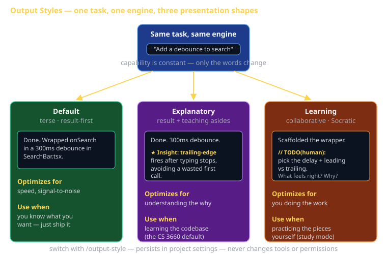

# Output Styles Cheat Sheet (80/20)

Output Styles are the cheapest lever in Claude Code: one command changes *how* Claude talks to you without touching what it can do. The 20% you'll use 80% of the time is knowing the three built-in styles, when each pays off, and how to switch — that's the whole game. Everything else (custom styles) is a bonus once you've internalized the core idea.



## The one idea that matters

Output Styles change the **behavioral layer of the system prompt** — the part that governs tone, verbosity, and how much reasoning Claude shows. They do **not** change Claude's tools, permissions, or capabilities. Same engine, same file edits, same shell access, same agentic loop. Different *communication shape* on the way out.

Think of it as picking the lens, not swapping the camera. The photo is the same scene; the framing changes what you notice.

> If you find yourself wishing Claude "explained more" or "just did it and shut up," you don't need a different model or a longer prompt — you need a different output style.

## The three built-in styles

| Style | What it optimizes for | Shape of the answer | Use it when |
|---|---|---|---|
| **Default** | Speed, signal-to-noise | Result first, terse, minimal commentary | You know what you want; you want it done |
| **Explanatory** | Understanding the *why* | Result + "★ Insight" asides about decisions | You're learning the codebase or a new pattern |
| **Learning** | You doing the work | Result with small `TODO(human)` hand-offs, Socratic nudges | You want to practice implementing the pieces yourself |

### Default

Concise and task-focused. Claude does the work and reports the outcome with as little ceremony as possible. This is the production-engineer setting: you've seen the pattern a hundred times and you just need the diff.

```text
You: Add a debounce to the search input.
Claude: Done. Wrapped onSearch in a 300ms debounce in SearchBar.tsx.
```

### Explanatory

Everything Default does, plus educational asides about the decisions it's making as it works. It surfaces the reasoning a senior dev would normally keep in their head — why this data structure, why this tradeoff, what it almost did instead.

```text
You: Add a debounce to the search input.
Claude: Done. Wrapped onSearch in a 300ms debounce in SearchBar.tsx.

★ Insight: I used a leading=false debounce so the request fires
  after the user stops typing, not on the first keystroke. For
  search-as-you-type, trailing-edge avoids a wasted call on the
  first character.
```

This is the style CS 3660 sessions are delivered in — you see the reasoning, not just the result, which is the entire point of Claude Code being the "textbook."

### Learning

Collaborative and Socratic. Claude does most of the work but deliberately leaves small, well-scoped pieces marked `TODO(human)` for you to implement, and asks questions instead of just answering them. You learn by filling in the blanks, not by reading a finished solution.

```text
You: Add a debounce to the search input.
Claude: I've scaffolded the debounce wrapper and wired the cleanup.
  One piece left for you:

  // TODO(human): pick the delay (ms) and decide leading vs trailing.
  //   Hint: what should happen on the very first keystroke?
  const debounced = useDebounce(onSearch, /* delay */);

  What delay feels right for search-as-you-type? Why?
```

Use Learning when the goal is *your* skill, not the shipped feature — exactly the right setting when practicing for a sprint where you'll be graded on individual contribution.

## How to switch

```text
/output-style                 # interactive picker (Default / Explanatory / Learning)
/output-style explanatory     # jump straight to one
/output-style:new             # create a custom style from a description
```

The choice **persists in your project settings** — it sticks across sessions until you change it. So if a teammate clones the repo, they may inherit the style you set if it's committed in project settings; check `/output-style` if Claude's tone surprises you.

## Custom output styles

A custom style is just a **markdown file describing the behavior you want**. Run `/output-style:new`, describe the communication shape ("always lead with a one-line summary, then a bulleted plan, never use emoji"), and Claude saves it as a reusable style you can select like the built-ins.

```markdown
---
name: exam-prep
description: Quiz me instead of answering directly
---

When I ask how to do something, do NOT give the full answer first.
Ask one diagnostic question, wait for my response, then reveal the
solution in steps. Mark any code you want me to write as TODO(human).
Keep prose under three sentences per turn.
```

Custom styles are how a team encodes "this is how we want Claude to talk in code reviews" or how an instructor ships a Socratic study mode. They're versioned like any other file — review them in PRs.

## A note on "Concise" and "Proactive"

You may see the words *Concise* and *Proactive* floating around in docs and chatter. Treat those as **informal descriptors of behavior**, not official toggles. The authoritative built-in styles are exactly three: **Default**, **Explanatory**, **Learning**. If someone tells you to "switch to Concise mode," they mean Default; "be more proactive" is a request, not a style. Don't go looking for a `/output-style concise` — it isn't a built-in.

## What this is in vernacular

- Output Styles ≈ **Strategy** (GoF) — interchangeable presentation strategies plugged into one unchanged engine. The algorithm (the agentic loop) stays put; you swap the strategy for *rendering* the result.
- A custom output style ≈ **Decorator** (GoF) — it wraps the same response and layers on extra behavior (insights, hand-offs, tone) without altering the core.

The mental model that keeps you out of trouble: the style decorates the *output*, it does not reconfigure the *agent*. Capability is constant; communication varies.

## How CS 3660 leverages this

1. **Lecture/companion content runs in Explanatory** so you see the reasoning behind each decision — that's the course treating Claude Code as a textbook that shows its work.
2. **Learning style is your study mode.** Before a sprint, flip to Learning and let Claude leave you `TODO(human)` pieces. You build the muscle you'll be graded on individually (the 45% instructor-eval portion rewards *your* contribution, not Claude's).
3. **Default during crunch.** Mid-sprint, when you know exactly what to ship, Default keeps the conversation tight and the context window clean.
4. **A team custom style** can encode your group's review voice — ship it in project settings so everyone's Claude reviews PRs the same way.

## Common failure modes

- **Thinking a style adds capability.** It doesn't. If Claude can't reach your database, switching to Explanatory won't fix that — that's an MCP/permissions problem, not a style problem.
- **Staying in Learning during crunch.** Those `TODO(human)` hand-offs are a feature when you're learning and a tax when you're shipping at 11pm. Flip to Default.
- **Forgetting it persists.** You set Explanatory once, then weeks later wonder why Claude is "so chatty." Run `/output-style` to check the current setting.
- **Chasing "Concise"/"Proactive" as real toggles.** They aren't. Use Default, or write a custom style that spells out the exact behavior.
- **Custom style that fights the task.** An `exam-prep` style that refuses to answer is great for studying and miserable when you actually need the answer fast. Switch back to Default before real work.
- **Confusing style with permission mode.** Shift+Tab cycles *permission modes* (how much autonomy); `/output-style` changes *communication shape* (how it talks). Orthogonal knobs — you set both independently.

## Further reading

- **`code.claude.com/docs/en/output-styles`** — official reference for the built-ins and `/output-style:new`.
- **`cheatsheet-claude-code-capabilities`** — the capabilities, permission modes, and skills these styles sit on top of.
- **`code.claude.com/docs/en/settings`** — where the persisted style choice lives in project settings.
