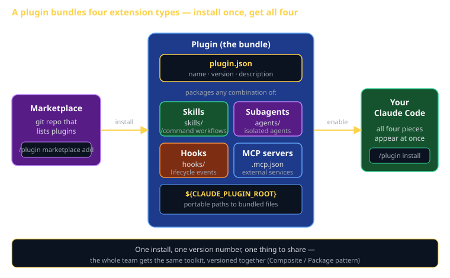

# Plugins Cheat Sheet (80/20)

A plugin is how you ship a whole Claude Code toolkit as one installable package. This cheat sheet is the 20% of plugins you'll use 80% of the time — what a plugin bundles, the `plugin.json` manifest, the directory layout, and how to install one from a marketplace. The payoff: instead of asking a teammate to copy four config files into the right places, you say "install this plugin" and they get your skill, your subagent, your hook, and your MCP server all at once, versioned together.

Individual Claude Code Artifact #5 ("build a plugin") is the capstone of the artifact series. It exists precisely *because* a plugin can wrap up the skill, subagent, hook, and MCP config you built in Artifacts 1–4 into one shareable bundle. This sheet is how you do that.



## What a plugin is (and isn't)

**Is**: an installable *package* that bundles any combination of four extension types — skills, subagents (agents), hooks, and MCP server configs — distributed as a unit. Add a marketplace, run `/plugin install`, and every member of your team gets the same toolkit.

**Isn't**: a new kind of extension. A plugin invents nothing — it *packages* the extensions you already know. There is no "plugin behavior"; there's only the behavior of the skills/agents/hooks/MCP servers inside it. The plugin is the box, not the contents.

The mental model: you've spent four artifacts building one skill, one subagent, one hook, one MCP config. Each lives in a different place (`~/.claude/skills/`, `.claude/agents/`, `settings.json`, `.mcp.json`). A plugin collects all four into one directory with a manifest so they install — and update — together.

## The four things a plugin can bundle

| Component | Lives in | What it adds | Artifact |
|---|---|---|---|
| **Skills** | `skills/<name>/SKILL.md` | Reusable `/command` workflows, lazy-loaded | #1 |
| **Subagents** | `agents/<name>.md` | Specialized isolated agents (reviewer, debugger) | #2 |
| **Hooks** | `hooks/hooks.json` (+ scripts) | Scripts that fire on lifecycle events | #3 |
| **MCP servers** | `.mcp.json` | Connections to external services/tools | #4 |

You don't need all four. A plugin can be skills-only, or just a hook, or any mix. The value scales with how much you bundle: one install, one version number, one thing to share.

## Directory layout

A plugin is just a directory with a `plugin.json` manifest at the root (inside a `.claude-plugin/` folder) plus the component directories:

```
cs3660-toolkit/
├── .claude-plugin/
│   └── plugin.json          # the manifest (required)
├── skills/                  # bundled skills
│   └── pr-summary/
│       └── SKILL.md
├── agents/                  # bundled subagents
│   └── rubric-checker.md
├── hooks/                   # bundled hooks
│   ├── hooks.json
│   └── format-on-save.sh
└── .mcp.json                # bundled MCP server configs
```

Auto-discovery: Claude Code finds `skills/`, `agents/`, `hooks/`, and `.mcp.json` by their standard locations — you don't list each file in the manifest. The manifest carries metadata (name, version, description), not a file inventory.

## The `plugin.json` manifest

The one required file. It identifies the plugin and is what the marketplace lists:

```json
{
  "name": "cs3660-toolkit",
  "version": "1.0.0",
  "description": "PR summaries, rubric checks, auto-format, and a Postgres MCP for CS 3660 sprints",
  "author": {
    "name": "Your Name",
    "email": "you@uvu.edu"
  },
  "homepage": "https://github.com/you/cs3660-toolkit",
  "keywords": ["cs3660", "review", "sprint"]
}
```

`name` and `version` are the load-bearing fields — the marketplace keys off `name`, and `version` is how everyone stays in sync. Bump `version` when you change anything inside; teammates re-running `/plugin install` get the update.

## Referencing bundled files: `${CLAUDE_PLUGIN_ROOT}`

The portability trap: a hook script or MCP command needs a path, but you don't know where the plugin lands on someone else's machine. **Never hardcode a path.** Use `${CLAUDE_PLUGIN_ROOT}` — it expands to the plugin's install directory at runtime.

```json
{
  "hooks": {
    "PostToolUse": [
      {
        "matcher": "Edit|Write",
        "hooks": [
          { "type": "command", "command": "${CLAUDE_PLUGIN_ROOT}/hooks/format-on-save.sh" }
        ]
      }
    ]
  }
}
```

Same rule for an MCP server shipped inside the plugin:

```json
{
  "mcpServers": {
    "sprint-db": {
      "command": "node",
      "args": ["${CLAUDE_PLUGIN_ROOT}/servers/db.js"],
      "env": { "DATABASE_URL": "${DATABASE_URL}" }
    }
  }
}
```

`${CLAUDE_PLUGIN_ROOT}` for files *inside* the plugin; environment variables like `${DATABASE_URL}` for secrets that live on the user's machine. Don't confuse the two.

## Installing a plugin (marketplace → install)

Plugins are distributed through **marketplaces** — a git repo (or local dir) that lists available plugins. Two steps: add the marketplace, then install from it. Manage everything with the `/plugin` command.

```bash
# 1. Add a marketplace (a git repo that publishes plugins)
/plugin marketplace add hunterino/cs3660-marketplace

# 2. Install a plugin from it
/plugin install cs3660-toolkit

# Browse / manage
/plugin                       # interactive: browse, install, enable, disable
/plugin marketplace list      # marketplaces you've added
```

After install, the bundled pieces just appear: the skill shows up in `/help`, the subagent in `/agents`, the MCP server in `/mcp`, and the hooks start firing. One command, four capabilities.

## What this is in vernacular

- A plugin ≈ the **Composite pattern** (GoF) — a bundle of parts treated as one unit. You install the composite; you get the leaves.
- A plugin ≈ a **Module / Package** — the *distribution unit*, like an npm package or a Dart pub package: a versioned, named, shareable bundle of code.
- The `plugin.json` manifest ≈ a `package.json` / `pubspec.yaml` — name, version, description, the metadata a registry reads.
- The marketplace ≈ a **package registry** (npm, pub.dev) — the index you add and install from.
- The whole thing ≈ a **Facade** over your toolkit — one simple front door (`/plugin install`) hiding the four-part setup behind it.

## Build your Artifact #5

You already built the contents in Artifacts 1–4. Assembling the plugin:

1. **Make the directory.** `mkdir -p cs3660-toolkit/.claude-plugin` and write `plugin.json` (copy the example above; set `name`, `version`, `description`).
2. **Drop in your pieces.** Move your Artifact #1 skill to `skills/`, your Artifact #2 subagent to `agents/`, your Artifact #3 hook to `hooks/`, your Artifact #4 MCP config to `.mcp.json`.
3. **Fix the paths.** Replace every hardcoded path in your hooks/MCP config with `${CLAUDE_PLUGIN_ROOT}/…`. This is the #1 thing that breaks on a teammate's machine.
4. **Publish a marketplace.** Push the plugin dir to a git repo with a marketplace manifest at the root listing it.
5. **Install it fresh.** From a clean checkout, `/plugin marketplace add <your-repo>` then `/plugin install cs3660-toolkit`. If all four pieces show up (`/help`, `/agents`, `/mcp`, hook fires), you're done.

The demo that earns the rubric: install your plugin live in front of the class and show all four bundled capabilities working from a single `/plugin install`.

## Common failure modes

- **Hardcoded paths in hooks/MCP.** Works on your machine, breaks on everyone else's. Use `${CLAUDE_PLUGIN_ROOT}` for every in-plugin path.
- **Manifest in the wrong place.** `plugin.json` goes in `.claude-plugin/`, not the plugin root. Wrong location = the marketplace can't read it.
- **Bumping contents without bumping `version`.** Teammates re-install and get the old bundle. Change anything inside → bump `version`.
- **Committing secrets into the plugin.** A `DATABASE_URL` or token baked into `.mcp.json` ships to everyone who installs. Reference `${ENV_VAR}` instead; let each user supply their own.
- **An empty box.** A plugin with a manifest but no real skill/agent/hook/MCP inside is a stub. The rubric wants working bundled capabilities, not scaffolding.
- **Forgetting the marketplace step.** `/plugin install <name>` fails if you never ran `/plugin marketplace add <repo>` first. Add the source before installing from it.

## Further reading

- **`code.claude.com/docs/en/plugins`** — official plugins guide.
- **`code.claude.com/docs/en/plugin-marketplaces`** — publishing and consuming marketplaces.
- **`cheatsheet-claude-code-capabilities`** — the extension types a plugin bundles (skills, hooks, subagents, MCP).
- **`cheatsheet-skills`**, **`cheatsheet-hooks`**, **`cheatsheet-subagents`**, **`cheatsheet-mcp`** — the four Artifacts you'll package into Artifact #5.
