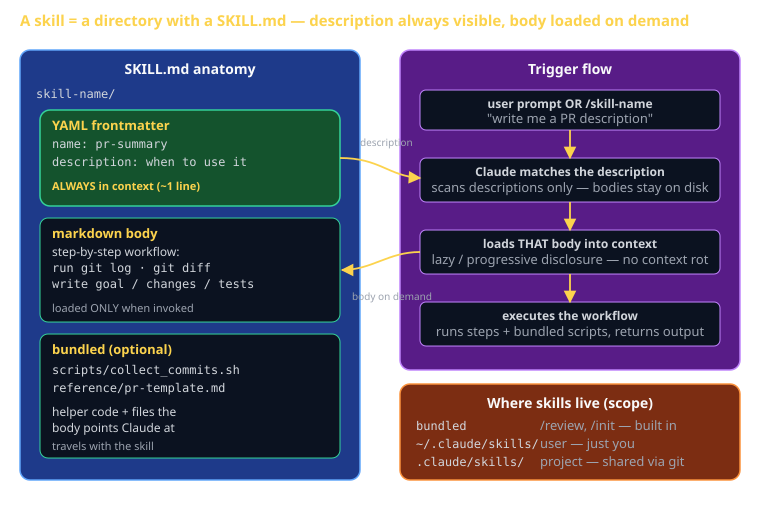

# Skills Cheat Sheet (80/20)

Claude Code is the textbook for CS 3660 in 2026. This cheat sheet is the 20% of Skills you'll use 80% of the time — what a skill *is* (a folder with a `SKILL.md`), how the `description` makes Claude pick it, why lazy loading beats a pasted prompt, and how to ship your own. Skills are the one Claude Code feature you build *as a deliverable*: Individual Claude Code Artifact #1 is "build a skill," so this sheet is written to get you to a working `SKILL.md`, not just to understand the idea.



## What a skill is (and isn't)

**Is**: a *directory* containing a `SKILL.md` file. That file has YAML frontmatter (`name`, `description`) and a markdown body of instructions. The directory can also bundle helper scripts and reference files the workflow needs.

**Isn't**: a magic command, a model, or a config setting. A skill is a packaged, reusable *workflow* — a named recipe Claude can pull into context and follow when the task matches.

The mental model: a skill is a prompt you wrote once, gave a name and a trigger, and checked into git so it's discoverable and versioned instead of living in a Slack message.

## Anatomy of a SKILL.md

```
pr-summary/                 ← directory name ≈ the /command
├── SKILL.md                ← required: frontmatter + body
├── scripts/                ← optional: helper scripts the body calls
│   └── collect_commits.sh
└── reference/              ← optional: files the body points Claude at
    └── pr-template.md
```

The `SKILL.md` itself has exactly two parts:

| Part | What it holds | Always in context? |
|---|---|---|
| YAML frontmatter | `name`, `description` | **Yes** — the `description` is always visible so Claude can decide when to use the skill |
| Markdown body | the actual instructions / workflow | **No** — loaded only when the skill is invoked |

That split is the whole point. See "Progressive disclosure" below.

## A real skill (copy this and edit)

```markdown
---
name: pr-summary
description: >
  Generate a GitHub PR description from the current branch's commits and diff.
  Use when the user asks to "open a PR", "write a PR description", or
  "summarize my changes for review".
---

# PR Summary

Gather the facts first:

1. Run `git log main..HEAD --oneline` to list the commits on this branch.
2. Run `git diff main..HEAD --stat` to see which files changed and by how much.

Then write a PR description with exactly these sections:

- **Goal** — one sentence: what this branch accomplishes and why.
- **Changes** — a bulleted list, grouped by area (frontend / backend / tests).
- **Test plan** — a checklist a reviewer can run to verify the change.

Output the result as a single fenced markdown block I can paste straight
into the GitHub PR description. Do not commit or push anything.
```

Save that as `~/.claude/skills/pr-summary/SKILL.md`. Now typing `/pr-summary` runs it, and Claude will *also* reach for it on its own when you say "write me a PR description."

## The `description` is the most important line

Claude never reads your skill body until it decides the skill is relevant — and it decides using the `description` alone. So the description must state **trigger conditions**, not just what the skill does.

| Weak description | Strong description |
|---|---|
| `Summarizes PRs` | `Generate a PR description from the branch's commits. Use when the user asks to open a PR, write a PR description, or summarize changes for review.` |
| `Opens issues` | `Create a GitHub issue from the current conversation. Use when the user says "file a bug", "open an issue", or "track this for later".` |

Rule of thumb: write the description so a *stranger* could predict exactly when the skill fires. Name the verbs and phrasings a user would actually type.

## Progressive disclosure (the killer feature)

This is why skills beat a giant `CLAUDE.md` or a pasted prompt.

- **`CLAUDE.md`** is loaded into context *every session, always*. Ten workflows pasted there means ten workflows' worth of tokens burned on every turn — even the nine you aren't using. That's "context rot."
- **A skill** keeps only its one-line `description` always-visible. The body enters context **lazily**, the moment the skill is invoked, and not before.

```
1000 lines of skill bodies sitting on disk
        │   only descriptions are scanned each turn  (~1 line each)
        ▼
user prompt OR /command matches a description
        ▼
THAT skill's body loads into context  ← just-in-time
        ▼
Claude executes the workflow
```

So you can have fifty skills installed and pay almost nothing for the forty-nine you don't use right now. Pasted prompts can't do this — they're either in the conversation (costing tokens) or not there at all.

## Where skills live (scope + precedence)

| Location | Scope | Shared how | Examples |
|---|---|---|---|
| **Bundled** | built into Claude Code | ships with the tool | `/review`, `/init` |
| **User** — `~/.claude/skills/` | just you, every project | not shared | your personal toolbox |
| **Project** — `.claude/skills/` | this repo, whole team | committed to **git** | team PR / issue workflows |
| **Plugin** | whoever installs the plugin | a marketplace plugin | instructor-published packs |

For CS 3660, put team workflows in `.claude/skills/` and commit them — your whole sprint team gets them on `git pull`. Put personal habits in `~/.claude/skills/`.

## How a skill gets invoked

Two paths, same skill:

1. **Explicitly** — you type `/pr-summary`. The directory name *is* the command name.
2. **Automatically** — Claude reads the task, matches it against every skill's `description`, and pulls in the one that fits. You don't type anything.

That dual nature is exactly the **Strategy pattern**: a set of interchangeable workflows, with the runtime selecting which one applies to the situation.

## Building your skill (Artifact #1 walkthrough)

The rubric line `cc-artifact-1-skill` asks you to ship a working skill. Do it in order:

1. **Pick a repetitive workflow you actually do.** Good first skills: "summarize my branch into a PR description" or "open a GitHub issue from this conversation." Both are small, real, and demoable.
2. **Make the directory.** `mkdir -p .claude/skills/<name>` (project) or `~/.claude/skills/<name>` (personal).
3. **Write `SKILL.md`.** Frontmatter `name` + a `description` that names the trigger phrases. Body = numbered, concrete steps.
4. **Bundle anything the steps need.** A `scripts/` helper, a `reference/` template — reference them by relative path from the body.
5. **Test both invocation paths.** Run `/<name>` explicitly. Then phrase a request that matches your description and confirm Claude reaches for it on its own.
6. **Verify discovery + versioning.** `/help` should list it; `git status` should show it staged (for project skills). Commit it.

A skill that can't be triggered by its description, or that a teammate can't get via `git pull`, isn't done.

## What this is in vernacular

- A skill ≈ **Strategy pattern** (GoF) — interchangeable workflows; the runtime selects which one applies.
- Invoking `/name` ≈ **Command pattern** (GoF) — a packaged, named, invocable action.
- Progressive disclosure ≈ **lazy loading / virtual proxy** — the body is a placeholder until something actually needs it.
- The `description` ≈ a **router predicate** — the condition that decides whether this handler runs.
- Bundled vs. user vs. project vs. plugin ≈ **scope/override chain** — like CSS specificity or config precedence.

## Skills vs. the alternatives

| You want to... | Use | Why |
|---|---|---|
| Always-on project facts (conventions, build commands) | `CLAUDE.md` | needs to be in context every turn |
| A reusable, *triggered* workflow | **a skill** | lazy-loaded, discoverable, versioned |
| A one-off instruction this once | just type it | not worth a file |
| Run code on a lifecycle event automatically | a hook | skills are invoked, hooks fire on events |

## Common failure modes

- **Vague `description`.** "Helps with PRs" never fires. Name the trigger phrases a user would type, or Claude won't pick the skill.
- **Putting the whole workflow in `CLAUDE.md`.** That's always-loaded — it bloats every turn and causes context rot. The body of a skill belongs in `SKILL.md`, loaded on demand.
- **Wrong scope.** A team workflow in `~/.claude/skills/` won't reach your teammates. Put shared skills in `.claude/skills/` and commit them.
- **Forgetting to commit (project skills).** If it's not in git, `git pull` won't deliver it to your sprint team. Discoverable + versioned is the whole advantage over a pasted prompt.
- **Referencing bundled scripts by absolute path.** Use paths relative to the skill directory so the skill is portable across machines.
- **A body that's a vague essay.** Skills work best as concrete, numbered steps with the exact commands to run — write it like a runbook, not a description.
- **Reinventing a bundled skill.** `/review` and `/init` already exist. Check `/help` before building your own.

## Further reading

- **`code.claude.com/docs/en/skills`** — official skills authoring guide.
- **`code.claude.com/docs/en/best-practices`** — Anthropic's recommended workflows.
- **`cheatsheet-claude-code-capabilities`** — where skills sit among hooks, sub-agents, MCP, and plan mode.
- **`cheatsheet-git-workflow`** — the git commands a PR-summary or issue skill will run on your behalf.
