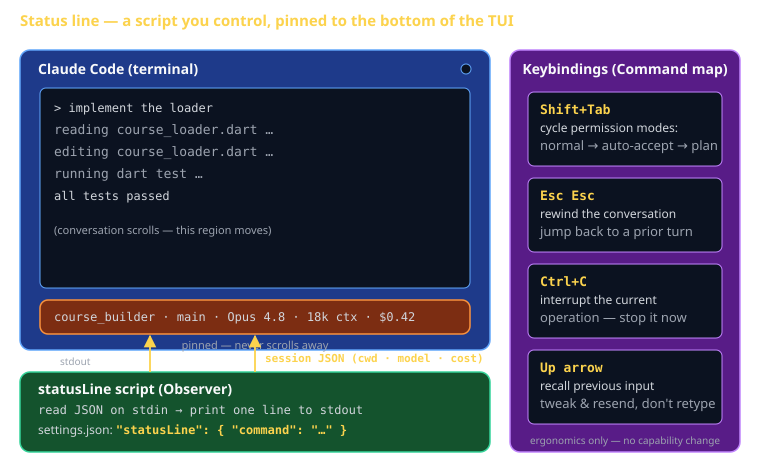

# Status Lines & Keybindings Cheat Sheet (80/20)

Claude Code is the textbook for CS 3660 in 2026. The status line and your keybindings are pure ergonomics — they change nothing about what Claude *can* do, only how fast you can see what it's doing and how fast you can steer it. The 20% worth knowing: a `statusLine` script that renders session state (cwd, branch, model, cost) at the bottom of the TUI, plus the four keyboard shortcuts that pay for themselves every Sprint session.

This sheet won't appear on a rubric, but a status line showing your active model and running cost is the cheapest way to stay aware of token spend during a long Sprint 3 session — and Esc-Esc is the fastest recovery when a session goes sideways.



## What the status line is

The **status line** is the persistent strip at the bottom of the Claude Code TUI. It never scrolls away — while the conversation moves above it, the status line stays pinned, showing whatever you tell it to.

You don't pick from a fixed menu of fields. Instead, you point Claude Code at a **command or script**. Every time the line needs to refresh, Claude Code runs your command, **pipes a JSON blob describing the session to it on stdin**, and renders **whatever your command prints to stdout** as the line. That's it. The status line is a program you control.

The `/statusline` slash command walks you through setting one up (it can write the script and the settings entry for you). But it's worth understanding the moving parts so you can customize it.

### What people put on it

| Segment | Why it's useful |
|---|---|
| Current directory | Confirms which repo/worktree you're in |
| Git branch | Stops you from committing to `main` by accident |
| Active model | Opus vs. Sonnet vs. Haiku — know what you're paying for |
| Context / cost | Running token usage so spend doesn't surprise you |

## Wiring it up: settings.json

The `statusLine` entry lives in `~/.claude/settings.json` (user-wide) or `.claude/settings.json` (per project). It names a command; `type: "command"` means "run this and use its stdout."

```json
{
  "statusLine": {
    "type": "command",
    "command": "~/.claude/statusline.sh"
  }
}
```

That's the whole hookup. Claude Code now runs `statusline.sh` on every refresh and pipes session JSON to it.

## The script: read JSON, print a line

Your script reads the JSON on **stdin** and prints **one line** to stdout. The JSON includes the working directory, the active model, and session/cost info. Here's a minimal version using `jq`:

```bash
#!/usr/bin/env bash
# ~/.claude/statusline.sh
# Claude Code pipes session JSON to us on stdin; our stdout becomes the line.

input=$(cat)

# Pull fields out of the JSON. Paths shown are illustrative —
# run `jq .` once on the raw input to confirm the exact shape.
cwd=$(echo "$input"   | jq -r '.workspace.current_dir // .cwd // "."')
model=$(echo "$input" | jq -r '.model.display_name // .model.id // "?"')

# git branch comes from git, not the JSON
branch=$(git -C "$cwd" rev-parse --abbrev-ref HEAD 2>/dev/null || echo "no-git")

dir=$(basename "$cwd")

# Print one line. The segments are joined with a middot.
printf '%s · %s · %s' "$dir" "$branch" "$model"
```

Make it executable (`chmod +x ~/.claude/statusline.sh`) and you'll see, for example:

```
course_builder · main · Opus 4.8
```

Add cost/context segments by reading the corresponding fields from the same JSON. The contract never changes: **read stdin, print one line.** Keep the script fast — it runs on every refresh, so don't make slow network calls in it.

## Keybindings: the four that matter

Keybindings map keystrokes to actions in the TUI. A handful are built in; you can customize them via a `keybindings.json` in your Claude config dir. You will get 80% of the value from exactly four.

| Shortcut | Effect |
|---|---|
| **Shift+Tab** | Cycle permission modes: normal → auto-accept → plan |
| **Esc Esc** | Rewind — jump the conversation back to a prior turn |
| **Ctrl+C** | Interrupt the current operation |
| **Up arrow** | Recall your previous input |

### Shift+Tab — change how much you're trusting Claude

One key cycles the three autonomy levels. **Normal** asks before each action. **Auto-accept** executes edits and common commands, asking only on risky ones. **Plan** is read-only — Claude proposes, you approve. Tap Shift+Tab until the mode shown matches how much you trust the next step.

### Esc Esc — the undo button for conversations

The most underused shortcut in the tool. Got off-track? Claude went down a wrong path and made a mess? Press **Esc twice** to open the rewind menu and jump back to a turn *before* things went sideways. Faster than `/clear` because you keep the early context you still want. When a Sprint session derails, this is your first move, not your last.

### Ctrl+C — stop it now

Claude is editing the wrong file, running too long, or heading somewhere you don't want? **Ctrl+C** interrupts the current operation so you can redirect. You don't have to wait for a bad plan to finish.

### Up arrow — don't retype

Recalls your previous input. Tweak a prompt and resend instead of typing it again from scratch.

## Customizing keybindings (optional)

If a default shortcut fights your muscle memory, override it in `keybindings.json` in your Claude config dir. Treat this as a power-user nicety — the defaults are well chosen, and rebinding is rarely necessary for the course. Change one key, test it, and don't rebind things you don't actually use.

## What this is in vernacular

- The `statusLine` script ≈ an **Observer** (GoF) — it watches session state (the JSON it's handed) and renders a view of it, without changing anything.
- Keybindings ≈ a **Command** map (GoF) — each keystroke is bound to an action the runtime invokes.

Neither one changes a capability. They're the dashboard and the controls, not the engine.

## Common failure modes

- **Script not executable.** Forgetting `chmod +x` on the status line script — Claude Code can't run it, and the line silently goes blank. Make it executable.
- **Assuming the JSON shape.** Hardcoding `.model.name` before checking the real keys. Run `jq .` on the raw stdin once to confirm field paths; use `//` fallbacks so a missing key degrades gracefully instead of printing `null`.
- **Slow status line.** Putting a network call or a heavy git command in the script. It runs on every refresh — keep it to fast local reads or the whole TUI feels laggy.
- **Multi-line output.** Printing more than one line. The status line is one line; extra newlines render as garbage. Use `printf`, not `echo` with embedded `\n`.
- **Ignoring the cost segment.** The whole point of a cost/model segment is to glance at it. If you add it and then never look, you've gained nothing — watch it during long sessions.
- **Reaching for `/clear` when you meant Esc-Esc.** `/clear` throws away *all* context; Esc-Esc rewinds to a good turn and keeps the rest. Rewind first.

## Further reading

- **`code.claude.com/docs`** — official docs, kept current.
- **`code.claude.com/docs/en/statusline`** — status line configuration and the JSON contract.
- **`cheatsheet-claude-code-capabilities`** — the broader feature set these ergonomics sit on top of (permission modes, the agentic loop).
