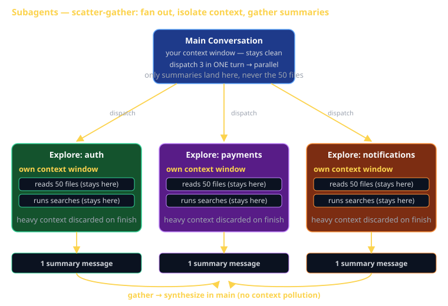

# Subagents Cheat Sheet (80/20)

A subagent is a separate Claude conversation — with its OWN context window — that the main agent spawns to do a focused job and report back. This cheat sheet is the 20% of subagents you'll use 80% of the time: when to reach for one, the built-in types, how to write your own, and the one rule that decides whether it works (give it a complete, self-contained prompt). Used well, a subagent is how you do an hour of research without spending an hour of your main conversation's context on it.

Individual Claude Code Artifact #2 (`cc-artifact-2-subagent`) requires you to **build and use a custom subagent**. This sheet is the actionable path to that artifact.



## What a subagent is (and isn't)

**Is**: a fresh Claude conversation with a clean, isolated context window. The main agent dispatches it with a prompt; the subagent does the work (reads files, runs searches, drafts a plan); only its **final summary message** comes back to the parent.

**Isn't**: a function call or a thread you can chat with mid-run. You can't answer a clarifying question while it's working. It runs, it finishes, it returns one message. Design for that.

The shape of every dispatch:

```
[ main agent: dispatch with a complete prompt ]
            ↓
   [ subagent: own context window ]   ← reads 50 files, runs searches
            ↓
   [ subagent: final summary ]        ← ONE message
            ↓
[ main agent: receives summary, context stays clean ]
```

The heavy context (the 50 files, the long stack traces, the dead ends) stays **inside** the subagent and is discarded when it finishes. Your main conversation only ever sees the summary.

## Three reasons to use one

1. **Parallel research (fan-out).** Dispatch several subagents in a single turn and they run *at the same time*. Three areas explored in the time of one.
2. **Context isolation.** Burn tokens on heavy reads *inside* the subagent. The main conversation never sees the 50 files — only the conclusion. This is the single biggest lever for keeping a long session sharp.
3. **Specialization.** A subagent can have a purpose-tuned system prompt and a restricted tool set — a `code-reviewer` that only reads, a `debugger` that can run tests.

## Built-in / common subagent types

| Agent | When to use |
|---|---|
| `general-purpose` | Open-ended, multi-step research where you're not sure what you'll find |
| `Explore` | "How does X work in this codebase?" — read-only search, returns the conclusion not the file dumps |
| `Plan` | "Design an implementation plan for X" — read-only, returns a step-by-step plan |
| `code-reviewer` | After writing a logical chunk — review for bugs, security, conventions |
| `debugger` | A test is failing or behavior is unexpected — isolate the root cause |

`Explore` and `Plan` are **read-only** by design — they can't edit your files, so they're safe to fan out aggressively. Run `/agents` to see every agent available in your project, including custom ones.

## Parallel vs. sequential (it's about the turn)

The rule is simple and worth memorizing:

- **Multiple subagents dispatched in ONE turn → run in parallel.**
- **One subagent per turn → run sequentially.**

```
You: "Explore how auth, payments, and notifications each work."

Claude: [dispatches Explore × 3 in a single turn]   ← parallel
        [each reads its own slice of the codebase]
        [three summaries return]
Claude: "Here's the synthesis: ..."
```

If those three had been dispatched one turn at a time, you'd wait for each to finish before the next started — three times the wall-clock time, and each summary would pile into the main context before the next ran.

## Building a custom subagent (the artifact)

A custom subagent is a markdown file with YAML frontmatter (identity + tool scope) and a system-prompt body. Drop it in:

- **`.claude/agents/`** — project-scoped, shared with your team via git (use this for the artifact so the grader sees it).
- **`~/.claude/agents/`** — user-scoped, your personal toolbox across all projects.

### Example: a `test-runner` subagent

```markdown
---
name: test-runner
description: >
  Runs the project test suite, reads failures, and reports which tests
  failed and the likely cause. Use after code changes, before a PR.
tools: Read, Grep, Glob, Bash
---

# Test Runner

You run the project's tests and diagnose failures. You do NOT fix code.

Steps:
1. Run the test command from CLAUDE.md (e.g. `dart test` or `npm test`).
2. If everything passes, report "All N tests pass" and stop.
3. For each failure, read the failing test and the code under test.
4. Report, per failure: the test name, the assertion that failed, and
   the single most likely cause (one sentence).

Output EXACTLY this, nothing else:
- A one-line pass/fail summary.
- A bullet per failure: `<test name> — <cause>`.
Do not propose patches. Do not edit files.
```

Save it, run `/agents` to confirm it's registered, then invoke it: *"Use the test-runner subagent to check the suite."* That round trip — define, register, dispatch, receive a summary — is exactly what `cc-artifact-2-subagent` is grading.

### Frontmatter fields that matter

| Field | What it does |
|---|---|
| `name` | The handle you (and the main agent) dispatch by. |
| `description` | When the main agent should auto-pick this agent. Write it as a trigger ("Use after code changes, before a PR"). |
| `tools` | The allow-list. Omit to inherit everything; **narrow it** to match the job (a reviewer needs `Read`/`Grep`, not `Bash`). |

## The one rule: a complete, self-contained prompt

A subagent **cannot ask you a clarifying question mid-run.** It gets one prompt and produces one answer. So the prompt must carry everything it needs and **state the exact output you want back.**

Bad (the subagent will guess, then drift):

```
"Look into the payment code."
```

Good (self-contained, scoped, output specified):

```
"Read everything under src/payments/. Explain how a charge flows from
API request to Stripe call to DB write. List the files involved and the
one function where idempotency is enforced. Return a numbered list, max
200 words. Do not modify anything."
```

If you'd need a follow-up question to do the task yourself, the subagent will need it too — so answer it *in the prompt*.

## What this is in vernacular

- The fan-out (dispatch several at once, collect summaries) ≈ **Scatter-Gather (EIP)** — broadcast the work, aggregate the replies.
- Each individual subagent ≈ a **Facade / black box** — you hand it a request and get back a clean summary; the messy internals (the 50 file reads) stay hidden.
- Context isolation ≈ a **stack frame** — locals live and die inside the call; only the return value escapes.
- Specialization (tuned prompt + scoped tools) ≈ **Strategy (GoF)** — interchangeable workers selected for the job.

## How CS 3660 leverages this

Subagents **replace TA hours.** When you'd normally wait for office hours:

- A test is red → dispatch `debugger`. It isolates the failing path in its own context and reports the cause.
- About to open a PR → dispatch `code-reviewer`. It reviews the diff against your conventions before a human ever sees it.
- Joining a new Sprint repo → dispatch `Explore`. "How is auth wired here?" comes back as a summary, not a 40-file slog through your main conversation.

For the `cc-artifact-2-subagent` rubric: ship a custom `.claude/agents/*.md`, show `/agents` listing it, and show a real dispatch where its summary fed your work. A `code-reviewer` or `debugger` tuned to your Sprint stack is a strong, honest choice.

## Common failure modes

- **Vague prompt, then surprised by the result.** The subagent can't ask you anything. Underspecify the prompt and it guesses; specify the output format and it delivers. This is the #1 cause of "the subagent did the wrong thing."
- **Dispatching one per turn when they're independent.** Sequential when it could be parallel — you wait 3× as long and pollute the main context with each summary as it returns. Send them in one turn.
- **Using a subagent for a one-line lookup.** If you already know the file and the answer fits in a sentence, just read it. The dispatch overhead isn't worth it.
- **Not narrowing `tools`.** A "reviewer" that can run `Bash` and edit files isn't a reviewer — it's a second main agent. Scope the tools to the job.
- **Expecting the heavy context back.** You get the summary, not the 50 files. If you need a detail the summary dropped, ask for it *in the prompt* next time ("list the files involved").
- **Forgetting to register it.** Created the `.md` but never ran `/agents` to confirm — if it's not listed, it won't dispatch. (Project files live in `.claude/agents/`, not `.claude/skills/`.)
- **Treating a subagent like a chat.** It's a one-shot fan-out, not a teammate you converse with. One prompt in, one summary out.

## Further reading

- **`code.claude.com/docs/en/sub-agents`** — official subagent reference (frontmatter, scoping, dispatch).
- **`cheatsheet-claude-code-capabilities`** — where subagents fit among hooks, skills, MCP, and plan mode.
- **`code.claude.com/docs/en/best-practices`** — Anthropic's recommended agentic workflows.
