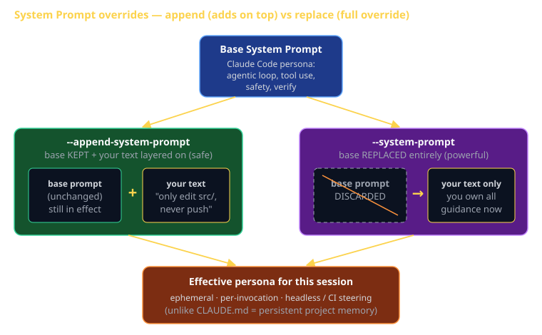

# System Prompts Cheat Sheet (80/20)

Claude Code is the textbook for CS 3660 in 2026. This cheat sheet is the 20% of system-prompt control you'll use 80% of the time — what the base system prompt is, the two CLI flags that override it per-invocation (`--append-system-prompt` vs `--system-prompt`), and how that differs from CLAUDE.md and output styles. Knowing this is the difference between an automation script that behaves predictably and one that goes rogue in your Sprint pipeline.

The system prompt is *who Claude is* for a given session. Override it deliberately, especially in headless/CI runs where no human is watching.



## What the system prompt is

The **system prompt** is the base instruction layer Claude Code sends to the model before your conversation begins. It defines Claude's persona and behavior: that it's an agentic coding tool, how it uses tools, when it plans vs acts, its safety posture, its tone. You normally never see it — it ships with Claude Code.

You can **override it per invocation** from the CLI. This is mostly useful for scripting, automation, CI, and headless (`-p` / `--print`) runs where you want tight, repeatable control over behavior rather than the interactive defaults.

## The two override flags

| Flag | Effect | Built-in guidance | Risk | Use when |
|---|---|---|---|---|
| `--append-system-prompt "…"` | **Adds** your text on top of the default | Kept | Low | Most of the time — nudge behavior, add a guardrail |
| `--system-prompt "…"` | **Replaces** the default entirely | **Lost** | High | You want full control and accept losing agentic defaults |

The contrast is the whole point: **append keeps the base and layers on; replace throws the base away.**

### `--append-system-prompt` (additive — the safe default)

```bash
claude -p "Fix the failing tests" \
  --append-system-prompt "Only edit files under src/. Never run git push."
```

Claude is still its full agentic self — it plans, reads stack traces, self-corrects — and *also* obeys your extra rules. This is what you want 80% of the time. Think of it as adding a constraint, not replacing a brain.

### `--system-prompt` (full replacement — powerful, deliberate)

```bash
claude -p "Summarize this diff" \
  --system-prompt "You are a terse changelog generator. Output only bullet points. No tool use."
```

Now the default agentic guidance is **gone**. Claude won't have its usual instincts about tool use, verification, or safety unless you put them back in your text. Powerful for narrow, single-purpose automations (a classifier, a formatter, a summarizer); dangerous if you expected normal Claude Code behavior and silently lost it.

## Pairs naturally with headless mode

Both flags shine in non-interactive runs:

```bash
# Headless, scriptable, one-shot
claude -p "Generate release notes from git log" \
  --append-system-prompt "Group changes by type: feat, fix, docs."

# Same idea from the SDK (TypeScript / Python)
# pass systemPrompt / appendSystemPrompt in the query options
```

In CI there's no human to catch a misbehaving agent, so the system prompt is your steering wheel. Append a strict policy; don't rely on the interactive defaults you remember from your terminal.

## The three layers — don't confuse them

These control *different things* and live at *different lifetimes*. This is the most common point of confusion.

| Layer | Answers | Scope | Lifetime | How you set it |
|---|---|---|---|---|
| **System prompt** | *Who is Claude?* | This invocation | Ephemeral (one run) | `--append-system-prompt` / `--system-prompt` |
| **CLAUDE.md** | *What is this project?* | Project (repo) | Persistent (every session) | A file in the repo |
| **Output style** | *How does it talk?* | Your config | Persistent (a preset) | Selected behavioral preset |

Rules of thumb:

- Need a rule for **one script run**? System prompt flag.
- Need a rule for **everyone on the repo, every session**? CLAUDE.md.
- Want a durable **tone/behavior preset** across your work? Output style.

A system-prompt flag is *ephemeral* — it dies when the process exits. CLAUDE.md is *persistent and project-scoped* — committed to git, read every session. Output styles are *persistent behavioral presets*. Reaching for a flag to do CLAUDE.md's job (or vice versa) is a classic mistake.

## What this is in vernacular

- `--append-system-prompt` ≈ **Template Method / hook override** (GoF) — the base algorithm runs; you fill in an extension point. Or **middleware that wraps** — your logic surrounds the default, both still run.
- `--system-prompt` ≈ **full subclass replacement** — you override the whole method body, the parent's implementation no longer executes. Or **middleware that short-circuits** — your handler responds and the chain never reaches the default.
- System prompt vs CLAUDE.md vs output style ≈ **constructor argument (per-instance)** vs **config file (per-project)** vs **theme/preset (per-environment)**.

## How CS 3660 leverages this

The Sprint pipeline runs Claude Code in GitHub Actions to do scoped, automated work (e.g. open a PR, fix a lint failure, generate notes). Headless runs have no human at the wheel, so the system prompt *is* the safety rail:

```yaml
# .github/workflows/sprint-bot.yml (excerpt)
- name: Scoped auto-fix
  run: |
    claude -p "Fix the lint errors reported by the CI step above" \
      --append-system-prompt "Only touch files under src/. Never push. Never amend commits. Stop and report if a fix would change public API."
```

Append (not replace) here: you keep Claude's full agentic competence and *add* the boundaries the assignment requires. That single appended line is the difference between a helpful bot and one that force-pushes to `main` at 2am.

## Common failure modes

- **Using `--system-prompt` when you meant `--append-system-prompt`.** You silently lose all built-in agentic guidance, then wonder why Claude stopped using tools sensibly. Default to append.
- **Putting project rules in a flag instead of CLAUDE.md.** A flag is ephemeral and per-invocation; your teammates and your next session won't see it. Persistent project conventions belong in CLAUDE.md.
- **Putting per-run automation rules in CLAUDE.md.** Now every interactive session inherits your CI-only constraint ("never push"), which is wrong for normal dev. Keep run-specific policy in the flag.
- **Forgetting safety rails in a full replacement.** If you `--system-prompt` away the defaults, *you* now own the safety instructions. Spell out tool-use limits, scope, and stop conditions yourself.
- **Trusting interactive defaults in headless CI.** No human approval gate runs in `-p` mode the way it does in your terminal. Append explicit guardrails for every automated invocation.
- **Confusing tone (output style) with identity (system prompt).** "Be terse" is usually an output-style or appended nudge; rebuilding the whole persona is a replacement. Pick the smallest layer that does the job.

## Further reading

- **`code.claude.com/docs`** — official docs, kept current.
- **`code.claude.com/docs/en/cli-reference`** — full flag list including `--append-system-prompt`, `--system-prompt`, `-p/--print`.
- **`code.claude.com/docs/en/sdk`** — driving Claude Code from TypeScript/Python with the same overrides.
- **`cheatsheet-claude-code-capabilities`** — CLAUDE.md, output styles, and the agentic loop these flags steer.
- **`cheatsheet-cicd-github-actions`** — the Sprint pipeline where headless system-prompt overrides earn their keep.
