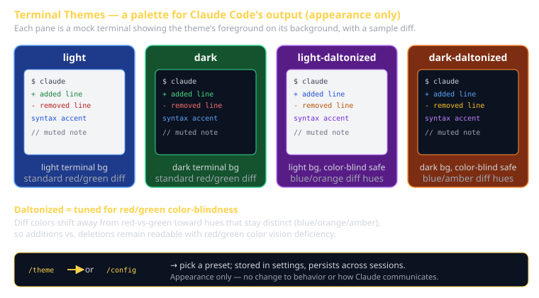

# Terminal Themes Cheat Sheet (80/20)

Claude Code is the textbook for CS 3660 in 2026. Terminal themes are a small surface, but the 20% worth knowing is this: a theme is *only* a color scheme for Claude Code's terminal output — diff colors, syntax highlighting, UI accents. It changes nothing about how Claude behaves or communicates. You set it once and forget it, with one important exception: if diffs are hard to read or you're color-blind, the **daltonized** variants are the entire reason this setting exists.



## What a theme is (and isn't)

**Is**: a palette. It controls the colors Claude Code draws in your terminal — the green/red of a diff, the accent colors of the UI, syntax tints. Pure appearance.

**Isn't**: an output style (which changes *how Claude communicates* — terse, explanatory, etc.) and isn't a system prompt or CLAUDE.md (which change *how Claude behaves*). Switching themes never changes behavior, capability, or wording. It's cosmetics, full stop.

Two color layers stack:

```
your terminal emulator (iTerm, Terminal.app, Windows Terminal)
        ↓  sets the base background + ANSI palette
Claude Code theme
        ↓  layers diff/syntax/UI accent colors on top
what you see
```

If colors look wrong, ask *which layer* is responsible — your emulator's background or Claude Code's theme.

## The preset themes

| Theme | Background | Use when |
|---|---|---|
| `light` | light | Your terminal has a light/white background |
| `dark` | dark | Your terminal has a dark background (most common) |
| `light-daltonized` | light | Light terminal **and** you want stronger red/green diff distinction |
| `dark-daltonized` | dark | Dark terminal **and** you want stronger red/green diff distinction |

"Daltonized" = the palette is adjusted for color-blind users (named after John Dalton). The biggest practical win is **diffs**: red deletions vs. green additions become distinguishable even with red/green color vision deficiency, because the variants shift toward hues that survive the deficiency rather than relying on red-vs-green alone.

The rule of thumb: **match the theme's background to your terminal's background.** A light theme on a dark terminal (or vice versa) produces washed-out, low-contrast text.

## Setting the theme

Two ways, both interactive — the choice is stored in your settings and persists across sessions.

```
/theme            # opens the theme picker directly
/config           # opens the config menu; theme is one of the options
```

Pick the preset, confirm, done. There's no per-project theme — it's a global preference for how *you* like Claude Code to look.

```
/theme
  ▸ dark
    light
    dark-daltonized
    light-daltonized
```

## What this is in vernacular

- A theme ≈ a **Strategy** (GoF) over rendering — interchangeable palettes the renderer selects at runtime; the logic underneath is identical.
- Or, even simpler: **a stylesheet for the CLI.** Same content, different skin.

## Why this matters for CS 3660

It's a minor quality-of-life setting, but **accessibility is not minor**. Three concrete cases:

- **Presenting your sprint demo.** Projector + ambient light wash out low-contrast palettes. Pick a high-contrast match (usually `dark` on a dark terminal) so the room can actually read your diffs.
- **Pair programming.** Your partner may be color-blind. Roughly 1 in 12 men has some red/green deficiency — a daltonized variant can be the difference between them following your diff and guessing.
- **Your own diffs.** If you've ever squinted to tell an addition from a deletion, switch to a daltonized variant before assuming the diff is wrong.

## Common failure modes

- **Theme/terminal background mismatch.** `light` theme in a dark terminal looks broken — washed out, unreadable. Match the backgrounds.
- **Expecting a theme to change behavior.** It won't. If Claude is too verbose or too terse, that's an **output style**, not a theme. Wrong knob.
- **Blaming Claude Code for your emulator's colors.** Some "ugly" colors come from your terminal emulator's ANSI palette, not Claude Code. Check iTerm/Terminal profiles too.
- **Ignoring daltonized variants when diffs are hard to read.** This is the one setting built specifically for that problem. Try it before fighting your eyes.
- **Hunting for a per-project theme.** There isn't one — it's a global user preference. Set it once.

## Further reading

- **`code.claude.com/docs`** — official docs, kept current.
- **`cheatsheet-claude-code-capabilities`** — the broader tour; output styles and modes live there.
