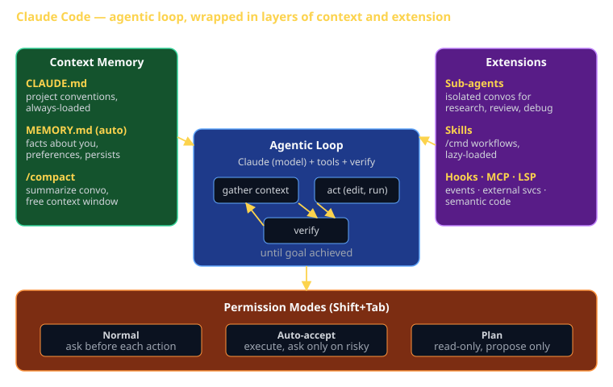

# Claude Code Capabilities Cheat Sheet (80/20)

Claude Code is the textbook for CS 3660 in 2026. This cheat sheet is the 20% of Claude Code you'll use 80% of the time — the agentic loop, context management, slash commands, plan mode, sub-agents, hooks, MCP, and skills. Knowing these well is the difference between treating Claude Code as autocomplete and treating it as a teammate.

The Sprint 3 capstone rubric requires "demonstrate substantive use of Claude Code agentic features beyond simple completion." This sheet is what that means in practice.



## What Claude Code is (and isn't)

**Is**: an *agentic* coding tool. It has a model (Claude), tools (file edit, shell, git, web), a feedback loop (test → diagnose → fix), and durable extensions (skills, hooks, sub-agents, MCP).

**Isn't**: an autocomplete plugin. It plans, executes multi-step work, runs your tests, reads stack traces, and self-corrects. Treating it as autocomplete is leaving 90% of the value on the table.

The shape of every interaction:

```
[ you describe a goal ]
        ↓
   [ context gather ]   ← reads files, runs commands
        ↓
      [ act ]            ← edits files, runs tests, commits
        ↓
   [ verify ]            ← checks output, re-reads, asks
        ↓
   loop until done
```

This is the **agentic loop**. Your job as the human is to scope the goal, provide context Claude can't infer, and review what comes out.

## Context management

Claude has a limited context window. Once it fills, the conversation either compacts or starts forgetting. Three mechanisms keep useful information in scope.

### CLAUDE.md (per-project memory)

A file at the repo root (or any parent dir). Claude Code reads it every session, every conversation. Use it for:

- Project conventions: lint rules, naming patterns, "always use X library."
- Architecture decisions: "the API is in `services/api/`, the frontend in `apps/web/`."
- Dont-do-this rules: "never commit `.env`," "use `pnpm` not `npm`."
- Testing commands: how to run tests, where they live.

```markdown
# CLAUDE.md
This project uses Bun + Hono on the backend and React + Vite on the frontend.
- Tests: `bun test` (backend), `pnpm test` (frontend)
- Always type-check before committing: `pnpm typecheck`
- API contracts live in `packages/contracts` — update them before changing implementations
```

The pattern: **write CLAUDE.md as if briefing a new contractor on day 1**.

### Auto memory (MEMORY.md)

Claude Code optionally maintains a `MEMORY.md` file in the home or project memory dir. As you work, Claude saves *things you'd want a future Claude to know*: your role, your preferences ("don't summarize what you just did"), team norms, project context.

You don't write to MEMORY.md directly. You let Claude propose entries; you confirm or reject.

Auto memory persists across conversations. Use it for *facts about you and your workflow*; use CLAUDE.md for *facts about the codebase*.

### `/compact`

When the conversation is long, `/compact` summarizes the conversation history into a brief, freeing the context window. Use when you've been working for hours and Claude starts repeating itself or losing track.

Better practice: don't let conversations get long. Use sub-agents for research-heavy tasks (their context doesn't pollute yours).

## Slash commands

Built-in commands you can run inline:

| Command | What it does |
|---|---|
| `/help` | Shows available commands |
| `/clear` | Wipes the conversation, fresh start |
| `/cost` | Shows your current session token usage and cost |
| `/compact` | Summarizes conversation, frees context |
| `/init` | Generates a CLAUDE.md by analyzing your repo |
| `/status` | Shows what mode you're in (plan / auto-accept / normal) |
| `/agents` | Lists available sub-agents |
| `/mcp` | Lists configured MCP servers |
| `/permissions` | Configure tool permissions |
| `/<custom>` | Run a skill (covered below) |

`!command` runs a shell command in your shell with the output landing in the conversation. Use when Claude needs to run something only you can authorize (e.g., `gcloud auth login`).

## Permission modes

Three levels of autonomy. Toggle with **Shift+Tab**.

### Normal mode (default)

Claude asks for permission before every file edit, shell command, or destructive operation. Slow, safe, good for unfamiliar territory.

### Auto-accept mode

Claude executes file edits and common shell commands automatically. Still asks before destructive operations (`rm -rf`, `git push --force`, secrets). Faster; trust required.

### Plan mode

**Read-only**. Claude can read files, run safe commands, search — but cannot edit, write, or run shell. Output is a plan you review before approving.

```
↑ Shift+Tab cycles: normal → auto-accept → plan → normal
```

Use plan mode for anything risky: refactors, migrations, "I'm not sure if this will work." See the plan, approve it, then execute.

## Plan mode workflow (the big-task pattern)

The Sprint 3 capstone is too large to "just go." Use this pattern:

1. **Plan mode**: describe the goal. Claude reads the codebase, asks clarifying questions, produces a plan.
2. **Review** the plan. Push back. Iterate. The plan is the contract.
3. **Approve** → Claude exits plan mode and starts executing.
4. **Auto-accept mode** for execution; Claude follows the plan.
5. **Verify** at checkpoints (after each task, after each commit).

This is faster than just-go for anything multi-file. The plan catches misunderstandings before they become 200 lines of wrong code.

## Sub-agents

A sub-agent is a separate, isolated Claude conversation that Claude spawns. Its context is its own; its output comes back as a single message to the parent.

### Why sub-agents

- **Parallel research**: spawn several at once to explore different areas. Each reports back; main conversation stays clean.
- **Context isolation**: heavy tasks (read 50 files, generate a 2000-line report) burn tokens — burn them in a sub-agent, not the main convo.
- **Specialization**: agents like `code-reviewer`, `debugger`, `security-auditor` have tuned prompts and tool access.

### Common sub-agents

| Agent | When to use |
|---|---|
| `general-purpose` | Open-ended research/multi-step tasks |
| `Explore` | "How does X work in this codebase?" |
| `Plan` | "Design an implementation plan for X" |
| `code-reviewer-pro` | After writing a logical chunk of code |
| `debugger` | Tests failing, behavior unexpected |
| `architect-reviewer` | After structural changes |
| `security-auditor` | Comprehensive security review |
| `test-automator` | Setting up or improving test coverage |

### Pattern: parallel research

```
You: "Help me understand the auth, payment, and notification systems."

Claude: [spawns three sub-agents in parallel, one per system]
        [agents return summaries]
Claude: "Here's the synthesis: ..."
```

Without sub-agents, Claude would read all three sequentially and exhaust its context.

## Hooks

Hooks are **scripts that run on specific events** in the Claude Code lifecycle. Configure in `~/.claude/settings.json` (user) or `.claude/settings.json` (project).

### Useful hook events

| Event | Fires on | Common uses |
|---|---|---|
| `pre-tool-use` | Before any tool runs | Block dangerous commands; gate file edits |
| `post-tool-use` | After a tool runs | Auto-format edited files; auto-commit |
| `user-prompt-submit` | After user types | Inject context; enforce conventions |
| `stop` | When Claude finishes a turn | Run tests; flag regressions |
| `session-start` | New conversation begins | Load context; remind of conventions |

### Example: auto-format on edit

```json
{
  "hooks": {
    "post-tool-use": [
      {
        "matcher": "Edit|Write",
        "command": "prettier --write \"$FILE\""
      }
    ]
  }
}
```

Now every file Claude edits gets formatted. No more "remember to run prettier."

### Example: block secret commits

```json
{
  "hooks": {
    "pre-tool-use": [
      {
        "matcher": "Bash",
        "command": "if echo \"$COMMAND\" | grep -qE 'git (commit|push)'; then ./scripts/check-no-secrets.sh; fi"
      }
    ]
  }
}
```

If the script exits non-zero, the tool call is blocked. The user sees a clear error.

## MCP (Model Context Protocol)

MCP is the **plugin system for connecting Claude to external services**. Each MCP server provides tools (functions Claude can call) and/or resources (data Claude can read).

### Common MCP servers

- **filesystem** — extra-careful file access (often outside the project root).
- **github-official** — issues, PRs, repos, releases.
- **postgres** — query a database directly.
- **playwright** — drive a real browser.
- **context7** — fetch live docs for any library.
- **sequential-thinking** — structured chain-of-thought.

### Configure in `~/.claude/mcp.json`

```json
{
  "mcpServers": {
    "postgres": {
      "command": "npx",
      "args": ["-y", "@modelcontextprotocol/server-postgres", "${DATABASE_URL}"]
    },
    "github": {
      "command": "docker",
      "args": ["run", "-i", "--rm", "ghcr.io/github/github-mcp-server"],
      "env": { "GITHUB_PERSONAL_ACCESS_TOKEN": "${GH_TOKEN}" }
    }
  }
}
```

After config, MCP tools appear via `/mcp` and become callable.

### Why MCP matters for Sprint 3

Capstones often need: query the prod DB, comment on a GitHub PR, drive a browser to test, fetch up-to-date docs. MCP lets Claude do all of these directly — no copy-paste from the web.

## Skills (custom workflows)

Skills are **reusable prompt workflows**. A skill is a directory with a `SKILL.md` containing YAML frontmatter (when to trigger) and markdown (what to do).

### Where they live

- **Bundled** — built into Claude Code (`/review`, `/simplify`, `/debug`, `/init`).
- **User** — `~/.claude/skills/` — your personal toolbox.
- **Project** — `.claude/skills/` — shared with your team via git.
- **Plugin** — bundled with a plugin from a marketplace.

### A simple skill

```markdown
---
name: pr-summary
description: Generate a PR summary from the current branch's commits
---

# PR Summary

Run `git log main..HEAD --oneline` to see commits on this branch.
Run `git diff main..HEAD --stat` to see scope.

Write a PR summary in this format:
- One-sentence goal
- Bulleted list of changes
- Test plan (checklist)

Output as a single block I can paste into the GitHub PR description.
```

Save as `~/.claude/skills/pr-summary/SKILL.md`. Now `/pr-summary` runs it.

### Why skills > pasted prompts

- **Discovery**: `/help` lists them.
- **Versioned**: live in git; reviewed in PRs.
- **Composable**: skills can call other skills.
- **Lazy-loaded**: unlike CLAUDE.md (always loaded), a skill's body only enters context when invoked. No context rot.

### Skills you'll want for Sprint 3

- `/review` — bundled, runs code review on uncommitted changes.
- `/init` — bundled, generates CLAUDE.md.
- `/debug` — bundled, structured debugging workflow.
- A custom one for your team's PR template.
- A custom one for "set up an issue from this conversation."

## Plugins (the package format)

A plugin = a directory containing skills + hooks + agents + MCP configs, all bundled. Install once; get everything.

```
my-plugin/
├── plugin.json          # manifest
├── skills/              # custom skills
│   └── deploy/SKILL.md
├── agents/              # custom sub-agents
│   └── reviewer.md
├── hooks/               # event hooks
│   └── pre-commit.sh
└── mcp/                 # MCP server configs
    └── postgres.json
```

For the course, you may not write a plugin — but you'll likely *use* plugins shared by classmates or instructors.

## LSP (Language Server Protocol)

LSP gives Claude **semantic** code understanding — not just text search. With LSP enabled:

- **goToDefinition**: jump to where `function` is defined, not just where it's mentioned.
- **findReferences**: find every callsite of `function`, even if shadowed or renamed in scope.
- **hover**: get type signatures, doc strings.
- **diagnostics**: type errors and missing imports surface immediately to Claude.

LSP requires the language server installed (e.g., `pyright` for Python, `typescript-language-server` for TS) and the LSP plugin enabled.

The practical effect: Claude understands "what is the type of `result.user`?" rather than guessing from context. **For TypeScript-heavy capstones, enabling LSP is high-leverage**.

## Keyboard shortcuts that matter

| Shortcut | Effect |
|---|---|
| **Shift+Tab** | Cycle permission modes (normal → auto-accept → plan) |
| **Esc Esc** | Open the rewind/undo menu (jump conversation back to a prior turn) |
| **Ctrl+R** | Toggle response detail (verbose vs. concise) |
| **Ctrl+C** | Interrupt the current operation |
| **Up arrow** | Recall previous input |

Esc-Esc is the most underused shortcut. Got off-track? Esc-Esc and pick the turn before things went sideways. Faster than `/clear` because you keep the early context.

## What this is in vernacular

- The agentic loop ≈ **Process Manager** (EIP) — Claude orchestrates a multi-step process and decides what runs next.
- Sub-agents ≈ **Scatter-Gather** (EIP) — fan out research, gather summaries, decide.
- Hooks ≈ **Observer** (GoF) — events fire; subscribers act.
- Skills ≈ **Strategy** (GoF) — interchangeable workflows the runtime selects.
- MCP ≈ **Adapter** (GoF) — uniform interface to disparate external systems.
- LSP ≈ **Facade** (GoF) — a clean interface over the messy world of every language's tooling.

## How CS 3660 leverages this

Per the syllabus, Claude Code replaces the textbook. That works because:

1. **Reading code beats reading prose.** Most concepts in the course (auth, REST, EIPs, state charts) are easier to learn by *building them with Claude* than by reading about them.
2. **Slash commands and skills make conventions teachable.** The instructor publishes a `/cs3660-checklist` skill; every student runs it before submitting.
3. **Sub-agents replace TA hours.** Stuck on a bug? `Task(subagent_type='debugger', ...)`. Need a code review? `Task(subagent_type='code-reviewer-pro', ...)`. The course-included reviewers are professional-grade.
4. **CLAUDE.md is the project briefing.** Every Sprint repo includes a CLAUDE.md the instructor maintains; Claude reads it every session.

For the Sprint 3 capstone rubric's *Substantive use of Claude Code* line: pick at least three of these (sub-agents, hooks, MCP, custom skill, plan mode) and demonstrate them in your demo or write-up.

## Common failure modes

- **Treating Claude as autocomplete**. Asking "complete this function" when you could ask "implement a feature." You're paying for an agent; use the agent.
- **Letting context fill up**. Long conversations slow down and lose track. `/compact`, sub-agent for research, or `/clear` and start fresh.
- **No CLAUDE.md**. Every session, Claude rediscovers your conventions. Write the brief once.
- **Skipping plan mode for big tasks**. "Just go" on a refactor produces wrong code. Plan first.
- **Auto-accept on critical paths**. Don't auto-accept production deploys.
- **Reinventing built-in skills**. `/review`, `/debug`, `/init` exist. Use them before writing a custom one.

## Further reading

- **`code.claude.com/docs`** — official docs, kept current.
- **`code.claude.com/docs/en/best-practices`** — Anthropic's own recommended workflows.
- **`code.claude.com/docs/en/skills`** — skills authoring guide.
- **`code.claude.com/docs/en/hooks-guide`** — hooks reference.
- **`cheatsheet-git-workflow`** — git commands Claude will use on your behalf.
- **`cheatsheet-cicd-github-actions`** — the pipeline Claude can configure for you.
