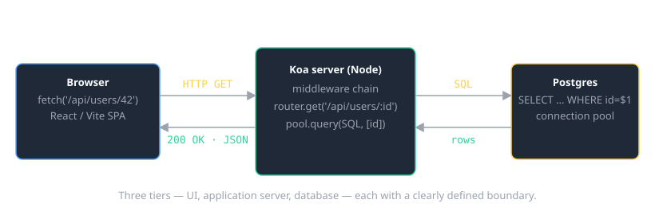
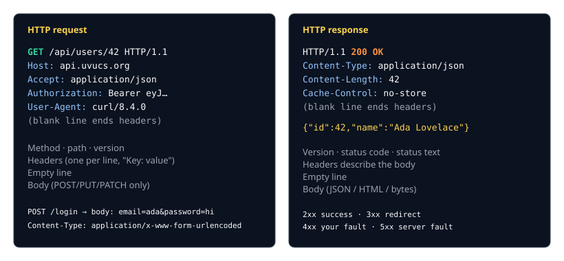
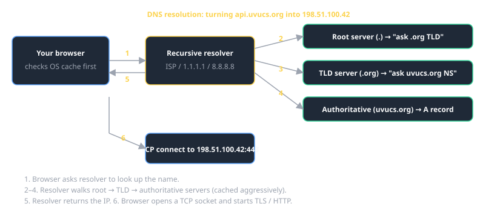
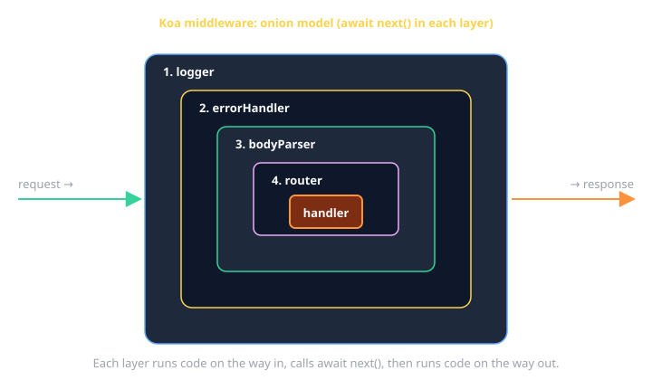
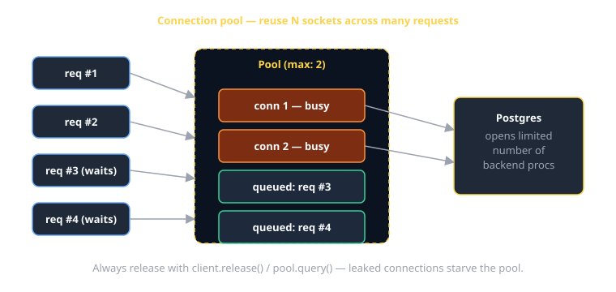

# Client / Server / Database Cheat Sheet (HTTP · DNS · Sockets · Koa · Postgres)

The 20% of the stack you'll touch 80% of the time when building a web app: how a request actually gets from a browser to your database and back.



---

## How HTTP works

HTTP is a **plain-text request/response protocol over TCP**. That sentence carries everything:

- **Plain text** — no magic. You can type a request by hand and read the response with your eyes.
- **Request/response** — the client speaks first; the server replies once; the cycle ends. Each request is independent (HTTP is "stateless"; cookies/tokens fake state on top).
- **Over TCP** — HTTP doesn't move bytes itself. It rides on top of a TCP socket, which guarantees ordered delivery to a specific host:port.

### Anatomy of a request and response



```
GET /api/users/42 HTTP/1.1     ← request line: METHOD PATH VERSION
Host: api.uvucs.org             ← headers: "Key: value", one per line
Accept: application/json
                                ← blank line ends headers
                                ← (no body for GET)
```

```
HTTP/1.1 200 OK                 ← status line: VERSION CODE TEXT
Content-Type: application/json
Content-Length: 42
                                ← blank line
{"id":42,"name":"Ada Lovelace"} ← body
```

### Methods you'll actually use

| Method   | Meaning                              | Has body? |
|----------|--------------------------------------|-----------|
| `GET`    | read a resource                      | no        |
| `POST`   | create / submit                      | yes       |
| `PUT`    | replace a resource                   | yes       |
| `PATCH`  | partial update                       | yes       |
| `DELETE` | remove a resource                    | sometimes |

`GET` and `HEAD` should be **safe** (no side effects). `GET`, `PUT`, `DELETE` should be **idempotent** (running them twice has the same effect as once).

### Status codes — only the ranges matter, day to day

| Range | Meaning                         | Examples                      |
|-------|---------------------------------|-------------------------------|
| 1xx   | informational                   | rare; ignore                  |
| 2xx   | success                         | 200 OK · 201 Created · 204 No Content |
| 3xx   | redirect                        | 301 permanent · 302 temp · 304 not modified |
| 4xx   | **your fault** (client error)   | 400 Bad Request · 401 Unauth · 403 Forbidden · 404 Not Found |
| 5xx   | **server's fault**              | 500 Internal · 502 Bad Gateway · 503 Unavailable |

When you're debugging and you see a 4xx, the client sent something wrong. A 5xx means your server crashed or a downstream service did.

### Headers worth knowing

| Header             | Purpose                                                    |
|--------------------|------------------------------------------------------------|
| `Host`             | required; which vhost on the server                        |
| `Content-Type`     | format of the body (`application/json`, `text/html`, …)    |
| `Content-Length`   | bytes in the body                                          |
| `Accept`           | what the client wants back                                 |
| `Authorization`    | credentials (`Bearer <jwt>`, `Basic <base64>`)             |
| `Cookie` / `Set-Cookie` | session state                                         |
| `Cache-Control`    | how long this can be cached                                |
| `User-Agent`       | who the client claims to be                                |

---

## Talking HTTP by hand (telnet)

The fastest way to convince yourself "HTTP is just text" is to type one yourself.

```bash
$ telnet example.com 80
Trying 93.184.216.34...
Connected to example.com.
Escape character is '^]'.
GET / HTTP/1.1
Host: example.com
Connection: close
                                 ← press Enter on a blank line to finish

HTTP/1.1 200 OK
Content-Type: text/html; charset=UTF-8
Content-Length: 1256
…

<!doctype html>
<html>
…
```

What just happened:

1. `telnet example.com 80` opened a raw TCP socket to port 80 (the well-known HTTP port).
2. You typed the request — method/path/version, one header, blank line.
3. The server replied with status, headers, blank line, body.
4. `Connection: close` tells the server to hang up after one response so you don't have to.

> macOS removed `telnet` by default. Install via `brew install telnet`, or use `nc example.com 80` (`netcat`) — same idea, fewer surprises.

### HTTPS (port 443) is the same — but encrypted

`telnet` won't work on `:443` because that's TLS-wrapped. Use `openssl s_client`:

```bash
$ openssl s_client -connect example.com:443 -quiet
GET / HTTP/1.1
Host: example.com
Connection: close
```

Inside the TLS tunnel it's the **exact same plain-text HTTP** — just nobody can see it on the wire.

---

## DNS — finding the server before you can talk to it

When you type `https://api.uvucs.org`, your computer doesn't know what IP that is. It asks DNS.



The walk goes: **OS cache → resolver → root → TLD → authoritative**, and the resolver caches every step for the TTL the records specify.

```bash
# Look up an A record (IPv4):
$ dig api.uvucs.org +short
198.51.100.42

# Step-by-step trace through the DNS hierarchy:
$ dig api.uvucs.org +trace

# What does my resolver actually return?
$ nslookup api.uvucs.org

# Inverse — IP back to a name:
$ dig -x 198.51.100.42 +short
```

### Records you'll see

| Type    | What it points to                         |
|---------|-------------------------------------------|
| `A`     | IPv4 address                              |
| `AAAA`  | IPv6 address                              |
| `CNAME` | alias to another DNS name (`www → apex`)  |
| `MX`    | mail server                               |
| `TXT`   | arbitrary strings (SPF, domain-verify)    |
| `NS`    | the authoritative name servers for a zone |

### When DNS bites you

- **Stale cache**: changes can take up to the record's TTL to propagate. Lower TTL before you cut over.
- **`/etc/hosts` overrides DNS** — handy for local testing, easy to forget you set it.
- **`localhost` is hardcoded** to `127.0.0.1` (and `::1`) on every OS.

---

## TCP sockets — what HTTP rides on

HTTP is what's *in* the message. The connection itself is a TCP socket: a bidirectional byte stream between `(client_ip, client_port)` and `(server_ip, server_port)`.

You don't usually write socket code — `fetch` / Koa / `pg` do it for you — but seeing it once makes the rest of the stack stop being magic.

### A bare-bones TCP client in TypeScript (Node `net` module)

```ts
// http-by-hand.ts — speaks HTTP/1.0 over a raw TCP socket.
// Run:  npx tsx http-by-hand.ts
import { createConnection } from "node:net";
import { lookup } from "node:dns/promises";

const HOST = "example.com";
const PORT = 80;

// 1) Resolve the DNS name to an IP first.
const { address } = await lookup(HOST);
console.log(`DNS: ${HOST} → ${address}`);

// 2) Open a TCP socket to that IP:port.
const socket = createConnection({ host: address, port: PORT }, () => {
  // 3) Once connected, write a hand-rolled HTTP request.
  //    Headers are separated by \r\n, ended by a blank line.
  const request =
    `GET / HTTP/1.0\r\n` +
    `Host: ${HOST}\r\n` +
    `Connection: close\r\n` +
    `\r\n`;
  socket.write(request);
});

// 4) Read bytes back as they arrive.
let response = "";
socket.on("data", (chunk) => { response += chunk.toString("utf8"); });
socket.on("end",  ()      => { console.log(response); });
socket.on("error", (err)  => { console.error("socket error:", err); });
```

What's worth noticing:

- `node:dns/promises` does the DNS step we just diagrammed.
- `createConnection` is the TCP socket. It returns a `Duplex` stream — `.write()` to send, listen for `data` to receive.
- The request body is a **string** with `\r\n` line endings — that's literally the HTTP/1.x wire format.
- We use HTTP/1.0 + `Connection: close` so the server hangs up when finished and `end` fires. Real HTTP/1.1 keepalive needs framing logic (parsing `Content-Length` or chunked encoding) — at which point you'd just use `fetch`.

### A bare-bones TCP server in TypeScript

```ts
// echo-server.ts — accepts a TCP connection and echoes whatever it receives.
// Run:  npx tsx echo-server.ts   then in another terminal:  nc localhost 9000
import { createServer } from "node:net";

const server = createServer((socket) => {
  console.log(`connect from ${socket.remoteAddress}:${socket.remotePort}`);
  socket.write("hello — type something\r\n");
  socket.on("data", (chunk) => socket.write(`echo: ${chunk}`));
  socket.on("end",  ()     => console.log("client disconnected"));
});

server.listen(9000, () => console.log("listening on :9000"));
```

This is what every HTTP server is doing under the hood — Koa just adds a parser, a router, and middleware on top of the same socket primitives.

---

## Koa — a small HTTP server in Node

Koa is a thin layer over Node's `http` module. The mental model is **middleware as an onion**: each function gets the request on the way in and the response on the way out.



```ts
// server.ts
import Koa from "koa";
import Router from "@koa/router";
import { koaBody } from "koa-body";

const app    = new Koa();
const router = new Router();

// 1) Logger (outermost layer)
app.use(async (ctx, next) => {
  const start = Date.now();
  await next();                         // run inner layers
  const ms = Date.now() - start;
  console.log(`${ctx.method} ${ctx.url} → ${ctx.status} (${ms}ms)`);
});

// 2) Centralized error handler
app.use(async (ctx, next) => {
  try {
    await next();
  } catch (err: unknown) {
    ctx.status = err instanceof HttpError ? err.status : 500;
    ctx.body   = { error: (err as Error).message };
    ctx.app.emit("error", err, ctx);
  }
});

// 3) Body parsing
app.use(koaBody());

// 4) Routes
router.get("/api/users/:id", async (ctx) => {
  const id = Number(ctx.params.id);
  const { rows } = await pool.query("SELECT id, name FROM users WHERE id = $1", [id]);
  if (rows.length === 0) ctx.throw(404, "user not found");
  ctx.body = rows[0];
});

router.post("/api/users", async (ctx) => {
  const { name, email } = ctx.request.body as { name: string; email: string };
  const { rows } = await pool.query(
    "INSERT INTO users (name, email) VALUES ($1, $2) RETURNING id, name, email",
    [name, email],
  );
  ctx.status = 201;
  ctx.body   = rows[0];
});

app.use(router.routes()).use(router.allowedMethods());
app.listen(3000, () => console.log("listening on :3000"));

class HttpError extends Error { constructor(public status: number, msg: string) { super(msg); } }
```

### The `ctx` object — read this often

| Read from `ctx`            | Meaning                                |
|----------------------------|----------------------------------------|
| `ctx.method`               | `GET`, `POST`, …                       |
| `ctx.url`, `ctx.path`      | request URL                            |
| `ctx.params.id`            | route param (`/users/:id`)             |
| `ctx.query.q`              | querystring `?q=foo`                   |
| `ctx.request.body`         | parsed body (after `koaBody()`)        |
| `ctx.headers.authorization`| any request header                     |

| Write to `ctx`             | Meaning                                |
|----------------------------|----------------------------------------|
| `ctx.status = 201`         | response status code                   |
| `ctx.body = obj`           | response body (auto-JSON for objects)  |
| `ctx.set("X-Foo", "bar")`  | response header                        |
| `ctx.throw(404, "msg")`    | bail out to the error middleware       |

### Middleware ordering rules

1. Logger / request-id **first** — so you log every request even if later middleware throws.
2. Error handler **second** — wraps everything below it.
3. Body parser **before** routes that read `ctx.request.body`.
4. Auth check **before** the handler that needs it.
5. The **router** goes last; that's the leaf of the onion.

---

## Postgres from Node — the `pg` library

```ts
// db.ts
import { Pool } from "pg";

export const pool = new Pool({
  host:     process.env.PGHOST     ?? "localhost",
  port:     Number(process.env.PGPORT ?? 5432),
  database: process.env.PGDATABASE,
  user:     process.env.PGUSER,
  password: process.env.PGPASSWORD,
  max:      10,                      // connection pool size
  idleTimeoutMillis: 30_000,
});
```

### Why a pool?

Opening a Postgres connection is expensive (TCP + auth + TLS). A pool keeps a small number of long-lived connections and hands them out per query.



> Rule: don't `new Pool(...)` per request — make one and import it everywhere.

### CRUD — parameterized queries (always)

```ts
// READ
const { rows } = await pool.query(
  "SELECT id, name, email FROM users WHERE id = $1",
  [id],
);

// CREATE
const { rows: [user] } = await pool.query(
  "INSERT INTO users (name, email) VALUES ($1, $2) RETURNING *",
  [name, email],
);

// UPDATE
await pool.query(
  "UPDATE users SET name = $1 WHERE id = $2",
  [name, id],
);

// DELETE
await pool.query("DELETE FROM users WHERE id = $1", [id]);
```

> **Never interpolate user input into SQL strings.** `$1`, `$2`, … parameters are sent separately from the query — Postgres can't confuse them with SQL syntax. Doing `` `WHERE name = '${name}'` `` is how SQL injection happens.

### Transactions — when one statement isn't enough

```ts
const client = await pool.connect();      // grab a dedicated connection
try {
  await client.query("BEGIN");
  await client.query("UPDATE accounts SET balance = balance - $1 WHERE id = $2", [100, fromId]);
  await client.query("UPDATE accounts SET balance = balance + $1 WHERE id = $2", [100, toId]);
  await client.query("COMMIT");
} catch (err) {
  await client.query("ROLLBACK");
  throw err;
} finally {
  client.release();                       // ALWAYS release — leak = pool starvation
}
```

### Schema you'll write 95% of the time

```sql
CREATE TABLE users (
  id         SERIAL PRIMARY KEY,
  email      TEXT NOT NULL UNIQUE,
  name       TEXT NOT NULL,
  created_at TIMESTAMPTZ NOT NULL DEFAULT now()
);

CREATE TABLE posts (
  id        SERIAL PRIMARY KEY,
  user_id   INT NOT NULL REFERENCES users(id) ON DELETE CASCADE,
  title     TEXT NOT NULL,
  body      TEXT NOT NULL
);

CREATE INDEX posts_user_id_idx ON posts(user_id);
```

| Type            | Use for                                    |
|-----------------|--------------------------------------------|
| `SERIAL` / `BIGSERIAL` | auto-increment primary keys         |
| `TEXT`          | strings (don't use `VARCHAR(n)` unless you really need the limit) |
| `INT` / `BIGINT`| integers                                   |
| `BOOLEAN`       | true/false                                 |
| `TIMESTAMPTZ`   | always timezone-aware timestamps           |
| `JSONB`         | structured but loose data                  |
| `UUID`          | external IDs (with `gen_random_uuid()`)    |

---

## Putting it together — the request, end-to-end

1. Browser parses the URL → asks DNS for the IP.
2. Browser opens a TCP socket to that IP:443, does a TLS handshake.
3. Browser writes an HTTP request over the socket.
4. Koa's listener accepts the connection; middleware runs in order.
5. The handler asks `pool.query(SQL, [params])`.
6. `pg` checks out a connection, sends the SQL with separate params, reads rows.
7. The handler sets `ctx.body`; Koa serializes it to JSON.
8. Middleware unwinds (logger writes the access line on the way out).
9. Response is written back over the same TCP socket; browser parses JSON.

If anything in your app is mysterious, it's almost always one of those nine steps — figure out which.

## When you're stuck

- [MDN HTTP overview](https://developer.mozilla.org/en-US/docs/Web/HTTP/Overview)
- [Koa docs](https://koajs.com/) — short, read it once front-to-back.
- [`node-postgres` docs](https://node-postgres.com/) — `Pool`, `Client`, transactions.
- DevTools → Network tab — every request, every header, every byte.
- `curl -v https://example.com` — same info from the terminal.
