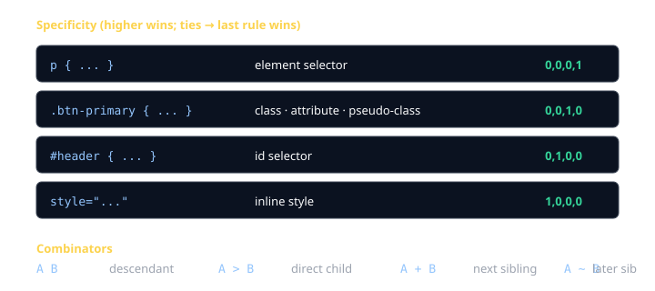
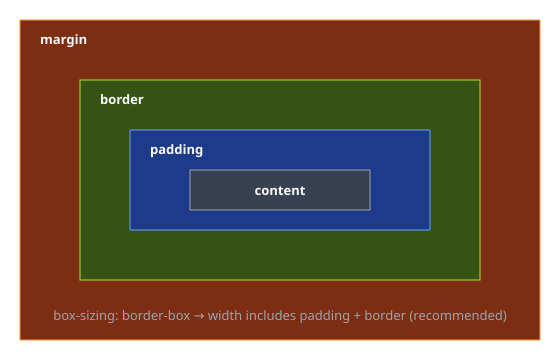
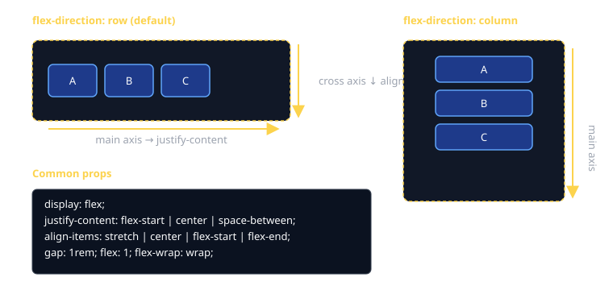
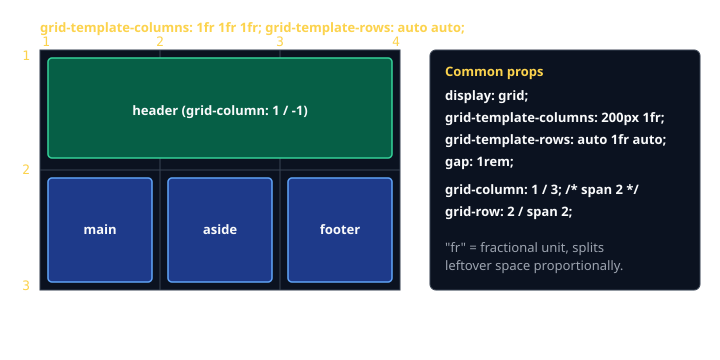
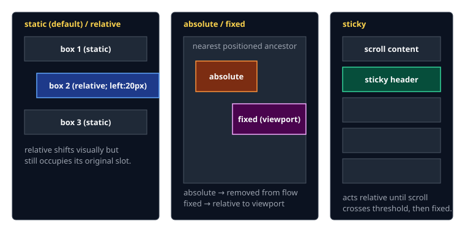

# CSS Cheat Sheet (80/20)

CSS has hundreds of properties. You'll spend ~80% of your time with selectors, the box model, flexbox, grid, and a handful of common properties.

## Three ways to apply styles

```html
<!-- 1. External (almost always use this) -->
<link rel="stylesheet" href="/styles.css" />

<!-- 2. Internal -->
<style> p { color: red; } </style>

<!-- 3. Inline (avoid; only for one-offs and email) -->
<p style="color: red">hi</p>
```

## Selectors and specificity

```css
p              { }   /* element */
.btn           { }   /* class — your main tool */
#hero          { }   /* id — usually overkill */
a:hover        { }   /* pseudo-class (state) */
li::first-letter { } /* pseudo-element (sub-part) */
input[type="email"] { } /* attribute */

nav a          { }   /* descendant: any <a> inside <nav> */
nav > a        { }   /* direct child only */
h2 + p         { }   /* immediately-following sibling */

.card, .panel  { }   /* group: applies to both */
```

When two rules fight, the higher-specificity rule wins. Inline > id > class > element. Ties go to the rule defined later.



> **Avoid `!important`.** It's a sledgehammer that wins specificity at the cost of making future overrides painful. Reach for it only as a last resort (e.g. overriding a third-party widget).

## The box model — the thing layout is built on

Every element is a rectangle with content, padding, border, and margin.



```css
* { box-sizing: border-box; }   /* set once, globally */

.card {
  width: 320px;
  padding: 16px;     /* inside the border */
  border: 1px solid #ccc;
  margin: 24px;      /* outside the border */
}
```

`box-sizing: border-box` makes `width` include padding + border. Without it, `width: 320px` + `padding: 16px` becomes 352px wide and you'll spend an hour debugging.

## display — how an element lays out

```css
display: block;         /* full-width, stacks vertically (div, p, h1) */
display: inline;        /* sits in text flow (span, a, em) */
display: inline-block;  /* inline placement, but accepts width/height */
display: flex;          /* 1D layout — see below */
display: grid;          /* 2D layout — see below */
display: none;          /* removed from layout entirely */
```

## Flexbox — for 1D layouts (a row OR a column)

```css
.toolbar {
  display: flex;
  gap: 1rem;
  justify-content: space-between;  /* main axis */
  align-items: center;             /* cross axis */
}
```



The 6 properties that handle 90% of flex needs:

| On the parent      | What it does                                              |
|--------------------|-----------------------------------------------------------|
| `display: flex`    | turn the parent into a flex container                     |
| `flex-direction`   | `row` (default) \| `column`                               |
| `justify-content`  | along main axis: `flex-start` \| `center` \| `space-between` |
| `align-items`      | along cross axis: `stretch` \| `center` \| `flex-start`   |
| `gap`              | space between children (replaces margin hacks)            |
| `flex-wrap`        | `wrap` lets items break to a new line                     |

| On a child         | What it does                                              |
|--------------------|-----------------------------------------------------------|
| `flex: 1`          | grow to fill available space                              |
| `flex: 0 0 200px`  | fixed-size, no grow, no shrink                            |

## Grid — for 2D layouts (rows AND columns at once)

```css
.layout {
  display: grid;
  grid-template-columns: 200px 1fr;          /* sidebar + flexible main */
  grid-template-rows: auto 1fr auto;         /* header, content, footer */
  gap: 1rem;
  min-height: 100vh;
}

.sidebar { grid-column: 1; grid-row: 1 / -1; }
.header  { grid-column: 1 / -1; }            /* span all columns */
```



`fr` = "fractional unit". `1fr 2fr` splits leftover space 1:2.

**Quick rule of thumb**: rows-or-columns → flex. Rows-and-columns at once → grid.

## Position — when normal flow isn't enough

```css
.card    { position: relative; }   /* nudgeable; anchor for absolute children */
.badge   { position: absolute; top: 8px; right: 8px; }
.toolbar { position: sticky;   top: 0; }     /* sticks once scrolled past */
.modal   { position: fixed;    inset: 0; }   /* glued to viewport */
```



`absolute` positions relative to the **nearest ancestor with a non-static `position`** — usually a `position: relative` parent you set deliberately.

## Colors and units

```css
color: #2563eb;                /* hex */
color: rgb(37 99 235);          /* modern rgb (no commas) */
color: rgb(37 99 235 / 0.5);    /* with alpha */
color: hsl(217 91% 60%);        /* hue/saturation/lightness — easier to tweak */
```

| Unit       | When to use                                                          |
|------------|----------------------------------------------------------------------|
| `px`       | borders, fixed icons, exact spacing                                  |
| `rem`      | fonts and rhythm — scales with the user's base font size             |
| `em`       | sizes relative to the **current element's** font size                |
| `%`        | sizes relative to the parent                                         |
| `vw` `vh`  | viewport width/height — full-screen heros, modals                    |
| `fr`       | grid only — fraction of free space                                   |

Default to `rem` for typography; `px` for hairlines and small fixed offsets.

## Typography (just the basics)

```css
body {
  font-family: system-ui, -apple-system, "Segoe UI", sans-serif;
  font-size: 1rem;        /* 16px by default */
  line-height: 1.5;
  color: #111;
}

h1 { font-size: 2rem; font-weight: 700; }
.muted { color: #6b7280; }
```

`system-ui` uses the OS's default UI font — fastest, no network round-trip, looks native.

## Backgrounds

```css
.hero {
  background: #1e293b url("/hero.jpg") center/cover no-repeat;
}
/* shorthand expanded: */
.hero {
  background-color: #1e293b;
  background-image: url("/hero.jpg");
  background-position: center;
  background-size: cover;
  background-repeat: no-repeat;
}
```

## Transitions — cheap polish

```css
.btn {
  background: #2563eb;
  transition: background 150ms ease, transform 150ms ease;
}
.btn:hover { background: #1d4ed8; transform: translateY(-1px); }
```

You almost never need `@keyframes` — transitions handle 90% of UI animation.

## Responsive design — media queries

```css
/* Mobile-first: write the small-screen styles, then add overrides up. */
.grid { display: grid; gap: 1rem; }

@media (min-width: 640px)  { .grid { grid-template-columns: 1fr 1fr; } }
@media (min-width: 1024px) { .grid { grid-template-columns: 1fr 1fr 1fr; } }
```

Common breakpoints (Tailwind's): 640 / 768 / 1024 / 1280 / 1536 px.

## CSS custom properties (variables)

```css
:root {
  --color-brand: #2563eb;
  --space-md: 1rem;
}

.btn {
  background: var(--color-brand);
  padding: var(--space-md);
}
```

Real CSS variables — they cascade and respond to media queries. Use them for design tokens (colors, spacing, font sizes).

## Common gotchas

- **Margin collapse**: vertical margins between block siblings collapse to the larger of the two. Use `gap` (in flex/grid) or padding to avoid it.
- **`width: 100%` + padding overflows** — fix with `box-sizing: border-box`.
- **`height: 100%` only works if every ancestor has a height.** Use `100vh` on `body` if you need full-viewport.
- **z-index only works on positioned elements** (`position` ≠ `static`).
- **Centering**: `display: flex; justify-content: center; align-items: center;` is the easiest way. Stop using `margin: 0 auto;` unless you understand why it does or doesn't work.

## When you're stuck

- [MDN CSS Reference](https://developer.mozilla.org/en-US/docs/Web/CSS) — the canonical doc.
- [CSS Tricks "A Complete Guide to Flexbox"](https://css-tricks.com/snippets/css/a-guide-to-flexbox/) and [Grid](https://css-tricks.com/snippets/css/complete-guide-grid/) — bookmark these.
- DevTools → Elements → Computed tab — see exactly which rules apply and which got overridden.
