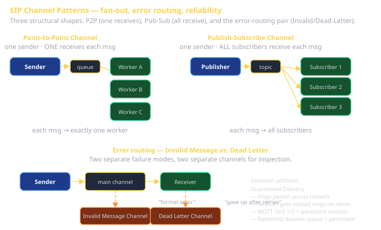

# Enterprise Integration Patterns Part 1 Cheat Sheet (80/20)

The vocabulary you need to talk about messaging-based systems with precision. Hohpe & Woolf's *Enterprise Integration Patterns* (2003) cataloged ~65 patterns; this sheet covers the 18 most-used in **Channels** and **Message Construction**. The other categories (routing, transformation, endpoints) are in `cheatsheet-eips-part2`.

The whole point: when you say "Publish-Subscribe Channel" in a code review, your reader knows exactly the architecture you mean. When you say "broadcasting messages thingy," they don't.



## Channel patterns — the 9

### Point-to-Point Channel
One sender. ONE receiver per message. Even if multiple receivers are listening on the channel, each message is delivered to exactly one of them.

**Use when**: work needs to be done once, by some-but-not-all available workers. Job queues are P2P.

**MQTT instance**: queue subscribers (`$share/group/topic`).
**RabbitMQ instance**: classic queues with multiple consumers.
**Concrete**: Sprint 2's "task queue for the LLM-classifier worker pool" wants this.

### Publish-Subscribe Channel
One sender. EVERY subscriber receives every message.

**Use when**: notifications, fan-out, event-driven architectures. The default for "X happened, anyone who cares should react."

**MQTT instance**: regular topic subscribers.
**WebSocket instance**: broadcast.
**Concrete**: Sprint 2's "notify all connected clients of state changes."

### Datatype Channel
The channel constrains the *type* of message it carries. All messages on `orders` are `OrderPlaced`. All messages on `payments` are `PaymentReceived`.

**Use when**: type discipline matters; you want subscribers to be able to assume the shape of every message.

**Trade-off**: more channels (one per type) but simpler subscriber code.

### Invalid Message Channel
Dedicated channel for messages that fail validation when received.

**Use when**: you want to inspect failures separately from the happy path. Lets you fix bugs without losing the malformed message.

### Dead Letter Channel
Where the system gives up. After N retries, after expiration, or after a routing failure, the message goes here for human inspection.

**Use when**: reliability matters; you'd rather human-investigate failures than silently drop them.

**RabbitMQ instance**: `x-dead-letter-exchange` config on a queue.
**MQTT instance**: not built-in; layer it yourself.

**Difference from Invalid Message Channel**: Invalid means "bad message format." Dead Letter means "couldn't be processed despite trying." Different failure modes; different inspection workflows.

### Guaranteed Delivery
Messages persist until delivered. The broker survives restarts; subscribers that come back online get messages they missed.

**Use when**: lost messages are unacceptable.

**MQTT instance**: QoS 1 (at-least-once) or QoS 2 (exactly-once) + persistent sessions.
**RabbitMQ instance**: durable queues + `delivery_mode=2` (persistent) on messages.
**Trade-off**: write to disk on every message → slower than in-memory.

### Channel Adapter
Connects an external system (database, file system, REST API) to your messaging infrastructure. Reads from the system on a schedule or trigger; publishes messages.

**Use when**: integrating a system that doesn't speak your messaging protocol natively. The Adapter (GoF) translates.

**Concrete**: a webhook receiver that translates incoming HTTP into MQTT messages.

### Messaging Bridge
Connects two messaging systems so messages flow between them. Different protocols, different brokers — the bridge is bilingual.

**Use when**: you have MQTT for one part of the system and Kafka for another, and they need to talk.

### Message Bus
Shared messaging substrate that many systems connect to. Schema discipline, reliable delivery, monitoring all live in the bus.

**Use when**: enterprise scale; many systems need to talk; you want one operational substrate.

**Concrete**: Kafka, NATS, or RabbitMQ as "the bus" for an organization.

## Message Construction patterns — the 9

The wire-format vocabulary. What's IN the message determines what receivers can do with it.

### Command Message
"Do this." The verb-shaped message that asks the receiver to *act*.

```json
{
  "type": "ChargePayment",
  "id": "msg-abc-123",
  "userId": "u-456",
  "amount": 19.99,
  "currency": "USD"
}
```

**Receiver**: executes the action. Often replies with success/failure.

**Tells**: imperative verbs in the message type (`Create`, `Charge`, `Send`, `Cancel`).

### Document Message
"Here is data." The noun-shaped message that *transfers* information.

```json
{
  "type": "InvoiceDocument",
  "id": "doc-xyz-789",
  "version": 2,
  "lineItems": [...],
  "total": 245.00
}
```

**Receiver**: reads, transforms, stores, forwards. Doesn't necessarily *do* anything immediate.

**Tells**: noun-shaped types (`InvoiceDocument`, `UserProfile`, `OrderRecord`); receiver has discretion about what to do.

### Event Message
"X happened." Past-tense announcement.

```json
{
  "type": "InvoiceApproved",
  "id": "evt-123-456",
  "occurredAt": "2026-05-06T10:30:00Z",
  "invoiceId": "inv-001",
  "approvedBy": "u-789"
}
```

**Receivers**: react however they care to. Multiple subscribers; sender doesn't know who's listening.

**Tells**: past-tense type names. Often paired with **Publish-Subscribe Channel**.

### The big three at a glance

| | Tense | Receiver acts? | Sender knows receiver? | Channel |
|---|---|---|---|---|
| **Command** | Imperative | Yes — does the thing | Yes (or one of N) | P2P typical |
| **Document** | Noun | Maybe (transforms/stores) | Sometimes | Either |
| **Event** | Past-tense | Up to receiver | No (often) | Pub-Sub typical |

Picking the right one matters. A **Command** sent on a Pub-Sub channel means N receivers all try to do the action — usually a bug. An **Event** sent as a Command means the receiver thinks it's being told what to do, when really it should be reacting.

### Request-Reply
A pair: request goes one way, reply comes back.

```json
// Request:
{ "type": "GetUserProfile", "id": "req-123", "replyTo": "client-44", "userId": "u-789" }

// Reply:
{ "type": "UserProfileResult", "id": "rep-456", "correlationId": "req-123", "user": {...} }
```

The request carries the **Return Address** (where to send the reply) and a **Correlation Identifier** (how the requester matches the reply to its request).

### Return Address
The "send the reply HERE" field. Why explicit: in async messaging, the reply may not naturally come back to the sender (e.g., the reply queue is per-instance, not per-service).

**Common mistake**: hardcoding the reply destination. Then you can't replay messages, you can't move services around, you can't have multiple instances. Carry the address in the message; it's a 50-character field that saves architectural pain.

### Correlation Identifier
Match an asynchronous reply to its request. The reply carries `correlationId: <originalRequestId>` so the requester knows which response goes with which.

**Why it matters**: in async systems, replies may arrive out of order, after long delays, or interleaved with other replies. Without correlation, you can't pair them up.

### Message Sequence
A logical message split across multiple wire messages. Each carries `sequenceNumber: 3 of 7`.

**Use when**: the payload is bigger than the broker's max message size, OR you want to start processing pieces while waiting for more.

**Often replaced by**: external storage (Claim Check pattern, see Part 2). Easier than sequence reconstruction.

### Message Expiration
Messages that go stale. Carry a `expiresAt` field; receivers check on consumption and discard if past.

**Use when**: stale data is worse than no data (stock prices, location data, ephemeral notifications).

### Format Indicator
The message describes its own schema version: `"schemaVersion": 3`. Receivers can adapt or reject.

**Use when**: schemas evolve over time and you need to support old senders without breaking new receivers.

## What this looks like in concrete tech

| EIP | MQTT | RabbitMQ | Kafka | WebSocket |
|---|---|---|---|---|
| **Pub-Sub Channel** | topics with shared subscribers | fanout exchange | every consumer in own group | broadcast |
| **P2P Channel** | shared subscriptions (`$share/...`) | classic queue, multi consumer | one consumer group | targeted send |
| **Datatype Channel** | one type per topic (convention) | one type per queue | one type per topic | n/a |
| **Guaranteed Delivery** | QoS 1/2 + persistent session | durable queue + persistent msg | always (default) | manual |
| **Dead Letter Channel** | layer manually | `x-dead-letter-exchange` | dead-letter topic via consumer logic | manual |

## Recognition exercise — your team's Sprint 2

Sketch your team's Sprint 2 architecture. For each component-to-component connection, name:

1. **Channel pattern** — P2P? Pub-Sub? Datatype?
2. **Message construction** — Command, Document, or Event?
3. **Reliability** — Guaranteed Delivery, or fire-and-forget?
4. **Failure handling** — Where do invalid/dead-letter messages go?

If you can't answer all four for every connection in your system, you have decisions to make BEFORE you start coding. Sprint 2's rubric demands ≥3 EIPs by name with code that shows them; this exercise is how you find them.

## Common mistakes

- **Pub-Sub for things that should be P2P.** N receivers all try to do the same job; you get N copies of the side effect.
- **Command Messages on a Pub-Sub channel.** Same bug, different angle. Use Event for "anyone who cares" and Command for "exactly one receiver should do it."
- **No Correlation Identifier.** Async replies become un-pairable.
- **Hardcoded Return Address.** Service can't be moved or replicated.
- **No Dead Letter Channel.** When a message can't be processed, it's silently lost.
- **Using "QoS 2 = exactly-once" as a security blanket.** Your *broker* delivers exactly once. Your *application's idempotency* still has to be correct (see EIP **Idempotent Receiver** in Part 2).

## What this is in vernacular

- Channels are the **Perfect Framework: Enterprise Messaging** concern's primary interface.
- Pub-Sub Channel ≈ **Observer** (GoF) at the network level.
- P2P Channel ≈ **Strategy + Worker Pool** at the network level.
- Document Message ≈ **DTO (Data Transfer Object)** at the wire level.
- Command Message ≈ **Command** (GoF Behavioral) serialized for the wire.

## Further reading

- **enterpriseintegrationpatterns.com/patterns/messaging/Messaging.html** — every pattern with the canonical illustration.
- **Hohpe & Woolf, *Enterprise Integration Patterns* (2003)** — the book. Still the right answer 22 years later.
- **`cheatsheet-eips-part2`** — routing and transformation patterns.
- **`cheatsheet-realtime-web`** — concrete substrate (MQTT, WebSocket, GraphQL subs) you'll implement these patterns with.
