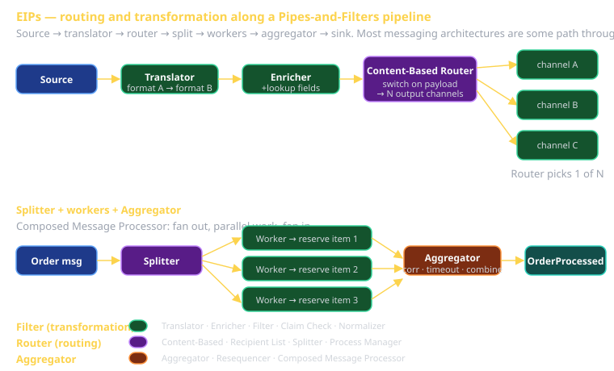

# Enterprise Integration Patterns Part 2 Cheat Sheet (80/20)

The Routing, Transformation, and Endpoint patterns from Hohpe & Woolf — the 47-or-so patterns that work on top of channels and messages from Part 1. This is the 20% you'll *use* when designing a Sprint 2 messaging system, plus the meta-pattern (Pipes-and-Filters) that frames all of them.

If `cheatsheet-eips-part1` told you "what's in the message" and "where it travels," this sheet tells you "what happens to it along the way."



## Pipes-and-Filters — the meta-pattern

The architectural shape that frames everything else. A *pipe* is a channel; a *filter* is a processing step. Compose filters via pipes and you get a pipeline.

```
[Source] --> [Filter A] --> [Filter B] --> [Filter C] --> [Sink]
            (pipe)        (pipe)        (pipe)
```

**Why it matters**: every filter is independently developable, deployable, testable. Each filter cares only about its input contract and output contract. Want to add a step? Insert a filter. Want to reorder? Reroute pipes.

**Concrete**: your Job Pack's LLM pipeline IS Pipes-and-Filters. Input parsing → prompt construction → LLM call → response parsing → document generation. Each is a filter.

**Tells**: any data-processing pipeline. Unix shell pipes (`grep | sort | uniq -c`) are literally this.

## Routing patterns — the 13

Routing patterns decide *where a message goes next*.

### Message Router
The base case. A filter that examines a message and forwards it to one of several output channels.

```typescript
function routeOrder(msg: OrderMessage): Channel {
  if (msg.amount > 10000) return 'high-value-orders';
  return 'standard-orders';
}
```

**Tells**: any "send this kind of message to channel X, that kind to channel Y."

### Content-Based Router
A Message Router that decides based on the message's *content* (vs. its type/header alone).

**Use when**: routing logic depends on payload fields. The most common router variant in real systems.

```typescript
// Route by region:
function route(msg: ShipmentRequest): Channel {
  switch (msg.destination.country) {
    case 'US': return 'us-fulfillment';
    case 'CA': return 'canada-fulfillment';
    default:   return 'international-fulfillment';
  }
}
```

### Message Filter
A filter that drops messages that don't match a predicate.

```typescript
// Pass through only "important" notifications:
const importantOnly = msgs.filter(m => m.priority === 'high');
```

**vs. Content-Based Router**: Filter has only "pass" or "drop"; Router has multiple output channels. Use Filter when "either it goes through or it doesn't"; Router when "it goes to exactly one of several places."

### Dynamic Router
The recipient *self-registers* with the router. Lets you add subscribers without redeploying the router.

**Use when**: receivers come and go; you don't want to hardcode routes.

### Recipient List
Fan-out to a *computed* set of receivers per message. Different from Pub-Sub: the routing decision is computed (often using message content).

```typescript
function deliveryList(invoice: Invoice): Channel[] {
  const channels = ['accounting'];
  if (invoice.amount > 5000) channels.push('management-review');
  if (invoice.taxJurisdiction === 'EU') channels.push('vat-reporting');
  return channels;
}
```

### Splitter
One incoming message → many outgoing.

```typescript
// Order with line items splits into per-line-item messages:
order.lineItems.forEach(item => publish('inventory-reservations', item));
```

**Use when**: parallel processing of message parts; downstream consumers care about pieces.

### Aggregator
Many incoming messages → one outgoing. Inverse of Splitter.

```typescript
// Wait for all line-item-fulfilled messages, emit one order-fulfilled:
const fulfilled = await collectAll(orderId, 'line-item-fulfilled', timeout);
publish('order-fulfilled', { orderId, items: fulfilled });
```

**Three knobs to set**:
- **Correlation** — which incoming messages belong to the same logical aggregation? (usually by an ID)
- **Completeness** — when do we emit? (all items received? timeout? a quorum?)
- **Strategy** — how do we combine them? (concat? sum? pick latest?)

### Resequencer
Messages may arrive out of order; restore the intended order. Buffer until a complete-prefix is available.

**Use when**: ordering matters AND your transport doesn't guarantee it (most don't, even when they claim to).

### Composed Message Processor
Splits, processes pieces, recombines. Splitter + (per-piece work) + Aggregator.

```
[Order] -> Splitter -> [Item 1] -> [Reserve Stock] --\
                       [Item 2] -> [Reserve Stock] ----> Aggregator -> [OrderProcessed]
                       [Item 3] -> [Reserve Stock] --/
```

**Tells**: any "fan-out parallel work, fan-in for the aggregate result."

### Scatter-Gather
Like Composed Message Processor, but the receivers are independent services that may or may not respond.

**Use when**: you want responses from multiple services in parallel and aggregate the results.

**Concrete**: federated search — query 5 backends, aggregate top results from each.

### Routing Slip
The message carries its own route. Each step pops the next destination from the slip and forwards.

**Use when**: routes are dynamic, computed up-front, but each step doesn't need to know the whole flow.

### Process Manager
A central orchestrator that holds the whole flow. It receives intermediate messages, decides what's next, sends out the next step.

**Use when**: complex flows where the routing decisions accumulate state.

**vs. Routing Slip**: Routing Slip is *static* (route computed once, embedded in the message). Process Manager is *dynamic* (decides each step based on what's happened so far).

**Concrete**: a multi-step workflow engine — Camunda, Temporal, AWS Step Functions. Sprint 2's state-chart engine is a small Process Manager.

### Message Broker
Decouple senders from receivers via a hub that everyone connects to. The broker handles delivery, routing, persistence.

RabbitMQ, Kafka, MQTT brokers, NATS, ActiveMQ — all Message Brokers.

## Transformation patterns — the 7

Transformation patterns reshape messages as they travel.

### Message Translator
Convert message format. JSON → Protobuf. Schema A → Schema B. Old version → new version.

```typescript
function translate(legacy: LegacyOrder): NewOrder {
  return {
    orderId: legacy.id,
    customerId: legacy.customer.id,
    items: legacy.lines.map(l => ({ sku: l.product, qty: l.count })),
  };
}
```

**Tells**: integrating systems with different schemas; supporting old senders during a migration.

### Envelope Wrapper
Add metadata around the payload — sender id, timestamp, correlation id, encryption key, etc.

```json
{
  "envelope": {
    "messageId": "uuid",
    "sentAt": "2026-05-06T...",
    "schemaVersion": 3,
    "encryption": "aes-gcm",
    "correlationId": "..."
  },
  "payload": { /* ... */ }
}
```

### Content Enricher
Add fields the receiver needs by looking them up. Sender provides minimal info; enricher fetches the rest.

```typescript
// Sender: { userId: 'u-123' }
// After enrichment: { userId: 'u-123', userName: 'Alice', userEmail: '...' }
```

**Tells**: receiver needs context the sender shouldn't have to know about; fan-in of multiple lookups.

### Content Filter
Strip fields the receiver shouldn't see. Privacy filtering, payload minimization.

**Use when**: a receiver needs *some* of the data; sending the whole thing is wasteful or unsafe.

### Claim Check
Payload is too big to send through the messaging system. Store it externally; pass a reference (the "claim check") in the message; receiver picks it up.

**Use when**: messages > broker max size (usually a few MB); you don't want to burden brokers with binary payloads.

```json
{
  "type": "VideoUploaded",
  "claimCheck": "s3://bucket/uploads/abc-123.mp4",
  "metadata": { "duration": 180 }
}
```

### Normalizer
Many input formats → one canonical form. Each input format gets its own translator; all of them feed into the same output schema.

```
[CSV input]  -> Translator A --\
[JSON input] -> Translator B ----> [Canonical Schema] --> Receiver
[XML input]  -> Translator C --/
```

### Canonical Data Model
A schema everyone agrees on. Senders translate to it; receivers translate from it. Avoids N×N translators (N senders × N receivers); now you have 2N (each end translates once).

**Use when**: many systems integrate; a shared schema is feasible.

**Trap**: Canonical Data Models that grow into "the union of every field anyone ever needed." When the canonical model has 200 optional fields, you've recreated the integration mess inside the schema.

## Endpoint patterns — the 12 (briefer)

Endpoint patterns govern how applications connect to the messaging substrate.

| Pattern | Solves |
|---|---|
| **Message Endpoint** | The thing in your app that connects to messaging |
| **Messaging Gateway** | Abstract messaging from the rest of the app — domain code doesn't know about queues |
| **Messaging Mapper** | Move data between domain objects and messages |
| **Transactional Client** | Coordinate message ops with DB transactions |
| **Polling Consumer** | Pull messages on a schedule |
| **Event-Driven Consumer** | Pushed messages (callback) |
| **Competing Consumers** | Multiple consumers share a P2P queue |
| **Message Dispatcher** | One receiver, many handlers (sub-routing in app) |
| **Selective Consumer** | Receiver picks what to consume (filter on the way in) |
| **Durable Subscriber** | Receives even when it was offline (= Pub-Sub + Guaranteed Delivery) |
| **Idempotent Receiver** | Safe to receive the same message twice |
| **Service Activator** | Bridge messaging to a service interface (e.g., the class LLM endpoint) |

**The two endpoint patterns you'll use most**:

### Idempotent Receiver
Even with QoS 2, exactly-once delivery is hard. Idempotent Receiver handles "what if I see this message twice?" by checking a deduplication store (often: a table of seen message IDs) before processing.

```typescript
async function handle(msg: Msg) {
  if (await alreadyProcessed(msg.id)) return; // Idempotent — second time is a no-op.
  await doWork(msg);
  await markProcessed(msg.id);
}
```

**Use when**: "exactly once" semantics matter. Always, in practice.

### Service Activator
A messaging endpoint that, on receipt of a message, invokes an in-process service. The class LLM endpoint is this — incoming HTTP triggers model inference.

## Recognition exercise — your team's Sprint 2

For each component-to-component connection in your Sprint 2 architecture, name:

1. The **routing** pattern (if any) — Content-Based Router? Splitter? Aggregator?
2. The **transformation** pattern (if any) — Translator? Enricher? Claim Check?
3. The **endpoint** pattern at each end — Idempotent Receiver? Polling vs. Event-Driven? Competing Consumers?

The Sprint 2 rubric requires ≥3 EIPs by name. The good news: any non-trivial messaging architecture uses at least 5-6 of these without trying. Naming them in the demo is the easy rubric win.

## Common mistakes

- **Aggregator without timeout.** Wait forever for the missing piece; never emit. Always have completeness criteria + timeout.
- **Synchronous Splitter.** Splitter that waits for each downstream to ack before sending the next defeats the purpose of fan-out.
- **Canonical Data Model that becomes a god-schema.** When everyone's optional fields are in it, no one's domain is coherent.
- **No Idempotent Receiver.** "QoS 2 means exactly once" is wrong if your application doesn't dedupe.
- **Composed Message Processor that loses the correlation.** Aggregator can't reassemble; messages stuck in limbo.

## What this is in vernacular

- **Pipes-and-Filters** ≈ **Chain of Responsibility** (GoF) at the network level. Same pattern, different scale.
- **Process Manager** ≈ a **State Machine** (and often, in 2026, a **Statechart**).
- **Idempotent Receiver** = the Perfect Framework's *Application > Workflow* concern's idempotency requirement.
- **Service Activator** is what makes the class LLM endpoint a "Perfect Framework Application Layer Adapter."

## Further reading

- **enterpriseintegrationpatterns.com** — every pattern with the canonical drawing.
- **`cheatsheet-eips-part1`** — channels and message construction (the foundation).
- **`cheatsheet-state-charts`** — XState for implementing Process Manager.
- **`cheatsheet-realtime-web`** — concrete substrates (MQTT, WebSocket, GraphQL subs).
- **Camunda** / **Temporal** / **AWS Step Functions** — production Process Manager engines if your capstone goes that direction.
