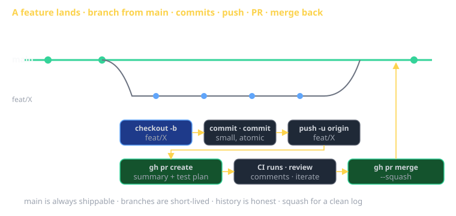

# Git Workflow Cheat Sheet (80/20)

The 20% of git you'll use 80% of the time. CS 3660 expects every Sprint to land in GitHub: branch per feature, commit often, PR for review, merge to main. This sheet covers the day-to-day commands plus the few non-obvious operations that save you when something goes wrong.

The opinionated frame: **trunk-based development**. One long-lived branch (`main`); short-lived feature branches; small, frequent merges. This is what Sprint repos use.



## The day-one setup

Once per machine:

```bash
git config --global user.name "Your Name"
git config --global user.email "you@example.com"
git config --global init.defaultBranch main
git config --global pull.rebase false        # use merge for pulls (simple, OK)
git config --global core.autocrlf input      # macOS/Linux
# Or on Windows:
# git config --global core.autocrlf true
```

For commit signing (recommended once you have an SSH key on GitHub):

```bash
git config --global gpg.format ssh
git config --global user.signingkey ~/.ssh/id_ed25519.pub
git config --global commit.gpgsign true
```

## Daily flow — the loop

```
git pull                       # start from latest main
git checkout -b feat/job-pack-rate-limit
# ... edit files ...
git status                     # see what changed
git diff                       # review unstaged changes
git add path/to/files
git commit -m "feat: rate-limit /api/generate"
git push -u origin feat/job-pack-rate-limit
gh pr create                   # opens PR via GitHub CLI
# ... reviewer comments ...
# ... fix, commit, push ...
gh pr merge --squash           # or merge in GitHub UI
git checkout main && git pull  # update local main
```

That's 90% of git. Master this loop first.

## Commits — the unit of work

A good commit:
- **One logical change**. Fixing a bug + refactoring the surrounding code = two commits.
- **Compiles, tests pass**. Anyone checking out this commit gets working software.
- **Has a clear message**. Tells the *why*, not the *what*.

### Commit message convention

[Conventional Commits](https://www.conventionalcommits.org) is the most common:

```
<type>(<scope>): <subject>

<optional body>

<optional footer>
```

Types: `feat`, `fix`, `docs`, `style`, `refactor`, `test`, `chore`, `ci`, `perf`.

```
feat(auth): add password reset flow
fix(api): handle empty user id in /me endpoint
docs(readme): clarify setup steps for Windows
refactor(jobs): extract pack scoring into separate module
```

The first line ≤ 72 chars. Body explains *why* (link the issue, describe the trade-off). Wrap body at 72 chars too.

### Atomic commits

If you've been hacking and accumulated unrelated changes, split before committing:

```bash
git add -p                     # interactive: pick hunks
# 'y' to stage hunk, 'n' to skip, 's' to split
git commit -m "fix: rate-limit edge case"
git add -p
git commit -m "refactor: extract validate() helper"
```

`git add -p` is the most underused git command. Learn it.

## Branching

Trunk-based: `main` is always shippable. Everything else is a feature branch.

### Naming convention

`<type>/<short-description>`:

- `feat/job-pack-export`
- `fix/login-csrf-bug`
- `docs/sprint-3-postmortem`
- `chore/bump-deps`

Match commit types. Helps when scanning `git branch -a`.

### Lifecycle

```bash
git checkout -b feat/X            # create
# ... work ...
git push -u origin feat/X         # push, set upstream
gh pr create                      # PR
gh pr merge --squash              # merge (deletes remote branch by default)
git checkout main
git pull
git branch -D feat/X              # delete local branch
```

`-D` (capital) force-deletes; lowercase `-d` only deletes if merged. Capital is what you want once GitHub has merged your PR (your local branch was rebased/squashed).

## Pull requests — the review unit

Every change to `main` goes through a PR. Why:

- Code review catches bugs and shares context.
- CI runs on the PR; failures block merge.
- The PR description is the durable record of *why* this change happened.

### A PR description that earns approval

```markdown
## Summary
- Rate-limit /api/generate to 10 req/min per user
- Return 429 with Retry-After header
- Document new env var: RATE_LIMIT_RPM

## Why
Sprint feedback: one student burned through team's Ollama quota
in 30 minutes. Need protection against runaway loops.

## Test plan
- [ ] Unit: rate limiter blocks 11th request within 1min
- [ ] Integration: 429 response has Retry-After header
- [ ] Manual: hit endpoint 11 times, see error message
```

If the PR has a clear summary, a reviewer can review it in 10 minutes instead of 40.

### Merge strategies

- **Squash** (recommended for feature branches): all PR commits collapse into one on `main`. Clean history; squash message becomes the commit message — make it good.
- **Rebase**: replay commits onto `main` in order. Linear history. Preserves your individual commits.
- **Merge** (creates a merge commit): preserves the branch history visually. More noise.

Pick one as a team and stick to it. CS 3660 default: **squash**.

## Reading history

```bash
git log                              # commits, newest first
git log --oneline                    # one line per commit
git log --oneline --graph --all      # ASCII branch graph
git log --since="2 weeks ago"        # time filter
git log --author="Daisy"             # author filter
git log -- path/to/file              # commits touching a file
git show <SHA>                       # full diff of one commit
git blame path/to/file               # who last touched each line
```

`git log --oneline --graph --all` is the "show me where we are" command.

## Diffing

```bash
git diff                       # unstaged changes
git diff --staged              # what's about to be committed
git diff main..HEAD            # this branch vs main
git diff main..HEAD -- src/    # ... in one directory
git diff <SHA1> <SHA2>         # between two commits
git diff <SHA1>..<SHA2>        # same, slightly different semantics
```

For PR-style review locally before pushing:

```bash
git diff main..HEAD --stat     # summary: which files, how many lines
git diff main..HEAD            # full diff
```

## Stashing — pause your work

You're mid-feature; the boss says "drop everything, fix this prod bug." Stash:

```bash
git stash                      # save uncommitted changes
git checkout main
git checkout -b fix/prod-bug
# ... fix, commit, PR ...
git checkout feat/X
git stash pop                  # restore
```

`git stash list` shows saved stashes. `git stash drop` discards. Don't let stashes accumulate — they're easy to forget and lose.

## Undoing things — the four most common cases

### "I haven't committed yet, throw it away"

```bash
git restore path/to/file       # discard unstaged changes (modern)
git checkout -- path/to/file   # same thing, older syntax
git restore .                  # discard all unstaged changes (DESTRUCTIVE)
```

### "I staged the wrong thing"

```bash
git restore --staged path/to/file   # unstage; keep file changes
```

### "My last commit is wrong; I haven't pushed"

```bash
git commit --amend             # edit message, or add staged changes to the same commit
git commit --amend --no-edit   # add staged changes, keep message
```

**Don't amend a commit you've pushed**. It rewrites history; collaborators have to force-pull.

### "I committed to the wrong branch"

```bash
# On wrong-branch:
git log -1                              # remember the SHA
git reset --hard HEAD~1                 # undo the commit (DESTRUCTIVE locally)
git checkout right-branch
git cherry-pick <SHA>                   # apply that commit here
```

Or, if you haven't lost the work yet:

```bash
git checkout -b right-branch            # create the branch where you are
# the commit is on right-branch now; back on wrong-branch:
git checkout wrong-branch
git reset --hard HEAD~1                 # undo on wrong-branch
```

## Merge conflicts — when two branches edited the same lines

Git stops the merge and marks conflicts in the file:

```
<<<<<<< HEAD
const port = 3000;
=======
const port = process.env.PORT ?? 3000;
>>>>>>> feat/X
```

Edit the file to the version you want; remove the markers; then:

```bash
git add path/to/conflicted-file
git commit                     # finishes the merge
```

If you panic:

```bash
git merge --abort              # back out, return to pre-merge state
```

For a complex conflict, ask Claude. `git status` then describe what each side does; Claude resolves with full understanding.

## Rebasing (advanced — careful)

Rebase rewrites history. Powerful, but only safe on **branches you haven't shared**.

### Updating your branch with the latest main

```bash
git checkout feat/X
git fetch origin
git rebase origin/main         # replay your commits on top of latest main
# resolve any conflicts...
git push --force-with-lease    # force-push (because history changed)
```

`--force-with-lease` is safer than `--force`: it refuses to overwrite if someone else pushed to your branch.

### Squashing your messy commits before PR

```bash
git rebase -i main             # opens an editor with each commit
# change 'pick' to 'squash' (or 's') for commits you want to merge into the one above
# save & close; edit the resulting commit message
```

This produces a clean PR.

**Never rebase `main` itself**. Never `--force` to `main`. Force-push only your feature branches.

## Tags — for releases

```bash
git tag v1.0.0                 # lightweight tag at HEAD
git tag -a v1.0.0 -m "First release"   # annotated (preferred for releases)
git push origin v1.0.0         # push one tag
git push --tags                # push all tags
git tag -l                     # list tags
```

CI is often configured to build/release on tag push.

## Working with remotes

```bash
git remote -v                  # list remotes
git remote add upstream git@github.com:original/repo.git
git fetch upstream             # download upstream's branches without merging
git pull upstream main         # fetch + merge upstream main into current branch
```

The fork pattern (you forked someone else's repo):

```bash
git remote add upstream git@github.com:original/repo.git
# ... your work on origin/feat/X ...
git fetch upstream
git rebase upstream/main       # keep your branch current with the original
```

## .gitignore — what NOT to commit

A `.gitignore` at the repo root tells git to ignore matching paths.

```
# Dependencies
node_modules/
__pycache__/
*.pyc

# Build output
dist/
build/

# Editor
.vscode/
.idea/

# Environment
.env
.env.*.local

# OS
.DS_Store
Thumbs.db

# Logs
*.log
npm-debug.log*
```

If you committed something you shouldn't have (like `.env`):

```bash
git rm --cached .env           # remove from index, keep on disk
echo ".env" >> .gitignore
git commit -m "chore: stop tracking .env"
```

But the secret is **still in git history**. For real secrets, you must rotate them and use `git filter-repo` to scrub history (advanced).

## SSH keys — connecting to GitHub

```bash
ssh-keygen -t ed25519 -C "you@example.com"
# accept defaults (saves to ~/.ssh/id_ed25519)
cat ~/.ssh/id_ed25519.pub      # copy this output
```

Paste into GitHub: Settings → SSH and GPG keys → New SSH key.

Test: `ssh -T git@github.com` should respond with "Hi USERNAME!"

Now switch your remote to SSH (faster, no password prompt):

```bash
git remote set-url origin git@github.com:user/repo.git
```

## GitHub CLI (`gh`) — the modern way to interact with GitHub

```bash
gh auth login                  # one-time, links to your GitHub account
gh pr create                   # interactive PR creation
gh pr list                     # PRs in this repo
gh pr view 42                  # show PR #42
gh pr checkout 42              # check out PR #42 locally
gh pr merge --squash           # merge the current PR
gh issue list                  # issues
gh issue create                # interactive
gh repo clone user/repo        # shorthand for the SSH URL
gh run list                    # CI run status for recent commits
gh run view <id>               # see logs of a specific run
```

`gh` is faster than the website for the common operations.

## Recovery patterns — "what did I just do"

### "I lost a commit"

```bash
git reflog                     # ALL recent HEAD movements (even after reset)
git checkout <SHA>             # checkout the lost commit (detached HEAD)
git checkout -b recover/lost   # save it on a new branch
```

`git reflog` is git's safety net. Most "I deleted something" panics are recoverable through reflog. It keeps ~90 days of history.

### "I want to see what I had yesterday"

```bash
git log --since="1 day ago"    # commits in the last day
git diff HEAD@{yesterday}      # diff against yesterday's HEAD
```

## What this is in vernacular

- The repo is a **Saga** (EIP) at the change level — every commit is a step in the long-running transaction of building software.
- Branches ≈ **Memento** (GoF) — saved snapshots of state you can return to.
- Tags ≈ **Mediator** (GoF) at the deploy boundary — a stable name CI uses to coordinate releases.
- A PR ≈ **Approval** workflow on a Saga — the change waits for human (and automated) sign-off before progressing to `main`.
- The reflog is the **Audit trail** of your local work; trusting it makes destructive operations recoverable.

## Common failure modes

- **Committing to main directly**. Always branch. Even for a one-line fix.
- **Massive PRs**. Review quality drops sharply over ~400 lines. Split into smaller PRs.
- **Force-pushing to shared branches**. Coworkers' work disappears. Only force-push your own feature branches; use `--force-with-lease`.
- **Committing secrets**. They live in history forever (or until expensive cleanup). `.env` in `.gitignore` from day one.
- **`pull` on a dirty working tree**. Surprising merges. Stash or commit first.
- **Stash forgotten**. Stashes are easy to leave behind. `git stash list` periodically.
- **Wrong remote URL (HTTPS instead of SSH)**. Password prompts every push. Switch to SSH.

## Further reading

- **Pro Git book** (`git-scm.com/book`) — free, comprehensive.
- **Atlassian's git tutorials** (`atlassian.com/git`) — visual explanations of merge/rebase.
- **`gh` CLI manual** (`cli.github.com/manual`) — the GitHub-specific commands.
- **`cheatsheet-cicd-github-actions`** — the pipeline that runs on every push.
- **`cheatsheet-claude-code-capabilities`** — Claude Code can drive these commands for you.
