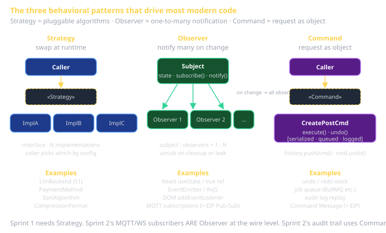

# GoF Behavioral Patterns Cheat Sheet (80/20)

The 11 patterns that shape how objects communicate. By count, this is the largest GoF family. By usage in modern code, **Strategy and Observer dominate** — every framework, every redux-like store, every event emitter is one of them. The rest you'll meet less often but more dramatically when you do.

This sheet covers all 11. Strategy and Observer get the deepest treatment because they're how 60% of your everyday code actually works.

## The eleven

| Pattern | Solves | One-line shape |
|---|---|---|
| **Strategy** | Pluggable algorithms | Interface + N implementations chosen at runtime |
| **Observer** | One-to-many notification | Subject keeps a list of observers, calls them on state change |
| **Command** | Encapsulate a request as an object | `{ execute(), undo() }` objects in a queue or history |
| **State** | Behavior changes when state changes | Dispatch to a state object; transitioning swaps it |
| **Template Method** | Algorithm skeleton in base class, steps in subclass | Abstract base with `final` method calling abstract steps |
| **Chain of Responsibility** | Pass a request along a chain of handlers | Each handler decides: handle or pass; chain ends at default |
| **Iterator** | Sequential access without exposing internals | `next()`/`hasNext()` or modern language iterator protocols |
| **Mediator** | Central object coordinates loose-coupled peers | Peers talk to mediator, never directly to each other |
| **Memento** | Capture/restore an object's internal state | `state = obj.save(); obj.restore(state)` for undo |
| **Visitor** | Operation across an object structure | Each element has `accept(visitor)`; visitor has per-type method |
| **Interpreter** | Grammar + interpreter for a language | AST node classes, each with `interpret(context)` |



## Strategy — the most-used pattern in 2026

Encapsulate a family of algorithms; make them interchangeable. The classic problem: you have one piece of code that needs to behave differently depending on context, and you'd otherwise write a switch statement that grows over time.

**The shape**: an interface, multiple implementations, runtime selection.

```typescript
interface PaymentMethod {
  charge(amount: number): Promise<Receipt>;
}

class StripePayment implements PaymentMethod { /* ... */ }
class PaypalPayment implements PaymentMethod { /* ... */ }
class ManualInvoice implements PaymentMethod { /* ... */ }

// Caller doesn't know which:
async function checkout(cart: Cart, method: PaymentMethod) {
  return method.charge(cart.total);
}
```

**Why it dominates**:
- **Open/Closed Principle in action.** Add a new payment method = new class + one config arm. Don't touch existing code.
- **Testable.** Swap a `MockPayment` in unit tests without dependency injection ceremony.
- **Composes with Factory Method** to pick the strategy from config.

**Sprint 1 example**: your `LlmBackend` interface with `ClassEndpoint`/`ClaudeApi`/`LocalOllama` is Strategy. Sprint 1's rubric grades you on having this exact shape.

**Tells**: any "swap algorithm at runtime" — sorting algorithms, validation rules, formatting, retry policies, payment methods, LLM backends.

## Observer — the second-most-used

Define one-to-many notification: when one object changes, all dependents are notified automatically. This is the substrate of every reactive framework, every event emitter, every pub/sub system.

**The shape**: a Subject keeps a list of Observers; on state change, the Subject loops and calls each Observer's update method.

```typescript
type Listener<T> = (value: T) => void;

class Observable<T> {
  private listeners: Listener<T>[] = [];
  private value: T;

  constructor(initial: T) { this.value = initial; }

  subscribe(fn: Listener<T>): () => void {
    this.listeners.push(fn);
    return () => { this.listeners = this.listeners.filter(l => l !== fn); };
  }

  set(v: T) {
    this.value = v;
    for (const fn of this.listeners) fn(v);
  }

  get(): T { return this.value; }
}

const cartTotal = new Observable(0);
const unsub = cartTotal.subscribe(v => updateBadge(v));
cartTotal.set(12.99); // triggers updateBadge
unsub();              // tear down
```

**Why it dominates**:
- React's `useState` is Observer with the framework hiding the wire-up.
- Vue's reactivity, Svelte's signals, RxJS — all Observer with different ergonomics.
- DOM events (`addEventListener`) — Observer.
- MQTT topic subscriptions, WebSocket subscribers — Observer at the network level (= EIP **Publish-Subscribe Channel**).

**Tells**: any one-source-many-listeners; any "X changed, notify dependents"; any reactive UI system.

**Common pitfalls**:
- Memory leaks. Forgotten subscriptions = listeners that survive their context. Always have a way to unsubscribe.
- Order dependencies. If listener B's correctness depends on listener A having already run, you've got a bug waiting. Don't depend on listener order.
- Async chaos. Listeners that schedule more state changes can re-enter the notification loop. Most frameworks batch updates to prevent this; don't fight the framework.

## Command

Encapsulate a request as an object. Foundation for: queueing, logging, undo/redo, retry, audit trails.

```typescript
interface Command {
  execute(): Promise<void>;
  undo?(): Promise<void>;
}

class CreatePostCommand implements Command {
  constructor(private title: string, private body: string, private db: Db) {}
  private createdId?: number;

  async execute() {
    this.createdId = await this.db.posts.insert({ title: this.title, body: this.body });
  }
  async undo() {
    if (this.createdId) await this.db.posts.delete(this.createdId);
  }
}

// History stack:
const history: Command[] = [];

async function run(cmd: Command) {
  await cmd.execute();
  history.push(cmd);
}

async function undo() {
  const cmd = history.pop();
  if (cmd?.undo) await cmd.undo();
}
```

**Tells**:
- "Execute later / on a queue" — Command.
- "Undo / redo" — Command with `undo()`.
- "Audit log of what happened" — Command serialized.
- "Retry on failure" — push the Command back on the queue.

**EIP connection**: the **Command Message** (EIP) is this pattern at the wire level. You serialize a Command, send it on a Channel, the receiver deserializes and executes.

## State

The behavior of an object changes when its internal state changes. Most-recognized as "implement a state machine cleanly."

**Without State pattern** (the thing you'd otherwise write):
```typescript
class Order {
  status: 'cart' | 'placed' | 'paid' | 'shipped' | 'delivered';

  ship() {
    if (this.status === 'cart') throw new Error('not paid yet');
    if (this.status === 'placed') throw new Error('not paid yet');
    if (this.status === 'paid') { this.status = 'shipped'; return; }
    if (this.status === 'shipped') throw new Error('already shipped');
    if (this.status === 'delivered') throw new Error('already delivered');
  }
  // similar mess for refund(), cancel(), pay()...
}
```

**With State pattern**:
```typescript
interface OrderState {
  ship(order: Order): void;
  pay(order: Order): void;
  cancel(order: Order): void;
}

class CartState implements OrderState {
  ship() { throw new Error('cannot ship from cart'); }
  pay(order: Order) { order.transitionTo(new PaidState()); }
  cancel(order: Order) { order.transitionTo(new CancelledState()); }
}
class PaidState implements OrderState {
  ship(order: Order) { order.transitionTo(new ShippedState()); }
  pay() { throw new Error('already paid'); }
  // ...
}
// etc.
```

The State pattern is the *object-oriented* implementation of state machines. For complex workflows you'll usually reach for **statecharts (XState)** instead — see `cheatsheet-state-charts`.

**Tells**: large `if/switch` chains keyed on a status enum; methods that throw "can't do X in state Y" errors.

## Template Method

Define the skeleton of an algorithm in a base class; let subclasses fill in steps without changing the structure.

```typescript
abstract class ReportGenerator {
  // The "template method" — public, final.
  generate(): string {
    const data = this.fetchData();
    const transformed = this.transform(data);
    const formatted = this.format(transformed);
    return this.attachHeader(formatted);
  }

  protected abstract fetchData(): RawData;
  protected abstract transform(data: RawData): Transformed;
  protected abstract format(t: Transformed): string;

  // Defaulted; subclass can override.
  protected attachHeader(body: string): string {
    return `--- Report ---\n${body}`;
  }
}
```

**Tells**: subclasses that should follow the same overall procedure but vary in specific steps. Compilers, test runners, lifecycle hooks (React component class methods are Template Method).

**vs. Strategy**: Template Method uses **inheritance** (base class + subclasses). Strategy uses **composition** (interface + injected implementation). Modern code prefers Strategy when there's a choice — composition is more flexible, easier to test, no inheritance ceremony.

## Chain of Responsibility

Pass a request along a chain of handlers; each handler decides whether to handle it or pass it along.

```typescript
type Handler = (req: Request, next: () => Promise<Response>) => Promise<Response>;

const auth: Handler = async (req, next) => {
  if (!req.user) throw new UnauthorizedError();
  return next();
};

const rateLimit: Handler = async (req, next) => {
  if (await isOverLimit(req.user.id)) throw new RateLimitError();
  return next();
};

const log: Handler = async (req, next) => {
  console.log(`request from ${req.user.id}`);
  return next();
};
```

**Tells**: web middleware (Express, Koa, ASP.NET, Rails). Logging chains. Validation pipelines. The pattern is everywhere on the server side.

**EIP connection**: this pattern at the messaging level is **Pipes-and-Filters** (each filter is a handler in the chain).

## Iterator

Sequential access to elements of a collection without exposing the underlying representation.

In modern languages, iterators are built into the type system (JS `Symbol.iterator`, Python `__iter__`, Rust `Iterator` trait, etc.). You almost never write the pattern explicitly anymore — you implement the language's iteration protocol.

```typescript
class Range {
  constructor(private start: number, private end: number) {}
  *[Symbol.iterator]() {
    for (let i = this.start; i < this.end; i++) yield i;
  }
}

for (const n of new Range(1, 5)) console.log(n); // 1 2 3 4
```

**Tells**: a custom collection (lazy stream, paged result, tree traversal). Pre-2026 you'd see explicit `Iterator` classes; now you implement the protocol.

## Mediator

A central object coordinates communication between peers. Peers talk to the mediator, not each other.

**Without Mediator**: a UI form where button-A's click handler reaches into checkbox-B's state, and changing checkbox-B updates dropdown-C, and dropdown-C's selection enables/disables button-A. N-to-N coupling.

**With Mediator**: every peer has a reference to the mediator. Peer events go to the mediator, which dispatches updates back to relevant peers.

**Modern incarnations**: Redux, Vuex, MobX, Pinia — the store is the Mediator. Components dispatch actions; the store mediates.

**Tells**: any complex coordination (form fields, dialog windows, multi-pane editors). When you find yourself writing `componentA.observerOf(componentB)` chains, reach for Mediator.

## Memento

Capture and restore an object's internal state, without violating encapsulation.

```typescript
class Editor {
  private text = '';

  save(): EditorMemento { return new EditorMemento(this.text); }
  restore(m: EditorMemento) { this.text = m.text; }
  type(s: string) { this.text += s; }
}

class EditorMemento {
  constructor(public readonly text: string) {}
}
```

**Tells**: undo/redo, snapshots, save-game state. JS dev tools' "step back" feature. State management in scientific computing.

**vs. Command**: Command captures *what was done* (with undo logic in the Command). Memento captures *the resulting state* (the snapshot). Often used together: Command.execute() takes a Memento before doing the work.

## Visitor

Apply an operation to elements of an object structure without modifying the elements. Useful when you have a stable structure (AST, DOM, file system tree) but a growing set of operations.

```typescript
interface AstVisitor {
  visitLiteral(node: LiteralNode): unknown;
  visitBinaryOp(node: BinaryOpNode): unknown;
  visitFunctionCall(node: FunctionCallNode): unknown;
}

interface AstNode {
  accept(visitor: AstVisitor): unknown;
}

class LiteralNode implements AstNode {
  accept(v: AstVisitor) { return v.visitLiteral(this); }
}

class TypeChecker implements AstVisitor { /* operations */ }
class CodeGenerator implements AstVisitor { /* operations */ }
class Pretty Printer implements AstVisitor { /* operations */ }
```

**Tells**: compilers, interpreters, anything traversing an AST. ESLint rules are Visitor at scale (each rule is a Visitor over the JS AST).

**vs. modern alternatives**: Visitor is verbose. Languages with pattern matching (Rust, Scala, Kotlin, modern JS via switch) often write the same thing as a single function with type-discriminated branches. Same idea, less ceremony.

## Interpreter

Define a representation for a grammar and an interpreter that uses the representation to interpret sentences.

You'll see this when you build a small DSL — query languages, configuration languages, expression evaluators. The shape: an AST node class hierarchy + an `interpret(context)` method.

```typescript
abstract class Expr {
  abstract evaluate(ctx: Context): number;
}

class NumberLit extends Expr {
  constructor(public readonly value: number) { super(); }
  evaluate() { return this.value; }
}

class Add extends Expr {
  constructor(public left: Expr, public right: Expr) { super(); }
  evaluate(ctx: Context) { return this.left.evaluate(ctx) + this.right.evaluate(ctx); }
}

const expr = new Add(new NumberLit(2), new NumberLit(3));
expr.evaluate({}); // 5
```

**Tells**: building a small DSL (Sprint 3 capstones occasionally do this — a custom rule engine, a query builder).

**Honesty check**: most "I should use Interpreter" cases are actually "I should use an existing parser library and a tree of nodes." Reach for `chevrotain`, `nearley`, `peg.js` before rolling your own.

## Recognition exercise

Open one component or module from your team's code:

- A function that picks behavior based on a config flag → **Strategy**
- A `useState` or `useEffect` chain → **Observer** (under React's hood)
- An "undo" button or audit log → **Command**
- A status enum with `if (status === 'X')` checks → **State**
- A subclass that follows the parent's procedure with one method overridden → **Template Method**
- An Express/Koa middleware stack → **Chain of Responsibility**
- A custom collection or generator → **Iterator**
- A redux store / pinia store / global event bus → **Mediator**
- A snapshot/restore feature → **Memento**
- An AST walker — type checker, linter, transformer → **Visitor**
- A custom expression evaluator → **Interpreter**

You're using 4-5 of these in any non-trivial app, named or not. Naming them earns rubric points, makes the code legible to teammates, and improves your communication with AI collaborators (precise vocabulary in your prompts → precise output).

## What this is in vernacular

- **Strategy** is the mechanical realization of "swap implementations" — it's how the **Adapter** (GoF Structural) often gets parameterized.
- **Observer** at the wire level is **Publish-Subscribe Channel** (EIP).
- **Command** at the wire level is **Command Message** (EIP).
- **Chain of Responsibility** at the wire level is **Pipes-and-Filters** (EIP).
- **State** at the workflow level is the **Statechart** pattern (Perfect Framework: Workflow).

## Further reading

- **refactoring.guru/design-patterns/behavioral-patterns** — interactive examples in 7 languages.
- **GoF book**, *Design Patterns* (1994), Chapter 5.
- **Effective Java**, items on functional interfaces and the Strategy pattern.
- **Reactive programming** (RxJS, ReactiveX) — Observer turned into a programming paradigm.
