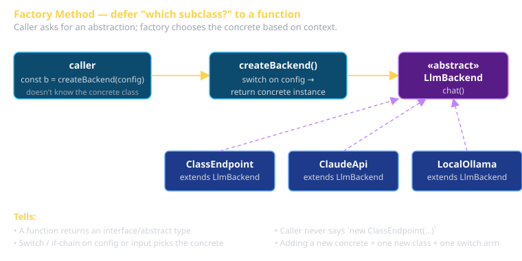

# GoF Creational Patterns Cheat Sheet (80/20)

The five patterns that solve "how should objects come into existence." If your code says `new Thing(...)` more than 3 times in a row across the codebase, you're probably ready for one of these.

## The five

| Pattern | Solves | One-line shape |
|---|---|---|
| **Factory Method** | "Which subclass do I instantiate?" | `BaseClass.createX()` returns a subclass instance |
| **Abstract Factory** | "I need a FAMILY of related objects" | `Factory.makeA()`, `Factory.makeB()` produce matched A/B |
| **Builder** | "Step-by-step construction of complex object" | `Builder().withX().withY().build()` |
| **Prototype** | "Clone instead of construct" | `existing.clone()` returns a copy you can mutate |
| **Singleton** | "Exactly one instance, globally accessible" | `Class.instance()` always returns the same object |

## Factory Method

Use when the *concrete class* should be chosen at runtime, not at compile time. Defers instantiation to a dedicated method (often virtual / overridden in subclasses).



```typescript
abstract class LlmBackend {
  abstract chat(msgs: Msg[]): Promise<string>;
}

class ClassEndpoint extends LlmBackend { /* ... */ }
class ClaudeApi    extends LlmBackend { /* ... */ }

function createBackend(config: Config): LlmBackend {
  if (config.useLocal) return new LocalOllama();
  if (config.useClaude) return new ClaudeApi(config.claudeKey);
  return new ClassEndpoint(config.classKey);
}
```

`createBackend` is the Factory Method. The caller doesn't know or care which subclass — only that it returns an `LlmBackend`. **This is the most-used Creational pattern in modern code.**

**Tells**: a function that returns an interface/abstract class, with a `switch`/`if` chain on config or input.

## Abstract Factory

A factory that produces *families* of related objects. Use when you have multiple things that must come from the same family.

```typescript
interface UiToolkit {
  button(props: ButtonProps): Component;
  modal(props: ModalProps): Component;
  toast(props: ToastProps): Component;
}

class MaterialToolkit implements UiToolkit { /* ... */ }
class CupertinoToolkit implements UiToolkit { /* ... */ }
```

If you pick `MaterialToolkit`, every component you build comes from Material; the toolkit is the Abstract Factory keeping them visually consistent. **Tell**: you'd want to swap "everything" together rather than one piece at a time.

## Builder

Step-by-step construction of complex objects, especially when:
- The object has many optional fields.
- Construction order matters.
- You want to validate at `.build()` time.

```typescript
class ResumePdf {
  static builder() { return new ResumePdfBuilder(); }
}

class ResumePdfBuilder {
  private summary?: string;
  private experience: Experience[] = [];

  withSummary(s: string) { this.summary = s; return this; }
  addExperience(e: Experience) { this.experience.push(e); return this; }
  build(): ResumePdf {
    if (!this.summary) throw new Error('summary required');
    return new ResumePdf(this.summary, this.experience);
  }
}

const pdf = ResumePdf.builder()
  .withSummary('Backend engineer ...')
  .addExperience({ company: 'X', role: 'Y' })
  .build();
```

**Tells**: a class with 5+ optional constructor args, a `build()` step that validates, fluent chained calls. Modern JS often gets away with `{...options}` constructors instead — Builder shines when validation between steps matters.

## Prototype

Clone an existing object instead of constructing fresh. Right when:
- "Make me one like that, with X changed."
- Construction is expensive but cloning is cheap.
- The factory is the existing instance itself.

```typescript
const baseConfig = {
  llmModel: 'llama3.3:70b',
  retries: 3,
  timeout: 30_000,
  // ... 20 more fields
};

const fastVariant   = { ...baseConfig, llmModel: 'llama3.2:1b' };
const aggressive    = { ...baseConfig, retries: 10 };
```

JS spread `{...obj}` is the canonical Prototype. Class-based languages need `Object.create()` or a `clone()` method. **Tells**: configuration variants, scenarios with shared baseline + small overrides.

## Singleton

Exactly one instance, globally accessible. Often a code smell, but legitimate when the thing being singletonized is *genuinely* singular:

- The DB connection pool.
- The logger.
- The config loader.

```typescript
class LlmClient {
  private static _instance: LlmClient;
  private constructor(private apiKey: string) { /* ... */ }
  static get instance() {
    return this._instance ??= new LlmClient(process.env.CS3660_LLM_KEY!);
  }
}

LlmClient.instance.chat(...);
```

**Why it's often wrong**: hidden global state defeats testing. **Why it's sometimes right**: the connection pool really is a singleton in your process. Use sparingly. If you need one for testing, allow a reset hook.

## Recognition exercise

Open one of your team's source files. For each `new ClassName(...)`:

- Does the caller actually know which class to construct? → not a Factory situation.
- Did you write a `createX()` function that returns the type? → that's Factory Method.
- Do you ever construct two classes that *must* match? → Abstract Factory.
- Do you `new` it then immediately set 8 fields? → Builder candidate.
- Do you copy + mutate an existing instance? → Prototype.
- Do you have a global `getInstance()` or top-level `let logger` you reuse? → Singleton.

You're probably using 3 of these without naming them. Naming them earns rubric points and makes your code easier to read.

## What this is in vernacular

- All five are GoF / Creational.
- Factory Method ≈ Strategy Method (when the strategy is "which class to make").
- Builder ≈ EIP **Message Construction patterns** (when the "object" is a wire-format message — Document Message, Command Message, etc.).
- Singleton implements the Perfect Framework's *one DB, one logger, one config* concerns when used right.

## Further reading

- **refactoring.guru/design-patterns/creational-patterns** — diagrams and code samples in 7 languages.
- **GoF book**, *Design Patterns* (1994), Chapter 3.
- **Effective Java**, Joshua Bloch — items 1-9 cover Creational patterns in production-grade detail.
