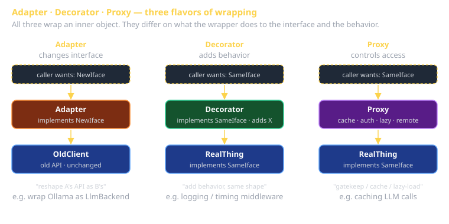

# GoF Structural Patterns Cheat Sheet (80/20)

The seven patterns that solve "how do objects fit together." If your codebase has growth pains around composition, integration with legacy code, or feature additions that touch every class — you want one of these.

## The seven

| Pattern | Solves | One-line shape |
|---|---|---|
| **Adapter** | Incompatible interfaces talking | Wrapper translates A's calls to B's API |
| **Bridge** | Decouple abstraction from implementation | Two parallel hierarchies; constructor injects impl |
| **Composite** | Uniform tree of leaves and branches | Both branch and leaf implement same interface |
| **Decorator** | Add behavior without subclassing | Wrap object; intercept and augment calls |
| **Facade** | Simpler interface to complex subsystem | One class with 3 methods over 8-class subsystem |
| **Flyweight** | Share common parts of many similar objects | Extract shared state into separate object |
| **Proxy** | Stand-in for another object | Same interface; controls/intercepts access |

## Adapter

Reshape one interface to match another. Use when you have a working class but the *shape* doesn't fit your code's expectations.

```typescript
// What we have:
class OllamaApiClient {
  generate(prompt: string, options: object): Promise<OllamaResp> { /* ... */ }
}

// What our code expects:
interface LlmBackend {
  chat(messages: Msg[]): Promise<string>;
}

// Adapter:
class OllamaAdapter implements LlmBackend {
  constructor(private client: OllamaApiClient) {}
  async chat(messages: Msg[]): Promise<string> {
    const prompt = messages.map(m => `${m.role}: ${m.content}`).join('\n');
    const resp = await this.client.generate(prompt, {});
    return resp.response;
  }
}
```

**Tells**: wrapping a third-party library; integrating legacy code into a modern interface. The most common Structural pattern in production code.

## Bridge

Two independent dimensions of variation. Without Bridge: a class explosion (`ButtonBlue`, `ButtonRed`, `LinkBlue`, `LinkRed` ...). With Bridge: two hierarchies meeting at a constructor.

```typescript
// Abstraction
class UiElement {
  constructor(protected renderer: Renderer) {}
  draw() { this.renderer.draw(this.shape); }
}
class Button extends UiElement { shape = 'rect'; }
class Link   extends UiElement { shape = 'underlined-text'; }

// Implementation
interface Renderer {
  draw(shape: string): void;
}
class CanvasRenderer implements Renderer { /* ... */ }
class SvgRenderer    implements Renderer { /* ... */ }

new Button(new CanvasRenderer()).draw();
new Link(new SvgRenderer()).draw();
```

**Tells**: you'd otherwise have a 2D class explosion. Sprint 3 capstones with multi-platform rendering often need Bridge.

## Composite

Tree structure where leaves and branches share an interface, so callers treat them uniformly.

```typescript
interface UiNode {
  render(): string;
}

class TextNode implements UiNode {
  constructor(private text: string) {}
  render() { return this.text; }
}

class ContainerNode implements UiNode {
  private children: UiNode[] = [];
  add(c: UiNode) { this.children.push(c); }
  render() { return this.children.map(c => c.render()).join(''); }
}
```

**Tells**: file systems, DOM trees, JSON, AST. Anywhere you traverse heterogeneous trees with the same logic.

## Decorator

Add behavior to an object without changing its class. Wrap, don't extend.

```typescript
interface Logger {
  log(msg: string): void;
}

class ConsoleLogger implements Logger {
  log(msg: string) { console.log(msg); }
}

class TimestampedLogger implements Logger {
  constructor(private inner: Logger) {}
  log(msg: string) { this.inner.log(`${new Date().toISOString()} ${msg}`); }
}

class FilteredLogger implements Logger {
  constructor(private inner: Logger, private level: string) {}
  log(msg: string) {
    if (msg.startsWith(this.level)) this.inner.log(msg);
  }
}

const logger = new FilteredLogger(
  new TimestampedLogger(new ConsoleLogger()),
  'ERROR',
);
```

**Tells**: middleware (every middleware is Decorator + Chain of Responsibility). React HOCs are Decorator. Express middleware is Decorator. Sprint 1's auth/log/rate-limit middleware stack is Decorator.

## Facade

A simpler interface to a complex subsystem.

```typescript
// Subsystem (10 classes, 30 methods)
class JwtVerifier { /* ... */ }
class SessionStore { /* ... */ }
class RbacChecker  { /* ... */ }
class AuditLogger  { /* ... */ }

// Facade:
class Auth {
  constructor(
    private jwt: JwtVerifier,
    private sessions: SessionStore,
    private rbac: RbacChecker,
    private audit: AuditLogger,
  ) {}

  async authorize(req: Request, action: string): Promise<User> {
    const token = req.headers.authorization?.split(' ')[1];
    const user = await this.jwt.verify(token);
    if (!await this.rbac.can(user, action)) {
      await this.audit.log({ user, action, allowed: false });
      throw new ForbiddenError();
    }
    return user;
  }
}

await auth.authorize(req, 'write:invoice');
```

**Tells**: reducing surface area of a sprawling subsystem to "the 3 things callers actually do." Resist the urge to make Facades God-objects — keep them narrow.

## Flyweight

Share common state across many similar objects. Use only when memory is the bottleneck.

```typescript
class Glyph {                       // intrinsic state (shared)
  constructor(public char: string, public font: Font) {}
}

class GlyphPool {
  private cache = new Map<string, Glyph>();
  get(char: string, font: Font): Glyph {
    const key = `${char}|${font.name}`;
    return this.cache.get(key) ?? this.cache.set(key, new Glyph(char, font)).get(key)!;
  }
}

// Each character ON A PAGE refers to a shared Glyph; per-page state (x, y) is held externally.
```

**Tells**: rendering 10,000+ similar things; memory profile shows redundant data. Most Sprint codebases never need Flyweight; recognize it but don't reach for it preemptively.

## Proxy

Same interface as the target; controls access to it. Four common variants:

- **Virtual proxy**: lazy load the real object on first use.
- **Protection proxy**: enforce permissions before forwarding.
- **Caching proxy**: cache results of expensive calls.
- **Remote proxy**: forward calls over the network (RPC stub).

```typescript
class CachingLlmProxy implements LlmBackend {
  private cache = new Map<string, string>();
  constructor(private inner: LlmBackend) {}

  async chat(msgs: Msg[]): Promise<string> {
    const key = JSON.stringify(msgs);
    if (this.cache.has(key)) return this.cache.get(key)!;
    const resp = await this.inner.chat(msgs);
    this.cache.set(key, resp);
    return resp;
  }
}
```

**Tells**: wrapping an existing service to add caching, auth, lazy loading, or remote dispatch *without changing the consumer*.

## Adapter vs. Decorator vs. Proxy — they all wrap



| | Changes interface? | Changes behavior? | Same identity to caller? |
|---|---|---|---|
| **Adapter** | Yes | No (just translates) | No — different interface |
| **Decorator** | No | Yes (adds) | Yes — same interface |
| **Proxy** | No | Maybe (controls access) | Yes — same interface |

If you're confused which you wrote: ask "what's the interface contract?" Different from inner = Adapter. Same with extra behavior = Decorator. Same with access control = Proxy.

## What this is in vernacular

- **Adapter** ≈ EIP **Message Translator** (when the wrapping crosses systems).
- **Facade** is the Perfect Framework's *Application > MVC* concern at file-organization scale.
- **Decorator chains** ARE the middleware pattern that the Web is built on.

## Further reading

- **refactoring.guru/design-patterns/structural-patterns** — interactive diagrams.
- **Express middleware**, **Koa middleware** — Decorator + Chain of Responsibility in production JS.
- **Java Servlet Filters** — same pattern, different language ecosystem.
