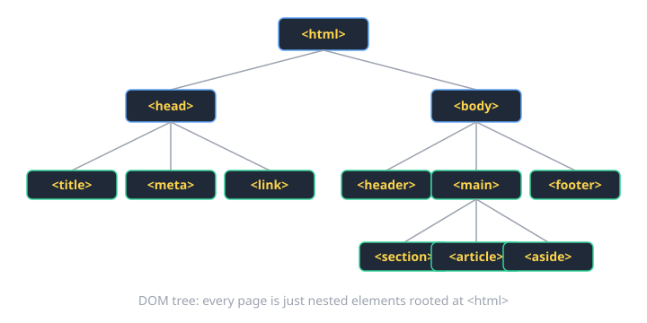
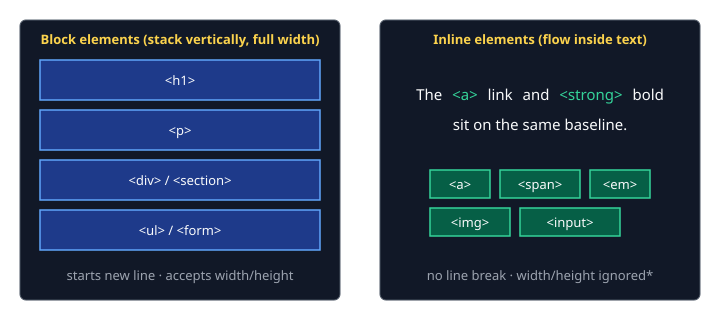
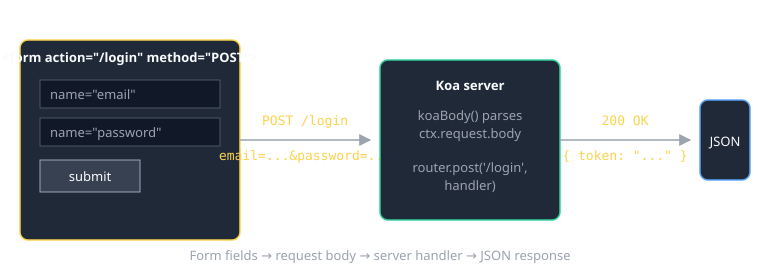

# HTML Cheat Sheet (80/20)

The 20% of HTML you'll write 80% of the time. Skip the obscure tags — look those up when you need them.

## Document skeleton

Every page starts with the same shell. Memorize it.

```html
<!doctype html>
<html lang="en">
  <head>
    <meta charset="utf-8" />
    <meta name="viewport" content="width=device-width, initial-scale=1" />
    <title>Page title</title>
    <link rel="stylesheet" href="/styles.css" />
    <script type="module" src="/main.js" defer></script>
  </head>
  <body>
    <!-- visible content -->
  </body>
</html>
```

- `<!doctype html>` — opt into modern (standards) rendering. Without it, browsers fall back to "quirks mode" and layout silently breaks.
- `viewport` meta — required for mobile to stop pretending it's a desktop browser zoomed out.
- `defer` on scripts — runs after HTML is parsed, in order. Almost always what you want.



## The tags you'll actually use

### Text and links

```html
<h1>Page title</h1>          <!-- exactly one per page -->
<h2>Section</h2>             <!-- nest in order: h1 → h2 → h3 -->
<p>A paragraph of text.</p>
<a href="/about">About</a>   <!-- internal link -->
<a href="https://uvu.edu" target="_blank" rel="noopener">UVU</a>
<strong>important</strong>   <em>emphasized</em>
<br />   <hr />
```

### Lists

```html
<ul> <li>unordered</li> <li>bullet list</li> </ul>
<ol> <li>ordered</li>   <li>numbered list</li> </ol>
```

### Images and media

```html

<video src="/clip.mp4" controls></video>
<audio src="/song.mp3" controls></audio>
```

`alt` is **not optional** — it's how screen readers, broken-image fallbacks, and search engines understand the image. Empty `alt=""` is correct for purely decorative images.

### Containers (semantic HTML)

```html
<header>   <!-- top of page or section -->
<nav>      <!-- primary navigation -->
<main>     <!-- the unique content (one per page) -->
<section>  <!-- a thematic chunk -->
<article>  <!-- self-contained content, e.g. a blog post -->
<aside>    <!-- sidebar, related-but-tangential -->
<footer>   <!-- bottom of page or section -->
<div>      <!-- generic container, no semantic meaning -->
<span>     <!-- generic inline wrapper -->
```

Reach for `<section>` / `<article>` / `<header>` / `<footer>` before `<div>`. Semantic tags help screen readers, accessibility tools, and your future self.



### Tables

Tables are for **tabular data**, not layout.

```html
<table>
  <thead>
    <tr><th>Name</th><th>Score</th></tr>
  </thead>
  <tbody>
    <tr><td>Ada</td><td>92</td></tr>
    <tr><td>Linus</td><td>88</td></tr>
  </tbody>
</table>
```

## Forms — most error-prone, learn this once

```html
<form action="/login" method="POST">
  <label>
    Email
    <input type="email" name="email" required autocomplete="email" />
  </label>

  <label>
    Password
    <input type="password" name="password" required minlength="8" />
  </label>

  <label>
    <input type="checkbox" name="remember" />
    Remember me
  </label>

  <button type="submit">Sign in</button>
</form>
```



### Input types you'll actually use

| `type=`     | Use for                            |
|-------------|------------------------------------|
| `text`      | default text input                 |
| `email`     | email — gets validation + keyboard |
| `password`  | masked input                       |
| `number`    | numeric — gets numeric keyboard    |
| `tel`       | phone numbers                      |
| `url`       | URLs                               |
| `date`      | native date picker                 |
| `checkbox`  | boolean                            |
| `radio`     | one-of-many                        |
| `file`      | file upload                        |
| `hidden`    | server-only data                   |
| `submit`    | submit button (or use `<button>`)  |

### Form rules of thumb

1. **Every input gets a `<label>`** — wrap or use `for="id"`. Required for accessibility.
2. **`name` is what gets sent to the server**, not `id`. Forget `name`, the field is dropped.
3. Use HTML validation (`required`, `min`, `max`, `pattern`) before reaching for JavaScript.
4. `<button>` defaults to `type="submit"` inside a form — set `type="button"` if you don't want submit behavior.

```html
<select name="role">
  <option value="">Choose…</option>
  <option value="student">Student</option>
  <option value="ta">TA</option>
</select>

<textarea name="bio" rows="4" cols="40"></textarea>
```

## Attributes that show up everywhere

| Attribute   | What it does                                          |
|-------------|-------------------------------------------------------|
| `id`        | unique identifier; one element only; `#id` in CSS     |
| `class`     | reusable label; many elements; `.class` in CSS        |
| `href`      | link target on `<a>` and `<link>`                     |
| `src`       | resource URL on ``, `<script>`, `<video>`, etc.  |
| `alt`       | text alternative for images                           |
| `title`     | tooltip on hover (don't rely on it for important info)|
| `data-*`    | custom data; readable in JS via `el.dataset.foo`      |
| `aria-*`    | accessibility hints for screen readers                |

## Accessibility (a11y) — non-negotiable basics

- Use semantic tags (`<button>`, not `<div onclick>`).
- Every `` has `alt`.
- Every form field has a `<label>`.
- Heading levels in order — don't skip from `h1` to `h4`.
- Color is never the only signal (think colorblindness).
- Interactive things must be keyboard-reachable (Tab/Enter/Space).

## Common gotchas

- **Self-closing tags don't need `/`** in HTML5 (`<br>` is fine), but it's harmless and JSX requires it.
- **Whitespace collapses** to a single space in rendered HTML. Newlines in the source don't appear in the page.
- **Block elements can't be inside inline elements.** `<a><div></div></a>` is technically allowed in HTML5 but `<span><div></div></span>` is not.
- **`<button>` inside `<form>` submits unless you set `type="button"`**. This bites everyone at least once.
- **`<input>` has no closing tag** (it's void). Same for ``, `<br>`, `<hr>`, `<meta>`, `<link>`.

## When you're stuck

- [MDN HTML Reference](https://developer.mozilla.org/en-US/docs/Web/HTML) — the only doc you actually need.
- DevTools → "Elements" tab — inspect the live DOM. Right-click any element on a real site to see how they did it.
