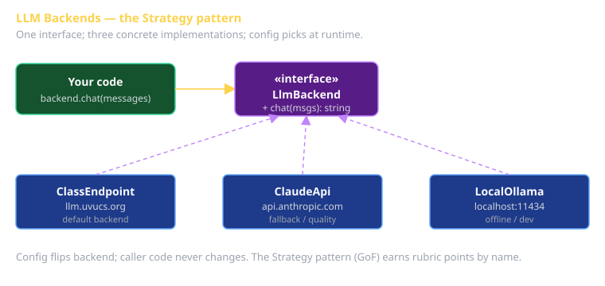

# Class LLM Endpoint Usage Cheat Sheet (80/20)

How to consume `https://llm.uvucs.org` from your code without melting it. The endpoint is your project's production LLM service; Claude Pro is your dev assistant. They're different things — don't confuse them.

## The contract

- **Base URL**: `https://llm.uvucs.org`
- **Auth**: Bearer token (your personal API key, delivered via Canvas DM in W1).
- **Models**: `llama3.2:1b` (fast), `llama3.3:70b` (high quality). `GET /api/models` for the current list.
- **Compatible API surface**: Ollama-style `/api/chat` + `/api/generate`. Many Ollama clients work as-is.

## The 30-second smoke test

```bash
export CS3660_LLM_KEY='<your-key>'

curl -s https://llm.uvucs.org/api/chat \
  -H "Authorization: Bearer $CS3660_LLM_KEY" \
  -H "Content-Type: application/json" \
  -d '{
    "model": "llama3.2:1b",
    "messages": [{"role": "user", "content": "Say hello in one word."}]
  }'
```

If you don't get a JSON response with one word, fix that before doing anything else.

## In code — JS

```typescript
const r = await fetch('https://llm.uvucs.org/api/chat', {
  method: 'POST',
  headers: {
    'Authorization': `Bearer ${process.env.CS3660_LLM_KEY}`,
    'Content-Type': 'application/json',
  },
  body: JSON.stringify({
    model: 'llama3.2:1b',
    messages: [{ role: 'user', content: prompt }],
  }),
});
const json = await r.json();
return json.message.content;
```

**The key never lives in your code.** Read from `process.env.CS3660_LLM_KEY`, set in `.env` (gitignored).

## Streaming responses

For UI: stream tokens as they arrive instead of waiting for the full response. Add `"stream": true`; the response is newline-delimited JSON, one chunk per token group.

```typescript
const r = await fetch(url, { /* ...same... */ body: JSON.stringify({...args, stream: true}) });
const reader = r.body!.getReader();
const decoder = new TextDecoder();
let buffer = '';
while (true) {
  const { done, value } = await reader.read();
  if (done) break;
  buffer += decoder.decode(value, { stream: true });
  const lines = buffer.split('\n');
  buffer = lines.pop()!;
  for (const line of lines) {
    if (!line) continue;
    const chunk = JSON.parse(line);
    process.stdout.write(chunk.message?.content ?? '');
    if (chunk.done) return;
  }
}
```

The pattern: read → buffer → split on newline → parse each line → consume. Worth wrapping in a generator/iterator helper.

## Rate limits

Per-key limits (sized to ~25 students):

- 60 requests / minute (rolling window).
- 4 concurrent requests.

When you hit a limit, you'll see HTTP 429 with a `Retry-After` header. **Don't fight it** — wait the requested time. The right code shape:

```typescript
async function callLlmWithBackoff(req, attempts = 3) {
  for (let i = 0; i < attempts; i++) {
    const r = await fetch(url, req);
    if (r.status !== 429) return r;
    const wait = Number(r.headers.get('Retry-After') ?? '5');
    await new Promise((res) => setTimeout(res, wait * 1000));
  }
  throw new Error('rate limited after retries');
}
```

## Fallback: the Strategy pattern

Sprint 1's rubric requires the Strategy pattern across LLM backends. The shape:



Skeleton:

```typescript
interface LlmBackend {
  chat(messages: Message[]): Promise<string>;
}

class ClassEndpointBackend implements LlmBackend { /* hits llm.uvucs.org */ }
class ClaudeApiBackend     implements LlmBackend { /* hits api.anthropic.com */ }
class LocalOllamaBackend   implements LlmBackend { /* hits localhost:11434 */ }

const backend: LlmBackend = config.llmBackend === 'claude'
  ? new ClaudeApiBackend(...)
  : config.llmBackend === 'local'
    ? new LocalOllamaBackend(...)
    : new ClassEndpointBackend(...);
```

When the class endpoint is down, flip the config; your code keeps running.

## What this is in vernacular

- **Service Activator** (EIP) — incoming HTTP triggers model inference.
- **Adapter** (GoF) — wraps Ollama's native API as a stable HTTP contract.
- **Perfect Framework: Security** — API keys, auth, rate limiting.
- **Perfect Framework: Scale** — shared resource with quotas.
- **Strategy** (GoF) — your `LlmBackend` interface, swappable backends.

## Common failure modes

| Symptom | Cause | Fix |
|---|---|---|
| 401 Unauthorized | Wrong/expired key | DM the instructor for rotation |
| 429 Too Many Requests | Hit rate limit | Honor `Retry-After`, add backoff |
| Connection refused | Service is down | Check the status page; flip to fallback backend |
| Empty / very short responses | Model returned `done` immediately | Check your prompt; the 1B model needs structure |
| `Slow first request` | Cold start | First call to a fresh model loads it; subsequent calls fast |

## What this is NOT

- Not your dev assistant. (That's Claude Code via Claude Pro.)
- Not a place to store data. (Conversations aren't persisted across requests by default.)
- Not authenticated as your user identity. (Your API key auths your CALLS, not who you are to the system.)
- Not a free playground. (Burn through your rate limit; learn nothing.)

## Status & support

Status page: `https://llm.uvucs.org/status`. If down, fall back to Claude API via the Strategy pattern.
Suspect a key leak? DM the instructor for rotation. Don't commit the key while waiting.
