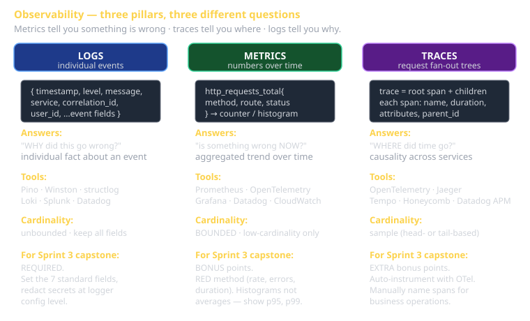

# Observability — Logs, Metrics, Traces Cheat Sheet (80/20)

The three pillars of observability — **logs**, **metrics**, **traces** — and the 20% of each you'll use 80% of the time. Sprint 3 capstone rubric requires structured logs at minimum; metrics and traces earn bonus points. The Perfect Framework's *CI/CD/Documentation/Feedback > User Feedback Everywhere* concern, plus the *Database > Audit trails* concern, both lean on this.

The metaphor: when production breaks, **metrics tell you something is wrong**, **traces tell you where**, **logs tell you why**.



## Logs

A log entry is a fact about something that happened. Structured logs are JSON-shaped; unstructured logs are strings. **Structured wins** for everything but human reading.

### The required fields

Every log line should have:

- **timestamp** — ISO 8601 with timezone. `"2026-05-06T14:23:45.123Z"`.
- **level** — `trace`/`debug`/`info`/`warn`/`error`/`fatal`.
- **message** — short human-readable summary.
- **service** — which service emitted this. Distinguishes microservices.
- **env** — `dev`/`staging`/`production`.
- **correlation_id** (a.k.a. `request_id`, `trace_id`) — ties together everything related to one request.
- **user_id** — when meaningful and not sensitive.

Plus event-specific fields:

```json
{
  "timestamp": "2026-05-06T14:23:45.123Z",
  "level": "info",
  "service": "job-pack-api",
  "env": "production",
  "correlation_id": "req_abc123",
  "user_id": "u_456",
  "message": "llm call completed",
  "model": "llama3.3:70b",
  "tokens_in": 1250,
  "tokens_out": 380,
  "duration_ms": 2340
}
```

### The Pino / Winston / Bunyan pattern (Node)

```javascript
import pino from 'pino';
const logger = pino({
  level: process.env.LOG_LEVEL ?? 'info',
  base: { service: 'job-pack-api', env: process.env.NODE_ENV },
});

// In middleware:
function loggerMiddleware(ctx, next) {
  ctx.log = logger.child({ correlation_id: ctx.headers['x-request-id'] ?? randomUUID() });
  ctx.log.info({ method: ctx.method, path: ctx.path }, 'request received');
  return next();
}

// In handler:
ctx.log.info({ tokens_in, tokens_out, duration_ms }, 'llm call completed');
```

Children inherit the parent's bindings (`correlation_id` etc.), so every log line in this request is automatically tagged.

### Levels — when to use which

| Level | When |
|---|---|
| `trace` | Per-step debugging. Off in production. |
| `debug` | Useful for diagnosing problems. Off in production by default; enable temporarily when investigating. |
| `info` | Normal operational events. Worth seeing. |
| `warn` | Something unexpected but recoverable. |
| `error` | Operation failed; the user got a bad result. |
| `fatal` | Service is unrecoverable. About to crash. |

**Rule of thumb**: production runs at `info`+. Anything below is too noisy.

### What NOT to log

- Passwords, API keys, OAuth tokens, JWTs, session cookies. Ever.
- Full PII unless required and approved (and even then: redact).
- Stack traces in user-facing logs (yes in operator logs).

Use a serializer that strips sensitive fields automatically:

```javascript
const logger = pino({
  redact: ['password', 'token', '*.password', 'headers.authorization', 'apiKey'],
});
```

## Metrics

A metric is a numeric measurement aggregated over time. Where logs are about *individual events*, metrics are about *trends*.

### The RED method (web services)

Three metrics every web service needs:

- **R**ate — requests per second.
- **E**rrors — request failures per second (or as a percentage).
- **D**uration — latency. Always look at distribution, not average.

Latency distribution example:

| Statistic | Meaning |
|---|---|
| p50 | Median — half of requests faster, half slower |
| p95 | 95% of requests faster than this; the slow tail |
| p99 | The really slow tail; affects users with patience for outliers |
| p99.9 | The catastrophic tail; usually where bugs hide |

**Average latency is a lie.** A few 30-second timeouts mixed with thousands of 100ms requests gives a meaningless average. Look at the distribution.

### The USE method (resources)

For each resource (CPU, memory, disk, network) measure:

- **U**tilization — % busy.
- **S**aturation — backlog/queue length.
- **E**rrors — failed operations.

When something's slow, USE tells you which resource is the bottleneck.

### Prometheus — the boring-but-correct stack

```javascript
import { Counter, Histogram, register } from 'prom-client';

const httpRequests = new Counter({
  name: 'http_requests_total',
  help: 'Total HTTP requests',
  labelNames: ['method', 'route', 'status'],
});

const httpDuration = new Histogram({
  name: 'http_request_duration_seconds',
  help: 'HTTP request latency',
  labelNames: ['method', 'route', 'status'],
  buckets: [0.01, 0.05, 0.1, 0.5, 1, 2.5, 5, 10],
});

// In middleware:
function metrics(ctx, next) {
  const end = httpDuration.startTimer({ method: ctx.method, route: ctx.path });
  return next().then(() => {
    httpRequests.inc({ method: ctx.method, route: ctx.path, status: ctx.status });
    end({ status: ctx.status });
  });
}

// Expose /metrics for Prometheus to scrape:
app.use('/metrics', async (ctx) => {
  ctx.body = await register.metrics();
});
```

### Cardinality — the trap

A metric's *cardinality* is the number of distinct label combinations. Each unique combination is a separate time series.

- `http_requests_total{method, route, status}` with 5 methods × 50 routes × 30 status codes = 7,500 series. Fine.
- Add `user_id` as a label = 7,500 × 100,000 users = 750 million series. **Prometheus melts down.**

Rule: never label by anything user-supplied or unbounded. User IDs go in *logs* (where each event is its own line) and *traces* (where each trace is its own span tree). Metrics get high-level dimensions only.

## Traces

A trace is a tree of operations across services, showing how one request fanned out and where time went.

### Anatomy of a trace

```
Trace: a14b2... (User clicked Generate)
└── HTTP POST /api/generate (130ms)
    ├── auth.verify_jwt              (8ms)
    ├── db.SELECT user                (12ms)
    ├── llm.chat                       (95ms)
    │   ├── prompt.compose             (3ms)
    │   ├── http.POST llm.uvucs.org    (88ms)
    │   └── response.parse             (2ms)
    └── db.INSERT draft                 (10ms)
```

Each row is a *span*. Each span has a name, a duration, attributes (key-value tags), events, and a parent. Together they form a tree.

### OpenTelemetry — the standard

OpenTelemetry (OTel) is the vendor-neutral standard for instrumenting traces. Most languages have a library; backends (Jaeger, Tempo, Datadog APM, Honeycomb) all consume OTel.

```javascript
import { trace } from '@opentelemetry/api';
const tracer = trace.getTracer('job-pack-api');

async function generate(ctx) {
  return tracer.startActiveSpan('handler.generate', async (span) => {
    span.setAttribute('user_id', ctx.user.id);
    try {
      const draft = await callLlm(ctx.body);
      span.setStatus({ code: 1 }); // OK
      return draft;
    } catch (err) {
      span.recordException(err);
      span.setStatus({ code: 2 }); // ERROR
      throw err;
    } finally {
      span.end();
    }
  });
}
```

### Auto-instrumentation

Most frameworks have OTel auto-instrumentation libraries that wrap HTTP servers, DB clients, fetch calls, etc. You import the library at startup; it adds spans to every common operation.

```javascript
// At the very top of your entry file:
import '@opentelemetry/auto-instrumentations-node/register';
```

Now every HTTP request, DB query, fetch call generates spans automatically. Manual instrumentation only where business logic deserves naming.

### Sampling

Recording every trace in production is expensive. Sample.

- **Head-based**: decide at the start ("trace this 1% of requests"). Simple; misses interesting outliers.
- **Tail-based**: record every span, decide at the end ("save this trace because it had an error"). More valuable; more infrastructure.

Most production systems start with head-based at 1-10%, add tail-based for errors and slow requests.

## Connecting the three

The pillars are most powerful when connected:

- A log line includes `trace_id` — click through to the full trace.
- A trace shows the request path; click a span to see its log lines.
- A metric alert fires; the runbook says "find the slow trace, look at its logs."

The pattern: **correlation IDs everywhere**. Generate at the edge (request enters the system); propagate through every internal call (HTTP headers, message metadata); attach to every log, metric, span.

## The minimum your capstone needs

To earn the rubric's "structured logs minimum":

1. Pick a structured logging library (Pino, Winston, structlog).
2. Set the required fields (timestamp, level, service, correlation_id, user_id).
3. Log every meaningful event (request received, request completed, errors, important business events).
4. Strip secrets via redaction config.

For bonus points (metrics):

1. Add Prometheus client + `/metrics` endpoint.
2. Track RED metrics for HTTP requests.
3. Add 1-2 custom metrics relevant to your capstone (e.g., `llm_calls_total`).

For more bonus points (tracing):

1. Add OpenTelemetry SDK + auto-instrumentation.
2. Configure exporter (console for dev; OTLP collector for staging).
3. Set up Jaeger or Tempo to view traces.

## What this is in vernacular

- Structured logs ≈ **Event Message** (EIP) at the storage level — each line is an Event captured.
- Metrics ≈ **Aggregator** (EIP) of events into counts/distributions.
- Traces ≈ **Process Manager** (EIP) reconstructed from events — the orchestration laid out as the tree it actually was.
- All three together = Perfect Framework's *Database > Audit trails* + *CI/CD/Documentation/Feedback > User Feedback Everywhere* concerns.
- Correlation IDs = EIP **Correlation Identifier** at the operational level.

## Common failure modes

- **Logs as strings, not JSON.** Searchable but not aggregatable. Migrate to structured.
- **No correlation IDs.** When investigating a user-reported issue, you can't find their related events. Always carry an ID.
- **Logging at debug level in production.** Disk fills up; signal-to-noise terrible.
- **Average latency dashboards.** Hides the slow tail. Show p95, p99 instead.
- **High-cardinality metric labels.** `user_id` as a metric label kills your TSDB. Move identity to logs/traces.
- **Logging passwords/secrets.** Cleanup is expensive. Redact at the logger config level.

## Further reading

- **Pino docs** (Node) — opinionated, fast, structured.
- **OpenTelemetry docs** (opentelemetry.io) — the standard.
- **Prometheus docs** (prometheus.io) — metrics that aren't trying to be too clever.
- **Google SRE book** — chapter on monitoring; introduces SLI/SLO/error budget.
- **`cheatsheet-cicd-github-actions`** — what runs the pipeline you're observing.
- **`cheatsheet-perfect-framework-concerns`** — audit trails, the data-side of observability.
