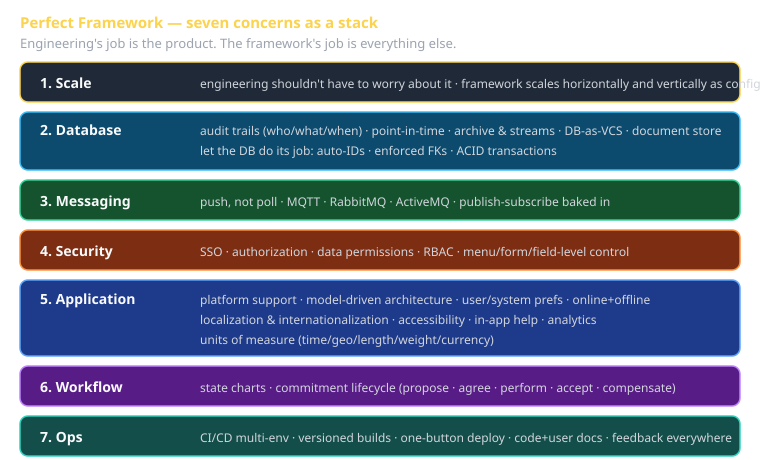
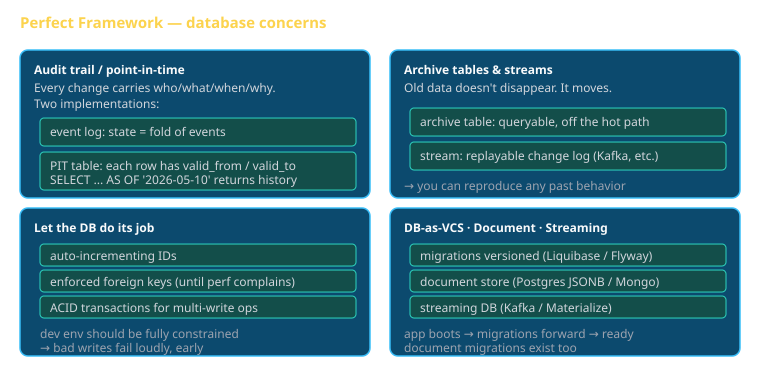
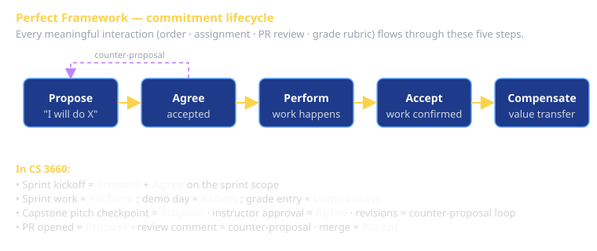

# The Perfect Framework Cheat Sheet (80/20)

The 20% of Hunter's *Perfect Framework* you'll spend 80% of your time talking about. Source: `The-Perfect-Framework.md` (Hunter, 2024). The framework is *aspirational* — no real framework hits 100% of these concerns — but the value is in **using the names**: every architectural decision in your sprint should map to one of these concerns, and you should know which.

The core question the framework answers: **what should the framework do for me so I don't have to do it again on every project?**

## The seven concerns (memorize the names)

1. **Scale** — engineering shouldn't worry about it
2. **Database** — audit trails, point-in-time, document, streaming, DB-as-VCS
3. **Enterprise Messaging** — push, not poll
4. **Security** — SSO, RBAC, data permissions, menu/form/field control
5. **Application** — multi-platform, model-driven, offline, i18n, a11y, units, analytics
6. **Workflow** — state charts and commitment lifecycle
7. **CI/CD + Documentation + Feedback** — multi-environment, versioned builds, one-button build, code docs, user docs, in-product feedback

In CS 3660 reflections and presentations: **say the concern's name explicitly.** "We addressed the *Audit trails* concern by storing every change as an event-sourced log" beats "we logged stuff."

---

## 1. Scale

> Engineering shouldn't have to worry about scale of application — the framework should be set to scale.

The framework hides scale concerns behind stable interfaces:

- **Horizontal scaling** of stateless workers is a config setting, not a code change.
- **Vertical scaling** of stateful components (databases, queues) is the framework's problem, not yours.
- **The bar**: you should never write a feature whose code becomes wrong when the system goes from 1 user to 10,000.

In CS 3660: the *class LLM endpoint* is the framework's instance of this — students consume it the same whether 1 or 25 are hitting it concurrently.

---

## 2. Database

The framework treats the database as a serious component with its own engineering concerns, not just a passive data dump. Five sub-concerns:

### 2a. Audit trails — who knew what when

Every change to load-bearing data is recorded with: **who** made it, **what** changed (before/after), **when** it happened, **why** (if recorded). Not "what is the current state" — "how did we get here." Two implementation patterns:

- **Append-only event log**: every change is an event; the current state is a fold of the events.
- **Point-in-time tables**: each row carries `valid_from` / `valid_to` timestamps; queries pick a time and the table answers "what did the data look like then?"

### 2b. Archive tables / streams — keep the data

Old data doesn't get deleted. It moves to archive tables (queryable but not in the hot path) or streams (replayable). The framework guarantees you can reproduce any past behavior given the data you've kept.

### 2c. Let the database do its job

> This work should and could be done by the database.

- **Auto-incrementing IDs** — don't reinvent.
- **Foreign keys enforced** — as much as you can, until performance complains. The development environment should be **fully constrained** so bad writes fail loudly. You can selectively relax constraints at scale.
- **ACID transactions** — if your business operation involves multiple writes, wrap it. Lost updates are not "we'll handle them at the app layer" — they're a database job.

### 2d. DB-as-VCS

Schemas evolve. The framework versions the schema like code:

- A migration tool (Liquibase, Flyway, Prisma Migrate) **detects** the current DB version, **applies** missing migrations, and can **roll back** if needed.
- Application boots by running migrations forward to its expected version. Never assume the DB schema is what you wrote last week.

### 2e. Document & streaming databases

- **Document store** — JSON-shaped data without rigid schema. Postgres JSONB or MongoDB. Use when the schema *is* per-tenant or per-record.
- **Schema migration for documents** — yes, even document stores have migrations. Versioned document shape → migration scripts → loader knows how to read older shapes.
- **Streaming databases** — data is the stream of changes (Kafka, Materialize, Upsolver). Useful when you want analytical queries over change events in real time.

---

## 3. Enterprise Messaging

> Today's apps don't want to be polled. It should allow messages to be pushed to and from the server.

The framework has a built-in async messaging substrate. Three common implementations:

- **MQTT** — lightweight pub/sub, the class uses `mqtt.uvucs.org`. Best for many small subscribers.
- **RabbitMQ** — full-featured AMQP broker. Best for routing-heavy workflows.
- **ActiveMQ** — enterprise broker, JMS-compatible. Best for Java-heavy enterprises (less common in 2026).

If you find yourself adding `setInterval(fetch, 5000)` to a client, you're polling. **Stop, use messaging.** This is the principle the entire Sprint 2 brief is built around.

---

## 4. Security

The framework has security as a feature, not as something you bolt on. Five sub-concerns:

- **Single sign-on (SSO)** — OAuth, OIDC, SAML. One identity, many apps.
- **Authorization** — separate from authentication. *Who can do what?*
- **Data permissions** — row-level: which records can this user see? Independent from feature permissions.
- **Role-based access control (RBAC)** — users have roles, roles have permissions, permissions gate operations. The Perfect Framework wires RBAC into the request pipeline so endpoints don't reimplement it.
- **Menu / form / field level control** — visibility and editability are computed from RBAC at the UI layer, automatically. A non-admin user shouldn't even *see* the admin menu, not just be denied when they click it.

---

## 5. Application

The biggest concern, with the most sub-concerns. The framework deals with the messy parts of "real users use the app on real devices in real conditions."

### 5a. Platform support

Android · iOS · Computer (Win/Mac/Linux/embedded) · Web browser. The framework lets you target several from one codebase (Flutter, React Native, Capacitor) without re-implementing the platform layer per surface.

### 5b. Model-Driven Architecture

The architecturally radical bit. The framework treats:

- **Field positioning** as data, not code.
- **Form design** as data — drag-and-drop in admin, no deploy needed.
- **Field-level permissions** as data tied to the field, not to the form.
- **Validation rules** as data, not hand-coded per form.

> Infrastructure as configuration and code.

When you can do this, customer-specific tweaks stop requiring engineering. When you can't, every customer is a fork.

### 5c. User / system preferences

Persisted, scoped, syncable. Per-user prefs (theme, locale) ride the user record. Per-system prefs (defaults, feature flags) ride the tenant or org record.

### 5d. Online + offline

The app keeps working when the network drops. State change happens locally; sync happens when the network returns. Conflict resolution is a *deliberate* policy, not "last write wins by accident."

### 5e. Localization & internationalization

- **Localization (l10n)** — currency, date format, number format, time zone. Per-user, not per-deployment.
- **Internationalization (i18n)** — language support, translation pipeline, locale-aware rendering (LTR/RTL). The framework keeps strings out of code so translators can work without a build.

### 5f. Accessibility

The framework defaults to WCAG-compliant components:

- **Blind / low vision** — screen reader semantics, ARIA roles, keyboard nav.
- **Color blind** — never information conveyed by color alone.
- **Age / motor impairment** — large hit targets, no time-bound interactions without an extension.
- **Deaf / hard of hearing** — captions on every video, transcripts where reasonable.

Accessibility is **not** a sprint 3 capstone bonus — it's the floor.

### 5g. Internal help system

Help text lives next to the field/form, in a shared system, retrievable in-app. Not a PDF in a different system.

### 5h. Analytics

Every meaningful user action emits a structured event. Backend computes funnels, retention, feature usage. Analytics is configured, not coded per feature.

### 5i. Units of measure

The framework knows that:

- **Time** has zones, durations, intervals — and that 24h ≠ 1 day across DST.
- **Geo** has projections, datums, distances along great circles.
- **Length / weight / volume** convert between systems.
- **Currency** has exchange rates that change every minute.

Mixing units is the bug. The framework's types prevent it.

---

## 6. Workflow / State management

> StateChart — Commitment

Two big ideas. Both come from outside web dev (statecharts from David Harel; commitment from speech-act theory).

### 6a. State charts

Every non-trivial UI screen and every business workflow is a state machine. **States, events, transitions, guards, actions.** The framework has a state-chart engine baked in (XState is the JS canonical implementation). Why this matters: the state of the page is a *thing you can name and inspect*, not an emergent product of which divs are mounted.

### 6b. Commitment lifecycle

Speech-act theory of business processes. Every meaningful interaction is one of:

1. **Propose** — "I will do X for you in exchange for Y."
2. **Agree** — counterparty accepts the proposal. (Or counter-proposes; back to step 1.)
3. **Perform** — work happens.
4. **Accept** — counterparty confirms the work was done satisfactorily.
5. **Compensate** — payment, gratitude, value transfer.

Every order, every assignment, every PR review, every grade rubric *is* a commitment. The framework models them explicitly so you can audit "where in the lifecycle is this thing stuck?"

---

## 7. CI/CD, documentation, feedback

Three concerns the framework takes seriously instead of leaving to the team:

### 7a. CI/CD

- **Multiple environments**: Local Dev · Staging/QA · Production. Each one's deploy and configuration is automated, parameterized.
- **Versioned build artifacts** — every deploy is a specific, reproducible artifact (image, archive). You can roll back to any prior artifact in one click.
- **One-button build** — the path from "commit" to "running in production" is a single workflow run, not a runbook.

### 7b. Documentation systems

- **Code documentation** — generated from comments + structure (dartdoc, JSDoc, Sphinx, etc.). Lives next to the code, not in a wiki.
- **User documentation** — in-product help (5g) plus a discoverable doc site. Updated as part of the same PR that ships the feature.

### 7c. User feedback everywhere

- A feedback affordance *on every screen*. Not a single "feedback" link at the top of the site.
- **AI behind it to speed creation** — the framework can summarize feedback into themes, surface trends, draft responses.

---

## "Other" the original lists

- **Unit testing** — built into the framework's project template, not added per-team.
- **MVC** — treat it as table stakes. Newer teams reach for MVVM, MVI, or unidirectional flow; the principle stands.
- **Mobile** — first-class, not an afterthought.

---

## How this lands in CS 3660

Each sprint targets specific concerns. Use this when picking your Sprint 3 capstone Perfect Framework concern.

| Sprint | Hits naturally | Could target as the focus |
|---|---|---|
| **Sprint 1 — Job Pack** | Application (5a multi-platform via web), Application (5d offline-as-Strategy-pattern), Security (4: API keys), Scale (1: hosted LLM) | Localization (5e — multilingual résumé) |
| **Sprint 2 — Messaging-rich** | Enterprise Messaging (3), Workflow (6a state charts), Database (2a audit trails) | Database (2d: streaming), Workflow (6b: commitment) |
| **Sprint 3 — Capstone** | Open — pick a concern not hit by S1/S2 | Accessibility (5f), i18n (5e), RBAC (4), Audit trails (2a), CI/CD (7a), Observability (cross-cutting), Units of measure (5i) |

---

## The one-line summary

> A framework that solves Scale, Database, Messaging, Security, Application, Workflow, and CI/CD-Documentation-Feedback **once** so engineering can spend its time on the actual product.

When you cite "Perfect Framework: ___" in a reflection, name the **concern** (Scale, Database, Messaging, Security, Application, Workflow, CI/CD) and the **sub-concern** (Audit trails, RBAC, Model-Driven Architecture, Commitment lifecycle, etc.). The LLM grader rewards specificity and penalizes the generic "we used a framework."
