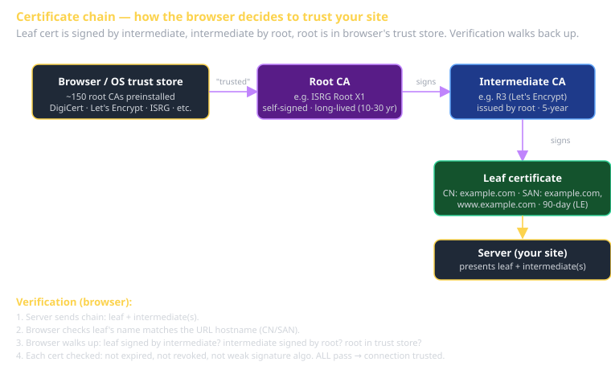

# PKI & mTLS Cheat Sheet (80/20)

The 20% of cryptography you'll use 80% of the time when securing web traffic. **PKI** (Public Key Infrastructure) is how the internet decides which keys to trust. **mTLS** (mutual TLS) is the same machinery applied symmetrically — both sides prove identity. This sheet covers what cert chains are, how TLS handshakes work, and when to reach for mTLS.

We don't cover algorithms (RSA vs. ECDSA, key sizes) — pick what your library defaults to and move on. Don't roll your own crypto.

## The pieces

| Term | What it is |
|---|---|
| **Public/private keypair** | Math. Private signs; public verifies. Private encrypts; public decrypts. |
| **Certificate** | "This public key belongs to this name, signed by a CA." |
| **Certificate Authority (CA)** | An entity whose key is in browsers' / OSes' trust stores. |
| **Chain** | cert → signed by intermediate CA → signed by root CA → in trust store. |
| **Trust store** | The list of root CAs your OS / browser trusts at install time. |



## How TLS verifies a server

When you visit `https://example.com`:

1. Server sends its certificate **chain**: leaf cert + intermediate(s).
2. Browser checks: does the leaf cert's name match `example.com`?
3. Browser checks: is the leaf cert signed by an intermediate's key?
4. Browser checks: is the intermediate signed by another intermediate, or by a root in my trust store?
5. Browser checks: is each cert in the chain unexpired and unrevoked?
6. Browser checks: is the leaf's `Subject Alternative Name` extension valid for this domain?

If all pass: connection is "secure." If any fail: warning page or connection refused.

### Chain depth

Modern certs have:
- **Root** (your browser trusts) → **Intermediate** (issued by root, used to sign leaves) → **Leaf** (the site cert).

Roots almost never sign leaves directly anymore — intermediates limit blast radius if compromised.

## What you actually do as an engineer

### Get a cert (Let's Encrypt — the easy path)

```bash
# certbot fetches and installs a Let's Encrypt cert for your domain.
sudo certbot --nginx -d example.com -d www.example.com
# Auto-renews via cron / systemd timer.
```

Free, automated, renews every 90 days. The default for any web service in 2026.

### Get a cert (Cloud provider)

AWS ACM, GCP Managed Certs, Azure Key Vault — all "click-to-cert" for resources behind their load balancers.

### Get a cert (commercial CA)

DigiCert, GlobalSign, GoDaddy, etc. Pay; sometimes faster issuance, sometimes more validation (EV / OV certs). 99% of cases don't need this — Let's Encrypt is the default.

### Get a cert (self-signed)

Generate yourself; not in any trust store. Only OK for development. Browsers/clients will warn loudly.

```bash
openssl req -x509 -newkey rsa:4096 -keyout key.pem -out cert.pem -days 365 -nodes \
  -subj "/CN=localhost"
```

### Cert lifecycle issues

- **Expired** — cert past its `notAfter` date. Browser refuses. **Set up auto-renewal**; certs that expire on a Sunday at 3am will ruin your weekend.
- **Hostname mismatch** — connecting to a name that's not in the cert's SAN list. Browser refuses.
- **Untrusted issuer** — cert signed by a CA not in the trust store. Browser refuses (or warns and the user clicks through, which is a worse outcome for production).
- **Weak signature algorithm** — old SHA-1 certs. Browsers reject.
- **Key compromise** — cert revoked via CRL or OCSP. Browsers SHOULD refuse (in practice, OCSP soft-fails common in browsers; the broader "revocation works" story has known holes).

## Mutual TLS (mTLS)

In normal TLS, the **server** proves its identity (via its certificate); the **client** doesn't. Mutual TLS adds: the *client also* proves its identity, with its own certificate.

### When to use mTLS

- **Service-to-service inside infrastructure** — service A calls service B; both have certs issued by your internal CA. Strong identity without shared API keys.
- **Zero-trust networks** — every connection (even within the perimeter) authenticates both sides.
- **B2B integrations** — a partner's system connects to yours; you issue them a client cert.
- **IoT** — devices have certs baked in at manufacturing time; servers verify on connect.

### When NOT to use mTLS

- **End-user authentication** — users don't carry certs gracefully. Use OAuth/JWT/sessions for humans.
- **Public APIs** — issuing per-developer client certs is operationally heavy. API keys + scoped tokens are friendlier.

### How mTLS handshake differs

Add to the standard TLS handshake: server requests a client cert; client presents it; server verifies it against a trusted CA list.

```nginx
# Nginx mTLS config
server {
  listen 443 ssl;
  server_name api.internal.example.com;

  ssl_certificate     /etc/ssl/server.crt;
  ssl_certificate_key /etc/ssl/server.key;

  # Require client cert:
  ssl_client_certificate /etc/ssl/client-ca.crt;  # CA that signs valid clients
  ssl_verify_client      on;

  location / {
    proxy_set_header X-Client-Cert-Subject $ssl_client_s_dn;
    proxy_pass http://upstream;
  }
}
```

Now the upstream service knows the client's identity (subject DN from the cert) without a separate auth header.

### Internal CA for mTLS

Issue certs from your own CA (for service identities). Tools:

- **cfssl** (Cloudflare) — CLI for running a small CA.
- **Smallstep** (`step-ca`) — simpler operational story.
- **HashiCorp Vault** — PKI engine; battle-tested.
- **AWS Private CA** / **GCP CA Service** — managed.

Service certs are short-lived (hours to days); rotation is automated. Don't issue 10-year service certs; you'll regret it.

## TLS at the protocol level (skim once, refer when needed)

- TLS 1.2 (RFC 5246, 2008) — baseline. Many flavors of cipher suites; some weak.
- TLS 1.3 (RFC 8446, 2018) — current standard. Faster handshake (1-RTT, 0-RTT possible), simpler cipher suite list, removed unsafe options. Use it.
- ALPN — protocol negotiation during TLS handshake. HTTP/2 and HTTP/3 use it.
- SNI — Server Name Indication. Lets a server host multiple domains on one IP; client tells the server which it's connecting to during the handshake.

You don't write TLS code; you configure your reverse proxy (nginx, Caddy, Traefik) or framework. Caddy auto-configures Let's Encrypt — set the domain, done.

## What this is in vernacular

- TLS = Perfect Framework's *Security > Transport-level Security*.
- Cert chain = a hierarchical trust delegation; structurally similar to **Composite** (GoF) — uniform interface (a Certificate) at every level of the tree.
- mTLS at scale = Perfect Framework's *Security > Authentication for service-to-service*.
- Internal CA = a service that's effectively a Factory of trust certificates; pairs with the Strategy pattern (different cert types for different services).

## Common failure modes

- **Forgetting to renew.** The site goes down on the renewal date. Auto-renew everything; alert on certs expiring in <30 days.
- **Mismatched chain.** Server sends only the leaf, not the intermediate. Some clients can fetch missing intermediates; others can't. Always send the full chain.
- **Self-signed in production.** Users see warnings; some clients (mobile apps, libraries) refuse outright.
- **Wildcard certs over-used.** A single `*.example.com` cert that covers production, staging, and 50 internal services means one key compromise affects everything. Scope tightly.
- **OCSP stapling not configured.** Slows TLS handshakes; also exposes the OCSP-soft-fail problem in many clients.
- **Long-lived service certs in mTLS.** Rotate frequently (hours-to-days). Stale certs are stale identity.

## Further reading

- **Bulletproof TLS Guide** (Ivan Ristić) — the bible.
- **Let's Encrypt docs** (letsencrypt.org/docs).
- **Cloudflare's introduction to TLS** — surprisingly accessible.
- **Smallstep blog** — practical PKI guidance.
- **`cheatsheet-auth`** — when to pick mTLS vs. JWT vs. OAuth.
- **`cheatsheet-owasp-top-10`** — A02 Cryptographic Failures, which is mostly TLS misconfigurations.
