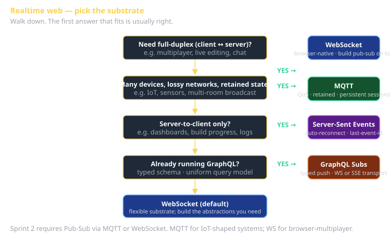

# Realtime Web Cheat Sheet (80/20)

The four substrates you'll consider when "the page needs to update without a refresh": **MQTT**, **WebSocket**, **Server-Sent Events (SSE)**, **GraphQL subscriptions**. Each is right for some workloads, wrong for others. This sheet covers the decision framework, the JavaScript-level API of each, and the production gotchas (reconnect, backoff, presence, ordering).

Sprint 2's rubric requires Pub-Sub via MQTT or WebSocket. Picking which is the first decision; getting the reconnect logic right is the second.



## The decision matrix

| Substrate | Best for | Browser-native? | Server cost | When to skip |
|---|---|---|---|---|
| **MQTT** | Many devices, lossy networks, retained state, IoT-flavored | Via JS client | Lightweight broker | Pure browser-only, full-duplex needed |
| **WebSocket** | Browser↔server full-duplex, multiplayer, live editing | Yes | Per-connection state | Server-to-client only (SSE simpler) |
| **SSE** | Server pushes notifications, client doesn't reply | Yes | HTTP-streaming, almost free | Need bidirectional, need binary |
| **GraphQL subscriptions** | Already on GraphQL; want typed push | No (transport: WS or SSE) | More than raw WS | Don't have GraphQL |

## MQTT

A pub-sub messaging protocol designed for IoT (1999, IBM). Topics, retained messages, QoS levels. Lightweight enough to run on a microcontroller; powerful enough to back chat apps.

**The class broker**: `mqtt.uvucs.org`. Use the `mqtt.js` library in JS:

```javascript
import mqtt from 'mqtt';

const client = mqtt.connect('wss://mqtt.uvucs.org:443/mqtt', {
  clientId: 'team5-' + Math.random().toString(36).slice(2),
  username: process.env.MQTT_USER,
  password: process.env.MQTT_PASS,
  clean: true,    // start fresh; flip to `false` for persistent session
  reconnectPeriod: 1000,  // ms; library reconnects automatically
});

client.on('connect', () => {
  console.log('connected');
  client.subscribe('cs3660/team5/chat', { qos: 1 });
});

client.on('message', (topic, payload) => {
  const msg = JSON.parse(payload.toString());
  // ...
});

// publishing:
client.publish('cs3660/team5/chat', JSON.stringify({ user: 'me', text: 'hi' }), { qos: 1 });
```

### Topics

A topic is a slash-separated string. Wildcards `+` (single level) and `#` (multi-level):

- `cs3660/team5/chat` — exact.
- `cs3660/+/chat` — any team's chat.
- `cs3660/#` — everything under cs3660.
- `+/+/notifications` — any 3-level path ending in notifications.

**Naming convention**: `<namespace>/<entity-id>/<event-type>`. Discipline pays off; chaos costs.

### QoS levels

| QoS | Meaning | When to use |
|---|---|---|
| **0** | At-most-once. Fire and forget. Broker doesn't ack. | Telemetry where lost messages are fine (cursor position, "user typing" indicators). |
| **1** | At-least-once. Broker stores; receiver acks; resend if no ack. | Most app messages. The default for "this should arrive." |
| **2** | Exactly-once. Two-phase ack. | Financial/transactional. Slow; rarely needed in practice. |

**Idempotency reminder**: even QoS 2 doesn't save you from double-processing if your *application* code isn't idempotent. See EIP **Idempotent Receiver**.

### Retained messages

Set `retain: true` when publishing. The broker keeps the last retained message on the topic; new subscribers get it immediately. Useful for "current state" topics.

```javascript
client.publish('cs3660/team5/score', JSON.stringify({ team: 5, score: 42 }), { retain: true });
```

A subscriber who joins after the publish gets the last value. Without retain, they'd wait until the next publish.

### Persistent sessions

`clean: false` + a stable `clientId` = the broker remembers the subscription list and queues messages for an offline subscriber. **The Durable Subscriber pattern** (EIP).

Trade-off: state on the broker. Fine for tens of thousands of clients; design carefully past that.

## WebSocket

A standard browser API for full-duplex TCP-level communication. Lower-level than MQTT (no built-in topics, no QoS, no retain) — you build app semantics on top.

```javascript
const ws = new WebSocket('wss://your-server.com/ws');

ws.onopen = () => {
  ws.send(JSON.stringify({ type: 'subscribe', channel: 'team5' }));
};

ws.onmessage = (e) => {
  const msg = JSON.parse(e.data);
  // ...
};

ws.onclose = () => {
  // reconnect with backoff (you write this)
};

ws.send(JSON.stringify({ type: 'chat', text: 'hello' }));
```

### What WebSocket gives you

- Full duplex (client and server can both send anytime).
- Browser-native — no library required (though Socket.io adds reconnect, rooms, fallback).
- Frames are typed (text or binary).

### What WebSocket doesn't give you

- **Topics / pub-sub** — you build it on top.
- **Reconnect** — you implement it.
- **Presence (who's online)** — server-side bookkeeping.
- **Backpressure** — fancy stuff requires careful coding.

### Reconnect with exponential backoff

The boilerplate every WS app needs:

```javascript
function connectWithBackoff(url, onMessage) {
  let attempt = 0;
  let ws;

  const connect = () => {
    ws = new WebSocket(url);
    ws.onopen = () => { attempt = 0; };
    ws.onmessage = (e) => onMessage(JSON.parse(e.data));
    ws.onclose = () => {
      const wait = Math.min(30_000, 500 * 2 ** attempt) + Math.random() * 500;
      attempt++;
      setTimeout(connect, wait);
    };
    ws.onerror = () => ws.close(); // trigger onclose for reconnect
  };

  connect();
  return { send: (msg) => ws?.send(JSON.stringify(msg)) };
}
```

`Math.random()` jitter prevents thundering-herd reconnects when the server restarts. The cap (30s here) prevents infinite backoff.

### When WebSocket is right

- The browser is one end (MQTT requires a JS client; WS is built in).
- You need full duplex (both sides initiate messages).
- You're building presence-based features (live cursor, multiplayer game state).
- You don't want a separate broker process.

### When WebSocket is wrong

- Many devices behind flaky networks (MQTT's QoS is gold here).
- Server-to-client only (SSE is simpler).
- Your audience is broadcast, not individual sessions (MQTT or a Pub-Sub layer is cleaner).

## Server-Sent Events (SSE)

The forgotten one. HTTP-streaming. Server-to-client only. The browser API auto-reconnects.

```javascript
const es = new EventSource('/api/events');

es.onmessage = (e) => {
  const data = JSON.parse(e.data);
  // ...
};

es.addEventListener('chat', (e) => {
  // Custom event types via the optional `event:` line in the SSE protocol.
});

// Browser auto-reconnects on disconnect. Browser also handles last-event-id.
```

### Why SSE shines

- Built-in reconnect.
- Built-in last-event-ID tracking — server can send only events newer than what client saw.
- Works through every proxy and CDN that handles HTTP correctly (which is most of them).
- One-line client API.

### Why SSE doesn't shine

- One-way. Client can't talk back over the same channel (use a separate POST endpoint).
- Text only. Binary requires base64.
- Browsers limit ~6 concurrent SSE connections per origin (HTTP/2 helps).

**When to use**: server pushes notifications, dashboards, build progress, log tailing.

## GraphQL Subscriptions

Push updates over a typed schema. Subscriptions are part of GraphQL spec; transport is usually WebSocket (`graphql-ws`) or SSE.

```graphql
subscription OnNewMessage($channelId: ID!) {
  newMessage(channelId: $channelId) {
    id
    text
    sentAt
    sender { id, name }
  }
}
```

Client (Apollo / urql / etc.):

```javascript
const subscription = client.subscribe({
  query: NEW_MESSAGE_SUBSCRIPTION,
  variables: { channelId: 'team5' },
}).subscribe({
  next: ({ data }) => { /* render data.newMessage */ },
});
```

**When to use**: you already have GraphQL; you want typed schema-validated push; team's mental model is around GraphQL queries.

**When to skip**: don't have GraphQL; raw WS/MQTT is simpler and lighter.

## Production gotchas all four share

### Backpressure
A subscriber that processes slower than the publisher rate accumulates a backlog. Three responses:
- Drop messages (sample, don't queue).
- Buffer with a hard cap (drop or disconnect when full).
- Apply pressure to the publisher (close the connection; let the protocol's flow control work).

### Presence
"Who's online?" Bookkeeping at the broker/server. Heartbeats: client pings every N seconds; server marks offline after timeout. WS: server emits a presence event on disconnect.

### Ordering
Even within a single connection, ordering can break (network buffering, retries, multi-instance servers). If order matters, sequence numbers + a Resequencer (EIP) at the consumer.

### Reconnect storms
When a service restarts, all N clients reconnect at once. Random jitter on backoff. Server-side connection limits to fail-fast unhealthy clients.

## What this is in vernacular

- MQTT topic = **Pub-Sub Channel** (EIP).
- WebSocket = the substrate; a "channel" on top is also Pub-Sub Channel.
- MQTT QoS 1 = **Guaranteed Delivery** (EIP) + **Idempotent Receiver** (EIP).
- MQTT persistent session = **Durable Subscriber** (EIP).
- All four substrates implement **Observer** (GoF Behavioral) at the network level.

## Further reading

- **MQTT v5 spec** — long but well organized. Read the QoS chapter.
- **`graphql-ws`** — the modern transport library for GraphQL subscriptions.
- **Socket.io** — opinionated WS abstraction with reconnect, rooms, fallback. Use if you don't want to build the boilerplate yourself.
- **`cheatsheet-eips-part1`** — channel + message-construction patterns the substrate implements.
- **`cheatsheet-state-charts`** — state chart for connection lifecycle (connecting / connected / disconnected / reconnecting).
