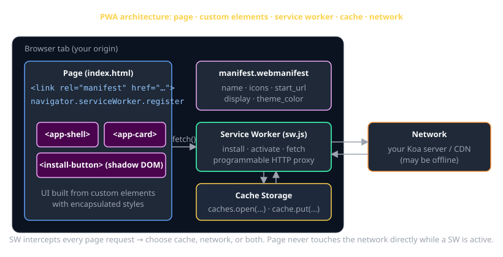
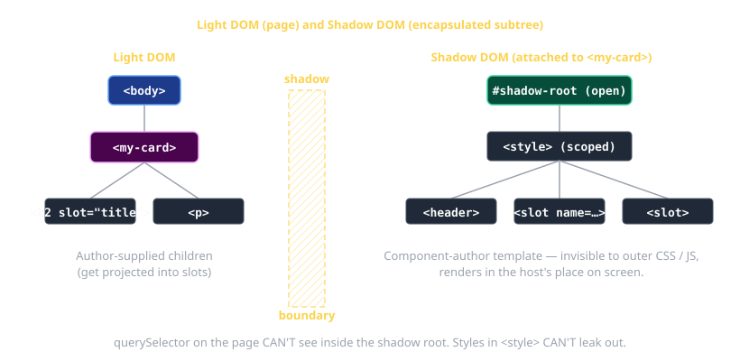
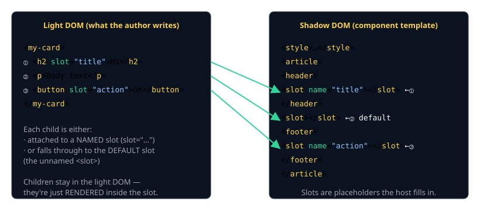
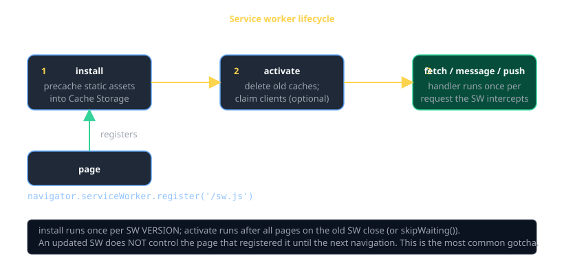
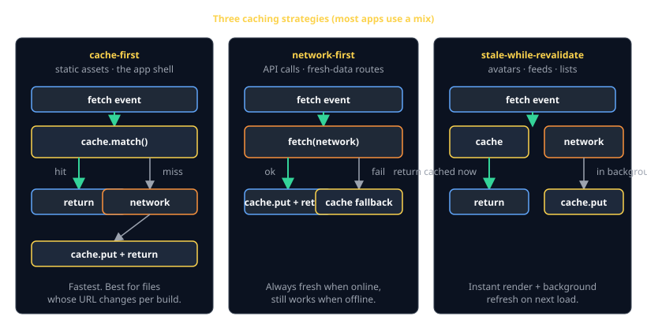

# Shadow DOM · PWA · Service Worker Cheat Sheet (80/20)

Three independent web platform features that share one mission: **make a web page act like a real, installed app.**

| Layer            | What it gives you                                  |
|------------------|----------------------------------------------------|
| **Shadow DOM**   | encapsulated, reusable UI primitives (custom elements) |
| **Web App Manifest** | "Add to Home Screen", icons, app metadata     |
| **Service Worker**   | offline, custom caching, push, background sync |

Together they turn `index.html + a few JS files` into something installable, encapsulated, and offline-capable.



Companion to the [HTML cheat sheet](html.md) (DOM basics) and [CSS cheat sheet](css.md) (selectors & box model).

---

## Part 1 — Shadow DOM and Custom Elements

### What is the shadow DOM?

A **shadow root** is a separate DOM subtree attached to a host element. The browser renders the shadow tree in the host's place on screen, but it's **isolated** from the rest of the page:

- Outer `document.querySelector` can't see inside.
- `<style>` rules inside the shadow root don't leak out, and outer page CSS doesn't leak in.
- Events that bubble out of the shadow root get **retargeted** so the outside world sees them as coming from the host element.



### Minimum viable web component

The recommended pattern is a `<template>` element in HTML, cloned into the shadow root from JS. This is faster than re-parsing HTML on every instantiation, separates structure from behavior, and keeps the JS free of stringly-typed markup.

```html
<!-- index.html — declare the template once, near the top of <body> -->
<template id="my-card-template">
  <style>
    :host             { display: block; border: 1px solid #ccc; padding: 1rem; }
    :host([hidden])   { display: none; }
    header            { font-weight: 600; }
    ::slotted(h2)     { margin: 0; }
  </style>
  <article>
    <header><slot name="title">Untitled</slot></header>
    <slot></slot>                                  <!-- default slot -->
  </article>
</template>

<script type="module" src="/my-card.js"></script>

<my-card>
  <h2 slot="title">Welcome</h2>
  <p>This is the body text.</p>
</my-card>
```

```js
// my-card.js
const template = document.getElementById("my-card-template");

class MyCard extends HTMLElement {
  constructor() {
    super();
    this.attachShadow({ mode: "open" })
        .appendChild(template.content.cloneNode(true));   // clone the template
  }
}

customElements.define("my-card", MyCard);          // tag name MUST contain a hyphen
```

**Rules of the game:**

- The tag name must contain a `-` (`<my-card>`, `<app-button>`). That's how the browser tells "custom" from "future built-in."
- Use `mode: "open"` (so `el.shadowRoot` works) unless you have a hard requirement otherwise. `closed` mostly fights the dev tools, not attackers.
- `:host` styles the host element itself from inside the shadow root. `:host([attr])` matches when the host has that attribute.
- **Don't build a shadow tree by assigning `innerHTML`.** It's tempting for tiny demos, but if any value in that string ever comes from user input (params, JSON, form fields), you've shipped an XSS. The `<template>` + `cloneNode` pattern above doesn't have that risk and is what production codebases use.

### Lifecycle callbacks (the four you'll actually use)

```js
class MyCard extends HTMLElement {
  static observedAttributes = ["variant"];          // attributes you want to react to

  connectedCallback()    { /* inserted into the DOM — wire up listeners, fetch data */ }
  disconnectedCallback() { /* removed — clean up listeners, abort fetches */ }
  attributeChangedCallback(name, oldVal, newVal) {
    if (name === "variant") this.dataset.variant = newVal;
  }
  adoptedCallback()      { /* moved between documents — extremely rare */ }
}
```

> **Don't touch the DOM in `constructor`** — the element may not be inserted yet, and children definitely aren't. Do that in `connectedCallback`.

### Slots — let users compose your component



```html
<!-- Light DOM (what the user writes): -->
<my-card>
  <h2 slot="title">Hi</h2>          <!-- → named slot -->
  <p>Body text</p>                  <!-- → default slot -->
  <button slot="action">OK</button> <!-- → named slot -->
</my-card>

<!-- Shadow DOM (component template): -->
<article>
  <header><slot name="title"></slot></header>
  <slot></slot>                                  <!-- default -->
  <footer><slot name="action"></slot></footer>
</article>
```

`<slot>` is a *placeholder*. Children stay in the light DOM but render where the slot is.

To style slotted content from inside the shadow root, use `::slotted()`:

```css
::slotted(h2)         { color: rebeccapurple; }
::slotted([slot=action]) { margin-top: 1rem; }
```

`::slotted` only matches the **top-level** slotted elements, not their descendants.

### Reflecting attributes ↔ properties

The idiomatic pattern: a public JS property that reads/writes the underlying HTML attribute.

```js
class MyToggle extends HTMLElement {
  static observedAttributes = ["checked"];
  get checked()    { return this.hasAttribute("checked"); }
  set checked(v)   { v ? this.setAttribute("checked", "") : this.removeAttribute("checked"); }

  attributeChangedCallback(name) {
    if (name === "checked") {
      this.shadowRoot.querySelector("input").checked = this.checked;
    }
  }
}
```

This is how built-in elements work too (`input.disabled`, `<input disabled>`).

### Custom events — talk to the outside world

```js
this.dispatchEvent(new CustomEvent("toggle", {
  detail: { checked: this.checked },
  bubbles: true,
  composed: true,         // CRUCIAL: lets the event escape the shadow root
}));
```

Listeners on the host element receive the event with `event.target` retargeted to the host.

### The 6 tradeoffs you should know

1. ✅ **Style isolation** — no more global CSS collisions. Worth the price by itself.
2. ✅ **Composable** — works in any framework, no framework, or with another component library.
3. ❌ **Forms don't auto-participate.** `<input>` inside a shadow root doesn't show up in `<form>` data unless you use Form-Associated Custom Elements.
4. ❌ **Global styles don't reach in.** You have to thread design tokens via CSS custom properties (`--color-brand`) — these *do* pierce shadow DOM.
5. ❌ **Tooling**: querySelector across shadow boundaries is awkward; testing libraries need helpers.
6. ❌ **SSR is harder.** Declarative shadow DOM (`<template shadowrootmode="open">`) is the answer, but tooling is still evolving.

---

## Part 2 — PWA: making it installable

A "Progressive Web App" needs three things:

1. Served over **HTTPS** (or `localhost` for dev).
2. A **web app manifest** linked from the page.
3. A registered **service worker** with a fetch handler.

When all three are present the browser shows an "Install" prompt and the page can be added to the home screen / dock.

### The manifest — `manifest.webmanifest`

```json
{
  "name": "CS3660 Companion",
  "short_name": "CS3660",
  "description": "Companion app for CS 3660 — Advanced Web Development.",
  "start_url": "/",
  "scope": "/",
  "display": "standalone",
  "background_color": "#0b1220",
  "theme_color": "#2563eb",
  "icons": [
    { "src": "/icons/192.png", "sizes": "192x192", "type": "image/png" },
    { "src": "/icons/512.png", "sizes": "512x512", "type": "image/png" },
    { "src": "/icons/maskable.png", "sizes": "512x512", "type": "image/png", "purpose": "maskable" }
  ]
}
```

Linked from your HTML:

```html
<link rel="manifest" href="/manifest.webmanifest" />
<meta name="theme-color" content="#2563eb" />
```

### Manifest fields you'll actually touch

| Field             | Meaning                                                   |
|-------------------|-----------------------------------------------------------|
| `name` / `short_name` | full + home-screen names                              |
| `start_url`       | URL the browser opens when the app launches               |
| `scope`           | URLs considered "inside" the app                          |
| `display`         | `standalone` (no chrome) · `fullscreen` · `minimal-ui` · `browser` |
| `background_color`| splash color before the page loads                        |
| `theme_color`     | OS chrome color (status bar, title bar)                   |
| `icons`           | array; need at least 192×192 and 512×512                  |
| `purpose: "maskable"` | a 512×512 icon designed to fill rounded/squircle shapes |

### Triggering and customizing the install prompt

```ts
let deferredPrompt: BeforeInstallPromptEvent | null = null;

window.addEventListener("beforeinstallprompt", (e) => {
  e.preventDefault();           // stop the browser's default mini-bar
  deferredPrompt = e as BeforeInstallPromptEvent;
  document.querySelector("install-button")?.removeAttribute("hidden");
});

async function install() {
  if (!deferredPrompt) return;
  await deferredPrompt.prompt();              // shows native install UI
  const { outcome } = await deferredPrompt.userChoice;   // "accepted" | "dismissed"
  console.log("install:", outcome);
  deferredPrompt = null;
}
```

`beforeinstallprompt` only fires when the install criteria are met. If it never fires, your manifest or service worker is missing/incorrect.

---

## Part 3 — Service Worker: the offline engine

A service worker is a **JavaScript thread the browser runs in the background, wired in as an HTTP proxy** between your page and the network. Every request the page makes — HTML, CSS, JS, images, JSON — fires a `fetch` event in your worker, and you choose what to do with it.

### Lifecycle



1. **install** — runs once per SW *version*. Ideal place to precache static assets.
2. **activate** — runs after old workers are gone. Ideal place to delete stale caches.
3. **fetch / message / push** — runs every time the SW is asked to do work.

### Registration (from the page)

```js
if ("serviceWorker" in navigator) {
  window.addEventListener("load", () => {
    navigator.serviceWorker
      .register("/sw.js", { scope: "/" })
      .then((reg) => console.log("SW registered:", reg.scope))
      .catch((err) => console.error("SW failed:", err));
  });
}
```

Two hard rules:

- **Scope is bounded by the SW's URL.** A worker at `/sw.js` can control `/`. A worker at `/app/sw.js` can only control `/app/...`. Put `sw.js` at the **site root**.
- **Register from the *page*, not the worker.** `register()` is an API on `navigator.serviceWorker`, available only on the main thread.

### The 3 lifecycle handlers

```js
// sw.js
const VERSION   = "v3";
const APP_SHELL = `app-shell-${VERSION}`;
const SHELL     = ["/", "/index.html", "/styles.css", "/main.js", "/manifest.webmanifest"];

self.addEventListener("install", (event) => {
  event.waitUntil(
    caches.open(APP_SHELL).then((cache) => cache.addAll(SHELL)),
  );
  self.skipWaiting();          // optional: don't wait for old SW to be idle
});

self.addEventListener("activate", (event) => {
  event.waitUntil(
    caches.keys().then((keys) =>
      Promise.all(keys.filter((k) => k !== APP_SHELL).map((k) => caches.delete(k))),
    ),
  );
  self.clients.claim();        // optional: take over already-open pages
});

self.addEventListener("fetch", (event) => {
  // strategy goes here — see below
});
```

> **Update gotcha**: by default, an updated SW becomes the "waiting" worker but doesn't control the page until every tab on the old version closes. `skipWaiting()` + `clients.claim()` skip both queues — convenient, but make sure your old assets and new assets can coexist for a tick.

### The Cache API

```js
const cache = await caches.open("my-cache-v1");
await cache.put(request, response.clone());     // store (clone — Response is one-shot)
const hit = await cache.match(request);         // retrieve
await cache.delete(request);
const all = await caches.keys();                // every cache on this origin
```

`cache.match()` returns `undefined` on miss, a `Response` on hit.

### Three caching strategies — pick by URL



```js
self.addEventListener("fetch", (event) => {
  const url = new URL(event.request.url);

  // 1. cache-first — for the static app shell (CSS, JS, fonts, icons)
  if (SHELL.includes(url.pathname)) {
    event.respondWith(
      caches.match(event.request).then((hit) => hit ?? fetch(event.request)),
    );
    return;
  }

  // 2. network-first — for API calls that should be fresh
  if (url.pathname.startsWith("/api/")) {
    event.respondWith(networkFirst(event.request, "api-cache-v1"));
    return;
  }

  // 3. stale-while-revalidate — for nice-to-be-fresh content (images, lists)
  event.respondWith(staleWhileRevalidate(event.request, "swr-v1"));
});

async function networkFirst(req, cacheName) {
  const cache = await caches.open(cacheName);
  try {
    const fresh = await fetch(req);
    cache.put(req, fresh.clone());
    return fresh;
  } catch {
    return (await cache.match(req)) ?? Response.error();
  }
}

async function staleWhileRevalidate(req, cacheName) {
  const cache  = await caches.open(cacheName);
  const cached = await cache.match(req);
  const fresh  = fetch(req).then((res) => { cache.put(req, res.clone()); return res; });
  return cached ?? fresh;
}
```

| Strategy                | Best for                         | Tradeoff                              |
|-------------------------|----------------------------------|---------------------------------------|
| cache-first             | hashed bundles, fonts, icons     | stale until you bump the cache name   |
| network-first           | live API data                    | small online penalty, works offline   |
| stale-while-revalidate  | feeds, avatars, gallery thumbs   | one-update lag (next load is fresh)   |

### Versioning — how to ship an update

Bump the cache name (`app-shell-v3` → `app-shell-v4`). The new SW's `install` re-fetches the shell, `activate` deletes the old cache. Old tabs keep working until they close.

If you cache `index.html` itself (cache-first), users can get stuck on an old HTML pointing at a deleted JS bundle. Two safe options:

1. **Cache `index.html` with network-first** — you always try the network, fall back to cache only when offline.
2. **Use hashed filenames** for JS/CSS (`main.4af8b.js`) and never cache `index.html` at all.

---

## How the three layers stitch together

A typical PWA:

```
index.html
├─ <link rel="manifest" href="/manifest.webmanifest">      ← installable
├─ <script type="module" src="/main.js">                    ← registers SW
├─ <my-app-shell>                                            ← custom element
│    └─ shadow root: <header>, <main>, <footer>             ← style-isolated
│       └─ <my-card>, <install-button>, <my-list>           ← more components
└─ /sw.js   (intercepts fetches; serves from cache offline)
```

- **Shadow DOM** keeps the UI primitives independent of each other and of any framework.
- **Manifest** turns the page into something installable.
- **Service worker** caches the static asset bundle (the JS that defines the components, the CSS, the icons) so the whole thing boots offline.

Build them in that order: components → manifest → service worker. Each layer is useful on its own, but the offline app experience needs all three.

---

## Common gotchas

### Shadow DOM
- **`document.querySelector` can't see inside.** Use `el.shadowRoot.querySelector(...)`.
- **Global stylesheets don't apply.** Pass design tokens via CSS custom properties, which *do* pierce.
- **Inputs don't join `<form>` data automatically.** Use Form-Associated Custom Elements (`static formAssociated = true`) when you need that.
- **Don't render user data with HTML-string APIs.** Use `textContent`, attribute setters, or DOM methods. The `<template>` + `cloneNode` pattern keeps user data out of the parsed-as-HTML path.

### PWA / Manifest
- **No HTTPS, no install.** `localhost` is the dev exception.
- **Missing 512×512 icon → no install prompt.**
- **`start_url` must be inside `scope`** or the OS launcher gets confused.

### Service Worker
- **Worker scope is bounded by its URL.** Place `sw.js` at the site root.
- **The first page load doesn't have a SW yet** — registration happens too late to intercept that load's requests. The SW takes effect on the *next* navigation (or with `clients.claim()` for already-open tabs).
- **Cached HTML can outlive the JS it points at.** Either don't cache HTML cache-first, or hash your asset filenames.
- **Updates are sticky.** A waiting SW won't activate while old tabs are still open. `skipWaiting()` overrides; combine with versioned cache names.
- **DevTools → Application tab is your friend.** "Update on reload", "Bypass for network", "Unregister" — all live there. Use them.

---

## When you're stuck

- [MDN — Web Components](https://developer.mozilla.org/en-US/docs/Web/API/Web_components)
- [MDN — Service Worker API](https://developer.mozilla.org/en-US/docs/Web/API/Service_Worker_API)
- [web.dev — Progressive Web Apps](https://web.dev/learn/pwa/)
- DevTools → **Application** tab — manifest preview, SW state, cache contents, "Install" button. Everything PWA in one place.
- DevTools → **Elements** tab — `#shadow-root (open)` shows up inline; you can inspect every node and computed style across the boundary.
