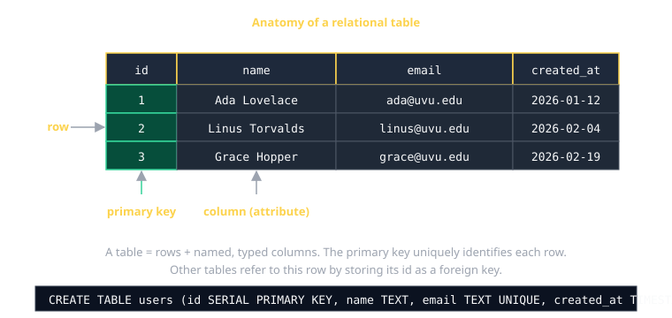
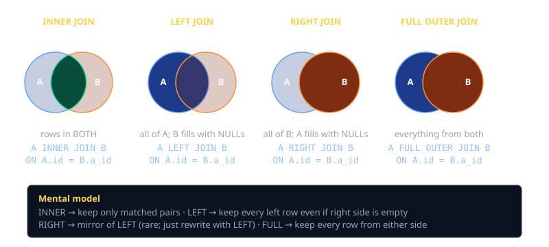
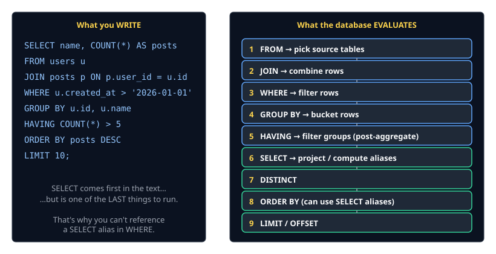
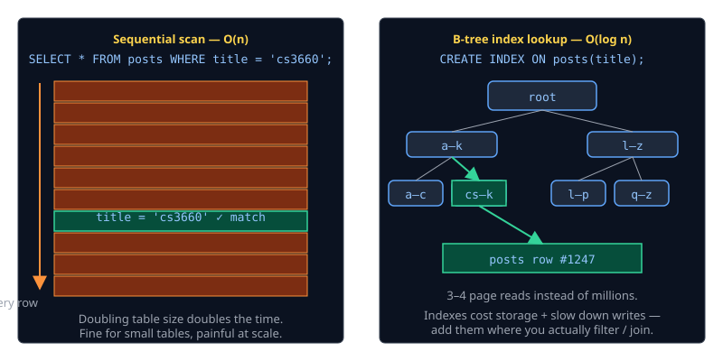

# SQL Cheat Sheet (80/20)

The 20% of SQL you'll write 80% of the time, with a Postgres flavor. Companion to the [Koa + Postgres cheat sheet](client-server-db.md).

> **Postgres-only features** are flagged inline. They're the bits that won't port to MySQL/SQLite without changes.

## What is SQL, really?

SQL is a *declarative* language for working with **relations** (tables of rows and columns). You describe **what** result you want; the database figures out **how** to compute it.



Three families of statements:

| Family | What it does           | Examples                               |
|--------|------------------------|----------------------------------------|
| DDL    | defines structure      | `CREATE TABLE`, `ALTER TABLE`, `DROP`  |
| DML    | reads/writes rows      | `SELECT`, `INSERT`, `UPDATE`, `DELETE` |
| TCL    | groups DML into a unit | `BEGIN`, `COMMIT`, `ROLLBACK`          |

## Defining a table (DDL)

```sql
CREATE TABLE users (
  id         SERIAL PRIMARY KEY,           -- auto-increment integer id
  email      TEXT NOT NULL UNIQUE,         -- enforced by Postgres
  name       TEXT NOT NULL,
  bio        TEXT,                          -- nullable by default
  created_at TIMESTAMPTZ NOT NULL DEFAULT now()
);

CREATE TABLE posts (
  id      SERIAL PRIMARY KEY,
  user_id INT  NOT NULL REFERENCES users(id) ON DELETE CASCADE,
  title   TEXT NOT NULL,
  body    TEXT NOT NULL,
  CHECK (char_length(title) > 0)
);
```

### Types you'll actually use (Postgres)

| Type            | Use for                                        |
|-----------------|------------------------------------------------|
| `SERIAL` / `BIGSERIAL` | auto-increment integer primary keys     |
| `INT` / `BIGINT`| integers                                       |
| `NUMERIC(p,s)`  | exact decimals (money — never use `FLOAT`)     |
| `TEXT`          | strings (don't use `VARCHAR(n)` unless you really need the limit) |
| `BOOLEAN`       | `true` / `false`                               |
| `DATE`          | calendar date (no time)                        |
| `TIMESTAMPTZ`   | timezone-aware timestamp (always prefer this)  |
| `UUID`          | external IDs, with `DEFAULT gen_random_uuid()` |
| `JSONB`         | structured but flexible JSON (indexable)       |

### Constraints — let the database enforce your rules

| Constraint                 | What it guarantees                                  |
|----------------------------|-----------------------------------------------------|
| `PRIMARY KEY`              | unique + not null + indexed                         |
| `UNIQUE`                   | no duplicates                                       |
| `NOT NULL`                 | column always has a value                           |
| `DEFAULT expr`             | value if you don't provide one                      |
| `REFERENCES other(id)`     | foreign key — must point to an existing row         |
| `ON DELETE CASCADE`        | delete dependent rows when the parent goes away     |
| `CHECK (expr)`             | arbitrary row-level invariant                       |

> **Constraints are a feature, not red tape.** They turn data corruption into a loud error instead of a silent disaster three weeks later.

### Altering a table

```sql
ALTER TABLE users ADD COLUMN avatar_url TEXT;
ALTER TABLE users ALTER COLUMN bio SET DEFAULT '';
ALTER TABLE users RENAME COLUMN name TO full_name;
ALTER TABLE users DROP COLUMN bio;
DROP TABLE posts;                 -- gone forever; no undo
```

## Reading rows — SELECT

The single most-typed statement in SQL.

```sql
-- Pick columns
SELECT id, name, email FROM users;
SELECT * FROM users;                -- all columns; fine for ad-hoc, avoid in app code

-- Filter rows
SELECT * FROM users WHERE id = 42;
SELECT * FROM users WHERE created_at >= '2026-01-01';
SELECT * FROM posts WHERE title ILIKE '%cs3660%';   -- ILIKE = case-insensitive (Postgres)
SELECT * FROM users WHERE bio IS NULL;
SELECT * FROM users WHERE id IN (1, 2, 3);
SELECT * FROM users WHERE created_at BETWEEN '2026-01-01' AND '2026-06-01';

-- Sort + limit
SELECT * FROM posts ORDER BY created_at DESC LIMIT 10;
SELECT * FROM posts ORDER BY created_at DESC LIMIT 10 OFFSET 20;   -- page 3

-- De-duplicate
SELECT DISTINCT user_id FROM posts;

-- Rename a column or table for the rest of the query
SELECT u.name AS author, p.title FROM users u JOIN posts p ON p.user_id = u.id;
```

### WHERE operators

| Operator     | Means                                       |
|--------------|---------------------------------------------|
| `=`  `<>`    | equal, not-equal (use `<>`, not `!=`)       |
| `<`  `<=`  `>`  `>=` | comparison                          |
| `BETWEEN a AND b`    | inclusive range                     |
| `IN (...)`   | one of a list                               |
| `LIKE 'foo%'`| wildcard match (`%`=many, `_`=one)          |
| `ILIKE`      | case-insensitive LIKE (Postgres)            |
| `IS NULL` / `IS NOT NULL` | NULL is special — see below    |
| `AND` `OR` `NOT` | combine conditions                      |

## NULL — the foot-gun

`NULL` means "unknown", not "empty". So `NULL = NULL` is **not true** — it's `NULL`.

```sql
WHERE bio = NULL          -- ❌ never matches anything
WHERE bio IS NULL         -- ✅
WHERE bio <> NULL         -- ❌
WHERE bio IS NOT NULL     -- ✅
```

### Useful NULL helpers

```sql
COALESCE(bio, '')         -- first non-NULL value
NULLIF(quantity, 0)       -- turns 0 into NULL (handy for divisions)
```

## Joining tables



```sql
-- INNER: only matched pairs
SELECT u.name, p.title
FROM   users u
JOIN   posts p ON p.user_id = u.id;

-- LEFT: every user, even those with zero posts
SELECT u.name, p.title
FROM   users u
LEFT JOIN posts p ON p.user_id = u.id;

-- Three tables — same idea, just chain JOINs
SELECT u.name, p.title, c.body
FROM   users u
JOIN   posts    p ON p.user_id = u.id
JOIN   comments c ON c.post_id = p.id;
```

### Mental model

- `INNER JOIN` = intersection. Drops rows that don't match on both sides.
- `LEFT JOIN`  = "give me every left row, attach the right side if it exists, else NULL."
- `RIGHT JOIN` = mirror of `LEFT`. Almost always rewrite as a `LEFT JOIN` from the other table.
- `FULL OUTER JOIN` = both sides, NULL where there's no match. Rare in app code.

> **`LEFT JOIN` + `WHERE right.col IS NULL`** is the idiom for *"find rows in A with no match in B."*
> ```sql
> SELECT u.id FROM users u LEFT JOIN posts p ON p.user_id = u.id WHERE p.id IS NULL;
> ```

## Aggregates and GROUP BY

```sql
SELECT COUNT(*)          FROM users;                       -- total rows
SELECT COUNT(DISTINCT user_id) FROM posts;
SELECT AVG(score), MIN(score), MAX(score), SUM(score) FROM submissions;

-- One result per group
SELECT user_id, COUNT(*) AS post_count
FROM   posts
GROUP BY user_id;

-- Filter groups (post-aggregate)
SELECT user_id, COUNT(*) AS post_count
FROM   posts
GROUP BY user_id
HAVING COUNT(*) > 5
ORDER BY post_count DESC;
```

**Rule of thumb**: every column in `SELECT` must either appear in `GROUP BY` or be inside an aggregate. Postgres won't let you forget this — most other databases will let you write the bug and produce nondeterministic results.

## Logical evaluation order — the secret to debugging SQL

You write `SELECT … FROM …`, but the database doesn't run them in that order.



This is why:

- You **can't reference a `SELECT` alias in `WHERE`** — `WHERE` runs before `SELECT`.
- You **can reference it in `ORDER BY`** — `ORDER BY` runs after `SELECT`.
- `WHERE` filters rows; `HAVING` filters groups. They're not interchangeable.

```sql
SELECT u.id, COUNT(*) AS post_count
FROM   users u
JOIN   posts p ON p.user_id = u.id
WHERE  p.created_at > '2026-01-01'    -- filter rows BEFORE grouping
GROUP BY u.id
HAVING COUNT(*) > 5                    -- filter groups AFTER aggregating
ORDER BY post_count DESC               -- alias OK here
LIMIT 10;
```

## Writing rows — INSERT / UPDATE / DELETE

```sql
-- INSERT a single row
INSERT INTO users (email, name)
VALUES ('ada@uvu.edu', 'Ada Lovelace');

-- Multiple rows
INSERT INTO users (email, name) VALUES
  ('a@uvu.edu', 'A'),
  ('b@uvu.edu', 'B');

-- Get the auto-generated id back  (Postgres)
INSERT INTO users (email, name)
VALUES ('grace@uvu.edu', 'Grace Hopper')
RETURNING id, created_at;

-- UPDATE: ALWAYS write the WHERE first
UPDATE users SET name = 'Ada L.' WHERE id = 1;
UPDATE posts SET view_count = view_count + 1 WHERE id = $1;

-- DELETE: same warning. Without WHERE, you delete everything.
DELETE FROM posts WHERE id = 42;
```

> Habit: type `WHERE` **before** the rest of an `UPDATE` or `DELETE`. Then go back and fill in the columns. The number of "I forgot the WHERE" production incidents in the world is staggering.

### Upsert — insert-or-update (Postgres)

```sql
INSERT INTO users (email, name)
VALUES ('ada@uvu.edu', 'Ada')
ON CONFLICT (email) DO UPDATE
  SET name = EXCLUDED.name;          -- EXCLUDED = the row you tried to insert
```

`ON CONFLICT … DO NOTHING` is also useful — silently skip duplicates.

## Subqueries and CTEs

A subquery is a `SELECT` inside another statement. A **CTE** (Common Table Expression) is the same idea spelled out top-to-bottom — much easier to read.

```sql
-- Subquery
SELECT name FROM users
WHERE id IN (SELECT user_id FROM posts WHERE title ILIKE '%cs3660%');

-- The same query as a CTE — read top to bottom
WITH cs3660_authors AS (
  SELECT DISTINCT user_id
  FROM   posts
  WHERE  title ILIKE '%cs3660%'
)
SELECT u.name
FROM   users u
JOIN   cs3660_authors a ON a.user_id = u.id;
```

CTEs are great for breaking a complex query into named steps. Default to them once a query gets longer than ~10 lines.

## UNION — stack two result sets

```sql
SELECT id, 'user'  AS kind FROM users
UNION ALL
SELECT id, 'admin' AS kind FROM admins;
```

`UNION ALL` keeps duplicates (cheap). `UNION` deduplicates (extra sort).

## Indexes — the speed knob



```sql
-- Index a column you filter or join on
CREATE INDEX posts_user_id_idx ON posts(user_id);

-- Composite index (order matters!) — useful when you filter by both
CREATE INDEX posts_user_created_idx ON posts(user_id, created_at);

-- Unique index = enforce uniqueness AND speed lookups
CREATE UNIQUE INDEX users_email_idx ON users(LOWER(email));
```

**Rules of thumb:**

1. Foreign-key columns should almost always be indexed.
2. `PRIMARY KEY` and `UNIQUE` columns are indexed for free.
3. Composite indexes work for queries that filter on a **left-anchored prefix** — `(a, b)` helps `WHERE a = …` and `WHERE a = … AND b = …`, but **not** `WHERE b = …` alone.
4. Indexes cost storage and slow down `INSERT/UPDATE/DELETE`. Don't index everything. Add when `EXPLAIN ANALYZE` shows it matters.

### Reading a query plan

```sql
EXPLAIN ANALYZE
SELECT * FROM posts WHERE user_id = 42;
```

What to look for:

- `Seq Scan on posts` — full table scan. OK for small tables, bad for big ones.
- `Index Scan using posts_user_id_idx` — index in use. Good.
- The **rows** estimate vs **actual** — if they're wildly different the planner has stale stats; run `ANALYZE table_name;`.

## Transactions — atomic groups of statements

```sql
BEGIN;
  UPDATE accounts SET balance = balance - 100 WHERE id = 1;
  UPDATE accounts SET balance = balance + 100 WHERE id = 2;
COMMIT;          -- both happen, or neither (if something fails first)

-- If you want to bail:
BEGIN;
  -- ... oops, wrong query
ROLLBACK;
```

ACID, briefly:

| Letter | Means                                              |
|--------|----------------------------------------------------|
| **A**tomic     | all-or-nothing; partial state is impossible|
| **C**onsistent | constraints hold at commit                 |
| **I**solated   | concurrent transactions don't see each other's in-flight changes |
| **D**urable    | once committed, survives a crash           |

> Wrap related writes in a transaction. If two statements should "happen together," they belong in `BEGIN … COMMIT`.

## Parameterized queries — say it once more

Never interpolate user input into SQL strings:

```ts
// ❌ SQL injection waiting to happen
pool.query(`SELECT * FROM users WHERE email = '${email}'`);

// ✅ Postgres parses query and parameters separately
pool.query("SELECT * FROM users WHERE email = $1", [email]);
```

This is non-negotiable. The driver sends placeholder + values; the database treats values as data, not SQL.

## Common gotchas

- **`NULL` propagates.** `NULL + 1 = NULL`. `WHERE x = NULL` never matches. Use `IS NULL` / `COALESCE`.
- **`COUNT(*)` vs `COUNT(col)`** — the second skips `NULL`s. Often what you want, often surprising.
- **`LIMIT` without `ORDER BY`** is non-deterministic. The database can return any rows it likes.
- **Implicit string-to-number casts** can break in subtle ways. Use the right type from the start.
- **`UPDATE`/`DELETE` without `WHERE`** affects every row. You will do this once. Do it on a development database.
- **Don't trust `OFFSET` for deep pagination** — at page 1000 it scans 1000 pages worth of rows. Use a keyset (`WHERE id > last_seen_id ORDER BY id LIMIT 20`) for big lists.
- **Time zones**: `TIMESTAMP` (without zone) and `TIMESTAMPTZ` look the same but behave differently. Pick `TIMESTAMPTZ` and never look back.
- **JSON in the database is fine; JSON instead of columns is usually a smell.** If a field is queried, indexed, or constrained — make it a column.

## When you're stuck

- [PostgreSQL docs](https://www.postgresql.org/docs/current/) — surprisingly readable; the canonical reference.
- `\d table_name` in `psql` — show columns, types, indexes, constraints, foreign keys at a glance.
- `EXPLAIN ANALYZE` — the database tells you exactly what it's doing. Read it before guessing.
- [Use The Index, Luke](https://use-the-index-luke.com/) — the indexing tutorial for people who actually need to make queries fast.
