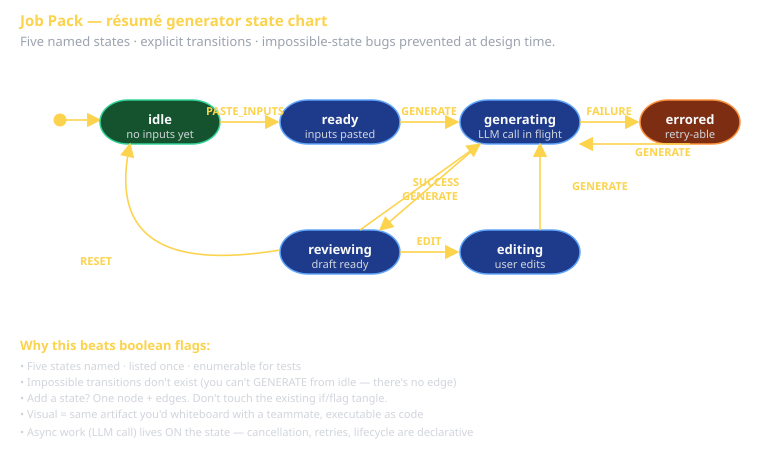

# State Charts Cheat Sheet (80/20)

David Harel's 1987 contribution: state machines + hierarchy + parallelism + history. Why it matters in 2026: most non-trivial UI workflows ARE state machines, and most engineers implement them as a tangle of boolean flags that rot at scale. **State charts make state explicit, enumerable, and testable.**

This cheat sheet covers the core vocabulary and a working XState v5 syntax. Sprint 2's rubric requires ≥1 explicit state chart; Sprint 3 capstones often want one.

## The vocabulary — five terms you must know

| Term | What it is |
|---|---|
| **State** | A named situation the system can be in (`idle`, `loading`, `error`). |
| **Event** | A trigger the system reacts to (`SUBMIT`, `RETRY`, `cancel.click`). |
| **Transition** | A rule: "in state X, when event E happens, go to state Y." |
| **Guard** | A predicate on a transition: only take it if the guard is true. |
| **Action** | A side effect that runs when entering/exiting a state or on a transition. |

Plus three more for *charts* (vs. plain machines):

| Term | What it is |
|---|---|
| **Hierarchical state** | A state that contains substates (`loading.fetching`, `loading.processing`). |
| **Parallel state** | Two-or-more state regions active simultaneously (`audio + video` together). |
| **History state** | Re-entering a hierarchical state remembers where you were (`*.H` notation). |



## A real example — the Job Pack résumé generator

```typescript
import { setup, createMachine } from 'xstate';

const resumeMachine = setup({
  types: {} as {
    context: { jobDescription: string; profile: string; draft?: string; error?: string };
    events:
      | { type: 'PASTE_INPUTS'; jobDescription: string; profile: string }
      | { type: 'GENERATE' }
      | { type: 'SUCCESS'; draft: string }
      | { type: 'FAILURE'; error: string }
      | { type: 'EDIT' }
      | { type: 'RESET' };
  },
}).createMachine({
  id: 'resume',
  initial: 'idle',
  context: { jobDescription: '', profile: '' },
  states: {
    idle: {
      on: {
        PASTE_INPUTS: {
          actions: ({ context, event }) => {
            context.jobDescription = event.jobDescription;
            context.profile = event.profile;
          },
          target: 'ready',
        },
      },
    },
    ready: {
      on: {
        GENERATE: 'generating',
        RESET: 'idle',
      },
    },
    generating: {
      on: {
        SUCCESS: { target: 'reviewing', actions: ({ context, event }) => { context.draft = event.draft; } },
        FAILURE: { target: 'errored', actions: ({ context, event }) => { context.error = event.error; } },
      },
    },
    reviewing: {
      on: {
        EDIT: 'editing',
        GENERATE: 'generating', // re-generate
        RESET: 'idle',
      },
    },
    editing: {
      on: { GENERATE: 'generating' },
    },
    errored: {
      on: {
        GENERATE: 'generating', // retry
        RESET: 'idle',
      },
    },
  },
});
```

**What this buys you**:
- `idle` is a different state from `ready`. The UI knows which "submit" button to render.
- You can't `GENERATE` from `idle` — the transition isn't there. Bug *prevented*, not just caught.
- The compiler enforces the event types. `dispatch('SUBMIT')` doesn't compile because there's no `SUBMIT` event.
- Adding "saved drafts" later? New state, new transitions, no `if`-flag rewrite.

## The "boolean flags" anti-pattern this replaces

```typescript
// BEFORE — the tangle:
const [isLoading, setIsLoading] = useState(false);
const [hasResult, setHasResult] = useState(false);
const [error, setError] = useState<string | null>(null);
const [hasInput, setHasInput] = useState(false);

if (isLoading && !error && !hasResult) { /* show spinner */ }
else if (!isLoading && hasResult && !error) { /* show result */ }
else if (error) { /* show error */ }
else if (!hasInput) { /* show empty form */ }
// ... 4 more cases for the impossible-but-still-checked combinations
```

Three boolean flags = 8 states; most are bugs. State chart says: there are 5 states (`idle`, `ready`, `generating`, `reviewing`, `errored`), period.

## Hierarchical states

A state can contain substates. Useful when a "macro" state has internal phases.

```typescript
states: {
  generating: {
    initial: 'callingLlm',
    states: {
      callingLlm:   { on: { CHUNK: 'streamingResponse' } },
      streamingResponse: { on: { DONE: 'parsingOutput' } },
      parsingOutput:    { on: { PARSED: '#resume.reviewing', FAILED: '#resume.errored' } },
    },
    on: {
      CANCEL: 'idle', // event handlers from outer state apply to all inner states
    },
  },
}
```

`generating.callingLlm`, `generating.streamingResponse`, `generating.parsingOutput` — three substates of one parent. The CANCEL handler at the outer level applies regardless of which inner state you're in.

## Parallel states (orthogonal regions)

Two regions, both active at once. Each has its own current state.

```typescript
states: {
  app: {
    type: 'parallel',
    states: {
      audio: {
        initial: 'muted',
        states: {
          muted:    { on: { TOGGLE: 'unmuted' } },
          unmuted:  { on: { TOGGLE: 'muted' } },
        },
      },
      video: {
        initial: 'paused',
        states: {
          paused:  { on: { PLAY: 'playing' } },
          playing: { on: { PAUSE: 'paused' } },
        },
      },
    },
  },
}
```

Audio and video are independent dimensions. Without parallel states, you'd write 4 states (`muted_paused`, `muted_playing`, `unmuted_paused`, `unmuted_playing`) and 4× the transitions.

## Guards — conditional transitions

A guard is a predicate; the transition only fires if it returns true.

```typescript
states: {
  ready: {
    on: {
      GENERATE: [
        { target: 'generating', guard: ({ context }) => context.jobDescription.length > 0 },
        { target: 'errored',    actions: ({ context }) => { context.error = 'no job description'; } },
      ],
    },
  },
}
```

Guards are evaluated in order; the first matching transition fires. `errored` is the fallback when validation fails.

## Actions — side effects

Three places they run:
- **On transition** — when this transition fires.
- **On entry** to a state.
- **On exit** from a state.

```typescript
states: {
  generating: {
    entry: ({ context }) => { logger.info('llm call started', { traceId: context.traceId }); },
    exit:  ({ context }) => { logger.info('llm call ended',   { traceId: context.traceId }); },
    on: {
      SUCCESS: {
        target: 'reviewing',
        actions: ({ context, event }) => { context.draft = event.draft; },
      },
    },
  },
}
```

**Pure-vs-side-effect rule**: state changes (assignment to `context`) and external effects (`fetch`, `logger.log`) should both go in actions. Don't compute "next state" in an action — the state machine does that.

## Invocations — async work

A state can invoke (start) an async actor when entered:

```typescript
states: {
  generating: {
    invoke: {
      src: 'callLlm',
      input: ({ context }) => ({ prompt: composePrompt(context.jobDescription, context.profile) }),
      onDone:  { target: 'reviewing', actions: assign({ draft: ({ event }) => event.output }) },
      onError: { target: 'errored',  actions: assign({ error: ({ event }) => String(event.error) }) },
    },
  },
}
```

The async work is *managed by the state machine*. Cancellation when leaving the state, lifecycle visualization, retry logic, error routing — all become declarative.

## State chart vs. state machine

| | State machine | State chart |
|---|---|---|
| States | flat list | hierarchical tree |
| Concurrent regions | no | yes (parallel states) |
| History | no | yes (re-enter where you left) |
| Visualization | OK | Excellent (the whole point) |
| Vocabulary count | 5 terms | 8 terms |

XState supports both. Plain machines for simple flows; full charts when you need hierarchy or parallelism.

## When to reach for a state chart

- ≥4 boolean state flags interact in your UI.
- You're catching "can't do X in state Y" errors at runtime instead of preventing them at design time.
- A workflow has multiple phases that share cancellation, error handling, or progress reporting.
- Your team has discussed the same edge case three times because it's hard to talk about without diagrams.

## When NOT to reach for a state chart

- A single boolean flag covers the whole concern (`isOpen` for a tooltip).
- The "states" are just a string label with no transition logic (`tab === 'profile'`).
- The framework's reactivity model already handles it cleanly (`useState` + render).

XState is real overhead. Only adopt where the complexity earns the dependency.

## Testing state charts

Two flavors:

**Unit test the machine directly** (no UI):

```typescript
const actor = createActor(resumeMachine).start();
actor.send({ type: 'PASTE_INPUTS', jobDescription: 'X', profile: 'Y' });
expect(actor.getSnapshot().value).toBe('ready');
actor.send({ type: 'GENERATE' });
expect(actor.getSnapshot().value).toBe('generating');
```

**Model-based testing** — generate test cases from the chart structure. XState has a `@xstate/test` companion. You enumerate every reachable state and assert that you can drive the UI into it. Powerful but a lot of setup; usually overkill for a sprint.

## What this is in vernacular

- State chart = the **State pattern (GoF)** at the workflow level.
- The **Process Manager (EIP)** in Sprint 2 IS a state machine — instances orchestrate flows.
- The **Commitment lifecycle** (Perfect Framework: Workflow) — Propose → Agree → Perform → Accept → Compensate — is a state chart's typical shape for business processes.
- XState's `actor model` ≈ Erlang-style processes.

## Further reading

- **stately.ai/docs** — XState documentation, including the visual editor.
- **Harel (1987), "Statecharts: A Visual Formalism for Complex Systems"** — the original paper. Surprisingly readable.
- **Constructing the User Interface with Statecharts** by Ian Horrocks (1999) — the working programmer's guide. Old but the principles age well.
- **`cheatsheet-eips-part2`** — Process Manager pattern, which is a state chart at the messaging level.
- **`cheatsheet-perfect-framework`** — the Workflow concern that motivates state charts at the architectural level.
