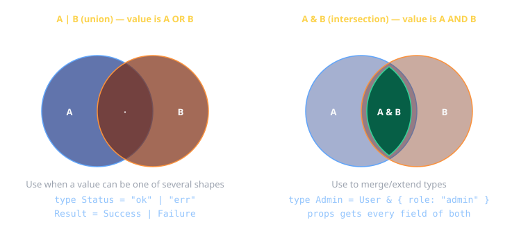
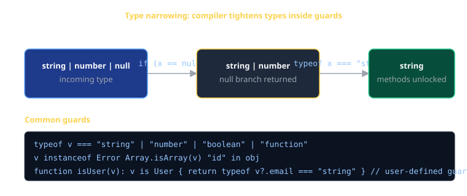
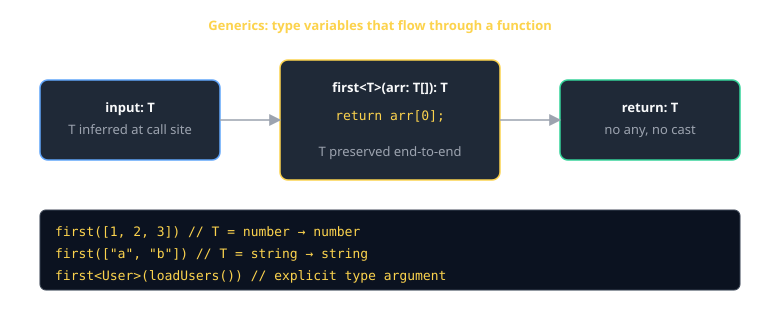

# TypeScript Cheat Sheet (80/20)

TypeScript is JavaScript with a static type system bolted on. The 20% you need on day one: primitives, objects, arrays, unions, generics, narrowing. Skip decorators, namespaces, and conditional types — you'll meet them when you need them.

## Primitives

```ts
const name:    string  = "Ada";
const age:     number  = 36;
const alive:   boolean = true;
const nothing: null    = null;
const missing: undefined = undefined;

// Almost always, let TS infer:
const inferred = "Ada";   // type: string
```

> **Don't write the type when inference works.** `const x: number = 1` is noisy; `const x = 1` says the same thing.

## Arrays and tuples

```ts
const ids:  number[]      = [1, 2, 3];
const tags: Array<string> = ["a", "b"];          // identical, just different syntax

// Tuple — fixed length, fixed types per slot:
const point: [number, number] = [10, 20];
const result: [string, number] = ["status", 200];
```

## Objects, type aliases, interfaces

```ts
type User = {
  id:      number;
  name:    string;
  email:   string;
  bio?:    string;        // optional
  readonly createdAt: Date;
};

const u: User = { id: 1, name: "Ada", email: "ada@uvu.edu", createdAt: new Date() };
```

`interface` and `type` are 95% interchangeable for object shapes:

```ts
interface User { id: number; name: string; }
type      User2 = { id: number; name: string; };
```

**Pick one and stay consistent.** Common rule: `interface` for public/extendable shapes, `type` for unions and combinators. Both compile to nothing.

## Functions

```ts
// parameter types + return type:
function add(a: number, b: number): number {
  return a + b;
}

// arrow form:
const add = (a: number, b: number): number => a + b;

// optional & default params:
function greet(name: string, greeting = "Hello"): string {
  return `${greeting}, ${name}`;
}

// function type as a value:
type BinaryOp = (a: number, b: number) => number;
const sub: BinaryOp = (a, b) => a - b;
```

> Only annotate the **return type** when you want the compiler to enforce it (it's a contract). For internal helpers, let inference do the work.

## Union and intersection types



```ts
// Union (|) — value is one of these
type Status = "pending" | "ok" | "error";
type Id     = number | string;

// Intersection (&) — value is all of these
type Timestamps = { createdAt: Date; updatedAt: Date };
type User       = { id: number; name: string };
type Stamped    = User & Timestamps;     // has all five fields
```

**Discriminated unions** are how you model "could be A or could be B":

```ts
type Result<T> =
  | { ok: true;  value: T }
  | { ok: false; error: string };

function unwrap<T>(r: Result<T>): T {
  if (r.ok) return r.value;        // TS narrows to the success branch
  throw new Error(r.error);
}
```

## Type narrowing

The compiler tightens a type as you check it. This is the most important "feel" to develop in TypeScript.



```ts
function format(x: string | number | null): string {
  if (x == null) return "n/a";          // narrows: removes null
  if (typeof x === "number") return x.toFixed(2);  // narrows to number
  return x.toUpperCase();                // remaining: string
}

function area(s: Shape) {
  if (s.kind === "circle") return Math.PI * s.r ** 2;   // narrowed by tag
  return s.w * s.h;
}
type Shape = { kind: "circle"; r: number } | { kind: "rect"; w: number; h: number };
```

### Common guards

```ts
typeof v === "string" | "number" | "boolean" | "function" | "object" | "undefined"
v instanceof Error
Array.isArray(v)
"id" in obj                              // does the property exist?

// User-defined guard:
function isUser(v: unknown): v is User {
  return typeof v === "object" && v !== null && "email" in v;
}
```

## Generics

A generic function takes types as well as values. The type variable flows through.



```ts
function first<T>(arr: T[]): T | undefined {
  return arr[0];
}

const n = first([1, 2, 3]);    // T inferred as number → n: number | undefined
const s = first(["a", "b"]);   // T inferred as string → s: string | undefined
```

Reach for generics when you'd otherwise reach for `any`:

```ts
async function getJSON<T>(url: string): Promise<T> {
  const res = await fetch(url);
  return res.json() as Promise<T>;
}

const user = await getJSON<User>("/api/me");   // user: User
```

### Generic constraints

```ts
function pluck<T, K extends keyof T>(items: T[], key: K): T[K][] {
  return items.map((item) => item[key]);
}
pluck([{ id: 1 }, { id: 2 }], "id");   // number[]
```

## Utility types — the ones you'll actually use

| Utility            | Does                                              |
|--------------------|---------------------------------------------------|
| `Partial<T>`       | makes all fields optional (`PATCH` payloads)      |
| `Required<T>`      | makes all fields required                         |
| `Readonly<T>`      | makes all fields readonly                         |
| `Pick<T, K>`       | keep just keys K                                  |
| `Omit<T, K>`       | drop keys K                                       |
| `Record<K, V>`     | dictionary type `{ [k in K]: V }`                 |
| `ReturnType<F>`    | extract the return type of a function type        |
| `Awaited<P>`       | unwrap a `Promise<T>` to `T`                      |

```ts
type DraftUser  = Partial<User>;             // { id?, name?, email?, … }
type PublicUser = Omit<User, "email">;        // hide email
type Roles      = Record<string, "admin" | "viewer">;
type LookupRet  = ReturnType<typeof lookup>;  // Promise<LookupAddress>
```

## Classes (when you need them)

```ts
class Counter {
  private count = 0;                     // class field with default

  constructor(public readonly name: string) {}   // shorthand for "this.name = name"

  inc(): void { this.count++; }
  get value(): number { return this.count; }
}

const c = new Counter("clicks");
c.inc();
console.log(c.name, c.value);   // "clicks" 1
```

| Modifier   | Effect                                |
|------------|---------------------------------------|
| `public`   | default; accessible everywhere        |
| `private`  | only inside this class                |
| `protected`| this class + subclasses               |
| `readonly` | can't be reassigned after constructor |
| `static`   | on the class, not instances           |

> Classes are great for stateful things (a `Counter`, a `Pool`, a `Logger`). For simple data shapes, prefer plain objects + `type`.

## Enums — usually a string union is better

```ts
// Old:
enum Role { Admin = "admin", Viewer = "viewer" }
// Better, simpler, zero runtime cost:
type Role = "admin" | "viewer";
```

`as const` is the modern way to get a constant lookup:

```ts
const Role = { Admin: "admin", Viewer: "viewer" } as const;
type Role = typeof Role[keyof typeof Role];   // "admin" | "viewer"
```

## any vs unknown vs never

| Type      | Meaning                                    | When to use                                       |
|-----------|--------------------------------------------|---------------------------------------------------|
| `any`     | turns off type checking on this value      | last resort; you've lost the war                  |
| `unknown` | "I don't know yet — narrow before using"   | API boundaries, JSON, third-party data            |
| `never`   | the type that can't exist                  | exhaustive checks, functions that throw / loop forever |

```ts
function exhaustive(x: never): never { throw new Error(`unhandled: ${x}`); }

function area(s: Shape): number {
  switch (s.kind) {
    case "circle": return Math.PI * s.r ** 2;
    case "rect":   return s.w * s.h;
    default:       return exhaustive(s);   // compile error if you add a Shape and forget a case
  }
}
```

## async / await + types

```ts
async function loadUser(id: number): Promise<User> {
  const res = await fetch(`/api/users/${id}`);
  if (!res.ok) throw new Error(`HTTP ${res.status}`);
  return (await res.json()) as User;        // assertion at the boundary; trust the API contract
}

const user: User = await loadUser(42);
```

> Validate at the boundary if it matters (e.g. with [Zod](https://zod.dev)). Inside your codebase, types are guarantees; at the network edge they're hopes.

## tsconfig — the flags that earn their keep

```jsonc
{
  "compilerOptions": {
    "target": "ES2022",
    "module": "NodeNext",
    "moduleResolution": "NodeNext",
    "strict": true,                     // turn on every strict-mode check
    "noUncheckedIndexedAccess": true,   // arr[i] is T | undefined (catches OOB bugs)
    "noImplicitOverride": true,         // require `override` keyword in subclasses
    "esModuleInterop": true,
    "skipLibCheck": true,
    "outDir": "dist",
    "rootDir": "src"
  }
}
```

`strict: true` is non-negotiable. The whole point of TypeScript evaporates without it.

## Common gotchas

- **`any` defeats the type system silently.** If you must escape, use `unknown` and narrow.
- **`{}` doesn't mean "empty object"** — it means "anything except null/undefined." Use `Record<string, never>` or `object` if you really need empty.
- **`==` vs `===`**: TS doesn't fix this. Use `===` always; `== null` is the one allowed exception (matches both `null` and `undefined`).
- **`.json()` returns `Promise<any>`.** Cast or validate at the call site.
- **Don't trust array index access.** Without `noUncheckedIndexedAccess`, `arr[0]` is typed `T` even when the array is empty. Turn the flag on.
- **`as` is an assertion, not a check.** `data as User` lies if `data` isn't a User. The compiler trusts you. Be worthy of that trust.

## When you're stuck

- [TypeScript handbook](https://www.typescriptlang.org/docs/handbook/intro.html)
- [Type Challenges](https://github.com/type-challenges/type-challenges) — when you want to actually learn the type system.
- The TypeScript Playground — paste code, hover identifiers, see the inferred types.
