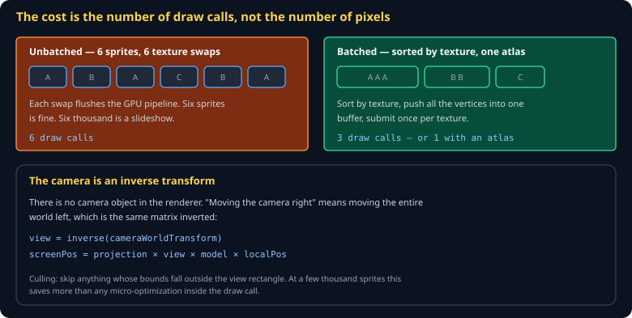
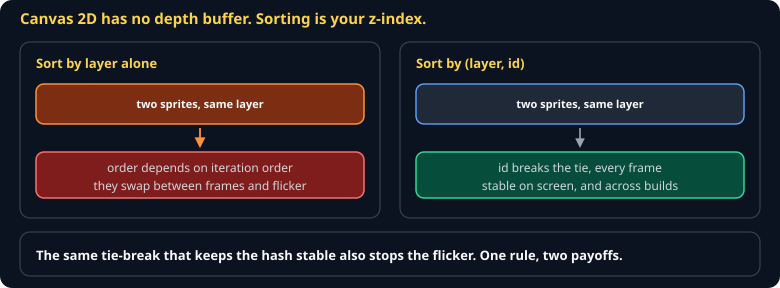

# 2D Rendering Cheat Sheet (80/20)

Sprites, atlases, cameras, and batching — the parts that determine whether your game runs at 60fps or 6. Covers both the Canvas 2D path and the WebGL sprite-batch path; skips signed distance fields, custom blend modes, and 2D lighting.

Companion to [`scene-graph-transforms`](scene-graph-transforms.md). Specified in `spec/S09-renderer-2d.md`.



## Start with Canvas 2D

For Tier 1 you do not need WebGL. Canvas 2D handles thousands of sprites and the API is four calls:

```js
ctx.save();
ctx.translate(x, y);
ctx.rotate(rot);
ctx.drawImage(atlas, sx, sy, sw, sh, -w / 2, -h / 2, w, h);
ctx.restore();
```

`drawImage` with nine arguments is the one that matters: source rectangle from the atlas, destination rectangle on screen. Drawing from `-w/2, -h/2` puts the sprite's origin at its centre, which is almost always what you want for rotation.

## The atlas

One image containing every sprite, plus a table of rectangles:

```json
{ "player_idle": { "x": 0,  "y": 0, "w": 32, "h": 32 },
  "player_run":  { "x": 32, "y": 0, "w": 32, "h": 32 } }
```

Why bother: a texture swap flushes the GPU pipeline. One atlas means one texture, which means the whole frame can be one batch. It also means one network request instead of two hundred.

> **Leave a transparent pixel of padding between atlas entries.** Without it, bilinear filtering samples the neighbouring sprite and you get a one-pixel fringe of the wrong colour — the classic "why is there a line on my sprite" bug.

## The camera

There is no camera in the renderer. Moving the camera right means moving the world left:

```js
ctx.save();
ctx.translate(canvas.width / 2, canvas.height / 2);   // screen centre
ctx.scale(zoom, zoom);
ctx.translate(-camera.x, -camera.y);                  // inverse of camera position
drawWorld();
ctx.restore();
```

Order matters and reads backwards: the last translate applies first.

## Culling

Skip anything off screen. At a few thousand sprites this is worth more than every micro-optimization inside the draw loop combined:

```js
const halfW = canvas.width / (2 * zoom), halfH = canvas.height / (2 * zoom);
if (Math.abs(s.x - camera.x) > halfW + s.w || Math.abs(s.y - camera.y) > halfH + s.h) continue;
```

## Draw order



Canvas 2D has no depth buffer — later draws land on top. So order is your z-index:

```js
sprites.sort((a, b) => a.layer - b.layer || a.y - b.y || a.id - b.id);
```

The `a.id` tie-break is not decoration. Without it, two sprites on the same layer and row can swap order between frames and flicker — and, in this course, two implementations can disagree.

## Moving to WebGL

When Canvas 2D stops keeping up, the change is: build one vertex buffer per texture, upload once, draw once. The sorting and culling above are unchanged — which is why doing them properly now costs nothing later.

## Common gotchas

- **Texture bleeding** — pad your atlas.
- **Blurry pixel art** — set `ctx.imageSmoothingEnabled = false` and use integer positions.
- **Sprites drawn from the top-left when rotating** — they orbit their corner. Offset by half.
- **Rebuilding the sort array every frame** — sort in place into a reused array.
- **Interpolating in the simulation instead of the renderer** — the sim runs at 20Hz and must not care that you draw at 144.
- **Loading images synchronously** — `Image.onload` is async. Draw nothing until the atlas is decoded, or you get silent blanks.

## When you're stuck

- [MDN Canvas API](https://developer.mozilla.org/en-US/docs/Web/API/Canvas_API) — the reference for the 2D path
- `spec/S09-renderer-2d.md` — the class specification
- Chrome DevTools performance panel: if `drawImage` dominates, batch. If the sort dominates, cull first.
