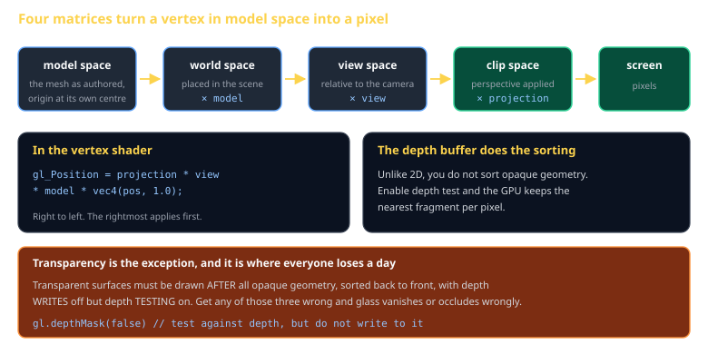

# 3D Rendering with WebGL2 Cheat Sheet (80/20)

The pipeline, the four matrices, the depth buffer, and the transparency rule — enough to put a lit, textured mesh on screen and understand why it looks wrong when it does. Skips deferred rendering, shadow maps, and PBR.

Companion to [`scene-graph-transforms`](scene-graph-transforms.md) and [`shaders-and-materials`](shaders-and-materials.md). Specified in `spec/S10-renderer-3d.md`.



## The four matrices

Every vertex takes the same journey, and the whole of 3D positioning is this line:

```glsl
gl_Position = projection * view * model * vec4(position, 1.0);
```

Right to left: `model` places the mesh in the world, `view` re-expresses the world relative to the camera, `projection` applies perspective.

| Matrix | Built from |
|---|---|
| `model` | the node's world transform — see the scene graph sheet |
| `view` | `inverse(cameraWorldTransform)` |
| `projection` | field of view, aspect ratio, near and far planes |

## Perspective

```js
export function perspective(fovYRadians, aspect, near, far) {
  const f = 1 / Math.tan(fovYRadians / 2);
  return [
    f / aspect, 0, 0,                              0,
    0,          f, 0,                              0,
    0,          0, (far + near) / (near - far),   -1,
    0,          0, (2 * far * near) / (near - far), 0,
  ];
}
```

> **`near` is the most consequential number here.** Setting it to `0.001` "just in case" destroys depth precision and produces z-fighting across the whole scene. Push it as far out as your closest visible geometry allows — `0.1` is usually right.

## The minimum draw

```js
const gl = canvas.getContext('webgl2');
gl.enable(gl.DEPTH_TEST);
gl.enable(gl.CULL_FACE);          // skip back-facing triangles: free 50%

const vao = gl.createVertexArray();
gl.bindVertexArray(vao);
gl.bindBuffer(gl.ARRAY_BUFFER, positionBuffer);
gl.enableVertexAttribArray(loc);
gl.vertexAttribPointer(loc, 3, gl.FLOAT, false, 0, 0);

gl.useProgram(program);
gl.uniformMatrix4fv(uMvp, false, mvp);
gl.drawElements(gl.TRIANGLES, indexCount, gl.UNSIGNED_SHORT, 0);
```

Vertex Array Objects are the WebGL2 feature worth using immediately — they capture all the attribute wiring so a draw is bind-and-go.

## Depth, and the transparency exception

Opaque geometry needs no sorting: enable the depth test and the GPU keeps the nearest fragment.

Transparency is where the day goes. Three things must all be true:

1. Draw **after** all opaque geometry
2. Sort **back to front**
3. Depth **writes off**, depth **testing on** — `gl.depthMask(false)`

Miss the third and transparent surfaces occlude each other as though they were solid.

## Culling

Back-face culling is free and removes half your triangles. Frustum culling — skipping meshes entirely outside the view — is the one that scales:

```js
// sphere-vs-frustum, the cheap version
for (const plane of frustumPlanes)
  if (dot(plane.normal, mesh.center) + plane.d < -mesh.radius) return false;   // outside
```

## glTF

Use `.glb` — the binary form, one file, no sidecar dependencies. It carries meshes, materials, and transforms in the layout WebGL wants. Do not write your own format; you will spend the term on it.

## Common gotchas

- **Nothing renders, no error.** Ninety percent of the time: no depth test, backwards winding, or a `near`/`far` that excludes your geometry. Try clearing to magenta to confirm you are drawing at all.
- **Z-fighting** — `near` is too small. See above.
- **The model is inside out** — winding order. Try `gl.frontFace(gl.CW)`.
- **Transposed matrices.** WebGL expects column-major. Passing a row-major matrix produces a scene that is *almost* right, which is much harder to debug than nothing.
- **Uniforms set before `useProgram`** — silently ignored.
- **A new buffer per frame** — allocate once, update with `bufferSubData`.

## When you're stuck

- [WebGL2 Fundamentals](https://webgl2fundamentals.org/) — the best available tutorial series
- `spec/S10-renderer-3d.md` — the class specification
- Spector.js or the browser's WebGL inspector: capture one frame and read the actual draw calls. Guessing at GL state is how days disappear.
