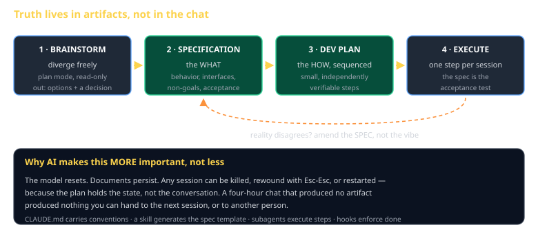

# AI SDLC / Spec-Driven Development Cheat Sheet (80/20)

Brainstorm → Specification → Dev Plan → Execute. The four-stage pipeline that keeps agent work from evaporating, and the one rule that makes it hold.

Companion to [`writing-a-spec-agents-can-build`](writing-a-spec-agents-can-build.md) and [`cc-the-11-pillars`](cc-the-11-pillars.md).

## The problem it solves

You have a four-hour conversation with an agent. It goes well. Then the session ends, the context is gone, and what you have is a pile of code nobody — including you — can explain the reasoning behind.

> **The model resets. Documents persist.**

Spec-driven development is not bureaucracy imported from 2005. It is the specific adaptation that makes agent work *resumable*: any session can be killed, rewound, or restarted, because the plan holds the state rather than the chat.

## The four stages

### 1 · Brainstorm — diverge

Explore options. Use plan mode so it cannot edit anything. A cheap model is fine here.

**Output:** two or three approaches with trade-offs, and a written decision saying which and why. The "why" is the part you will want in six weeks.

### 2 · Specification — converge on the WHAT

Behavior, interfaces, non-goals, acceptance criteria. The document you would hand a contractor who will never speak to you.

**Non-goals matter as much as goals.** "This does not handle multiplayer" prevents an agent from helpfully building multiplayer.

### 3 · Dev Plan — sequence the HOW

Break the spec into steps that are small, ordered, and **independently verifiable**. The test of a good step: could one agent, in one session, with no other context, complete it and know it succeeded?

### 4 · Execute — one step per session

Run each step in a fresh session or subagent. The spec is the acceptance test.

## The rule that makes it work

> **Reality disagrees? Amend the spec, not the vibe.**

You will hit something the spec did not anticipate. The tempting move is to "just handle it" in the code and move on. Do not. Update the spec, then update the code — otherwise the spec becomes fiction, and the next session builds against fiction.

This is the same discipline the engine spec track grades you on. A specification that drifts from what was built is worse than none, because it is confidently wrong.

## Which pillar does what

| Stage | Pillars that carry it |
|---|---|
| Brainstorm | plan mode · a cheap model · subagents fanning out |
| Specification | a **skill** that generates your spec template |
| Dev Plan | the same skill, or a subagent |
| Execute | one **subagent** per step · **hooks** enforcing the definition of done |
| Throughout | **CLAUDE.md** carrying conventions so every session starts informed |

## Scaling it down

Not every task needs four documents. Match the ceremony to the work:

| Task | Process |
|---|---|
| "Can we even do X?" | A spike. Two sentences of intent, then find out. Throw the code away. |
| A small change to code that exists | Questions, a short design in chat, then build. No documents. |
| A new subsystem or project | The full pipeline. |

The failure mode in both directions is real: ceremony on a one-line fix wastes an hour, and no ceremony on a subsystem wastes a week.

## Common gotchas

- **A spec that is really an implementation.** If it names variables and functions, you wrote code with prose around it.
- **Plan steps that are not verifiable.** "Improve error handling" cannot be checked. "Every provider failure surfaces a visible message" can.
- **Executing from the chat instead of the plan.** The moment you improvise a step, the plan stops describing what was built.
- **Never amending.** A spec that was right at the start and never touched is a spec nobody read.
- **Brainstorming with write access.** Plan mode exists so exploration cannot quietly become implementation.

## When you're stuck

- `docs/superpowers/specs/` and `docs/superpowers/plans/` in this course's repos — real examples of both, including their mistakes
- [`writing-a-spec-agents-can-build`](writing-a-spec-agents-can-build.md) — the specification stage in detail
- If a plan step feels too big to verify, it is. Split it until each one ends in something you can check.
