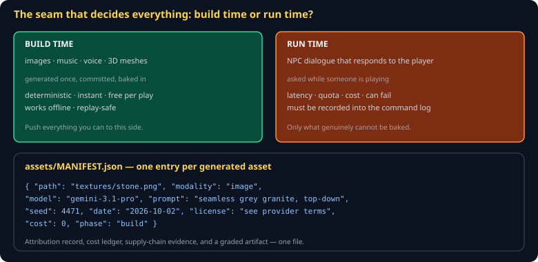

# Asset Pipeline and Provenance Cheat Sheet (80/20)

Where generated assets come from, where they get baked, and the manifest that records it. The manifest is graded, so this sheet is also the spec for that deliverable.

Companion to [`procedural-generation`](procedural-generation.md) and [`local-llm-in-games`](local-llm-in-games.md). Specified in `spec/S08-asset-handles.md`.



## The seam

> **Everything you can generate at build time, generate at build time.**

| | Build time | Run time |
|---|---|---|
| What | images, music, voice, meshes | dialogue that responds to the player |
| Cost per play | zero | latency, quota, money |
| Deterministic | yes | no — must be recorded |
| Works offline | yes | no |

Build-time generation is committed as bytes. It cannot fail during a demo, it costs nothing on the hundredth playthrough, and it never desyncs. Run-time generation is for the one thing that genuinely cannot be baked: an NPC responding to something the player just did.

This seam is also where the economics land — build-time text generation is covered by a Claude Pro subscription via `claude -p`; runtime calls from a shipped game are not.

## The manifest

`assets/MANIFEST.json`, one entry per generated asset:

```json
{
  "assets": [
    { "path": "textures/stone.png",
      "modality": "image",
      "model": "gemini-3.1-pro",
      "prompt": "seamless grey granite texture, top-down, tileable",
      "seed": 4471,
      "date": "2026-10-02",
      "license": "see provider terms",
      "cost": 0,
      "phase": "build" },

    { "path": "audio/vo/guard_greeting.wav",
      "modality": "speech",
      "model": "kokoro-82m",
      "prompt": "The gate is sealed.",
      "voice": "am_adam",
      "date": "2026-10-04",
      "license": "Apache-2.0",
      "cost": 0,
      "phase": "build" }
  ]
}
```

It is four things at once — which is why it is worth the discipline:

1. **Attribution.** What made this, and from what prompt.
2. **Cost ledger.** What the project actually spent.
3. **Supply-chain record.** Which models and licenses you depend on.
4. **A graded artifact.** It is greppable, so it is checkable.

## Formats

| Kind | Use | Not |
|---|---|---|
| Textures | PNG for sprites and pixel art; WebP for photographic | BMP, TIFF |
| Meshes | **`.glb`** — binary glTF, one file | OBJ, FBX, a custom format |
| Audio | OGG for music, WAV for short effects | MP3 |
| Data | JSON | YAML at runtime — an extra parser for no benefit |

Use `.glb` and do not write your own mesh format. Writing one will consume the term.

## Handles, not paths

Load once, reference by id:

```js
export class Assets {
  #cache = new Map();
  async load(id, url, decode) {
    if (this.#cache.has(id)) return this.#cache.get(id);
    const asset = await decode(await fetch(url));
    this.#cache.set(id, asset);
    return asset;
  }
  get(id) {
    const a = this.#cache.get(id);
    if (!a) throw new Error(`asset not loaded: ${id}`);   // loud, not undefined
    return a;
  }
}
```

Throwing on a missing asset beats returning `undefined` — an undefined texture becomes a black square three subsystems away from the actual mistake.

## The simulation must not touch assets

The sim knows an entity has `spriteId: 'guard'`. It has no idea what that looks like, how big the file is, or whether it has loaded. If your simulation reads an image's dimensions, the seam has leaked and your headless conformance runs will fail.

## Licensing, briefly

Record the license in the manifest even when the answer is "coursework use." Model output licensing is genuinely unsettled and varies by provider — some open weights are Apache-2.0, some are non-commercial. Writing it down costs a line and means you can answer the question later.

## Common gotchas

- **Committing 400MB of generated video.** Git is not a CDN. Generate small, or keep large media out of the repo.
- **A manifest written at the end.** Nobody remembers October's prompt in December. Add the entry when you add the asset.
- **Run-time generation for things that could be baked.** Latency and quota for no benefit.
- **Silent asset failures.** A missing texture should throw, not render black.
- **Assets loaded during a tick.** Async inside the simulation breaks determinism. Load first, then run.
- **No fallback.** Every generated asset needs a procedural or authored stand-in — a conformance vector checks this.

## When you're stuck

- `spec/S08-asset-handles.md` — the class specification
- [glTF overview](https://www.khronos.org/gltf/) — for the `.glb` format
- If a texture is black, check the manifest first. It is usually a path that was renamed and a load that failed quietly.
