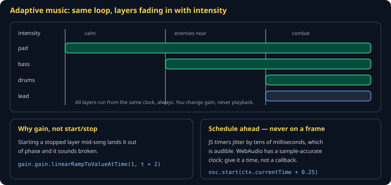

# Audio and Procedural Music Cheat Sheet (80/20)

Web Audio in the parts a game needs: playing a sound without allocating garbage, scheduling accurately enough that music does not stutter, and layering a score that responds to what is happening. Skips convolution reverb, spatial audio, and worklets.

Companion to [`game-feel-and-juice`](game-feel-and-juice.md). Specified in `spec/S18-audio.md`.



## Two rules that prevent most audio bugs

**1 · The context starts suspended.** Browsers require a user gesture:

```js
const ctx = new AudioContext();
document.addEventListener('pointerdown', () => ctx.resume(), { once: true });
```

Silent audio that "works on my machine" is almost always this.

**2 · Schedule ahead, never on a frame.** `setTimeout` jitters by tens of milliseconds and that is audible. WebAudio has a sample-accurate clock — give it a *time*:

```js
osc.start(ctx.currentTime + 0.25);      // exact
// NOT: setTimeout(() => osc.start(), 250)
```

## Playing a sound effect

```js
export function play(ctx, buffer, { volume = 1, pitchVariance = 0.1 } = {}) {
  const src = ctx.createBufferSource();
  src.buffer = buffer;
  src.playbackRate.value = 1 + (Math.random() * 2 - 1) * pitchVariance;
  const gain = ctx.createGain();
  gain.gain.value = volume;
  src.connect(gain).connect(ctx.destination);
  src.start();
  return src;
}
```

`AudioBufferSourceNode` is single-use — create one per playback. It is cheap and self-cleaning, so this is not the allocation to worry about.

**Vary the pitch ±10%.** A repeated sound at identical pitch turns into a machine gun within three shots, and players hear it as a bug.

> **Use `Math.random()` here, not the simulation's RNG.** Audio is presentation. Drawing from the sim's generator makes the simulation depend on how many sounds played, which depends on frame rate.

## Adaptive music

The cheapest technique that sounds professional: several layers of one loop, all playing from the start, with gain fading in and out.

```js
export function setIntensity(layers, intensity, ctx, rampSeconds = 2) {
  for (const [threshold, gainNode] of layers) {
    const target = intensity >= threshold ? 1 : 0;
    gainNode.gain.linearRampToValueAtTime(target, ctx.currentTime + rampSeconds);
  }
}
```

**Change gain, never playback.** Starting a stopped layer mid-song lands it out of phase and sounds broken. All layers run always; only their volume changes.

## Procedural music

Free, tiny, deterministic, and squarely on the procedural-generation requirement. A pentatonic scale is the trick — every note sounds acceptable against every other, so random selection cannot produce a wrong note:

```js
const PENTATONIC = [0, 2, 4, 7, 9];           // semitone offsets
const freq = (root, degree) => root * Math.pow(2, PENTATONIC[degree % 5] / 12);

export function note(ctx, root, degree, at, duration = 0.4) {
  const osc = ctx.createOscillator();
  const gain = ctx.createGain();
  osc.type = 'triangle';
  osc.frequency.value = freq(root, degree);
  gain.gain.setValueAtTime(0, at);
  gain.gain.linearRampToValueAtTime(0.2, at + 0.02);        // attack
  gain.gain.exponentialRampToValueAtTime(0.001, at + duration);   // decay
  osc.connect(gain).connect(ctx.destination);
  osc.start(at);
  osc.stop(at + duration);
}
```

The envelope is what separates "music" from "a beep." Never start or stop a gain at exactly zero with `exponentialRampToValueAtTime` — it throws.

## The lookahead scheduler

Schedule a little ahead of the clock, on a slow timer:

```js
setInterval(() => {
  while (nextNoteTime < ctx.currentTime + 0.2) {     // 200ms lookahead
    note(ctx, root, sequence[step % sequence.length], nextNoteTime);
    nextNoteTime += beatDuration;
    step++;
  }
}, 50);
```

The timer being imprecise no longer matters — it only has to run *often enough*, because the notes themselves are scheduled precisely.

## Common gotchas

- **Context suspended.** Silence, no error.
- **`setTimeout` for note timing.** Audible jitter.
- **No pitch variance.** Machine-gun effect.
- **Music layers started and stopped.** Phase drift.
- **Simulation RNG for audio.** Frame rate changes the game.
- **`exponentialRampToValueAtTime(0, …)`.** Throws — ramp to `0.001`.

## When you're stuck

- [A Tale of Two Clocks](https://web.dev/articles/audio-scheduling) — the canonical article on lookahead scheduling
- [MDN Web Audio API](https://developer.mozilla.org/en-US/docs/Web/API/Web_Audio_API)
- If audio is silent, check `ctx.state` first. It is `"suspended"` more often than not.
