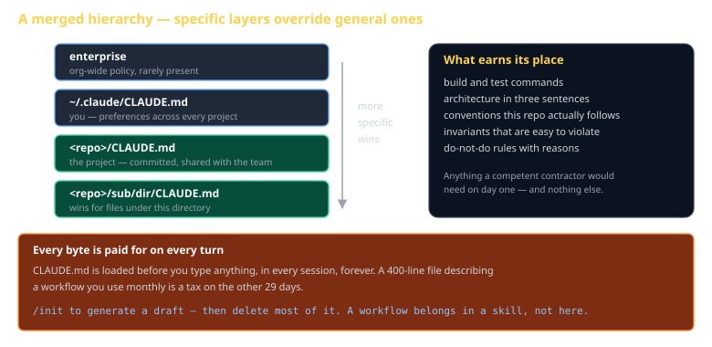
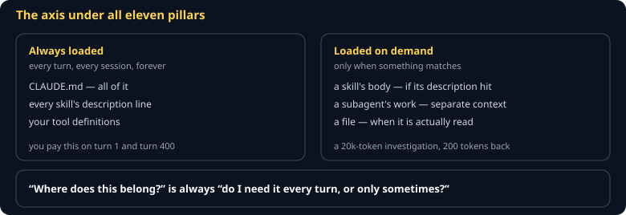
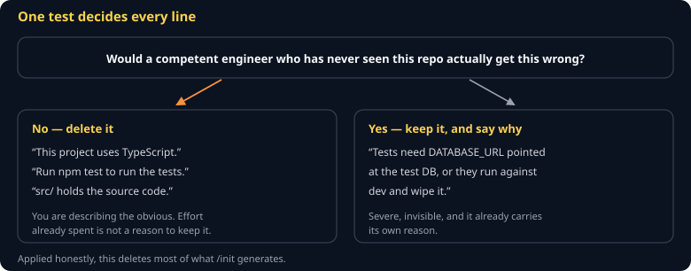
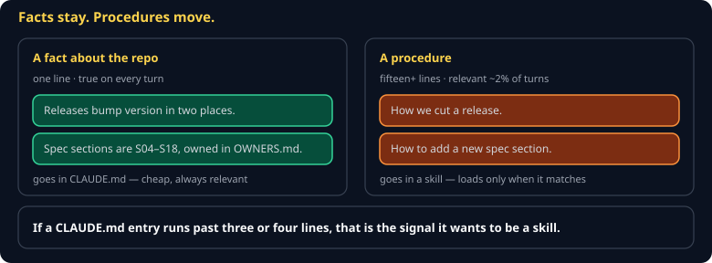
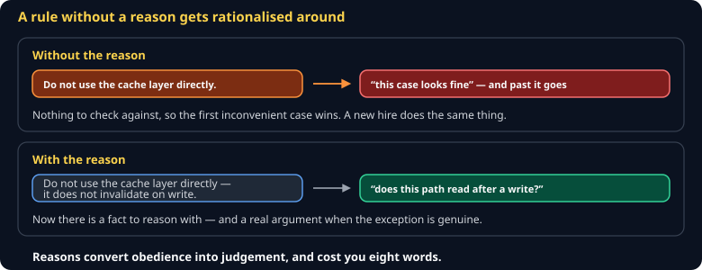

# CLAUDE.md Cheat Sheet (80/20)

Pillar 1. What to put in the file that is loaded before every single turn — and, more importantly, what to keep out of it.

Companion to [`cc-the-11-pillars`](cc-the-11-pillars.md) and [`cc-skills`](cc-skills.md).



## The mental model



> **CLAUDE.md is the day-one briefing you would give a competent contractor.**

They are a good engineer. They know the language. They do not know *your* repo: which of three test commands is real, that `sim/` must never import the renderer, that the deploy script has to run from the repo root. Write that down. Write nothing else down.

## The hierarchy

Layers merge, with the more specific one winning:

```
enterprise policy       (rare)
~/.claude/CLAUDE.md     you, across all projects
<repo>/CLAUDE.md        the project, committed
<repo>/sub/CLAUDE.md    wins for files under sub/
```

A subdirectory file is the right tool when one corner of a repo has genuinely different rules — a `sim/` tree with an import ban, say.

## What earns its place



```markdown
# CLAUDE.md

## What this is
A browser game engine. `src/sim/` is pure simulation; `src/render/` draws it.

## Commands
npm test          # vitest
npm run typecheck # tsc --noEmit

## Invariants
- `src/sim/**` must never import from `src/render/**`. A test enforces this.
- The simulation is deterministic: no `Math.random()`, no `Date.now()`.
- Quantize before hashing, rounding half away from zero.

## Conventions
- Zero runtime dependencies. Dev dependencies are fine.
- Commit subject finishes "applying this commit will…"
```

That is roughly the right size. Notice what is absent: no tutorial, no explanation of what TypeScript is, no workflow.

## What to keep out



| Do not put here | Put it here instead |
|---|---|
| A multi-step workflow | A **skill** — loads only when it fires |
| Generic best practices | Nowhere. The model knows them. |
| A copy of the README | Link to it, or use `@README.md` |
| A rule that must be enforced | A **hook** — a request is not a guarantee |
| Long code examples | The codebase, which it can read |

> **Every byte is paid for on every turn.** A 400-line CLAUDE.md describing a workflow you use once a month taxes the other 29 days. `/init` generates a draft; your job is to delete most of it.

## Imports

`@path/to/file.md` pulls another document into context deliberately:

```markdown
Architecture details: @docs/architecture.md
```

Useful, and easy to abuse — an import chain that drags in 3,000 lines has the same cost as writing them inline.

## Testing that it works



The only real test is behavioral:

1. Write the file.
2. Start a **new** session.
3. Ask for something that needs the knowledge — "run the tests."
4. Watch whether it uses the right command **without being told**.

If it guesses wrong, the file did not say what you thought it said. This is the same skill you are learning in the spec track: prose that seems unambiguous to its author frequently is not.

## Common gotchas

- **Never restarting the session.** Edits do not apply to a running one.
- **Documenting aspiration instead of reality.** "We use TDD" when the repo has four tests teaches the model to trust a file that lies.
- **Rules with no reason.** "Never use `any`" gets abandoned under pressure. "Never use `any` — it disables the checks that catch the bug class in `parseVector`" survives.
- **Letting it rot.** A CLAUDE.md describing last quarter's architecture is worse than none.
- **Secrets.** It is committed. Obviously.

## When you're stuck

- Run `/init` in a fresh repo and read what it generates — a useful baseline
- [Claude Code memory docs](https://code.claude.com/docs) — precedence and import rules
- The best test remains: new session, ask for something specific, see whether it already knew.
