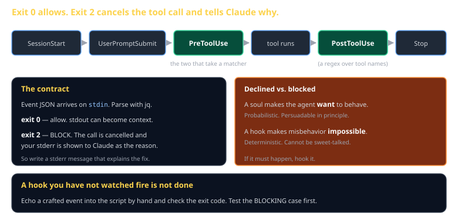

# Hooks Cheat Sheet (80/20)

Pillar 7, and the only pillar that is deterministic. Shell scripts that run on lifecycle events, the exit code that cancels a tool call, and how to test one properly.

Companion to [`cc-the-11-pillars`](cc-the-11-pillars.md) and [`soul-sovereign-council`](soul-sovereign-council.md).



## Why hooks exist

Everything else in Claude Code is a request to a model. A model can be persuaded, confused, or simply have a bad turn.

> **A hook runs every time, whether the model feels like it or not.** That determinism is the entire point.

## The contract

Event JSON on stdin. Exit code decides what happens:

| Exit | Effect |
|---|---|
| `0` | Allow. Anything on stdout can become context. |
| `2` | **Block.** The tool call is cancelled and your **stderr** is shown to Claude as the reason. |

Because stderr becomes the explanation, write it for a reader who needs to know what to do instead — not just that they were stopped.

## The events

`SessionStart` · `UserPromptSubmit` · **`PreToolUse`** · **`PostToolUse`** · `Stop`

The two workhorses are `PreToolUse` and `PostToolUse`, and they are the only ones that take a **matcher** — a regex over tool names like `Edit|Write` or `Bash`.

## A guard

```bash
#!/usr/bin/env bash
# PreToolUse, matcher: Edit|Write
set -euo pipefail

event="$(cat)"
tool="$(printf '%s' "$event" | jq -r '.tool_name // empty')"
path="$(printf '%s' "$event" | jq -r '.tool_input.file_path // empty')"

case "$tool" in Edit|Write) ;; *) exit 0 ;; esac

if [[ "$path" == conformance/* || "$path" == spec/* ]]; then
  cat >&2 <<MSG
BLOCKED: $path

spec/ and conformance/ are read-only here. An engine that can edit the tests
it is measured against is grading its own work. Write to out/ instead.
MSG
  exit 2
fi
exit 0
```

## Registering it

`.claude/settings.json`:

```json
{
  "hooks": {
    "PreToolUse": [
      { "matcher": "Edit|Write",
        "hooks": [{ "type": "command",
                    "command": "$CLAUDE_PROJECT_DIR/.claude/hooks/guard.sh" }] }
    ]
  }
}
```

`$CLAUDE_PROJECT_DIR` keeps it portable — an absolute path works on your machine and nobody else's.

## Testing it

> **A hook you have not watched fire is not done.**

```bash
echo '{"tool_name":"Write","tool_input":{"file_path":"spec/S01.md"}}' \
  | bash .claude/hooks/guard.sh; echo "EXIT=$?"     # expect 2

echo '{"tool_name":"Write","tool_input":{"file_path":"out/engine.ts"}}' \
  | bash .claude/hooks/guard.sh; echo "EXIT=$?"     # expect 0
```

**Test the blocking case first.** A guard only ever observed to allow has not been shown to guard — and a hook with a typo in its path check silently permits everything while looking installed.

## What belongs in a hook

| Good fit | Wrong tool |
|---|---|
| Format on every edit | "Please format" in CLAUDE.md |
| Block force-push and secrets | Hoping the model notices |
| Run tests before finishing | A checklist nobody reads |
| Protect files from an agent | Asking it nicely |

If it must happen, hook it. If it is a judgment call, give it a soul.

## Common gotchas

- **Exiting 1 instead of 2.** Only `2` blocks. `1` is a hook error and the call proceeds.
- **Forgetting the tool-name check.** Your `Edit` guard also fires on `Read`, and reading was never the risk.
- **Slow hooks.** They run on every matching call. Keep them under a few hundred milliseconds.
- **Absolute paths in settings.** Use `$CLAUDE_PROJECT_DIR`.
- **A stderr message that only says "blocked."** Claude gets that text and needs to know what to do instead.
- **No `set -euo pipefail`.** A failing `jq` silently produces an empty string, and your guard allows everything.

## When you're stuck

- [Claude Code hooks docs](https://code.claude.com/docs)
- `jq -r '.'` on a captured event to see the exact JSON shape for the event you are handling
- If a hook seems not to run, check the matcher first — a regex that does not match is silent, not an error.
