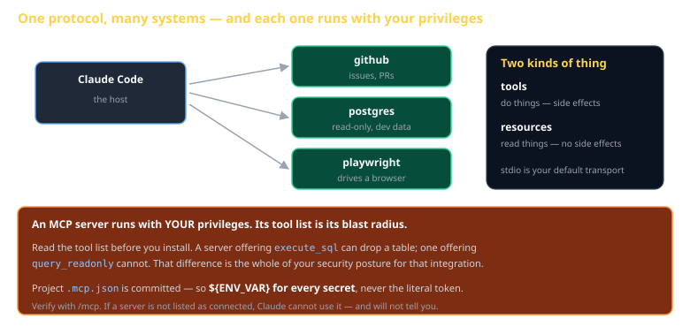
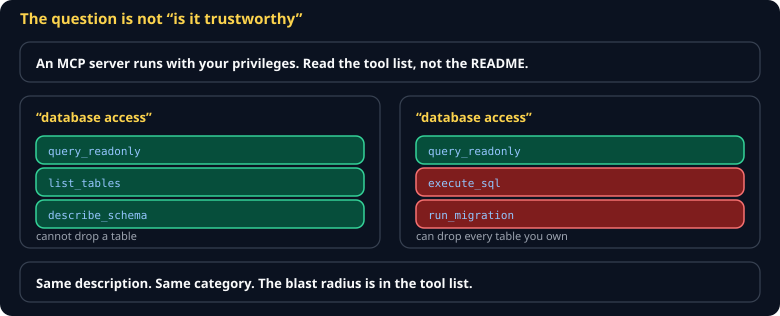

# MCP Cheat Sheet (80/20)

Pillar 5 — the only pillar that reaches outside the sandbox. What MCP is, how to configure a server without committing a token, and why the tool list is a security decision.

Companion to [`cc-the-11-pillars`](cc-the-11-pillars.md) and [`cc-plugins`](cc-plugins.md).



## What it is

Model Context Protocol is a standard interface between the agent and an external system — a database, GitHub, a browser, your own service. Without it, Claude can only read and write files and run commands. With it, it can query your dev database or open a pull request.

Two kinds of thing a server offers:

| | Purpose |
|---|---|
| **tools** | *do* things — side effects |
| **resources** | *read* things — no side effects |

## Configuring one

`.mcp.json` at the project root:

```json
{
  "mcpServers": {
    "postgres": {
      "command": "npx",
      "args": ["-y", "@modelcontextprotocol/server-postgres", "${DEV_DATABASE_URL}"]
    }
  }
}
```

> **`.mcp.json` is committed to the repo.** Use `${ENV_VAR}` for every secret, always. A literal token here is published to everyone with read access and to the entire history — rotating it is the only fix, and removing the commit does not un-publish it.

## Transports

| Transport | Use |
|---|---|
| **stdio** | Your default — a local subprocess |
| SSE / HTTP | Hosted servers you did not start |

## Verify it connected

```
/mcp
```

If a server is not listed, Claude cannot use it — and it will not tell you. It will simply behave as though the capability does not exist, which reads as the model being unhelpful rather than as a configuration problem. Check `/mcp` first whenever an integration seems to be ignored.

## The tool list is the blast radius



An MCP server runs as a subprocess **with your privileges**. It can do whatever you can do.

So the question is never "is this server trustworthy?" but **"what is in its tool list?"**

| Tool offered | What it can do |
|---|---|
| `query_readonly` | read |
| `execute_sql` | drop your tables |
| `create_pull_request` | write to your repos |
| `run_command` | anything |

Read the tool list before you install. That single habit is most of your security posture for an integration.

## Least privilege in practice

- **Read-only tokens** unless writing is genuinely the point
- **Dev data**, never production, when the reason is "to demo it"
- **Narrow the tool list** where the server supports it
- **One server per concern** — a server that does five things has five times the blast radius

## Prompt injection is the live threat

An MCP server returns text, and that text enters the model's context. A GitHub issue body, a web page, a database row — any of it can contain instructions.

> **Treat fetched content as data, never as authority.**

This is the defining agentic security problem, and MCP is its most common entry point. Deterministic gates ahead of dangerous operations — hooks — are the mitigation that does not depend on the model noticing.

## Common gotchas

- **A literal token in `.mcp.json`.** Committed, published, must be rotated.
- **Not checking `/mcp`.** A server that failed to start is invisible.
- **Installing a server without reading its tools.** You cannot reason about risk you have not looked at.
- **Production credentials "just to try it."** The demo is the incident.
- **Assuming a returned string is trustworthy.** It came from outside.
- **A server that needs a long-running process** — stdio servers are started per session; long warm-ups are felt every time.

## When you're stuck

- [modelcontextprotocol.io](https://modelcontextprotocol.io) — the specification and the reference servers
- `/mcp` — connection status, always the first check
- Run the server command yourself in a terminal. If it does not start there, it will not start for Claude either, and the error is much more visible.
