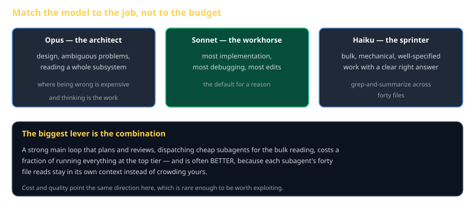

# Model Selection Cheat Sheet (80/20)

Pillar 8. Which model for which job, why the answer is usually a *combination*, and how to stop paying top-tier prices for mechanical work.

Companion to [`cc-the-11-pillars`](cc-the-11-pillars.md) and [`cc-subagents-and-archetypes`](cc-subagents-and-archetypes.md).

## The three tiers

| Tier | Reach for it when |
|---|---|
| **Opus** — architect | The problem is ambiguous, the design matters, or being wrong is expensive |
| **Sonnet** — workhorse | Most implementation, most debugging, most edits. The default for a reason. |
| **Haiku** — sprinter | Bulk, mechanical, well-specified work with a clear right answer |

`/model` switches per session. `/fast` keeps Opus reasoning with quicker output.

## The lever that matters

> **A strong main loop dispatching cheap subagents for bulk reading is both cheaper and often better.**

Cheaper is obvious. *Better* is the part people miss: a subagent that reads forty files to answer one question returns the answer, and those forty reads stay in its context rather than crowding yours. You get a cleaner main context *and* a smaller bill.

Cost and quality pointing the same direction is rare. Exploit it.

## Matching model to task

| Task | Tier | Why |
|---|---|---|
| "Should this be a component or a system?" | Opus | Design judgment, expensive to get wrong |
| "Implement `queryPairs` against this spec" | Sonnet | Specified work |
| "Find every call site of `stateHash`" | Haiku | Mechanical, verifiable |
| "Why does this desync at tick 400?" | Opus/Sonnet | Real debugging is reasoning |
| "Reformat these 30 JSON files" | Haiku | No judgment involved |
| "Review this spec section for ambiguity" | Opus | The whole task is noticing subtlety |

## The failure mode in each direction

**Too small.** A cheap model on an ambiguous task produces confident, plausible, wrong output — and you spend more time reviewing it than the task would have taken. The cost saving is negative.

**Too large.** Top-tier for a mechanical rename is not wrong, just wasteful. It is the less harmful mistake, which is why it is the more common one.

The asymmetry matters: when unsure, size up. A wrong architectural decision costs a week; an unnecessary Opus call costs cents.

## In this course

The generator runs several independent builds of the class spec on a schedule. That is exactly the shape where tier selection pays:

- The **main loop** that plans, reviews divergence, and decides promotion wants capability
- The **build agents** doing well-specified implementation from a document can be cheaper
- At K=3 twice weekly, the difference compounds across a semester

Watch the quota rather than assuming. Six full builds a week on a Pro subscription is real usage, and the time to discover the ceiling is September.

## Common gotchas

- **Defaulting to the largest for everything.** Wasteful, and slower.
- **Using the smallest to save money on design work.** The most expensive kind of saving.
- **Switching mid-task.** Context does not transfer cleanly; finish, then switch.
- **Assuming the tier is the problem.** Bad output is more often a bad prompt. Fix the prompt first — it is free.
- **Not knowing what you are spending.** Put it in the status line and stop guessing.

## When you're stuck

- `/model` to see and change the current selection
- A status line showing running cost — see Pillar 10
- If output quality is disappointing, rewrite the prompt before reaching for a bigger model. It works more often than the upgrade does.
