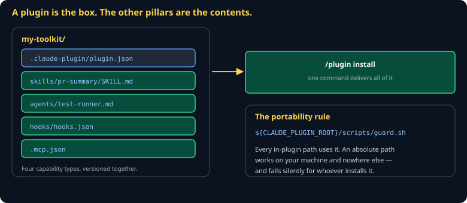

# Plugins Cheat Sheet (80/20)

Pillar 6 — the distribution unit. How to bundle skills, agents, hooks, and MCP config into one installable thing, and the single rule that makes it work on someone else's machine.

Companion to [`cc-the-11-pillars`](cc-the-11-pillars.md) and [`cc-skills`](cc-skills.md).



## What it is

A plugin is **the box, not the contents.** It has no capabilities of its own — it packages the four that do:

```
my-toolkit/
├── .claude-plugin/plugin.json   ← the manifest
├── skills/pr-summary/SKILL.md
├── agents/test-runner.md
├── hooks/hooks.json
└── .mcp.json
```

One `/plugin install` delivers all four, versioned together. That is the entire value: a teammate gets your whole working setup, matched, in one command.

## The manifest

```json
{
  "name": "cs3540-toolkit",
  "version": "0.1.0",
  "description": "Engine spec workflow: conformance guard, spec skill, archetype agents.",
  "author": "your-name"
}
```

## The portability rule

> **Every path inside the plugin uses `${CLAUDE_PLUGIN_ROOT}`.**

```json
{ "hooks": { "PreToolUse": [{ "matcher": "Edit|Write",
    "hooks": [{ "type": "command",
                "command": "${CLAUDE_PLUGIN_ROOT}/scripts/guard.sh" }] }] } }
```

An absolute path works on your machine and nowhere else — and it fails *silently*, because a hook whose command does not exist simply does not run. The plugin looks installed and enforces nothing.

## When to build one

Not for one skill. Build a plugin when you have a **coherent working setup** that only makes sense together:

- A guard hook, plus the skill that explains what it guards, plus the agent that respects it
- A whole workflow: spec skill, plan skill, archetype agents, definition-of-done hook

In this course, the guarded-agent capstone is bundled plugin-style precisely because the soul, the narrowed tools, the guard hook, and the scoped MCP connection are only meaningful as a set. Any one of them alone is a demo; together they are a working posture.

## Versioning

Bump the version when behavior changes, not when you fix a typo. Someone installing `0.2.0` after running `0.1.0` should be able to read what changed — so keep a short changelog in the README.

Pin versions when it matters. A plugin whose hook changes under you is a plugin that will break someone's workflow on a Tuesday for no visible reason.

## Testing before you ship

Install it into a **clean project** you have never used it in. That is the only way to catch:

- An absolute path you forgot
- A dependency you happen to have installed
- A hook that assumed your directory layout
- A skill referencing a file you did not include

Everything works in the directory where you built it. That proves nothing.

## Common gotchas

- **Absolute paths.** Works for you, silently dead for everyone else.
- **Shipping a `.mcp.json` with a literal token.** It is in the box now, and in the history.
- **A plugin that is one skill.** Just ship the skill.
- **No description.** Nobody installs what they cannot understand from the listing.
- **Hooks that assume a project layout.** Check the path exists before acting on it.
- **Never testing a clean install.** The most common reason a plugin fails on first use.

## When you're stuck

- [Claude Code plugin docs](https://code.claude.com/docs)
- Install your own plugin into a fresh scratch directory and use it for a day
- If a bundled hook seems not to fire, echo `${CLAUDE_PLUGIN_ROOT}` from inside it — an unresolved variable is the usual answer.
