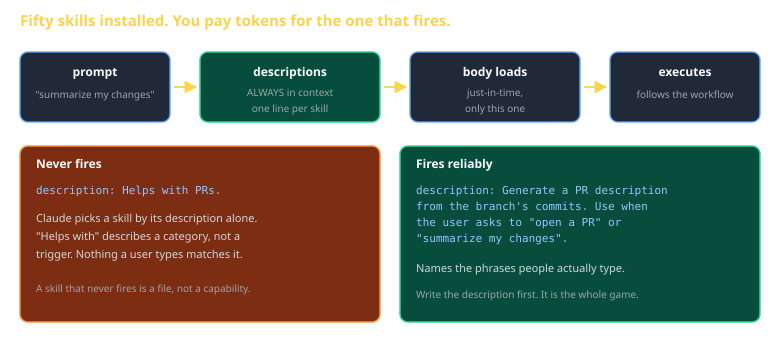
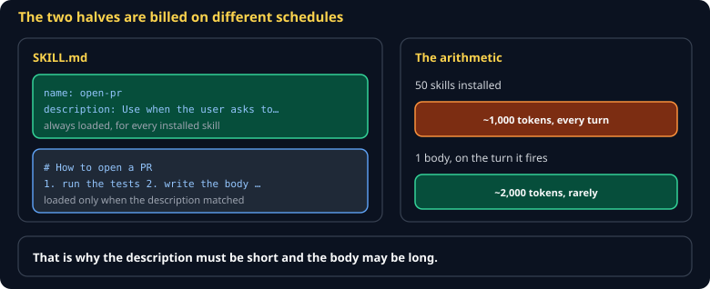
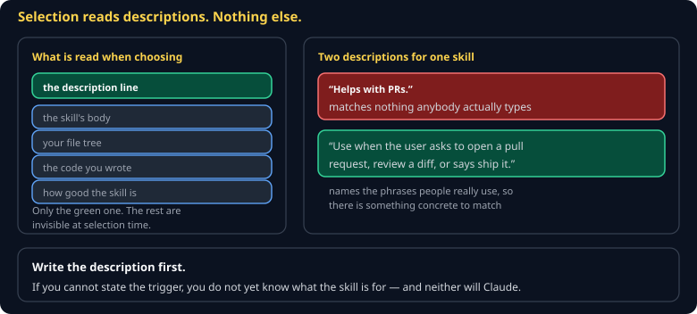

# Skills Cheat Sheet (80/20)

Pillar 3, and the first artifact you ship in the Forge track. What a skill is, why the description is the entire game, and how to write one that actually fires.

Companion to [`cc-the-11-pillars`](cc-the-11-pillars.md) and [`cc-claude-md`](cc-claude-md.md).



## What it is



A **directory** containing `SKILL.md`: YAML frontmatter plus a markdown body of instructions. It may also bundle scripts and reference files.

```
pr-summary/
├── SKILL.md          ← required
├── scripts/
│   └── collect.sh
└── reference/
    └── template.md
```

The mental model: a prompt you wrote once, gave a trigger, and checked into git — instead of leaving it in a Slack message.

## Progressive disclosure

| Part | Always in context? |
|---|---|
| `description` in frontmatter | **Yes** — every turn, forever |
| Markdown body | **No** — loaded only when the skill fires |

That split is the entire value. Fifty skills installed costs you fifty one-line descriptions; you pay for the body of the one that actually runs. A workflow pasted into `CLAUDE.md` costs you its full length on every turn of every session.

## The description is the whole game



Claude selects a skill by reading descriptions and nothing else. So the description is not documentation — it is the trigger.

```yaml
# Never fires
description: Helps with PRs.

# Fires
description: >
  Generate a GitHub PR description from the current branch's commits and diff.
  Use when the user asks to "open a PR", "write a PR description", or
  "summarize my changes for review".
```

**Name the phrases a user would really type.** Write the description first, before the body — if you cannot state the trigger, you do not yet know what the skill is for.

## A complete skill

```markdown
---
name: pr-summary
description: >
  Generate a GitHub PR description from the current branch's commits and diff.
  Use when the user asks to "open a PR", "write a PR description", or
  "summarize my changes for review".
---

1. Run `git log main..HEAD --oneline` and `git diff main..HEAD --stat`.
2. Write the description with exactly these sections:
   - **Goal** — one sentence on why this exists
   - **Changes** — bullets, grouped by subsystem
   - **Test plan** — the commands a reviewer should run
3. Print it. Never push, and never open the PR without being asked.
```

Short, specific, and it ends with a boundary. A skill that quietly does more than it said is worse than no skill.

## Scope

| Location | Who gets it |
|---|---|
| `~/.claude/skills/` | just you, every project |
| `.claude/skills/` | the team — committed to the repo |

Project skills are how a convention becomes shared instead of tribal.

## Testing it — both ways

A skill is not done until you have watched it fire **twice**:

1. Explicitly: `/pr-summary`
2. Implicitly: "can you summarize my changes for review?"

The second is the real test. If only the first works, your description does not match how anyone speaks, and the skill will sit unused.

## Common gotchas

- **A vague description.** The single reason skills do not fire.
- **A body that is really a whole methodology.** If it is 400 lines, it is several skills.
- **Forgetting the boundary.** State what it must not do — push, delete, deploy.
- **Duplicating CLAUDE.md.** Conventions go there; workflows go here.
- **Never testing the natural-language path.** Half the point, untested.

## When you're stuck

- [Claude Code skills docs](https://code.claude.com/docs)
- `~/.claude/skills/` — read a few that ship with your setup; the good ones are short
- If it will not fire, paste your description and ask Claude what phrasing would trigger it. The mismatch is usually obvious once named.
