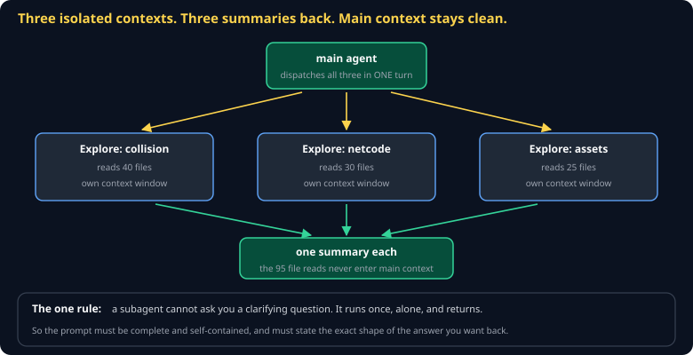

# Subagents and Archetypes Cheat Sheet (80/20)

Pillar 4. When to fan work out to isolated contexts, how to write a prompt for something that cannot ask you a follow-up question, and the five archetypes worth encoding as subagents.

Companion to [`cc-the-11-pillars`](cc-the-11-pillars.md) and [`ai-sdlc-spec-driven`](ai-sdlc-spec-driven.md).



## Three reasons to use one

**Parallel research.** Dispatch several in one turn and they run concurrently. Three explorations take the time of the slowest, not the sum.

**Context isolation.** A subagent that reads forty files to answer one question returns *the answer*. The forty file reads stay in its context and never pollute yours. This is usually the biggest win.

**Specialization.** A narrowed toolset and a tuned system prompt produce better work on a specific job than a general agent will.

## The one rule

> **A subagent cannot ask a clarifying question.** It runs once, alone, and returns.

Everything about writing subagent prompts follows from this:

```
Bad:  "Look into the collision code."
Good: "Read src/sim/collision/ and report, as a markdown table:
       every exported function, its file:line, and whether it is
       called from outside that directory. Do not modify anything."
```

State the scope, the output shape, and the boundary. If you would have to answer a question for a human doing this task, answer it in advance.

## Writing one

`.claude/agents/sweeper.md`:

```markdown
---
name: sweeper
description: Reduce complexity without changing behavior. Use after a feature lands.
tools: Read, Edit, Bash
---

## Mission
Reduce complexity in recently changed code while preserving behavior exactly.
Your output is measured in code DELETED.

## Principles
- Every change must keep the tests green. Run them before and after.
- Prefer deleting over refactoring; prefer refactoring over adding.

## Anti-goals
- Never add a feature mid-sweep.
- Never clean code that is about to be deleted.
- Never touch behavior. If a test changes, you have failed.
```

**The anti-goals section is the important part.** A mission alone drifts — an agent told to simplify will helpfully add a helpful abstraction. Naming what it must *not* do is what keeps a specialized agent specialized.

## The five archetypes

Boris's claim is that engineering roles are collapsing into five shapes. Each makes a good subagent because each has clear anti-goals:

| Archetype | Mission | Anti-goals |
|---|---|---|
| **Prototyper** | Maximize learning per hour. Every spike ends in a verdict. | Never extend past the question. No tests, no polish. |
| **Builder** | "Works on my machine" → works in production. | No gold-plating. Never ship without a test. |
| **Sweeper** | Reduce complexity, behavior-preserving. | No features mid-sweep. |
| **Grower** | Move activation and retention. | Output is metric movement, not PRs. |
| **Maintainer** | Availability, integrity, confidentiality. | Do not become the department of "no". |

They also map onto the lifecycle: Brainstorm is Prototyper work, Spec and Plan are Builder work with Maintainer review, Execute is Builder ⇄ Sweeper, and post-ship Grower findings feed the next Brainstorm.

## Fanning out

Multiple subagents dispatched **in one turn** run in parallel. One per turn runs sequentially. Read-only types are safe to fan out aggressively; agents that write are not — two agents editing the same file will fight.

## Common gotchas

- **A prompt that assumes context.** "Fix the bug we discussed" — it was not there.
- **No output shape.** You get prose when you wanted a table, and you cannot use it.
- **Fanning out writers.** Parallel edits to one tree produce conflicts nobody asked for.
- **No anti-goals.** The agent helpfully exceeds its mission, every time.
- **Using one for a small task.** The dispatch has overhead; a two-file question is faster inline.

## When you're stuck

- `/agents` lists what is registered — if yours is missing, the frontmatter is malformed
- [Claude Code subagent docs](https://code.claude.com/docs)
- If a subagent returns something useless, reread its prompt as though you knew nothing else. That is genuinely all it had.
