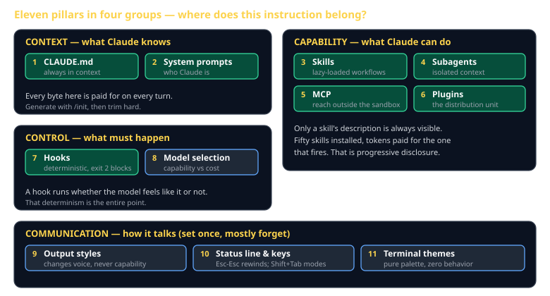
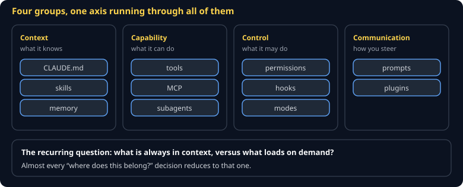
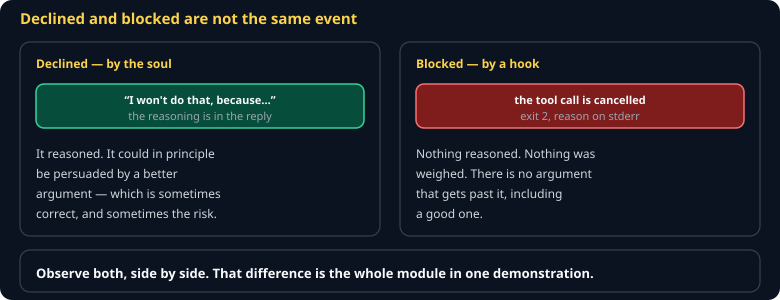
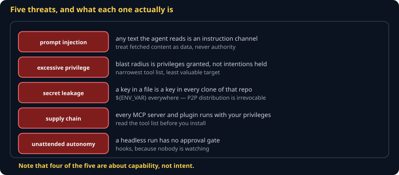
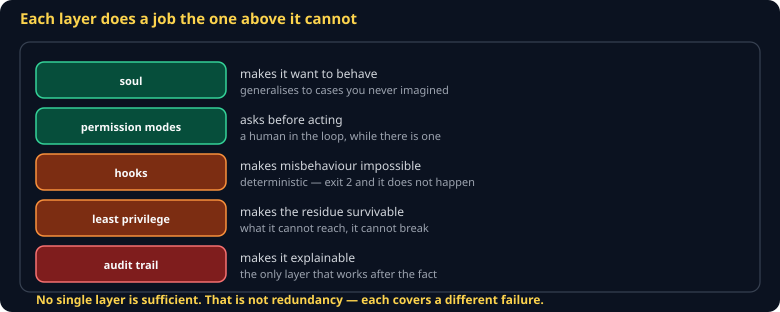

# The 11 Pillars of Claude Code Cheat Sheet (80/20)

The index to everything else in the Soul track. Eleven places an instruction, capability, or configuration can live — put it in the right one and the agent behaves. This sheet is the map; each pillar has its own sheet.

## The recurring axis

> **What is ALWAYS in context, versus what loads on demand.**

Almost every decision below is really this question. `CLAUDE.md` and skill *descriptions* are always loaded — you pay for them on every single turn. Skill *bodies*, subagent work, and MCP results load only when needed. Getting this wrong is how people end up with a slow, expensive agent that still does not know the build command.

## The four groups

| Group | Pillars | The question it answers |
|---|---|---|
| **Context** | CLAUDE.md · system prompts | What does Claude know before you say anything? |
| **Capability** | skills · subagents · MCP · plugins | What can Claude *do*? |
| **Control** | hooks · model selection | What must happen, and what does it cost? |
| **Communication** | output styles · status line · themes | How does it talk to you? |

## Where does this belong?

The practical use of this map — a decision table for "I want the agent to…"

| You want | Pillar | Why not the others |
|---|---|---|
| It to know your test command | **CLAUDE.md** (1) | Needed every session; belongs in always-context |
| A repeatable multi-step workflow | **Skill** (3) | Loads only when it fires; a pasted prompt costs tokens forever |
| To research three subsystems at once | **Subagents** (4) | Each gets its own context; the 50 file reads stay inside |
| To query your database | **MCP** (5) | The only pillar that reaches outside the sandbox |
| To ship all of the above to a teammate | **Plugin** (6) | The box, not the contents |
| To *guarantee* formatting on every edit | **Hook** (7) | The only deterministic one — see below |
| To spend less | **Model selection** (8) | Opus main loop, Haiku subagents is the biggest lever |
| Explanations as it works | **Output style** (9) | Changes voice, never capability |

## The one distinction worth memorizing

> **A soul makes the agent *want* to behave. A hook makes misbehavior *impossible*.**

Everything in Context and Capability is probabilistic — you are asking a model, and a model can be persuaded, confused, or simply have a bad turn. Hooks are shell scripts with exit codes. Exit `2` cancels the tool call and hands your stderr back as the reason.

You will build both this term and demonstrate the difference directly: ask the agent to do something its soul forbids and it **declines**, with reasoning. Ask it to do something the hook forbids and it is **blocked** — cancelled, no negotiation.

If it must happen, hook it. If it is a judgment call, give it a soul.

## The lightning round

Pillars 8–11 are knobs, not projects.

- **Model selection** — Opus for architecture, Sonnet for the work, Haiku for bulk. `/model` per session.
- **Output styles** — `/output-style explanatory` is worth setting for this course.
- **Status line and keys** — `Esc-Esc` rewinds a derailed session. Learn that one today.
- **Terminal themes** — pure palette. The daltonized variants keep red/green diffs readable.

## Common gotchas

- **Putting a workflow in CLAUDE.md** — you now pay for it on every turn, including the thousand turns it is irrelevant to. That is what skills are for.
- **A skill description like "helps with PRs"** — it will never fire. The description is the trigger; name the phrases users actually type.
- **A subagent prompt that asks a question** — a subagent cannot ask for clarification mid-run. State the exact output you want back.
- **Committing a token in `.mcp.json`** — project MCP config is committed. Use `${ENV_VAR}`, always.
- **Trusting a prompt to enforce a rule** — if it must happen every time, it is a hook, not a request.

## When you're stuck

- [Claude Code docs](https://code.claude.com/docs) — the authoritative reference
- `/mcp` to see whether a server is actually connected; `/agents` for subagents
- Each pillar has its own sheet in this library — start with [`cc-claude-md`](cc-claude-md.md)
