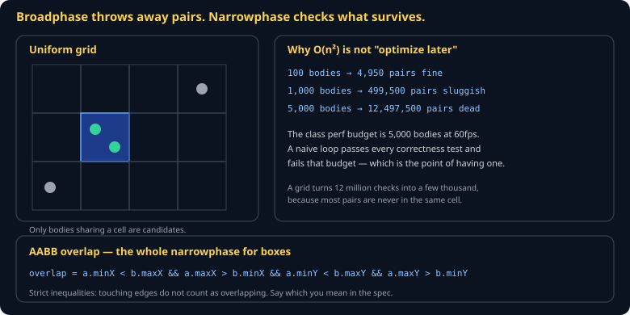
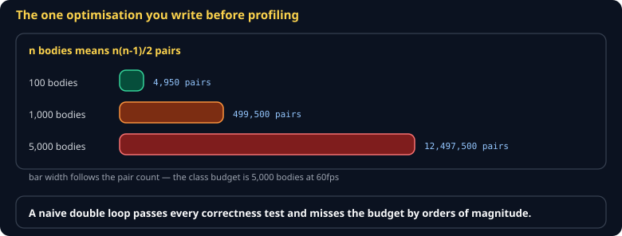
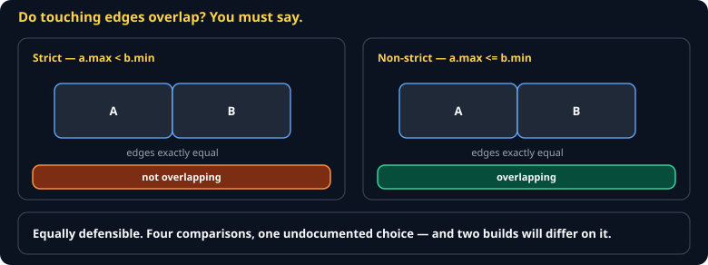

# Collision and Spatial Partition Cheat Sheet (80/20)

AABB overlap, a uniform grid broadphase, and how to resolve a hit without objects sinking into each other. Skips SAT for rotated polygons, continuous collision detection, and physics engines — you need a grid and boxes to pass this course's budget.

Companion to [`game-programming-patterns`](game-programming-patterns.md). Specified in `spec/S11-collision.md`.



## Why this is not "optimize later"



| Bodies | Pairs to check |
|---|---|
| 100 | 4,950 |
| 1,000 | 499,500 |
| 5,000 | **12,497,500** |

The class performance budget is 5,000 bodies at 60fps. A naive double loop **passes every correctness test** and fails that budget — which is exactly why the budget exists. This is the one optimization you write before profiling.

## Narrowphase: AABB



Axis-aligned bounding boxes. The entire test:

```js
export function overlaps(a, b) {
  return a.minX < b.maxX && a.maxX > b.minX &&
         a.minY < b.maxY && a.maxY > b.minY;
}
```

> **Strict inequalities mean touching edges do not overlap.** That is a choice, not a fact — say which you mean in your spec, because the other reading is equally defensible and two builds will differ on it.

## Broadphase: a uniform grid

```js
export class Grid {
  constructor(cellSize) { this.cellSize = cellSize; this.cells = new Map(); }

  #key(cx, cy) { return cx * 73856093 ^ cy * 19349663; }

  insert(body) {
    const x0 = Math.floor(body.minX / this.cellSize), x1 = Math.floor(body.maxX / this.cellSize);
    const y0 = Math.floor(body.minY / this.cellSize), y1 = Math.floor(body.maxY / this.cellSize);
    for (let cx = x0; cx <= x1; cx++)
      for (let cy = y0; cy <= y1; cy++) {
        const k = this.#key(cx, cy);
        let list = this.cells.get(k);
        if (!list) this.cells.set(k, (list = []));
        list.push(body);
      }
  }

  *pairs() {
    const seen = new Set();
    for (const list of this.cells.values())
      for (let i = 0; i < list.length; i++)
        for (let j = i + 1; j < list.length; j++) {
          const a = list[i], b = list[j];
          const lo = Math.min(a.id, b.id), hi = Math.max(a.id, b.id);
          const k = lo * 100003 + hi;
          if (seen.has(k)) continue;      // a big body spans cells; dedupe
          seen.add(k);
          yield [a, b];
        }
  }
}
```

The `seen` set matters: a body larger than one cell lands in several, so the same pair surfaces more than once. Without deduping you apply the same impulse twice and objects launch.

**Cell size:** roughly the size of your average body. Too small and big bodies span dozens of cells; too large and every body lands in one cell, which is the naive loop wearing a hat.

## Resolution

Detecting is half the job. Separate along the axis of *least* penetration:

```js
export function resolve(a, b) {
  const overlapX = Math.min(a.maxX, b.maxX) - Math.max(a.minX, b.minX);
  const overlapY = Math.min(a.maxY, b.maxY) - Math.max(a.minY, b.minY);

  if (overlapX < overlapY) {
    const push = a.x < b.x ? -overlapX / 2 : overlapX / 2;
    a.x += push; b.x -= push;
  } else {
    const push = a.y < b.y ? -overlapY / 2 : overlapY / 2;
    a.y += push; b.y -= push;
  }
}
```

Splitting the push evenly assumes equal mass. Weight it by inverse mass if that matters; give static bodies infinite mass so only the mover moves.

## Order determines the result

Resolving in a different order produces a different final state — which means **pair order is part of your specification**. Sort by `(minId, maxId)` before resolving, or two correct implementations will hash differently after any pile-up.

## Common gotchas

- **Tunnelling** — a fast body skips through a thin wall between ticks. Cap velocity per step, or thicken walls.
- **Double resolution** — see the dedupe above.
- **Jitter in a pile** — objects resolved in a loop push each other back and forth. Run two or three resolution passes per tick and accept a little overlap.
- **Grid cells keyed by a string** — `` `${cx},${cy}` `` allocates a string per body per frame. Use the integer hash.
- **Forgetting to clear the grid** — rebuild it each tick, or last tick's positions collide with this tick's.

## When you're stuck

- [Spatial Partition, Nystrom](https://gameprogrammingpatterns.com/spatial-partition.html)
- `spec/S11-collision.md` — the class specification and its budget
- Draw every AABB and every occupied cell for one frame. Almost every collision bug is visible the instant you can see the boxes.
