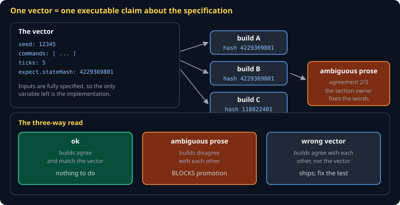
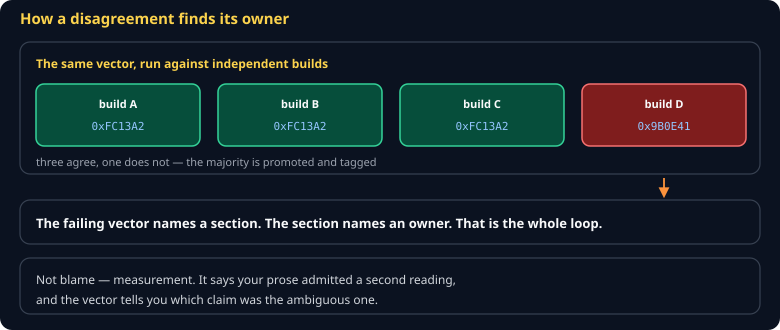

# Conformance Vectors Cheat Sheet (80/20)

How to turn a sentence in the class engine spec into something a machine can check. This is the format your section is graded through, so it is worth the ten minutes.

Companion to [`writing-a-spec-agents-can-build`](writing-a-spec-agents-can-build.md).



## What a vector is

A vector fully specifies the **inputs** to a simulation and asserts the **one number** that comes out.

```json
{
  "id": "S01/fixed-timestep-accumulator",
  "section": "S01",
  "title": "250ms at a 50ms fixed step advances exactly 5 ticks",
  "seed": 12345,
  "commands": [],
  "ticks": 5,
  "expect": { "stateHash": 4229369801 }
}
```

Because seed and commands are pinned, the only thing left that can vary is the implementation. That is what makes disagreement *informative*.

| Field | Rule |
|---|---|
| `id` | `<section>/<slug>`, unique across the repo |
| `section` | Must match the directory the file sits in |
| `seed`, `ticks` | Non-negative integers |
| `commands` | Sorted by non-decreasing `tick`; every tick less than `ticks` |
| `expect.stateHash` | Integer in `0..4294967295` |

## How the runner replays it

```
reset(seed)
for t in 0 .. ticks-1:
    apply every command whose tick == t     ← before the tick, not after
    tick()
compare stateHash() to expect.stateHash
```

A command at tick 0 affects the very first step. If you write a vector assuming commands land *after* the tick, your expected hash will be wrong and the report will say `wrong-vector`.

## Reading the result



This is the part that matters, because it tells you **what to fix**.

| Builds agree with each other? | Match your vector? | Diagnosis | Who fixes what |
|---|---|---|---|
| Yes | Yes | `ok` | nothing |
| **No** | — | `ambiguous-prose` | **you fix the prose** — and promotion is blocked until you do |
| Yes | **No** | `wrong-vector` | **you fix the vector** — the engine is self-consistent, your test was wrong |

> **Builds disagreeing with each other is never the engine's fault.** Two agents read the same words and built different things, which means the words permitted both. That is a defect in your section, and it is the only one that blocks the class.

## Writing a vector that tests something

The failure mode is a vector that cannot fail. Three ways it happens:

**It asserts a constant.** If your section's vector runs an empty world, every implementation returns the offset basis and the vector passes unconditionally. Pin state that your section actually changes.

**It only covers the happy path.** A collision vector where nothing collides proves nothing. Include the case that is easy to get wrong — the boundary, the tie, the empty set.

**It restates the implementation.** If the only way to know the expected hash is to run one particular implementation, you have written a snapshot, not a claim. Derive the expected value from what the prose says should happen.

## Deriving an expected hash by hand

For a section whose state is a handful of integers, compute it:

```bash
node -e "
const P=0x01000193; let h=0x811c9dc5;
for (const v of [12345, 5, 0]) {
  const b=v>>>0;
  for (let s=0;s<32;s+=8){ h=(h^((b>>>s)&0xff))>>>0; h=Math.imul(h,P)>>>0; }
}
console.log(h);
"
```

Quantize first, using **round half away from zero** — not the host language's `round`. See `spec/S00-overview.md`.

## Common gotchas

- **A vector in the wrong directory** — `section` must match the folder, or the divergence report attributes your failure to someone else's section.
- **Commands out of order** — the loader rejects unsorted commands rather than silently reordering them.
- **A command at a tick past `ticks`** — rejected at load, because a command that never fires cannot affect the expected hash and is almost always a typo.
- **Floats in `args`** — allowed, but quantize before they reach the hash, or two correct implementations will disagree on the last bit.
- **Editing a vector to make a build pass** — a `PreToolUse` hook blocks the generator from doing this, and you should not do it either. A vector that disagrees with agreeing builds is a finding, not an obstacle.

## When you're stuck

- `spec/S00-overview.md` — the authoritative format
- `src/vector.ts` — the validator; its error messages name the offending field
- `src/runner.ts` — the replay order, in about twenty lines
- Run `npx vitest run test/vector.test.ts` to see every rejection case as an example
