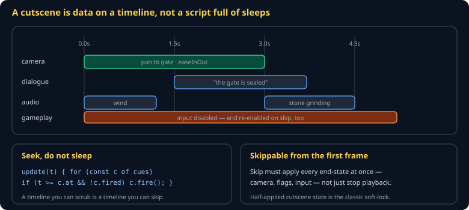

# Cutscenes and Timelines Cheat Sheet (80/20)

How to script a scripted moment without hard-coding sleeps, and how to make it skippable without soft-locking the game. This is also how the course satisfies its "video" requirement — an in-engine cutscene is free, deterministic, and replayable, which a generated clip is not.

Companion to [`storytelling-in-games`](storytelling-in-games.md) and [`scene-graph-transforms`](scene-graph-transforms.md).



## The shape

A cutscene is **data**: a list of cues, each with a time and an effect.

```js
export const gateScene = {
  duration: 6.0,
  cues: [
    { at: 0.0, kind: 'camera',   to: 'gate', ease: 'easeInOut', over: 3.0 },
    { at: 0.0, kind: 'input',    enabled: false },
    { at: 0.0, kind: 'sound',    id: 'wind' },
    { at: 1.5, kind: 'dialogue', speaker: 'guard', text: 'The gate is sealed.' },
    { at: 3.0, kind: 'sound',    id: 'stone_grinding' },
    { at: 5.5, kind: 'flag',     set: 'sawGateScene' },
    { at: 6.0, kind: 'input',    enabled: true },
  ],
};
```

Not this:

```js
// don't
await moveCamera(gate);
await sleep(1500);
showDialogue('The gate is sealed.');
```

The `await`-and-sleep version cannot be skipped, cannot be scrubbed, cannot be tested, and pauses inside a deterministic simulation.

## The player

```js
export function update(scene, state, dtSeconds) {
  state.t += dtSeconds;
  for (const cue of scene.cues) {
    if (state.t >= cue.at && !state.fired.has(cue)) {
      state.fired.add(cue);
      apply(cue);
    }
  }
  return state.t >= scene.duration;
}
```

Twelve lines, and it gives you skip, scrub, and replay for free.

## Skip

> **Skip must apply every remaining cue's *end state*, not merely stop playback.**

```js
export function skip(scene, state) {
  for (const cue of scene.cues) {
    if (!state.fired.has(cue)) { state.fired.add(cue); applyEndState(cue); }
  }
  state.t = scene.duration;
}
```

The classic soft-lock is a cutscene that disabled input at `t=0`, re-enables it at `t=6`, and was skipped at `t=2`. The player is now standing in a world they cannot control. Every cue that *disables* something must have a partner that re-enables it, and skip must run both.

Skip must work **from the first frame**. A cutscene that must play two seconds before it can be skipped is a cutscene players resent.

## Camera moves

Interpolate with easing, never linearly — a linear camera move reads as mechanical:

```js
const easeInOutCubic = (t) =>
  t < 0.5 ? 4 * t * t * t : 1 - Math.pow(-2 * t + 2, 3) / 2;

camera.pos = lerpVec(from, to, easeInOutCubic(elapsed / duration));
```

## Where cutscenes live

In the **renderer and UI layer**, not the simulation — with one exception. Anything that changes world state (a flag set, a door opened, an item granted) must enter the simulation as a **command**, exactly like player input. Otherwise the cutscene's effects vanish on replay and desync in multiplayer.

```js
log.append({ tick, kind: 'flag_set', args: { flag: 'sawGateScene' } });
```

## Trailers

The other half of the video requirement: capture gameplay rather than generating it. `MediaRecorder` on the canvas stream is enough, and OBS is better. A trailer built from real footage of your game is more convincing than any generated clip, and it costs nothing.

## Common gotchas

- **Sleeps instead of a timeline.** Unskippable, untestable.
- **Skip that only stops playback.** Soft-lock.
- **Input disabled with no guaranteed re-enable.** Same.
- **Cutscene state that never entered the command log.** Vanishes on replay.
- **Unskippable first play.** Players hate it more than a bad cutscene.
- **Dialogue timed to voice length hard-coded in seconds.** Re-record the line and the whole scene drifts.

## When you're stuck

- Your timeline is a list of `{at, kind, ...}` — if a cutscene bug is hard to reproduce, print the cue list and the current `t`.
- [`game-feel-and-juice`](game-feel-and-juice.md) — easing functions, which cutscenes lean on heavily
- Test by skipping at every second. Any second that leaves the game broken is a missing end-state.
