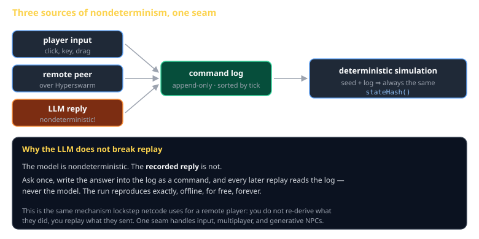
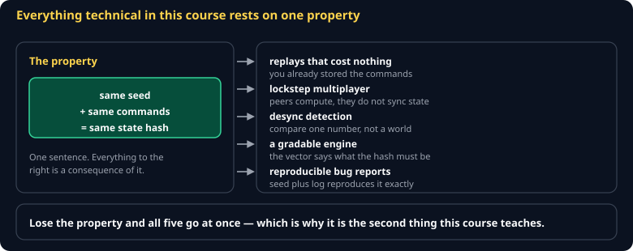
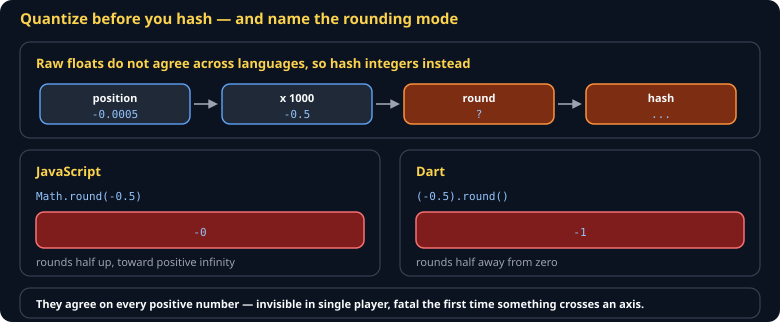
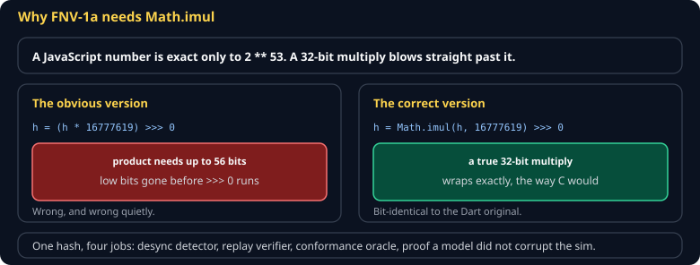

# Determinism and Replay Cheat Sheet (80/20)

How to make a simulation produce the same result twice, and why that single property buys you replays, multiplayer, and a gradable engine at once. Covers seeded randomness, the quantized state hash, and the command log. Skips floating-point determinism across CPU architectures — quantizing sidesteps it.

Companion to [`game-loop-and-time`](game-loop-and-time.md) and [`netcode`](netcode.md). Specified in `spec/S02-determinism.md` and `spec/S03-command-model.md`.



## The property



> **Same seed + same commands ⇒ same state hash.** Every time, on every machine.

That one sentence is worth an enormous amount:

| You get | Because |
|---|---|
| Replays that cost nothing | The log *is* the replay file |
| Lockstep multiplayer | Send commands, not state — kilobytes instead of megabytes |
| Desync detection | Compare one 32-bit number per tick |
| A gradable engine | Conformance vectors assert exactly this |
| Reproducible bug reports | "Seed 4471, these commands" reproduces it on your machine |

## Rule 1: no ambient randomness

```js
// WRONG — unreproducible, and nothing above works any more
const angle = Math.random() * Math.PI * 2;

// RIGHT — the sim owns its randomness
const angle = this.rng.next() * Math.PI * 2;
```

The class PRNG is **mulberry32**, chosen because you can read it:

```js
export function mulberry32(seed) {
  let a = seed >>> 0;
  return () => {
    a = (a + 0x6d2b79f5) | 0;
    let t = Math.imul(a ^ (a >>> 15), 1 | a);
    t = (t + Math.imul(t ^ (t >>> 7), 61 | t)) ^ t;
    return ((t ^ (t >>> 14)) >>> 0) / 4294967296;
  };
}
```

One generator, owned by the simulation, seeded once. Two generators drawn in different orders is the same bug as `Math.random()`.

## Rule 2: no ambient time

`Date.now()` and `performance.now()` are as nondeterministic as randomness. The simulation's only clock is its tick count.

## Rule 3: quantize before hashing



Raw floats will not agree across languages or even across compilers. Quantize to integers first:

| Quantity | Scale |
|---|---|
| Positions | ×1000 |
| Health, resources | ×10 |

> **Round half away from zero — never the host language's `round`.** JavaScript's `Math.round(-0.5)` is `-0`; Dart's `(-0.5).round()` is `-1`. They agree on every positive number, so this bug is invisible in single-player and fatal the first time an entity crosses to the negative side of an axis.

```js
export const roundHalfAwayFromZero = (x) => (x < 0 ? -Math.round(-x) : Math.round(x));
export const quantize = (x, scale) => roundHalfAwayFromZero(x * scale);
```

## The state hash



32-bit FNV-1a, folded a byte at a time:

```js
const PRIME = 0x01000193;
export function fnv1a(hash, value) {
  const bytes = value >>> 0;
  let h = hash >>> 0;
  for (let shift = 0; shift < 32; shift += 8) {
    h = (h ^ ((bytes >>> shift) & 0xff)) >>> 0;
    h = Math.imul(h, PRIME) >>> 0;      // NOT (h * PRIME) >>> 0
  }
  return h;
}
```

Thirty-two bits, not sixty-four: a JS number is exact only to 2^53, and a 64-bit FNV's `hash * prime` blows past that and silently loses precision. `Math.imul` keeps every intermediate inside 32 bits.

**Hash entities in ascending id order.** Two implementations storing entities in different containers must still agree, so iteration order can never be the map's.

## The command log

Everything that enters the simulation is a command, appended in tick order. Which is why a language model does not break any of this:

```js
const reply = await llm.ask(prompt);        // nondeterministic, happens once
log.append({ tick, kind: 'npc_line', args: { text: reply } });   // now it is data
```

Replay reads the log, never the model. Same trick lockstep netcode uses for a remote player — you do not re-derive what they did, you replay what they sent.

## Common gotchas

- **`(h * PRIME) >>> 0`** — looks equivalent to `Math.imul`, is not. The product exceeds 2^53 and rounds before the mask.
- **Iterating a `Map` or `Set`** for hashing — insertion-order dependent. Sort by id.
- **`Array.prototype.sort()` without a comparator** — sorts lexicographically, so `[2, 10]` becomes `[10, 2]`.
- **`-0` in a hash** — `Object.is(-0, 0)` is false but `-0 >>> 0` is `0`. Quantize into integers and it stops mattering.
- **Seeding from the clock** — fine for picking a seed, fatal for reproducing. Log the seed you chose.
- **Async inside `tick()`** — resolution order is not deterministic. Ticks are synchronous, always.

## When you're stuck

- `spec/S02-determinism.md` — the class specification
- `src/hash.ts` — the reference implementation, proven bit-identical to a Dart original
- Hash after every tick and diff two runs. The first tick where hashes differ is where determinism broke, and it is almost always randomness, time, or iteration order.
