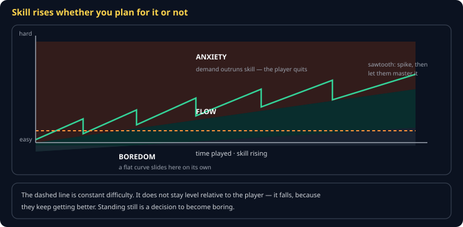

# Difficulty and Flow Cheat Sheet (80/20)

Why a constant difficulty becomes boring on its own, what shape a good curve has, and how to raise difficulty without cheating. Skips full dynamic difficulty adjustment systems — the sawtooth and a few honest levers get you most of the way.

Companion to [`theory-of-fun`](theory-of-fun.md) and [`playtesting`](playtesting.md).

## The claim

Csikszentmihalyi's flow channel: engagement lives in a band between *demand exceeds skill* (anxiety) and *skill exceeds demand* (boredom).

The consequence people miss:

> **Skill rises whether you plan for it or not. So constant difficulty is not neutral — it is a slow slide into boredom.**

Standing still is a decision.

## The sawtooth

A monotonically rising curve is exhausting. The shape that works is a sawtooth:

1. **Spike** — introduce something new. The player is briefly out of their depth.
2. **Plateau** — let them practise until they own it. *This is where the fun actually happens*, and it is the part most often cut.
3. **Spike again.**

The plateau is not filler. It is where the learning pays off, and a game that spikes continuously never lets the player feel competent.

## Honest levers versus cheap ones

| Honest — demands new skill | Cheap — demands more time |
|---|---|
| A new enemy that must be fought differently | The same enemy with triple health |
| Two mechanics combined for the first time | More of the same enemies at once |
| Less margin for error (tighter timing) | Less margin for error (less healing) |
| Removing a crutch the player leaned on | Damage numbers scaled up |

Health-and-damage scaling is not difficulty; it is duration. It makes fights *longer*, and long fights against a pattern you have mastered is the definition of boredom.

## The onboarding curve

The first ten minutes are a different problem: skill is near zero and rising fast.

- **Teach one thing at a time**, and let them use it before introducing the next.
- **Teach by design, not text.** A room where the only exit is above you teaches jumping better than a tooltip.
- **Make the first failure cheap.** An early death that costs thirty seconds teaches; one that costs ten minutes drives people off.

## Adjusting without cheating

If you adapt to the player, adapt the **inputs**, not the rules:

| Acceptable | Feels like cheating |
|---|---|
| Enemies spawn slightly less often | Enemy health changes mid-fight |
| Health drops appear when low | Your damage is secretly reduced |
| A hint after several failures | The boss dodges more when you are winning |

The rule: never change something the player has learned to predict. Breaking a learned pattern is a betrayal, and players detect it even when they cannot name it.

## Measuring it

You do not need telemetry. Watch three testers and record where each one **stopped**. Clustering means a wall; scattering means it is roughly tuned. This is why the playtest rubric asks for the quit timestamp.

## Common gotchas

- **Difficulty tuned by the developer.** You have played it a thousand times. You are the worst possible judge.
- **Spikes with no plateau.** Constant escalation is exhausting and never lets mastery feel good.
- **Confusing length with difficulty.** A ten-minute health sponge is not hard.
- **Optional content that is mandatory.** If the "optional" tutorial is required to survive, it is not optional.
- **No skill floor.** If a player can lose without understanding why, that is noise. See [`theory-of-fun`](theory-of-fun.md).

## When you're stuck

- Raph Koster, *A Theory of Fun* — the pattern-learning argument beneath all of this
- [`playtesting`](playtesting.md) — the protocol for getting quit timestamps
- Watch someone play your first five minutes. If they hesitate, you have a teaching problem, not a difficulty problem.
